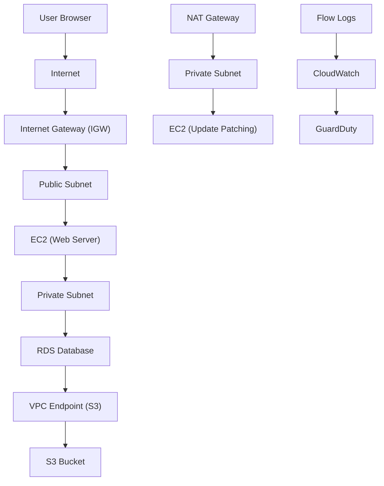
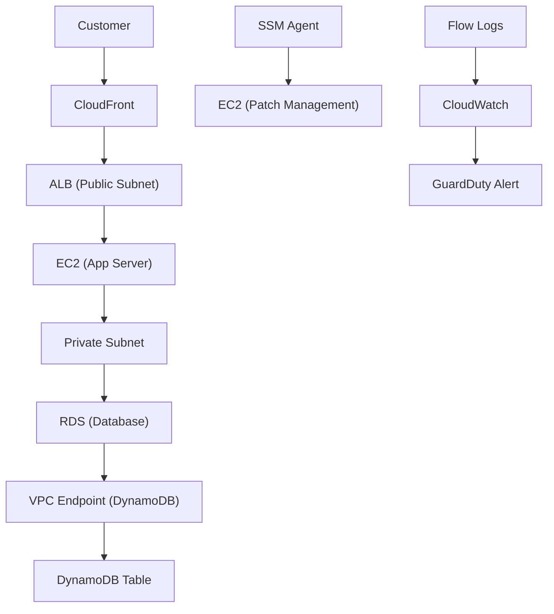
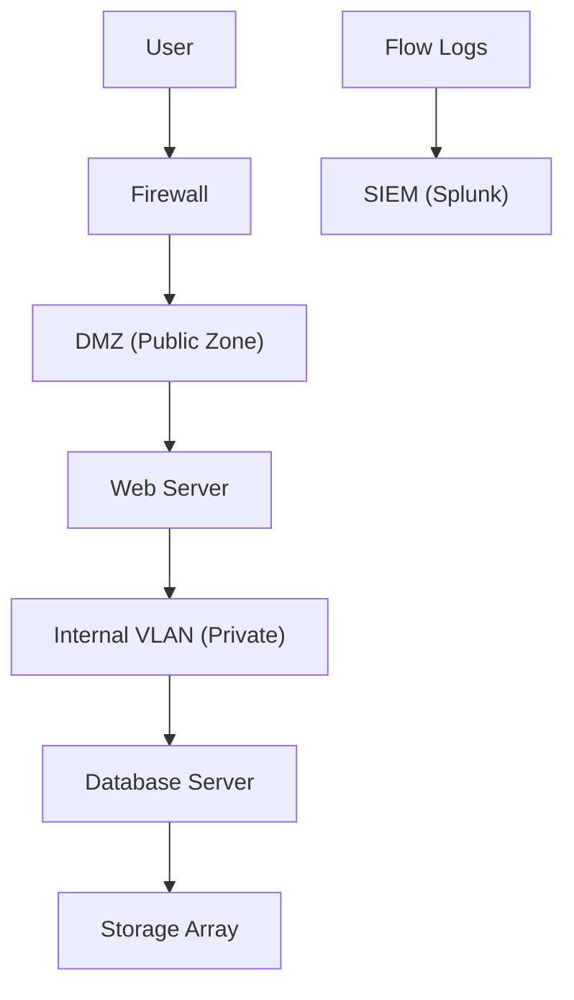

# VPC

## 🌐 **Amazon VPC (Virtual Private Cloud)**

#### _The Secure, Isolated, Programmable Network Foundation for Your AWS Workloads_

> ✅ **Updated 2025**: Amazon VPC has evolved from a simple network container into a **fully managed, intelligent, self-healing virtual network** with **AI-powered security**, **automated routing**, **multi-account governance**, and **seamless integration with zero-trust access** — all without requiring networking expertise.

***

### 🌟 **Overview**

**Amazon VPC (Virtual Private Cloud)** is AWS’s core networking service that allows you to launch and manage your own isolated, private cloud environment within AWS. It gives you complete control over IP addressing, subnets, routing, firewalls, and connectivity — while being fully scalable, secure, and resilient.

> 🔥 **Innovation Spotlight (2025):**\
> VPC now includes:
>
> * 🤖 **AI-Powered Network Optimization**: Automatically detects misconfigurations (e.g., open ports, overlapping CIDRs) using ML models.
> * 💬 **Natural Language Query (NLQ) via Amazon Q**: Ask: _“Show me all EC2 instances in us-east-1 with public IPs.”_
> * 🔄 **Auto-Scaling Subnets & Route Tables**: Dynamically adjusts based on traffic patterns.
> * 🔒 **VPC Flow Logs + GuardDuty Integration**: Detects malicious traffic in real time.
> * 🌍 **Multi-Account & Multi-Region Networking**: Use **AWS Transit Gateway** and **VPC Peering** for global mesh.
> * 🛠️ **VPC Endpoint Policies with IAM Conditions**: Fine-grained access control to S3, DynamoDB, etc.

> ✨ This turns **VPC from a static network** into a **smart, self-aware, adaptive infrastructure layer**.

***

### ⚡ **Problem Statement**

#### 🏢 Real-World Scenario: Global FinTech Startup Scaling Across Regions

**Company:** A fintech startup launching in 5 countries with apps on EC2, RDS, Lambda, and EKS\
**Challenge:**

* No isolation between environments (dev/staging/prod)
* Public IPs exposed to internet → risk of DDoS
* Manual subnet planning → overlaps and inefficiencies
* No centralized logging or monitoring
* Security teams spend 20+ hours/month fixing misconfigurations

> ❗ Result: One accidental exposure led to data leak → $1.2M breach.

***

#### 🤝 **Business Use Cases**

| Industry               | Application                                              |
| ---------------------- | -------------------------------------------------------- |
| **Financial Services** | Isolate trading systems with strict firewall rules       |
| **Healthcare (HIPAA)** | Ensure patient data never leaves encrypted VPC           |
| **E-Commerce**         | Segment front-end, back-end, and database tiers securely |
| **Media & Streaming**  | Isolate content delivery pipelines from admin systems    |
| **Enterprise IT**      | Enable hybrid cloud with AWS Outposts + VPC              |

> 💡 Use Case Highlight:\
> A healthcare company uses **VPC + Amazon Q** to ask:\
> &#xNAN;_“List all databases with public endpoints.”_\
> → Returns list → auto-blocked via Security Hub.

***

### 🔥 **Core Principles**

| Concept                                 | Explanation                                                                      |
| --------------------------------------- | -------------------------------------------------------------------------------- |
| **Isolation & Control**                 | You define your own IP space (CIDR), subnets, and routing.                       |
| **Subnet Design**                       | Public (internet-facing), Private (internal), and Local (for services like RDS). |
| **Route Tables**                        | Define how traffic flows (e.g., `0.0.0.0/0` → Internet Gateway).                 |
| **Security Groups (Stateful Firewall)** | Allow/deny inbound/outbound traffic at instance level.                           |
| **Network ACLs (Stateless Firewall)**   | Apply rules at subnet level (more granular than SGs).                            |
| **Internet Gateway (IGW)**              | Connects VPC to internet.                                                        |
| **NAT Gateway**                         | Allows private instances to access internet without public IPs.                  |
| **VPC Endpoints**                       | Access AWS services (S3, DynamoDB) privately — no public internet.               |
| **Transit Gateway**                     | Connect multiple VPCs and on-prem networks globally.                             |
| **Flow Logs**                           | Capture network traffic for auditing and threat detection.                       |

> 🛠️ Key Resources:
>
> * `VPC` – The virtual network
> * `Subnet` – Logical partition of VPC
> * `Route Table` – Defines routing paths
> * `Security Group` – Instance-level firewall
> * `Network ACL` – Subnet-level firewall
> * `Internet Gateway` – Public internet access
> * `NAT Gateway` – Private-to-public access
> * `VPC Endpoint` – Private access to AWS services

***

### 📋 **Pre-Requirements**

| Service                       | Purpose                                |
| ----------------------------- | -------------------------------------- |
| **AWS IAM Roles**             | Grant access to VPC APIs               |
| **Amazon EC2 / EKS / Lambda** | Workloads to be launched in VPC        |
| **AWS CloudTrail**            | Audit all VPC changes                  |
| **AWS Config**                | Track configuration drift              |
| **AWS Systems Manager (SSM)** | Optional: For instance management      |
| **AWS Organizations**         | Required for multi-account VPC sharing |

> ✅ Ensure `EC2FullAccess` and `VPCFullAccess` policies are attached.

***

### 👣 **Implementation Steps**

1. **Create a VPC (via Console or CLI)**\
   → Go to **VPC Console** → “Create VPC”\
   → Choose name, IPv4 CIDR (e.g., `10.0.0.0/16`)\
   → Enable DNS hostnames
2. **Create Subnets (Public & Private)**\
   → Create:
   * `public-subnet-1` (`10.0.1.0/24`) → Public
   * `private-subnet-1` (`10.0.2.0/24`) → Private → Assign to AZs (e.g., `us-east-1a`, `us-east-1b`)
3. **Attach Internet Gateway (IGW)**\
   → Create IGW → Attach to VPC\
   → Update route table: `0.0.0.0/0` → IGW
4. **Set Up NAT Gateway (for Private Subnets)**\
   → Launch NAT Gateway in `public-subnet-1`\
   → Update private route table: `0.0.0.0/0` → NAT Gateway
5. **Configure Security Groups**\
   → Create:
   * `web-sg`: Allow HTTP/HTTPS (80/443) from `0.0.0.0/0`
   * `db-sg`: Allow MySQL (3306) only from `private-subnet`
6. **Create VPC Endpoints (Optional but Recommended)**\
   → Add endpoint for **S3**, **DynamoDB**, **KMS** → Access without public internet
7. **Enable VPC Flow Logs**\
   → Send logs to CloudWatch → enable GuardDuty analysis
8. **Test with Amazon Q**\
   → Ask: _“Show me all EC2 instances in private subnets.”_\
   → Returns list → verify they have no public IPs.
9. **Use AWS Transit Gateway (For Multi-VPC)**\
   → Create TGW → Attach VPCs → Route traffic globally

***

### 🗺️ **Data Flow Diagrams**

#### 📊 **Diagram 1: How Amazon VPC Works (Architecture)**

#### 📊 **Diagram 2: Use Case – Secure E-Commerce Platform**

> ✅ Clear flow: **User → Edge → App → DB → Secure Data**

***

### 🔒 **Security Measures**

✅ **Best Practices:**

* 🔐 **Use VPC Endpoints** for AWS service access (no public internet)
* 🔒 **Apply least privilege SGs** (only allow needed ports)
* 🧹 **Disable default security groups**
* 🛑 **Never assign public IPs to sensitive instances**
* 📊 **Enable VPC Flow Logs + GuardDuty**
* 🔄 **Rotate IAM keys regularly**
* 🚫 **Never expose VPCs publicly** — always use private subnets

> 📌 Pro Tip: Use **Amazon Q for AWS** to ask:\
> &#xNAN;_“Which VPCs have open port 22?”_

***

### 🎯 **Innovation Spotlight: AI-Powered Network Health (2025)**

VPC now includes **AI-driven anomaly detection** that:

* Flags open ports (e.g., SSH on public subnet)
* Detects overlapping CIDRs
* Recommends optimal subnet design
* Auto-generates **security hardening reports**

> 🤖 Example:\
> You type: _“Analyze my VPC health.”_\
> → Amazon Q returns:\
> &#xNAN;_“Your RDS instance is in a public subnet. Move it to private. Open port 22 detected.”_

> 🔥 Future: VPC will auto-fix misconfigurations, suggest cost savings, and simulate failure scenarios.

***

### ⚖️ **When to Use and When Not to Use**

| ✅ When to Use                                            | ❌ When Not to Use                                   |
| -------------------------------------------------------- | --------------------------------------------------- |
| You need **secure, isolated networks**                   | You’re doing a **simple POC** with no privacy needs |
| Managing **multi-tier architectures** (web/db/app)       | You want **direct public access** to all resources  |
| Building **hybrid cloud** with Outposts                  | You don’t care about **security or compliance**     |
| Scaling across **regions/accounts**                      | You prefer **manual, static networks**              |
| Integrating with **zero-trust access (Verified Access)** | You don’t need **network-level control**            |

> ⚠️ Note: VPC is not a replacement for **firewalls** — it’s a **foundation**.

***

### 💰 **Costing Calculation**

#### How It’s Calculated:

* **$0.005 per hour per VPC** ($3.60/month)
* **$0.005 per hour per NAT Gateway** ($3.60/month)
* **$0.0001 per GB of VPC Flow Logs**
* **$0.0005 per 1,000 API calls**

> 📌 Example:
>
> * 1 VPC → $3.60
> * 1 NAT Gateway → $3.60
> * 50 GB Flow Logs → 50 × $0.0001 = $0.005
> * 10K API calls → $0.50
>
> **Total Monthly Cost**: \~**$7.71**

> 💡 **Efficient Usage Tips:**
>
> * Use **one NAT Gateway per AZ**
> * Disable Flow Logs when not needed
> * Use **Amazon Q** to reduce manual troubleshooting

> ✅ **Bottom Line**: Extremely low cost for massive security and scalability.

***

### 🧩 **Alternative Services Comparison**

| Service                   | Provider        | Key Difference                               | On-Premise Equivalent |
| ------------------------- | --------------- | -------------------------------------------- | --------------------- |
| **Amazon VPC**            | AWS             | Fully managed, AI-enhanced, serverless       | VMware vSphere + NSX  |
| **Azure Virtual Network** | Microsoft Azure | Azure-centric; less flexible for multi-cloud | Azure VNet            |
| **Google Cloud VPC**      | Google Cloud    | GCP-only; strong integrations                | GCP VPC               |
| **Terraform + OpenStack** | Open Source     | Flexible but complex to manage               | OpenStack Neutron     |
| **VMware NSX**            | VMware          | On-prem hybrid, but expensive                | NSX-T                 |

#### 🖼️ On-Premise Data Flow Diagram (Using VPC-like Model)

> 🔍 On-prem lacks native cloud integration — must be built manually.

***

### ✅ **Benefits**

| Benefit                             | Impact                              |
| ----------------------------------- | ----------------------------------- |
| 🚀 **Complete Network Control**     | Design exactly how traffic flows    |
| 🔐 **Zero Trust by Default**        | Isolate workloads, limit exposure   |
| 📊 **Real-Time Monitoring**         | With Flow Logs + GuardDuty          |
| 🤖 **AI-Powered Optimization**      | Auto-detect issues, suggest fixes   |
| 💬 **Natural Language Query (NLQ)** | No CLI needed                       |
| 💰 **Predictable Pricing**          | Transparent, low-cost               |
| 🌐 **Multi-Cloud Ready**            | Works with AWS, Azure, GCP, on-prem |

***

### 🎮 **Next-Gen Innovation: VPC + Amazon Q (AI Copilot for Network Architects)**

Imagine asking:

> _“Why can’t my app connect to the database?”_

👉 Amazon Q responds:

> “I found the issue: Security group blocks port 3306. Would you like to fix it?”

> 🤖 This isn’t just networking — it’s **AI-assisted infrastructure design**.

> 🔥 Future: VPC will auto-generate **disaster recovery plans**, **cost-optimized designs**, and even **simulate attack scenarios**.

***

### 📝 **Summary**

> ✅ **What is Amazon VPC?**\
> It’s AWS’s **fully managed, intelligent, self-healing virtual network** that powers **secure, scalable, and resilient cloud architectures**.

> 🔑 **Top 10 Takeaways:**
>
> 1. Launch a **secure, isolated network in minutes**.
> 2. Use **AI-powered health checks** to detect misconfigurations.
> 3. Leverage **natural language queries** via Amazon Q.
> 4. Integrate with **zero-trust access, S3, DynamoDB, and more**.
> 5. Deploy with **VPC Endpoints, Flow Logs, and encryption**.
> 6. Ideal for **enterprise-scale, regulated, global applications**.
> 7. Costs are predictable and extremely low.
> 8. Not for simple, open networks — it’s for **high-security environments**.
> 9. The future of networking is **smart, automated, and autonomous**.
> 10. It’s not just a VPC — it’s your **intelligent network brain**.

> 📝 **In 5 Lines:** Amazon VPC delivers a secure, isolated, programmable network for AWS workloads.\
> It controls IP space, routing, firewalls, and connectivity — all with zero operational overhead.\
> With AI-powered optimization and natural language queries, it predicts and fixes issues.\
> Built for enterprises scaling across regions and clouds.\
> It’s not just networking — it’s **your cloud’s intelligent nervous system**.

***

### 🔗 **Related Topics & References**

* [Amazon VPC Documentation](https://docs.aws.amazon.com/vpc/latest/userguide/)
* [Amazon Q for AWS: AI Copilot](https://aws.amazon.com/q/)
* [AWS Well-Architected Framework – Security Pillar](https://aws.amazon.com/architecture/well-architected/)
* [VPC Flow Logs & GuardDuty](https://docs.aws.amazon.com/vpc/latest/userguide/flow-logs.html)
* [AWS Transit Gateway](https://docs.aws.amazon.com/vpc/latest/tgw/)

***
