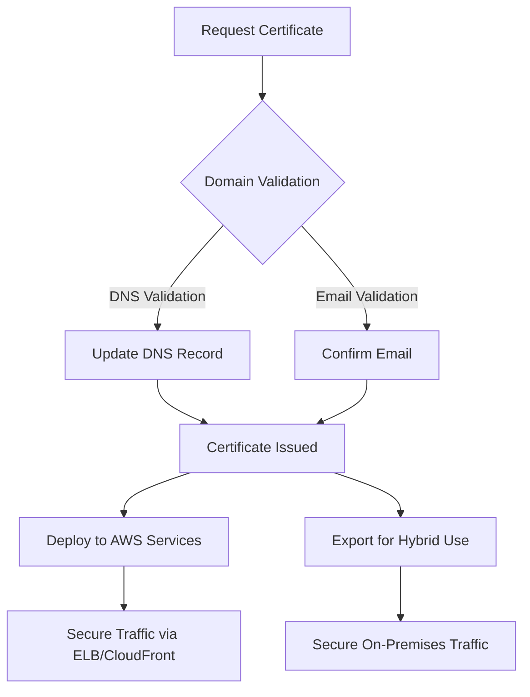
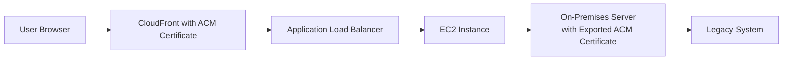

# ACM

## ACM

### 🌟 **Overview of AWS Certificate Manager (ACM)**

AWS Certificate Manager (ACM) is a managed service that simplifies the provisioning, deployment, and management of TLS/SSL certificates for AWS services and hybrid applications. It eliminates the complexity of manual certificate management, including renewal and rotation, by automating these processes. ACM supports both public and private certificates, ensuring secure communications for applications running on AWS or on-premises environments.

<figure><figcaption></figcaption></figure>

**Innovation Spotlight**:

* **Exporting Public Certificates**: As of July 2025, ACM now supports exporting public certificates, enabling hybrid and multi-cloud deployments where certificates need to be deployed outside AWS .
* **Post-Quantum Cryptography Integration**: ACM integrates with AWS KMS for ML-DSA (Module-Lattice-Based Digital Signature Standard), preparing for quantum computing threats .

***

### ⚡ **Problem Statement**

**Real-World Scenario**: A financial institution operates a hybrid application where customer data is processed partly on AWS and partly on an on-premises legacy system. The institution requires TLS encryption for all data in transit but faces challenges in manually managing certificates across environments, leading to potential security gaps and operational overhead.

**Industries/Applications**:

* **Healthcare**: Securing patient data transmission between cloud-based APIs and on-premises EHR systems.
* **E-commerce**: Encrypting payment gateways spanning AWS and third-party services.
* **Government**: Ensuring FIPS compliance for hybrid architectures.

#### 🤝 **Business Use Cases**

1. **Hybrid Cloud Security**: Securely extend AWS-based applications to on-premises infrastructure.
2. **Multi-Cloud Deployments**: Use ACM-issued certificates across AWS, Azure, or GCP.
3. **IoT Devices**: Ensure encrypted communication for IoT devices outside AWS.

***

### 🔥 **Core Principles**

* **Serverless Certificate Management**: Automated provisioning, renewal, and deployment of certificates.
* **Public and Private Certificates**:
  * **Public Certificates**: For internet-facing services (e.g., websites).
  * **Private Certificates**: For internal services within a VPC or on-premises.
* **Integration with AWS Services**: Works seamlessly with ELB, CloudFront, API Gateway, and more.
* **Quantum-Safe Cryptography**: Support for ML-DSA keys via AWS KMS for future-proof security .

***

### 📋 **Pre-Requirements**

1. **AWS Account**: With appropriate IAM permissions.
2. **Domain Ownership Validation**: DNS or email-based validation for public certificates.
3. **Hybrid Environment Setup**: On-premises servers or multi-cloud resources.
4. **AWS CLI or SDK**: For automation tasks.

***

### 👣 **Implementation Steps**

#### **Exporting a Public Certificate from ACM**

1. **Request a Certificate**:
   * Navigate to ACM in AWS Console → Request a certificate → Choose public certificate.
   * Validate domain ownership via DNS or email.
2.  **Export the Certificate**:

    * Use the `ExportCertificate` API or AWS CLI to retrieve the certificate body, private key, and chain.

    ```bash
    aws acm export-certificate --certificate-arn <arn> --passphrase <phrase> --output json
    ```
3. **Deploy On-Premises**:
   * Install the certificate on on-premises servers (e.g., Apache, Nginx).
4. **Automate Renewal**:
   * Use AWS Lambda to automate re-export and deployment upon renewal.

***

### 🗺️ **Data Flow Diagram**

#### **Diagram 1: How ACM Works**



#### **Diagram 2: Hybrid Use Case**



***

### 🔒 **Security Measures**

* **Least Privilege IAM Roles**: Restrict ACM access to necessary actions only.
* **Encryption**: Use AWS KMS to encrypt private keys during export .
* **VPC Isolation**: For private certificates, ensure VPC endpoints are used.
* **Audit Trails**: Enable AWS CloudTrail to monitor certificate requests and exports.

***

### ⚖️ **When to Use and When Not to Use**

* ✅ **When to Use**:
  * Automating TLS management for AWS services.
  * Hybrid or multi-cloud environments requiring consistent certificate management.
  * Compliance needs (e.g., FIPS, HIPAA).
* ❌ **When Not to Use**:
  * Applications not using TLS.
  * Environments requiring custom certificate authorities not integrated with ACM.

***

### 💰 **Costing Calculation**

* **Public Certificates**: Free when used with supported AWS services. Exported certificates may incur KMS costs for encryption ($0.03/10,000 requests).
* **Private Certificates**: $0.75/month per certificate.
* **Sample Calculation**:
  * 10 public certificates (exported 100 times/month): $0 (ACM) + $0.03 (KMS) = $0.03/month.
  * 5 private certificates: $3.75/month.

***

### 🧩 **Alternative Services**

| **Provider** | **Service**                   | **Key Differences**                                      |
| ------------ | ----------------------------- | -------------------------------------------------------- |
| **AWS**      | ACM                           | Automated renewal, free for AWS services, hybrid export  |
| **Azure**    | Key Vault Certificates        | Integration with Azure services, no free tier            |
| **GCP**      | Certificate Authority Service | Supports private CAs, no built-in export feature         |
| **On-Prem**  | OpenSSL                       | Manual management, no automation, free but high overhead |

#### **On-Premise Data Flow Diagram**


***

### ✅ **Benefits**

* **Cost Savings**: Free public certificates for AWS services.
* **Automation**: Hands-free renewal and deployment.
* **Scalability**: Supports thousands of certificates.
* **Security**: Integration with AWS security services (e.g., IAM, KMS).

***

### 📝 **Summary**

AWS Certificate Manager simplifies TLS/SSL certificate management through automation, hybrid flexibility, and robust security. Key takeaways:

1. Automates certificate lifecycle management.
2. Supports hybrid and multi-cloud deployments via export feature.
3. Integrates with quantum-safe cryptography.
4. Cost-effective for public certificates on AWS.
5. Ideal for compliance-sensitive industries.

***

### 🔗 **Related Topics**

* [AWS Security Blog on ACM Export](https://aws.amazon.com/blogs/security/category/learning-levels/expert-400/)
* [AWS Certification Paths](https://aws.amazon.com/certification/)
* [Hybrid Cloud with IAM Roles Anywhere](https://aws.amazon.com/blogs/security/category/learning-levels/expert-400/)

For further details, refer to the [ACM Documentation](https://docs.aws.amazon.com/acm/).
