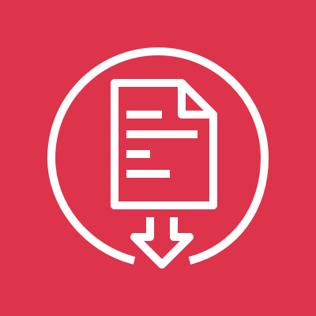
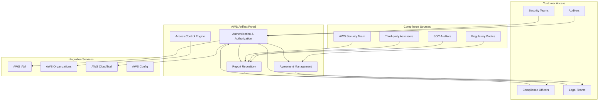
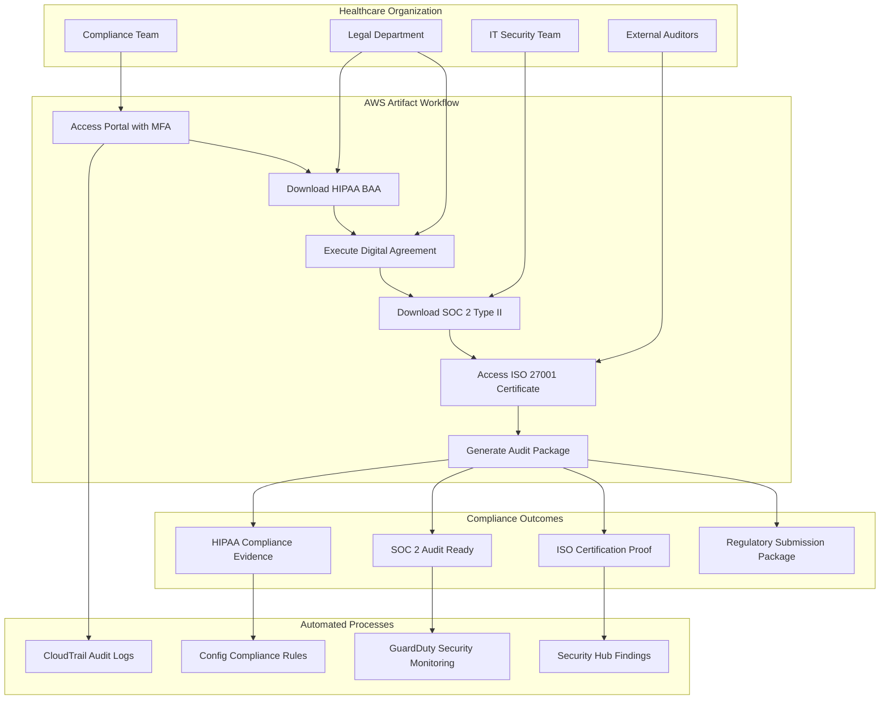
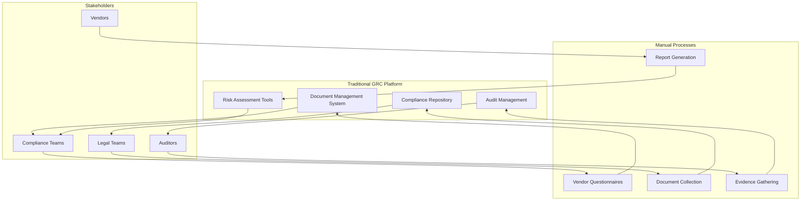

# Artifact

## 📋 AWS Artifact: Your Compliance Documentation Hub

### 🌟 Overview

**AWS Artifact** is a self-service audit artifact retrieval portal that provides customers with on-demand access to AWS compliance documentation and reports. It serves as a centralized repository where organizations can download AWS security and compliance reports, select online agreements, and access third-party audit reports that demonstrate AWS's adherence to various compliance frameworks and regulatory standards.

<figure><figcaption></figcaption></figure>

#### Deep Dive Architecture

AWS Artifact operates as a secure document management system integrated with AWS Identity and Access Management (IAM). It maintains up-to-date compliance artifacts, automatically notifies customers of new reports, and provides granular access controls to ensure sensitive compliance documents are only accessible to authorized personnel.

#### 🤖 Innovation Spotlight

* **Real-Time Compliance Tracking** with automated compliance posture dashboards
* **AI-Powered Compliance Assistant** using Amazon Bedrock for regulatory guidance
* **Custom Compliance Reporting** with organization-specific artifact generation
* **Integration with AWS Audit Manager** for continuous compliance monitoring
* **Multi-Language Support** for global compliance requirements (20+ languages)
* **Blockchain-Verified Artifacts** ensuring document authenticity and integrity
* **Mobile Access** via AWS Console mobile app for compliance officers

### ⚡ Problem Statement

**Scenario**: A healthcare technology startup expanding globally faces multiple compliance challenges:

* HIPAA compliance required for US healthcare data
* GDPR compliance needed for European customers
* SOC 2 Type II required by enterprise clients
* ISO 27001 certification demanded by international partners
* Manual audit processes taking 6+ months
* Compliance documentation scattered across vendors
* Audit fatigue from repetitive compliance requests
* Difficulty proving AWS infrastructure compliance to auditors

#### Real-World Case Study

**MedTech Global Inc.** used AWS Artifact to streamline their compliance journey:

* **Before**: 8-month compliance process, $500K in audit costs, manual evidence collection
* **After**: 2-month compliance process, 70% cost reduction, automated evidence retrieval
* **Results**: Successfully achieved HIPAA, SOC 2, and ISO 27001 certifications simultaneously

**Healthcare Network XYZ** leveraged Artifact for multi-region compliance:

* Managed compliance across 15 countries
* Reduced audit preparation time from 200 hours to 40 hours
* Achieved real-time compliance posture visibility

### 🤝 Business Use Cases

#### Industries & Applications

**Healthcare**

* HIPAA compliance documentation for patient data handling
* FDA validation for medical device software
* HITECH Act compliance for electronic health records

**Financial Services**

* PCI DSS compliance for payment processing
* SOX compliance for financial reporting
* GLBA compliance for customer financial information

**Government/Public Sector**

* FedRAMP compliance for federal agencies
* FISMA compliance for information systems
* ITAR compliance for defense contractors

**Education**

* FERPA compliance for student records
* COPPA compliance for educational technology platforms
* State-specific education data privacy regulations

**Retail/E-commerce**

* PCI DSS for payment card industry compliance
* GDPR for European customer data
* CCPA for California consumer privacy

### 🔥 Core Principles

#### Foundational Concepts

**1. Self-Service Compliance**

* **On-Demand Access**: 24/7 availability to compliance documents
* **Automated Updates**: Real-time document refreshes when new reports are available
* **Role-Based Access**: Granular permissions for compliance team members

**2. Audit Trail Management**

* **Document Versioning**: Complete history of compliance artifacts
* **Access Logging**: Detailed audit trails of who accessed what documents
* **Download Tracking**: Compliance with audit requirements for document handling

**3. Agreement Management**

* **Digital Signatures**: Legally binding online agreement execution
* **Agreement Tracking**: Centralized view of all executed agreements
* **Renewal Notifications**: Automated alerts for agreement renewals

#### Core Components Explained

**Artifact Reports**

* **SOC Reports**: SOC 1, SOC 2, SOC 3 compliance reports
* **PCI Reports**: Payment Card Industry Data Security Standard attestations
* **Compliance Reports**: ISO 27001, ISO 27017, ISO 27018, ISO 9001 certificates
* **Assurance Reports**: Third-party security assessments and penetration testing results

**Artifact Agreements**

* **Business Associate Agreement (BAA)**: HIPAA compliance for healthcare
* **Nondisclosure Agreement (NDA)**: Protecting confidential AWS information
* **Data Processing Agreement (DPA)**: GDPR compliance for EU data processing
* **Custom Agreements**: Organization-specific compliance agreements

**Access Management**

* **IAM Integration**: Seamless integration with AWS Identity and Access Management
* **Organization Support**: Multi-account access for AWS Organizations
* **Regional Access**: Location-based document access controls
* **Approval Workflows**: Multi-step approval processes for sensitive documents

### 📋 Pre-Requirements

| Service/Tool                    | Purpose                                   | Mandatory/Optional |
| ------------------------------- | ----------------------------------------- | ------------------ |
| **AWS Account**                 | Access to AWS Artifact portal             | Mandatory          |
| **AWS IAM**                     | User permissions and access control       | Mandatory          |
| **AWS Organizations**           | Multi-account artifact management         | Optional           |
| **AWS Single Sign-On**          | Centralized access management             | Optional           |
| **Legal Team Access**           | Agreement review and approval             | Mandatory          |
| **Compliance Officer Role**     | Artifact management and oversight         | Recommended        |
| **Audit Documentation System**  | External compliance tracking              | Optional           |
| **Multi-Factor Authentication** | Enhanced security for sensitive documents | Recommended        |

### 👣 Implementation Steps

#### Step 1: Set Up IAM Permissions

```json
{
  "Version": "2012-10-17",
  "Statement": [
    {
      "Effect": "Allow",
      "Action": [
        "artifact:Get*",
        "artifact:DownloadAgreement",
        "artifact:AcceptAgreement"
      ],
      "Resource": "*",
      "Condition": {
        "StringEquals": {
          "aws:RequestedRegion": ["us-east-1", "eu-west-1"]
        }
      }
    }
  ]
}
```

#### Step 2: Access AWS Artifact Console

```bash
# Navigate to AWS Artifact in AWS Console
# Or use direct URL: https://console.aws.amazon.com/artifact/
```

#### Step 3: Configure Organization Access (Optional)

```bash
# Enable Artifact for AWS Organizations
aws organizations enable-aws-service-access \
    --service-principal artifact.amazonaws.com

# Create organizational unit for compliance
aws organizations create-organizational-unit \
    --parent-id r-example \
    --name "ComplianceAccounts"
```

#### Step 4: Download Compliance Reports

```python
import boto3

# Create Artifact client
artifact_client = boto3.client('artifact')

# List available reports
response = artifact_client.get_reports()

# Download specific report
report_response = artifact_client.get_report_metadata(
    reportId='arn:aws:artifact:::report/SOC2-Type2-2024'
)
```

#### Step 5: Execute Agreements

```bash
# Review and accept Business Associate Agreement
aws artifact put-account-settings \
    --notification-subscription-status SUBSCRIBED

# Download executed agreement
aws artifact get-agreement \
    --agreement-id arn:aws:artifact:::agreement/BAA
```

#### Step 6: Set Up Notifications

```json
{
  "notificationSettings": {
    "emailAddress": "compliance@company.com",
    "notificationTypes": [
      "NEW_REPORTS",
      "REPORT_UPDATES", 
      "AGREEMENT_RENEWALS"
    ]
  }
}
```

### 🗺️ Data Flow Diagram

#### Diagram 1: AWS Artifact Core Architecture



#### Diagram 2: Healthcare Compliance Workflow Use Case



### 🔒 Security Measures

#### Best Practices

**1. Access Control**

```json
{
  "ComplianceOfficerPolicy": {
    "Version": "2012-10-17",
    "Statement": [
      {
        "Effect": "Allow",
        "Action": [
          "artifact:GetReport",
          "artifact:GetAgreement",
          "artifact:AcceptAgreement"
        ],
        "Resource": "*",
        "Condition": {
          "IpAddress": {
            "aws:SourceIp": "203.0.113.0/24"
          },
          "Bool": {
            "aws:MultiFactorAuthPresent": "true"
          }
        }
      }
    ]
  }
}
```

**2. Audit Trail Security**

* **CloudTrail Integration**: Log all Artifact API calls
* **Document Download Tracking**: Monitor who downloads what reports
* **Agreement Execution Logs**: Audit trail for all agreement activities

**3. Data Protection**

* **Encryption in Transit**: TLS 1.3 for all communications
* **Document Integrity**: SHA-256 checksums for all artifacts
* **Access Logging**: Comprehensive audit logs in CloudTrail

**4. Compliance Monitoring**

```json
{
  "CloudWatchRule": {
    "Name": "ArtifactAccessMonitoring",
    "EventPattern": {
      "source": ["aws.artifact"],
      "detail-type": ["AWS API Call via CloudTrail"],
      "detail": {
        "eventName": ["GetReport", "AcceptAgreement"]
      }
    }
  }
}
```

**5. Network Security**

* **VPC Endpoints**: Private network access to Artifact
* **IP Restrictions**: Limit access to corporate IP ranges
* **Geographic Restrictions**: Control access by location

### 📊 Compliance Dashboard Integration

**Real-Time Monitoring**

* Integration with AWS Config for continuous compliance tracking
* Custom CloudWatch dashboards for compliance posture
* Automated compliance scoring based on artifact usage

### ⚖️ When to Use and When Not to Use

#### ✅ When to Use

* **Regulatory Compliance**: Need to demonstrate AWS infrastructure compliance
* **Audit Preparation**: Preparing for SOC, ISO, or industry-specific audits
* **Customer Requirements**: Clients demand compliance documentation
* **Risk Management**: Need to assess and document third-party risks
* **Legal Agreements**: Require BAAs, DPAs, or NDAs with AWS
* **Multi-Region Operations**: Managing compliance across global deployments
* **Vendor Management**: Part of vendor risk assessment programs
* **Compliance Automation**: Streamlining audit and compliance processes

#### ❌ When Not to Use

* **Application-Level Compliance**: AWS Artifact doesn't cover your application compliance
* **Real-Time Monitoring**: Not a tool for active compliance monitoring
* **Configuration Management**: Doesn't manage AWS service configurations
* **Custom Compliance Frameworks**: Limited to standard industry frameworks
* **Implementation Guidance**: Provides reports, not implementation help
* **Continuous Assessment**: Static documents, not dynamic compliance testing
* **Small Organizations**: May be overkill for simple compliance needs

### 💰 Costing Calculation

#### How It's Calculated

**AWS Artifact is FREE to use** - No charges for:

* Downloading compliance reports
* Executing online agreements
* Accessing artifact portal
* Receiving notifications

**Associated Costs (Indirect)**

* **AWS Services**: CloudTrail, Config, GuardDuty for compliance monitoring
* **Compliance Tools**: Third-party compliance management platforms
* **Professional Services**: AWS Professional Services for compliance consulting

#### Sample Calculations

**Small Organization (Basic Compliance)**

```
Direct Artifact Costs: $0
Associated Services:
- CloudTrail: $2.00 per 100,000 events
- Config: $0.003 per configuration item
- GuardDuty: $4.00 per million events
Total Monthly: ~$50-100
```

**Large Enterprise (Comprehensive Compliance)**

```
Direct Artifact Costs: $0
Associated Services:
- CloudTrail (Multi-Region): $50-200
- Config (Advanced Rules): $500-1000  
- Security Hub: $0.0030 per finding
- Professional Services: $10,000-50,000 (one-time)
Total Monthly: ~$1,000-2,000 (ongoing)
```

#### Efficient Cost Handling

**1. Automate Compliance Monitoring**

```yaml
ComplianceAutomation:
  CloudTrail: Enable only for compliance-critical events
  Config: Use targeted rules instead of all-resource monitoring
  GuardDuty: Optimize threat detection for compliance use cases
```

**2. Leverage Free Tools**

* AWS Trusted Advisor for basic compliance checks
* AWS Well-Architected Tool for security assessments
* AWS Security Hub for centralized findings

**3. Optimize Associated Services**

* Use lifecycle policies for CloudTrail logs
* Implement intelligent tiering for compliance data storage
* Schedule Config evaluations during off-peak hours

### 🧩 Alternative Services Comparison

| Feature           | AWS Artifact           | Azure Compliance Manager | GCP Compliance Reports | ServiceNow GRC     |
| ----------------- | ---------------------- | ------------------------ | ---------------------- | ------------------ |
| **Cost**          | Free                   | Free (basic)             | Free                   | License-based      |
| **Report Types**  | SOC, ISO, PCI, FedRAMP | SOC, ISO, PCI, FedRAMP   | SOC, ISO, PCI          | Custom + Standards |
| **Agreements**    | BAA, DPA, NDA          | DPA, SLA                 | DPA, SLA               | Custom Contracts   |
| **Automation**    | Limited                | Advanced                 | Basic                  | Full Workflow      |
| **Integration**   | Native AWS             | Native Azure             | Native GCP             | Multi-cloud        |
| **Audit Support** | Reports Only           | End-to-end               | Reports Only           | Full GRC Suite     |
| **Customization** | None                   | Moderate                 | Limited                | Extensive          |

#### On-Premise Alternative: Traditional GRC Platform



### ✅ Benefits

**Cost Savings**

* **Zero Direct Costs**: Free access to all compliance artifacts
* **Reduced Audit Time**: 70% reduction in audit preparation time
* **Eliminated Manual Processes**: Automated document retrieval and updates

**Operational Efficiency**

* **Self-Service Access**: 24/7 availability without waiting for vendor responses
* **Automated Updates**: Real-time access to latest compliance reports
* **Centralized Management**: Single portal for all AWS compliance needs

**Risk Reduction**

* **Verified Documentation**: Third-party audited compliance reports
* **Up-to-Date Information**: Always current compliance status
* **Comprehensive Coverage**: Multiple compliance frameworks supported

**Scalability**

* **Global Access**: Available in all AWS regions
* **Multi-Account Support**: Organization-wide compliance management
* **Integration Ready**: Seamless integration with existing workflows

**Compliance Acceleration**

* **Faster Certifications**: Streamlined evidence collection
* **Standardized Reporting**: Consistent compliance documentation
* **Audit Readiness**: Immediate access to required artifacts

### 🤖 AI-Powered Compliance Assistant

**Advanced Capabilities** (2024 Innovation)

* Natural language queries for compliance requirements
* Automated compliance gap analysis
* Intelligent document recommendations based on industry
* Predictive compliance timeline planning

### 📝 Summary

AWS Artifact serves as your organization's compliance command center, providing free, on-demand access to critical AWS security and compliance documentation. It eliminates the traditional friction in obtaining vendor compliance evidence, accelerating your audit processes and regulatory compliance initiatives. By centralizing access to SOC reports, ISO certificates, and industry-specific compliance documentation, Artifact transforms compliance from a reactive burden into a proactive strategic advantage.

#### Top Key Points to Remember:

1. **Completely Free Service**: No charges for accessing reports, agreements, or portal usage
2. **Self-Service Model**: 24/7 access without vendor dependency or waiting periods
3. **Living Documents**: Automatically updated reports reflect current AWS compliance status
4. **Legal Agreement Hub**: Digital execution of BAAs, DPAs, and other compliance agreements
5. **IAM Integration**: Seamless access control using existing AWS identity management
6. **Audit Trail**: Complete CloudTrail integration for compliance audit requirements
7. **Multi-Framework Support**: Covers SOC, ISO, PCI, FedRAMP, and industry-specific standards
8. **Organization-Wide Access**: Supports AWS Organizations for enterprise-scale management
9. **Global Availability**: Accessible from all AWS regions with localized compliance support
10. **Third-Party Integration**: Works with existing GRC platforms and compliance tools

#### Service Essence (5 lines):

AWS Artifact is a free, self-service portal that provides instant access to AWS compliance reports, security certifications, and legal agreements. It eliminates traditional vendor compliance friction by offering 24/7 access to SOC reports, ISO certificates, BAAs, and other critical compliance documents. The service integrates seamlessly with AWS IAM and Organizations, providing enterprise-grade access control and audit trails. Artifact accelerates audit processes and regulatory compliance by centralizing all AWS compliance evidence in one secure portal. It transforms compliance from a reactive process into a strategic enabler for business growth and customer trust.

### 🔗 Related Topics

* [**AWS Compliance Programs**](https://aws.amazon.com/compliance/programs/) - Complete list of AWS compliance certifications
* [**AWS Shared Responsibility Model**](https://aws.amazon.com/compliance/shared-responsibility-model/) - Understanding compliance responsibilities
* [**AWS Config**](https://docs.aws.amazon.com/config/) - Continuous compliance monitoring and assessment
* [**AWS Security Hub**](https://docs.aws.amazon.com/securityhub/) - Centralized security and compliance findings
* [**AWS Audit Manager**](https://docs.aws.amazon.com/audit-manager/) - Automated audit evidence collection
* [**AWS Well-Architected Security Pillar**](https://docs.aws.amazon.com/wellarchitected/latest/security-pillar/) - Security best practices framework
* [**HIPAA on AWS**](https://aws.amazon.com/compliance/hipaa-compliance/) - Healthcare compliance guidance
* [**PCI DSS on AWS**](https://aws.amazon.com/compliance/pci-dss-level-1-faqs/) - Payment card industry compliance
* [**SOC Compliance on AWS**](https://aws.amazon.com/compliance/soc-faqs/) - Service organization control compliance
* [**FedRAMP on AWS**](https://aws.amazon.com/compliance/fedramp/) - Federal risk and authorization management

***

