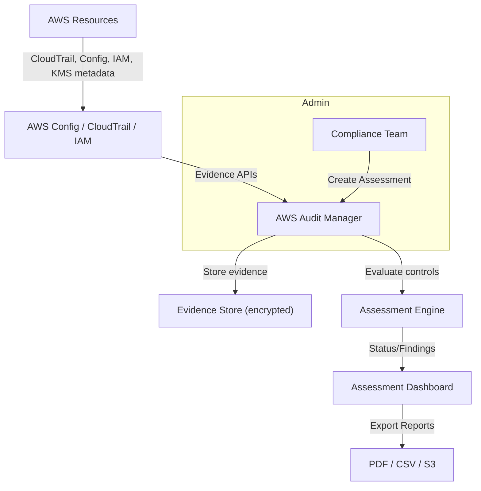
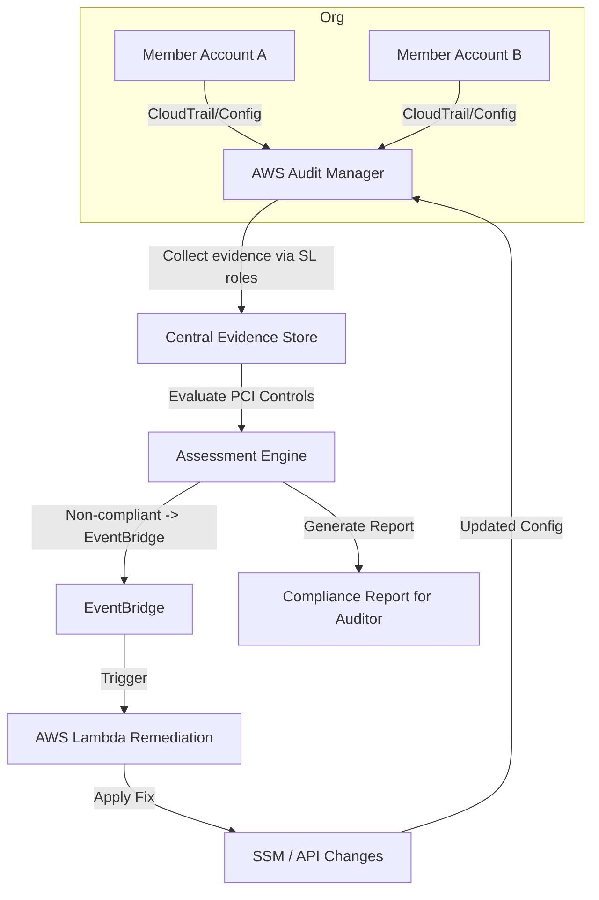
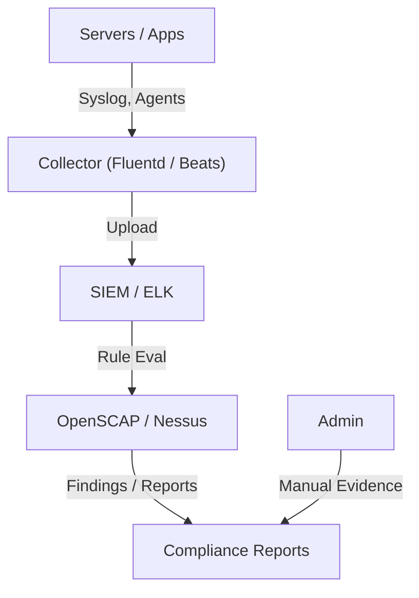

# Audit Manger

## 🌟 AWS Audit Manager — Innovation Spotlight & Deep Dive 🛠️🚀

### **Overview (🌟)**

**AWS Audit Manager** automates evidence collection, maps AWS resource configurations to compliance frameworks, and streamlines audit-ready reporting so organizations can continuously assess and demonstrate compliance.&#x20;

<figure><figcaption></figcaption></figure>

> **Innovation spotlight :** expanded prebuilt frameworks (including updated NIST/ISO/PCI baselines), tighter integrations with AWS Config Conformance Packs, cross-account evidence collection across AWS Organizations, and more granular control over custom frameworks and controls.

***

### ⚡ Problem Statement (Real-world / Case study)

A multinational fintech wants continuous, auditable proof of controls across 50 AWS accounts to satisfy PCI-DSS and SOC 2 auditors. Manual evidence collection is slow, error-prone, and inconsistent across accounts and regions.

Industries/applications:

* Finance (PCI, SOC 2) — payment platforms, neobanks
* Healthcare (HIPAA/HITRUST) — EHR systems, patient portals
* Retail (PCI) — e‑commerce platforms
* Enterprise IT (ISO 27001, GDPR) — SaaS providers, large enterprise workloads

2.1 🤝 Business Use Cases

* Continuous evidence collection for external audits (SOC 2, PCI).
* Mapping AWS Config & CloudTrail evidence to control requirements.
* Centralized audit reporting across AWS Organizations.
* Auto-remediation tie-ins: detect control drift → trigger remediations and re-evaluate.

***

### 🔥 Core Principles

* Continuous evidence collection: automatically gathers evidence (Config, CloudTrail logs, IAM data, KMS keys, VPC flow info, etc.).
* Control frameworks & assessments: prebuilt or custom frameworks composed of controls and mapped AWS data sources.
* Assessments & control statuses: controls evaluated as **Compliant / Non‑compliant / Not applicable / Not evaluated**.
* Delegated and cross-account collection: uses service-linked roles to gather evidence across member accounts in AWS Organizations.
* Immutable audit artifacts: time-stamped evidence with provenance for auditor review.

Key terms & resources:

* Assessment: a set of controls tied to a framework (e.g., PCI assessment for an app).
* Framework: regulatory standard (prebuilt or custom) containing controls and evidence mappings.
* Control: individual requirement (e.g., “enable CloudTrail”). Controls have evidence sources and evaluation logic.
* Evidence: collected artefact or data point (Config snapshot, CloudTrail event, IAM policy, KMS key metadata, manual evidence upload).
* Assessment report: generated artifact (PDF/CSV) for auditors with mapped evidence and findings.
* Evidence store: encrypted storage within Audit Manager holding collected evidence.
* Delegated admin account: central account configured to manage Audit Manager across Organization.
* Control mapping: association between AWS services/data and control requirements. Examples: AWS Config rule -> control; CloudTrail event -> evidence item.

***

### 📋 Pre-Requirements

* AWS Organization (recommended) for cross-account assessments.
* IAM permissions: Audit Manager service-linked role and delegated admin role.
* AWS Config enabled (recorders and rules) in target accounts.
* CloudTrail enabled (multi-region trails).
* S3 buckets/log storage and KMS keys for encryption (if storing logs).
* (Optional) AWS Security Hub, AWS Config Conformance Packs, AWS Systems Manager for remediations.
* Audit/Compliance owner contacts and auditor requirements (list of required controls and evidence retention periods).

***

### 👣 Implementation Steps (practical)

1. Design assessment scope: accounts, regions, frameworks (e.g., PCI, SOC2).
2. Enable AWS Organizations and designate a delegated Audit Manager admin account.
3. Ensure CloudTrail (multi-region) and AWS Config are enabled across accounts/regions.
4. In delegated admin account, open AWS Audit Manager → enable service and accept required roles.
5. Choose a prebuilt framework or create a custom framework; customize controls as needed.
6. Create an Assessment: set scope (accounts, AWS resources, time range), attach framework.
7. Configure evidence collection: map Config rules, CloudTrail events, IAM/KMS metadata, and S3 artifacts.
8. Validate and run assessment; Audit Manager starts collecting evidence automatically via service-linked roles.
9. Review control statuses and flagged findings; attach manual evidence where automated evidence is insufficient.
10. Generate assessment reports (PDF/CSV), export evidence for auditors, and schedule periodic runs.
11. (Optional) Integrate with EventBridge/Lambda or Systems Manager for automated remediation workflows on non-compliant controls.
12. Maintain evidence retention and rotate KMS keys per security policy.

***

### 🗺️ Data Flow Diagrams (Mermaid)

Diagram 1 — How AWS Audit Manager works (core flow):

***

Diagram 2 — Example use case (cross-account PCI assessment with auto-remediation):

***

### 🔒 Security Measures (best practices)

* Enforce least-privilege IAM for Audit Manager admin and service-linked roles.
* Enable AWS Organizations SCPs and centralized management for consistency.
* Encrypt evidence at rest using customer-managed KMS keys; rotate keys per policy.
* Require multi-region CloudTrail and aggregated S3 logging.
* Use AWS Config Conformance Packs and managed rules to ensure controls are automatically evaluable.
* Protect exported reports: store reports in encrypted S3 buckets with restricted access and object lock if required.
* Logging & monitoring: alert on changes to Audit Manager settings, evidence collection failures, or unauthorized role changes.
* Access governance: restrict who can download or modify assessment data; use AWS CloudTrail to audit actions.

***

### ✅ When to use and when not to use

* ✅ When to use:
  * You need continuous, auditable evidence collection for regulatory compliance (SOC 2, PCI, HIPAA).
  * You operate multiple AWS accounts and want centralized audit reporting.
  * You want to map AWS-native telemetry to compliance controls and produce auditor-ready reports.
* ❌ When not to use:
  * Your environment is primarily on-premise with no AWS footprint.
  * You need deep, custom evaluations of non-AWS systems where Audit Manager cannot collect evidence (you’ll need custom tooling).
  * You require real-time enforcement (Audit Manager is assessment/reporting focused; use Config + EventBridge + SSM/Lambda for realtime remediation).

***

### 💰 Costing Calculation

* Pricing model (how it’s calculated): Audit Manager pricing is typically based on number of active assessments and evidence processed (check current AWS Pricing page for exact per‑unit pricing). Costs depend on assessment runs, evidence storage, and additional AWS services used (S3, KMS, Config, CloudTrail).
* Efficiency tips:
  * Scope assessments narrowly to relevant accounts/regions.
  * Reuse frameworks/controls where possible.
  * Archive older assessment evidence to cheaper storage tiers (S3 Glacier) if retention allows.
  * Consolidate evidence collection at delegated admin account to reduce cross-account duplication.
* Sample (illustrative) calculation:
  * Assume Pricing X per assessment run + Y per 1,000 evidence items. For 10 accounts, monthly runs = 4, evidence items = 5,000 → cost = 4\*X + (5 \* Y). Add S3 + KMS charges (storage and API requests).

(Note: Use the AWS Pricing Calculator with your account metrics for exact numbers.)

***

### 🧩 Alternatives (comparison table)

| Capability / Focus             |       AWS Audit Manager | AWS Config + Custom Scripts           | Azure Policy & Azure Blueprints | GCP Security Command Center | On‑Premise (Open-source) |
| ------------------------------ | ----------------------: | ------------------------------------- | ------------------------------- | --------------------------- | ------------------------ |
| Native AWS evidence collection |                       ✅ | ✅ (requires custom)                   | Limited                         | Limited                     | ❌                        |
| Prebuilt compliance frameworks |                       ✅ | Partial                               | ✅                               | Partial                     | Depends                  |
| Cross-account orchestration    |      ✅ (Org integrated) | Manual                                | ✅                               | Limited                     | Manual                   |
| Auditor-ready reports          |                       ✅ | Custom reports                        | ✅                               | Custom                      | Custom                   |
| Auto-evidence mapping          |                       ✅ | No (manual)                           | Partial                         | Partial                     | No                       |
| Cost                           | Managed service pricing | Lower infrastructure cost, higher ops | Managed service                 | Managed service             | Operational overhead     |

On-premise alternative example: Use OpenSCAP/Nessus + custom collectors to gather evidence, store in central SIEM, produce reports.

Mermaid diagram — On-premise data flow (example):

***

### ✅ Benefits

* Automated, continuous evidence collection reduces manual auditor work.
* Centralized assessments across AWS Organizations improve consistency.
* Faster audit cycles and demonstrable control maturity.
* Integrates with AWS Config/CloudTrail for reliable provenance.
* Enables governance at scale with reproducible frameworks.

***

### 📝 Summary & Key Takeaways

AWS Audit Manager automates mapping AWS telemetry to compliance controls and generates auditor-ready evidence and reports.

Top 7 points to keep in mind

1. Enable CloudTrail (multi-region) and AWS Config across accounts first.
2. Use a delegated admin account for centralized collection.
3. Prefer prebuilt frameworks when possible; customize controls carefully.
4. Encrypt evidence with CMKs and restrict S3/report access.
5. Integrate with Config Conformance Packs for automatic control evaluation.
6. Automate remediations via EventBridge + Lambda/SSM for drift.
7. Regularly review frameworks and evidence retention policies.

> In short: AWS Audit Manager continuously collects evidence from AWS services, maps it to compliance frameworks, evaluates control status, and produces auditor-ready reports—enabling scalable, repeatable compliance across AWS accounts.

***

### 🔗 Related Topics

* AWS Config & Conformance Packs
* AWS CloudTrail best practices
* AWS Organizations & Service Control Policies (SCPs)
* AWS KMS: key management & encryption best practices
* Automating remediation with EventBridge + Lambda + Systems Manager

