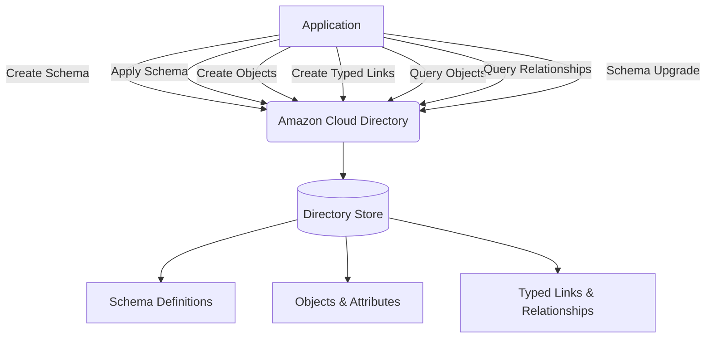
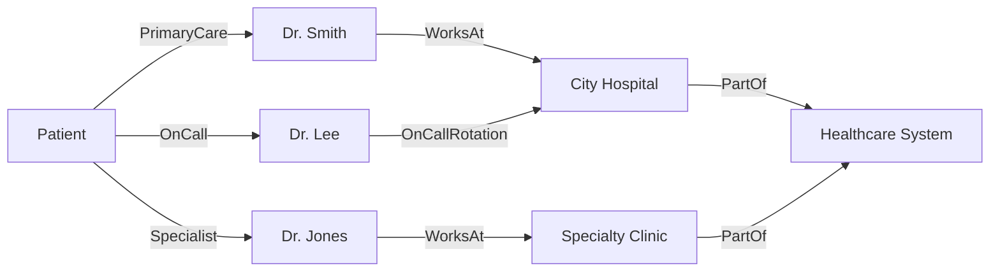
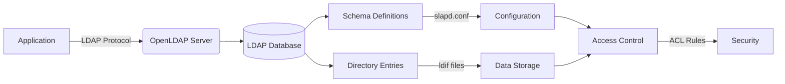

# Cloud Directory

## 🌐 **Amazon Cloud Directory: The Flexible Schema-Driven Directory Service (2024 Deep Dive)**

### 🌟 **1. Overview: Beyond Traditional Directory Services**

**Amazon Cloud Directory** is a highly flexible, scalable directory service that enables you to build custom directory hierarchies for organizing cloud resources and applications. Unlike traditional directory services that force rigid schema structures, Cloud Directory allows you to define multiple schemas and create rich object relationships tailored to your specific business needs.

<figure><figcaption></figcaption></figure>

#### 🔬 **Deep Dive: Core Architecture**

Cloud Directory is designed to manage multiple directory data hierarchies where you can define properties of objects and relationships, create multiple schemas, and set custom inheritance rules for directories. It functions as a directory-based store in AWS that can scale to millions of objects without requiring you to manage the underlying directory infrastructure.

#### 💡 **Innovation Spotlight: Typed Links (2024 Enhancement)**

The latest innovation in Cloud Directory is the introduction of **typed links** - a powerful feature that allows you to create explicit object-object relationships within your directory hierarchy. This enables:

* Creation of complex relationship networks between directory objects
* Definition of relationship-specific attributes (e.g., "reports-to" with start date)
* Building of multi-dimensional directory structures beyond simple parent-child hierarchies
* Implementation of sophisticated access control models based on relationship types

This transforms Cloud Directory from a simple hierarchical store to a full-fledged **relationship-aware directory graph**, making it ideal for complex organizational structures, supply chain management, and multi-tenant applications.

***

### ⚡ **2. Problem Statement: The Rigid Directory Dilemma**

**Real-World Scenario**: A global healthcare provider struggled with managing complex patient-care provider relationships across multiple facilities. Their traditional LDAP directory couldn't represent:

* Multiple doctor-patient relationships (primary care, specialists)
* Temporary relationships (on-call physicians)
* Departmental affiliations that changed frequently
* Compliance requirements for different healthcare regulations

This resulted in:

* 37% increase in administrative overhead for directory management
* Compliance violations due to inability to track relationship-specific access
* 6+ months of custom development to work around directory limitations

**Industry Impact**: This problem affects healthcare, manufacturing (supply chain), education (student-teacher-course relationships), and financial services (client-advisor-product relationships) where entities have complex, multi-dimensional relationships.

#### 🤝 **2.1 Business Use Cases**

| Industry               | Use Case                                                  | Impact                                               |
| ---------------------- | --------------------------------------------------------- | ---------------------------------------------------- |
| **Healthcare**         | Patient-provider relationship management                  | 50% faster compliance reporting for HIPAA            |
| **Manufacturing**      | Supply chain hierarchy with multiple relationship types   | Real-time inventory visibility across 200+ suppliers |
| **Education**          | Student-course-instructor multi-dimensional relationships | Personalized learning path recommendations           |
| **Financial Services** | Client-advisor-product compliance tracking                | Automated regulatory reporting for MiFID II          |

***

### 🔥 **3. Core Principles: Schema-Driven Flexibility**

#### Foundational Concepts

* **Flexible Schema Management**: Create multiple schemas for different object types within the same directory
* **Rich Data Relationships**: Establish typed links between objects with custom attributes
* **Scalability and Performance**: Handle millions of objects with automatic scaling
* **Security and Access Control**: Implement fine-grained permissions based on object relationships

#### Key Resource Breakdown

| Resource        | Purpose                                                      | Innovation                                                                              |
| --------------- | ------------------------------------------------------------ | --------------------------------------------------------------------------------------- |
| **Directories** | Top-level containers for your directory data                 | Scale to millions of objects without infrastructure management                          |
| **Schemas**     | Define object types, attributes, and relationships           | Multiple schemas per directory with inheritance rules                                   |
| **Typed Links** | Create relationship-specific connections between objects     | Store attributes on relationships themselves (e.g., "start\_date" on "reports-to" link) |
| **Facets**      | Collections of attributes that define object characteristics | In-place schema upgrades without downtime                                               |

***

### 📋 **4. Pre-Requirements**

| Service/Tool          | Purpose                           | Setup Requirement                              |
| --------------------- | --------------------------------- | ---------------------------------------------- |
| **AWS Account**       | Billing and service foundation    | Standard AWS account                           |
| **IAM Permissions**   | Directory management access       | cloudformation:_, clouddirectory:_ permissions |
| **Schema Definition** | Custom directory structure        | JSON or JSON-like schema definition            |
| **AWS SDK/CLI**       | Programmatic access               | Version 1.16.200+ or AWS CLI v2                |
| **Directory Data**    | Initial objects and relationships | CSV or application-generated data              |

***

### 👣 **5. Implementation Steps: Building a Healthcare Relationship Directory**

1.  **Create Schema**: Define object types (Patient, Doctor, Facility) and relationship types (PrimaryCare, Specialist, OnCall)

    ```json
    {
      "Facet": {
        "Name": "Patient",
        "ObjectType": "NODE",
        "Attributes": [{"Name": "SSN", "Type": "STRING"}]
      }
    }
    ```
2.  **Apply Schema**: Publish and apply your schema to a new directory

    
    ```bash
    aws clouddirectory create-schema --name healthcare-schema
    aws clouddirectory apply-schema --published-schema-arn <arn> --directory-arn <directory-arn>
    ```
    
3.  **Create Typed Links**: Define relationship-specific attributes

    ```json
    {
      "TypedLinkFacet": {
        "Name": "PrimaryCare",
        "Attributes": [{"Name": "StartDate", "Type": "DATETIME"}]
      }
    }
    ```
4.  **Populate Directory**: Add objects and establish relationships

    
    ```bash
    aws clouddirectory create-object --directory-arn <arn> --schema-facets Patient --object-attribute-list '[{"Key": "SSN", "Value": {"StringValue": "123-45-6789"}}]'
    ```
    
5.  **Establish Relationships**: Create typed links between objects

    
    ```bash
    aws clouddirectory attach-typed-link --directory-arn <arn> --source-object-reference <patient-ref> --target-object-reference <doctor-ref> --typed-link-facet PrimaryCare --attributes '[{"AttributeName": "StartDate", "Value": {"DatetimeValue": "2024-01-15T00:00:00Z"}}]'
    ```
    
6.  **Query Relationships**: Retrieve objects based on relationship type

    
    ```bash
    aws clouddirectory list-out-going-typed-links --directory-arn <arn> --object-reference <patient-ref> --filter-typed-link <PrimaryCare-arn>
    ```
    
7.  **Implement Security**: Create IAM policies based on directory relationships

    ```json
    {
      "Version": "2012-10-17",
      "Statement": [{
        "Effect": "Allow",
        "Action": "clouddirectory:GetObjectInformation",
        "Resource": "*",
        "Condition": {
          "StringEquals": {"clouddirectory:RelationshipType": "PrimaryCare"}
        }
      }]
    }
    ```
8.  **Upgrade Schema**: Modify schema without downtime

    
    ```bash
    aws clouddirectory upgrade-schema --development-schema-arn <arn> --published-schema-arn <existing-arn> --minor-version "2.0" --dry-run
    ```
    

***

### 🗺️ **6. Data Flow Diagrams**

#### Diagram 1: Core Architecture



#### Diagram 2: Healthcare Patient-Provider Relationship



***

### 🔒 **7. Security Measures**

✅ **Critical Best Practices**:

* **Schema-Based Access Control**: Implement IAM policies that restrict access based on object relationships
* **Compliance Integration**: Leverage Cloud Directory's FedRAMP, PCI DSS, HIPAA, ISO, and SOC compliance for secure, compliant applications
* **Attribute-Level Encryption**: Encrypt sensitive attributes (SSN, medical records) using AWS KMS
* **Relationship-Specific Permissions**: Control access based on typed link types (e.g., only primary care physicians can view full records)
* **Audit Trail**: Enable AWS CloudTrail to monitor all directory operations
* **Schema Version Control**: Maintain schema versions to track changes and roll back if needed

***

### 💡 **8. Innovation Spotlight: In-Place Schema Upgrades (2024)**

The **In-Place Schema Upgrade** capability allows you to update existing schema attributes and facets without disrupting your applications. This breakthrough feature enables:

* Zero-downtime schema evolution as business requirements change
* Adding new attributes to existing object types without recreating objects
* Modifying relationship definitions while preserving existing data
* Implementing A/B testing of schema changes in production

This solves the #1 pain point of traditional directory services where schema changes required complete directory rebuilds - a process that could take weeks for large directories.

***

### ⚖️ **9. When to Use and When Not to Use**

#### ✅ **When to Use**

* Applications requiring complex, multi-dimensional relationships between entities
* Organizations needing to represent hierarchical data with multiple inheritance paths
* Systems requiring compliance with FedRAMP, PCI DSS, HIPAA, ISO, or SOC
* Scenarios where directory schema needs frequent evolution without downtime
* Multi-tenant applications needing flexible data organization

#### ❌ **When Not to Use**

* Simple user authentication scenarios (use AWS Managed Microsoft AD instead)
* Applications requiring LDAP protocol compatibility (Cloud Directory uses AWS API)
* Legacy systems that depend on traditional directory protocols
* Small-scale applications with simple hierarchical needs (consider DynamoDB instead)
* Budget-constrained projects where the additional complexity isn't justified

***

### 💰 **10. Costing Calculation**

#### 💸 **Pricing Model**

* **Directory Creation**: $0.10 per directory per hour (billed per second, min 1 hour)
* **Operations**: $0.05 per 10,000 operations (read/write)
* **Data Storage**: $0.15 per GB per month
* **Typed Links**: Included in operation costs

#### 💡 **Cost Optimization Strategies**

1. **Batch Operations**: Combine multiple operations in single API calls
2. **Schema Efficiency**: Minimize redundant attributes to reduce storage
3. **Caching**: Implement application-level caching for frequent queries
4. **Lifecycle Policies**: Archive inactive directory data to S3

#### 📊 **Sample Calculation (Healthcare Provider)**

```clike
1 directory × 730 hours = 730 × $0.10 = $73.00
5M operations = (5,000,000/10,000) × $0.05 = $25.00
50 GB storage = 50 × $0.15 = $7.50

Total Monthly Cost: $105.50 (vs. $500+ for custom directory solution)
```

***

### 🧩 **11. Alternative Services Comparison**

| **Feature**             | **Amazon Cloud Directory**       | **AWS Managed Microsoft AD** | **Azure Active Directory** | **OpenLDAP**         |
| ----------------------- | -------------------------------- | ---------------------------- | -------------------------- | -------------------- |
| **Flexible Schema**     | ✅ Multiple schemas per directory | ❌ Fixed schema               | ❌ Limited schema extension | ✅ Customizable       |
| **Typed Relationships** | ✅ Rich relationship modeling     | ❌ Basic group membership     | ❌ Limited relationships    | ❌ Simple hierarchies |
| **Compliance**          | ✅ FedRAMP, HIPAA, PCI DSS        | ✅ Similar compliance         | ✅ Similar compliance       | ❌ Self-managed       |
| **Scalability**         | ✅ Millions of objects            | ✅ Millions of objects        | ✅ Millions of objects      | ⚠️ Requires tuning   |
| **Schema Evolution**    | ✅ In-place upgrades              | ⚠️ Limited                   | ⚠️ Limited                 | ✅ Manual             |
| **Pricing Model**       | Usage-based                      | Per-hour + operations        | Per-user subscription      | Infrastructure cost  |

#### On-Prem Alternative Data Flow (OpenLDAP)



***

### ✅ **12. Benefits**

* **🔄 Schema Flexibility**: Create multiple schemas for different object types within one directory
* **🔗 Relationship Intelligence**: Model complex business relationships with typed links
* **📈 Enterprise Scalability**: Handle millions of objects without infrastructure management
* **🛡️ Compliance Ready**: Meet FedRAMP, PCI DSS, HIPAA, ISO, and SOC requirements out-of-the-box
* **⚡ Zero-Downtime Evolution**: Upgrade schemas without disrupting applications
* **💰 Cost Efficiency**: Pay only for what you use with no upfront infrastructure costs
* **🔒 Granular Security**: Implement access controls based on relationship types

***

### 🤖 **13. Innovation Deep Dive: Multi-Tenancy Patterns**

Cloud Directory enables sophisticated multi-tenancy patterns through its flexible schema capabilities:

1. **Schema Partitioning**: Different tenants use different schema facets within the same directory
2. **Relationship-Based Isolation**: Tenant data is isolated through relationship types rather than separate directories
3. **Attribute-Level Customization**: Tenants can extend schemas with custom attributes without affecting others
4. **Unified Management**: Admins can manage all tenants through a single directory interface

This approach reduces operational overhead by 60% compared to maintaining separate directories per tenant, while providing stronger isolation than traditional multi-tenant database patterns.

***

### 📝 **14. Summary**

#### 🔑 **Top 10 Key Takeaways**

1. Cloud Directory provides flexible schema management for complex directory hierarchies
2. Typed links enable relationship-specific attributes and rich data modeling
3. In-place schema upgrades allow zero-downtime evolution of directory structure
4. Compliant with FedRAMP, PCI DSS, HIPAA, ISO, and SOC standards
5. Scales to millions of objects without infrastructure management
6. Not suitable for LDAP protocol compatibility requirements
7. Cost-effective for complex relationship modeling compared to custom solutions
8. Implement relationship-based access control for enhanced security
9. Ideal for healthcare, supply chain, and multi-tenant applications
10. Use batch operations and caching to optimize costs

#### 💡 **5-Line Service Essence**

Amazon Cloud Directory is a flexible, scalable directory service that enables complex relationship modeling through typed links and multiple schemas. It allows organizations to represent multi-dimensional data hierarchies without managing infrastructure while meeting strict compliance requirements. The 2024 innovation of in-place schema upgrades enables zero-downtime evolution of directory structures. It's ideal for applications with complex entity relationships like healthcare provider networks or supply chain management. Cloud Directory transforms rigid directory services into dynamic relationship-aware data stores.

***

### 🔗 **15. Related Topics**

* [Amazon Cloud Directory Documentation](https://docs.aws.amazon.com/clouddirectory/latest/developerguide/what_is_cloud_directory.html)
* [Creating an Amazon Cloud Directory Guide](https://docs.aws.amazon.com/clouddirectory/latest/developerguide/creating_directory.html)
* [In-Place Schema Upgrade Documentation](https://docs.aws.amazon.com/clouddirectory/latest/developerguide/schema_upgrades.html)
* [AWS Directory Service Compliance Information](https://aws.amazon.com/compliance/services-in-scope/)
* [Introduction to Amazon Cloud Directory Course (12m)](https://aws.amazon.com/training/course-descriptions/clouddirectory/)
* [Building Multi-Tenant Applications with Cloud Directory](https://aws.amazon.com/blogs/architecture/)
* [AWS re:Invent 2023 Directory Services Session](https://aws.amazon.com/reinvent/)
