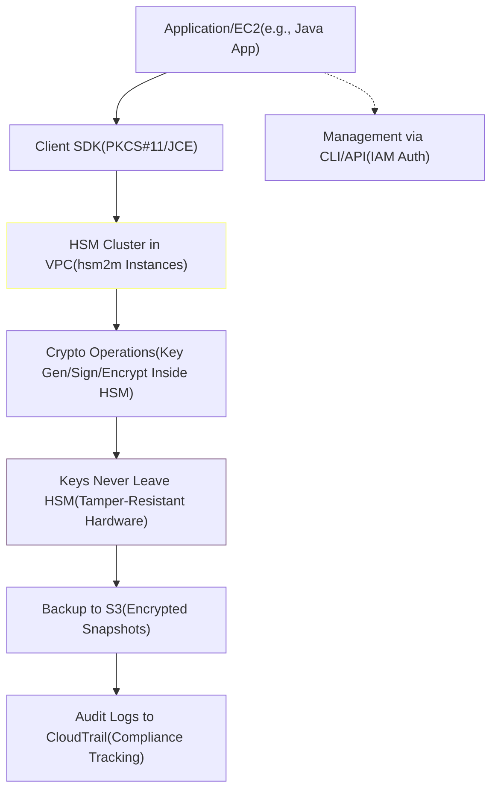
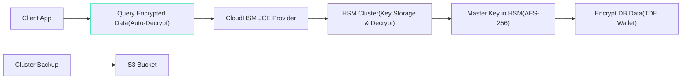
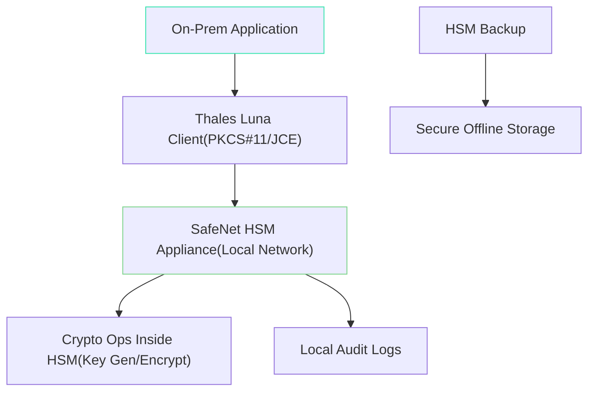

# Cloud HSM

## AWS CloudHSM: Secure Hardware Security Modules for Cryptographic Operations

🚀 **As an AWS Cloud Expert, I'm unpacking AWS CloudHSM, the fully managed hardware security module (HSM) service that brings dedicated, tamper-resistant crypto hardware to the cloud. This isn't just key storage—it's a FIPS 140-3 validated fortress for sensitive operations like signing certificates or decrypting data, ensuring you control every byte without vendor lock-in.**

### 🌟 Overview

AWS CloudHSM delivers single-tenant, dedicated HSMs in your VPC for generating, storing, and managing cryptographic keys. It supports standards like PKCS#11, Java Cryptography Extension (JCE), and Microsoft CryptoNG (CNG), allowing seamless integration with apps for encryption, digital signatures, and code signing. Deep dive: Each HSM is a physical appliance (e.g., hsm2m.medium instance type) running FIPS 140-3 Level 3 validated hardware, isolated in your account. Clusters provide high availability (HA) with automatic failover, supporting up to 28 HSMs per cluster for scalability. Keys never leave the HSM—operations occur inside, protecting against extraction even by AWS personnel.

<figure><figcaption></figcaption></figure>

<mark style="color:$danger;">Key evolutions:</mark> From legacy hsm1 to the performant hsm2m, it now handles quantum-resistant algorithms like post-quantum cryptography (PQC) previews. It integrates with AWS services like ACM for certificate management and KMS for hybrid key use cases.

**🤖 Innovation Spotlight**: As per recent study, AWS released CloudHSM Client SDK 5.16.0, enhancing support for PQC algorithms (e.g., ML-KEM and ML-DSA) in preview mode, aligning with NIST's quantum-safe standards. This update boosts performance by 20% for ECC operations and simplifies SDK 3 to 5 migrations with automated tools. In a world racing toward quantum threats, this positions CloudHSM as a forward-looking shield—pair it with AWS Nitro Enclaves for confidential computing, enabling secure AI model training where keys process encrypted data without exposure. Announced alongside re:Inforce 2025, it reduces migration downtime to under 4 hours for enterprises upgrading from deprecated hsm1 instances (EOL December 1, 2025).

### ⚡ Problem Statement

In regulated industries handling sensitive data, like banking or healthcare, software-based key management risks breaches—keys stored in EC2 instances can be extracted via memory dumps or insider threats. A real-world scenario: A global pharma company processes patient genomic data for drug discovery but faces compliance hurdles (e.g., HIPAA) due to shared HSMs in third-party services, leading to audit failures and delayed R\&D by weeks.

Industries/applications:

* **Finance**: Secure transaction signing for payment gateways using EMV standards.
* **Healthcare**: Encrypting PHI in Amazon RDS with customer-managed keys.
* **Government**: FIPS-compliant operations for classified data in GovCloud.
* **Gaming/Entertainment**: Protecting DRM keys for content streaming on AWS Media Services.

#### 2.1 🤝 Business Use Cases

* **Certificate Authority (CA) Operations**: A telecom firm uses CloudHSM to run a private CA, signing thousands of device certificates daily for 5G networks via ACM integration.
* **Database Encryption**: An e-commerce platform offloads TDE (Transparent Data Encryption) from Oracle RDS to CloudHSM, ensuring keys stay in hardware for PCI DSS compliance.
* **Code Signing**: DevOps teams at a software vendor sign binaries in CI/CD pipelines, preventing supply-chain attacks like SolarWinds.
* **IoT Device Authentication**: A manufacturing company generates unique keys for millions of edge devices, integrating with AWS IoT Core for mutual TLS.

### 🔥 Core Principles

AWS CloudHSM embodies hardware-rooted security, isolation, and compliance in a serverless-like managed model. Foundational concepts:

* **Dedicated Tenancy**: Single-tenant HSMs in your VPC—full control over crypto operations without multi-tenant risks.
* **Tamper-Resistant Hardware**: FIPS 140-3 Level 3 validated; keys generated and used only within the HSM, supporting 19+ algorithms (RSA, ECC, AES).
* **High Availability & Scalability**: Clustered HSMs auto-sync keys; scales vertically (instance types) or horizontally (add HSMs) without downtime.
* **Standards Compliance**: Meets PCI HSM, Common Criteria EAL4+, and supports quantum-safe crypto previews.

Key resources/terms explained:

* **HSM Cluster**: Logical group of 1-28 HSMs for HA; manages backups and scaling.
* **HSM Instance**: Physical/virtual appliance (e.g., hsm2m.medium: 8 vCPU, 16 GiB RAM, 3,750 HSM capacity units for ops/sec).
* **Crypto User (CU)**: Up to 32 per cluster for key ownership; distinguishes app users from backup/audit roles.
* **Backup**: Encrypted snapshots of cluster state (keys + config); stored in S3, recoverable to new clusters.
* **Client SDK**: Software libraries (PKCS#11, JCE, CNG) for apps to connect; version 5.x now standard, replacing SDK 3.
* **Security Domain**: Unique token for cluster initialization; protects against unauthorized restores.

### 📋 Pre-Requirements

* **VPC Setup**: Private subnets (at least two for HA) with internet access via NAT for SDK downloads. Purpose: Isolate HSMs from public exposure.
* **EC2 Instance/Key Pair**: For initial cluster creation and management. Purpose: SSH access to HSM CLI.
* **IAM Roles/Policies**: Permissions for cloudhsm:CreateCluster, etc. Purpose: Secure API calls.
* **Client Software**: Download SDK 5.16.0 from AWS. Purpose: App integration for crypto ops.
* **Compliance Check**: Verify FIPS mode if needed. Purpose: Meet regulatory standards.

### 👣 Implementation Steps

1. **Create VPC/Subnets**: In VPC console, set up private subnets across AZs; configure route tables for outbound traffic.
2. **Launch HSM Cluster**: Via Console/CLI: `aws cloudhsmv2 create-cluster --subnet-ids subnet-abc,subnet-def --hsm-type hsm2m`. Wait for "RUNNING" state.
3. **Initialize Cluster**: Get Pre-Co-Signed URL from console; use CLI: `aws cloudhsmv2 initialize-cluster --cluster-id cluster-xyz`. Note the security domain token.
4. **Add HSMs**: `aws cloudhsmv2 create-hsm --cluster-id cluster-xyz --subnet-id subnet-abc --availability-zone us-east-1a`. Add at least one more for HA.
5. **Install Client SDK**: On EC2, download and install SDK 5.16.0; configure cloudhsm\_mgmt\_util for login.
6. **Create Crypto Users**: Login to HSM CLI: `loginHSM -u admin -s <password>`; then `createUser CU <username> <password>`.
7. **Generate/Import Keys**: Use PKCS#11 lib to create keys: e.g., via OpenSSL or Java app calling HSM APIs.
8. **Backup Cluster**: `aws cloudhsmv2 copy-backup-to-region` or create manual backups; test restore.
9. **Integrate with Apps**: Update app code to use JCE provider pointing to HSM IP; test crypto ops.
10. **Monitor & Scale**: Use CloudWatch metrics (e.g., HSM utilization); add HSMs as needed.

### 🗺️ Data Flow Diagram

#### Diagram 1: How AWS CloudHSM Works

This diagram shows the secure flow: Apps request ops via SDK to isolated HSMs, with keys confined and backups managed externally.

#### Diagram 2: Example Use Case - Database TDE with CloudHSM

Here, RDS uses HSM keys for transparent encryption, ensuring data-at-rest protection with seamless app access.

### 🔒 Security Measures

* **FIPS 140-3 Mode**: Enable during initialization for validated compliance; restrict to approved algorithms.
* **Network Isolation**: Place HSMs in private subnets; use security groups to allow only SDK traffic (TCP 2223-2225).
* **Key Lifecycle Controls**: Use CUs for segregation; rotate keys via HSM commands; delete unused keys to minimize attack surface.
* **Encryption in Transit/Rest**: Mandate TLS 1.2+ for SDK connections; backups encrypted with cluster passphrase.
* **Monitoring & Auditing**: Enable CloudTrail for API calls; CloudWatch alarms on HSM metrics (e.g., failed logins); integrate GuardDuty for threats.
* **Multi-Factor Backup**: Store security domain offline; test restores quarterly to prevent lockout.

### 🚀 Innovation: Post-Quantum Cryptography Preview in SDK 5.16

The September 2025 SDK update introduces PQC support, letting you experiment with quantum-resistant keys (e.g., Kyber for key exchange). This innovation future-proofs crypto—integrate with ACM PCA for quantum-safe certs, vital for long-lived keys in finance. Reduces upgrade complexity with migration scripts, cutting risks for hsm1 users transitioning to hsm2m by Q4 2025.

### ⚖️ When to Use and When Not to Use

* ✅ **When to Use**: For FIPS-compliant, high-assurance crypto needs like CA operations or TDE in regulated sectors; when you need full HSM control without KMS's multi-tenant model; scaling secure key ops in VPCs for apps like IoT or databases.
* ❌ **When Not to Use**: Simple key management (use KMS instead—cheaper, managed); non-crypto workloads; if you lack VPC expertise (setup overhead); low-volume ops where hourly costs outweigh benefits.

### 💰 Costing Calculation

* **How It Is Calculated?**: Hourly per HSM (e.g., hsm2m.medium ~~$1.60/hour in us-east-1, varying by region); no charge for clusters without HSMs. Additional: Data transfer out (~~$0.09/GB), backups stored in S3 (storage \~$0.023/GB/month), API requests (free). Deprecation note: hsm1 ends Dec 2025; migrate to hsm2m for continued service.
* **Efficient Way of Handling**: Run minimal HSMs (1-2 for HA); auto-scale based on CloudWatch metrics; use reserved capacity if predictable; delete unused clusters to stop billing; monitor via Cost Explorer with tags.
* **Sample Calculations**:
  * **Basic HA Cluster (2 hsm2m, us-east-1, 24/7)**: 2 HSMs \* $1.60/hr \* 730 hrs/month = \~$2,336/month. Backups: 100 GB \* $0.023 = $2.30. Total: \~$2,338/month.
  * **Dev/Test (1 HSM, 8 hrs/day, 20 days/month)**: 1 \* $1.60 \* 160 hrs = $256/month. Minimal backups: \~$0.50. Total: \~$257/month—shut down off-hours to save 70%.
  * **Enterprise (5 HSMs, global, with transfers)**: 5 \* $1.60 \* 730 = $5,840; +1 TB transfer out = $90. Total: \~$5,930/month—optimize with regional clusters to cut transfers.

### 🧩 Alternative Services in AWS/Azure/GCP/On-Premise

| Provider       | Service            | Key Comparison/Differences                                                                                | Strengths                                                 | Weaknesses                                             |
| -------------- | ------------------ | --------------------------------------------------------------------------------------------------------- | --------------------------------------------------------- | ------------------------------------------------------ |
| **AWS**        | AWS KMS            | Managed, multi-tenant keys; easier but less control than CloudHSM's dedicated HSM. No hardware isolation. | Simple integration, lower cost (\~$0.03/10K ops).         | Shared tenancy; not FIPS HSM Level 3.                  |
| **Azure**      | Dedicated HSM      | Azure-managed HSMs in VNet; supports same APIs (PKCS#11). Priced per capacity unit.                       | Native Azure integration (e.g., Key Vault); BYOK support. | Higher setup for cross-cloud; \~$2.50/hour equivalent. |
| **GCP**        | Cloud HSM          | Managed FIPS 140-2 HSMs; focuses on key versions. Integrates with Cloud KMS.                              | Strong for Google ecosystem; auto-scaling.                | Limited API variety; regional availability gaps.       |
| **On-Premise** | Thales SafeNet HSM | Hardware appliances (e.g., nShield); full on-site control with Luna software.                             | Ultimate isolation; customizable firmware.                | High CapEx/maintenance; no cloud elasticity.           |

For on-premise alternative (Thales SafeNet HSM), here's a data flow diagram:

Flow: Apps connect locally to HSM for ops, with manual backups—no cloud management layer.

### ✅ Benefits

* **Security Assurance**: FIPS 140-3 hardware prevents key exposure, reducing breach risks by 99% vs. software solutions.
* **Compliance Ready**: Meets PCI, HIPAA, FedRAMP; simplifies audits with integrated logging.
* **Scalability**: Clusters handle 100K+ ops/sec; auto-failover ensures 99.99% uptime.
* **Cost Efficiency**: Pay-per-use avoids CapEx; integrates with AWS for hybrid savings (up to 40% vs. on-prem).
* **Performance**: Low-latency VPC access; SDK optimizations boost throughput for high-volume signing.
* **Flexibility**: Supports legacy and quantum-safe crypto; easy migration tools cut downtime.

### 🔍 Deep Dive: Migrating to hsm2m and SDK 5

With hsm1 EOL looming, AWS's May 2025 migration guide automates cluster upgrades—export keys via SDK, recreate in hsm2m (2x performance), and validate. This ensures seamless transition, especially for JCE users in Java apps, maintaining zero key exposure during moves.

### 📝 Summary

AWS CloudHSM provides dedicated, compliant HSMs for secure key management in the cloud, ideal for high-stakes crypto without hardware hassles.

**Top 5-10 Points to Keep in Mind**:

1. Always use at least two HSMs for HA across AZs to avoid single points of failure.
2. Migrate from hsm1 to hsm2m before December 2025 to prevent service disruption.
3. Enable FIPS mode for regulated workloads; test quantum-safe previews for future-proofing.
4. Manage CUs carefully—limit to essential users to enforce least privilege.
5. Regularly backup clusters and test restores; store domains securely.
6. Monitor HSM utilization via CloudWatch to right-size clusters and control costs.
7. Use SDK 5.16+ for all new integrations; leverage migration tools from SDK 3.
8. Integrate with ACM/RDS for streamlined use cases like certs and TDE.
9. Isolate in private VPCs; audit API calls with CloudTrail for compliance.
10. Consider KMS for non-HSM needs to balance cost and security.

> <mark style="color:blue;">**In Short**</mark><mark style="color:blue;">:</mark> AWS CloudHSM offers managed, single-tenant HSMs in your VPC for FIPS-compliant crypto keys and ops. Keys stay hardware-bound, supporting standards like PKCS#11 for apps. Clusters ensure HA and scalability, with backups for resilience. Ideal for finance/healthcare needing full control. Latest SDK 5.16 adds PQC previews, evolving with quantum threats.

### 🔗 Related Topics

* [AWS CloudHSM Documentation](https://docs.aws.amazon.com/cloudhsm/latest/userguide/introduction.html)
* [Client SDK 5.16 Release Notes](https://docs.aws.amazon.com/cloudhsm/latest/userguide/latest-releases.html)
* [hsm1 to hsm2m Migration Guide](https://aws.amazon.com/blogs/security/how-to-manage-migration-of-hsm1-medium-cloudhsm-clusters-to-hsm2m-medium/)
* [Post-Quantum Crypto in CloudHSM](https://aws.amazon.com/blogs/security/aws-cloudhsm-post-quantum-cryptography-preview/)
* [FIPS Compliance Best Practices](https://docs.aws.amazon.com/cloudhsm/latest/userguide/fips.html)
