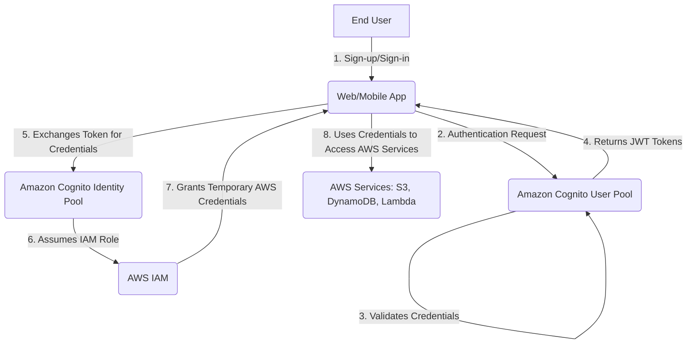
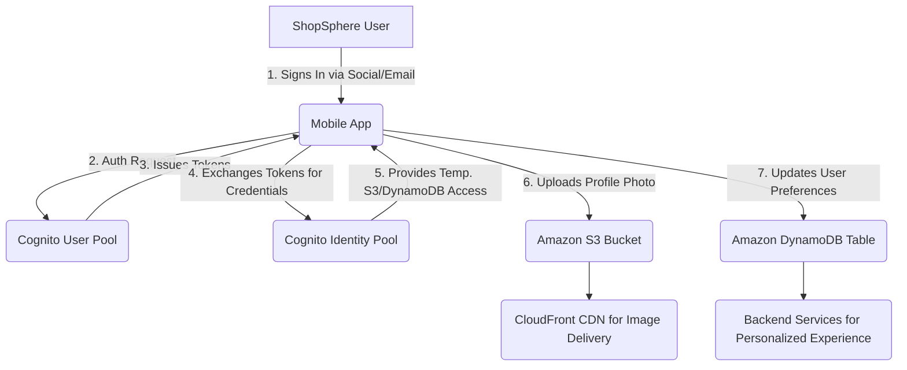
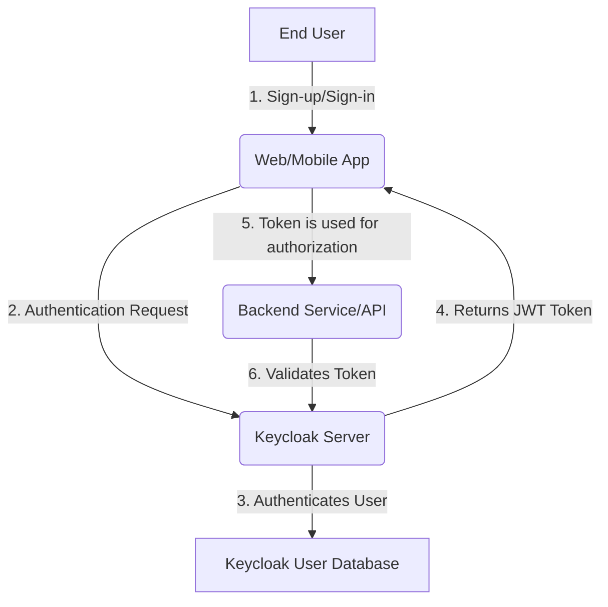

# Cognito

## Amazon Cognito

### 🌟 Overview: Amazon Cognito 🔒

**Amazon Cognito** is a fully managed service that provides a scalable and secure way to handle user authentication, authorization, and user management for web and mobile applications. It's designed to simplify the process for developers, allowing them to focus on core application logic rather than building and managing complex user directories and authentication systems from scratch. Cognito can scale to millions of users and offers a rich set of features, including multi-factor authentication (MFA), social and enterprise identity federation, and a customizable hosted UI.

<figure><figcaption></figcaption></figure>

**Innovation Spotlight 💡:**

The primary innovation of Amazon Cognito is its **two-tiered architecture**, which separates the concerns of user authentication and access to AWS resources. This is a crucial distinction that solves a major security challenge.

* **User Pools**: These are the user directories. They handle all aspects of user sign-up, sign-in, and account management. This is where you authenticate your users, whether they sign in with a username and password, or through social identity providers like Google, Facebook, and Apple.
* **Identity Pools (Federated Identities)**: These are the credential brokers. Once a user is authenticated (either through a User Pool or an external provider), the Identity Pool provides them with temporary, limited-privilege AWS credentials. This allows the authenticated user to securely access other AWS services like Amazon S3, DynamoDB, or AWS Lambda without ever needing to expose long-term AWS credentials in the application.

This separation of duties provides a robust security model, ensuring that user authentication is handled separately from AWS resource authorization, enforcing the principle of least privilege.

***

### ⚡ Problem Statement: A Scalable E-commerce Platform

A startup, **"ShopSphere,"** is building a new e-commerce application. They anticipate rapid growth and need a user management system that can scale from a few hundred users to millions. They want to provide multiple sign-in options, including traditional email/password and social logins (Google, Facebook). They also need to ensure that signed-in users can securely upload profile pictures to Amazon S3 and manage their personal data in a DynamoDB table, all without hardcoding AWS credentials into the mobile or web application.

Building this from scratch would require:

* Developing and maintaining a secure user database.
* Implementing sign-up, sign-in, and password recovery flows.
* Handling password hashing, salting, and storage securely.
* Integrating with multiple social login APIs.
* Creating a system to issue temporary, secure access tokens for AWS services.
* Managing user session states and token refreshes.

This is a significant engineering effort that distracts from the core business of building the e-commerce platform. Amazon Cognito solves this entire problem with a fully managed, serverless solution.

#### 🤝 Business Use Cases

* **Consumer-Facing Applications (CIAM)**: Add sign-up and sign-in to any web or mobile app (e-commerce, social media, content platforms).
* **SaaS Applications**: Manage user access for multi-tenant Software-as-a-Service platforms.
* **IoT Solutions**: Authenticate IoT devices or their operators to grant them access to AWS resources.
* **Internal Applications**: Provide a central identity store for a company's internal applications, often integrating with an existing enterprise directory via SAML.

***

### 🔥 Core Principles

* **Serverless**: No servers to provision or manage for user authentication and management. Cognito automatically scales to handle millions of users.
* **Standards-Based**: Uses industry-standard protocols like OpenID Connect, OAuth 2.0, and SAML 2.0.
* **Federation**: Easily integrates with social identity providers (Google, Facebook, Apple, Amazon) and enterprise identity providers (Okta, Azure AD).
* **Customization**: Provides a customizable hosted UI for a brand-consistent user experience and allows for custom authentication flows using AWS Lambda triggers.

**Resources & Terms**:

* **User Pool**: A user directory that provides sign-up and sign-in services for your users.
* **Identity Pool**: A service that provides temporary AWS credentials to authenticated users (from a User Pool or other federated providers) to access AWS services.
* **App Client**: A configuration within a User Pool that defines how your application interacts with the User Pool (e.g., authentication flows, allowed callback URLs).
* **Hosted UI**: A pre-built, customizable sign-up and sign-in web page provided by Cognito.
* **MFA (Multi-Factor Authentication)**: An added layer of security requiring a second form of verification (e.g., SMS code, authenticator app).
* **Lambda Triggers**: AWS Lambda functions that can be invoked at various points in the authentication and user management workflows (e.g., pre-sign-up, post-confirmation).

***

### 📋 Pre-Requirements

1. **AWS Account**: An active AWS account.
2. **IAM Permissions**: An IAM user or role with permissions to create and manage Cognito resources.
3. **Application**: A web or mobile application that will integrate with Cognito.
4. **AWS SDK/Amplify**: The appropriate AWS SDK (e.g., for JavaScript, Python, iOS, Android) or the AWS Amplify library to easily interact with Cognito APIs.
5. **DNS/SSL (Optional)**: If you use a custom domain for your Hosted UI, you'll need a custom domain and an SSL certificate in AWS Certificate Manager.

***

### 👣 Implementation Steps

1. **Create a User Pool**:
   * Navigate to the Amazon Cognito console.
   * Click "Create user pool."
   * Define your sign-in options (e.g., username, email, phone number) and password policy.
   * Configure MFA settings (SMS or Authenticator App).
2. **Add an App Client**:
   * In your User Pool, go to "App integration" and click "Create app client."
   * Give it a name and configure authentication flows (e.g., allow `ADMIN_NO_SRP_AUTH` for server-side auth or `USER_SRP_AUTH` for client-side).
   * Note the "App client ID" and "App client secret."
3. **Configure a Hosted UI (Optional but Recommended)**:
   * In "App integration," set up a "Domain" for your user pool (e.g., `myshopsphere.auth.us-east-1.amazoncognito.com`).
   * Configure "App client" settings, including callback URLs and allowed OAuth flows.
4. **Create an Identity Pool**:
   * Navigate to the Amazon Cognito console's "Identity Pools" section.
   * Click "Create identity pool."
   * Enable "Authenticated" access and link it to your User Pool.
   * Define two IAM roles: one for authenticated users and one for unauthenticated users (for guest access). Grant these roles the necessary permissions (e.g., authenticated role can `s3:PutObject` on a specific S3 bucket).
5. **Integrate with Your Application**:
   * Use the AWS Amplify library or the AWS SDK for your application's language.
   * Configure your application with the User Pool ID, App Client ID, and Identity Pool ID.
   * Use the SDK/Amplify components to handle sign-up, sign-in, and other user flows. The SDK handles the token exchange between the User Pool and Identity Pool automatically.
   * Once a user is signed in, use the temporary credentials provided by the Identity Pool to make secure calls to other AWS services like S3 or DynamoDB.

***

### 🗺️ Data Flow Diagram

#### Diagram 1: How Amazon Cognito Works

#### Diagram 2: E-commerce Platform Use Case

***

### 🔒 Security Measures

* **IAM Least Privilege**: Ensure the IAM role provided by the Identity Pool has only the minimum necessary permissions to access specific AWS resources. Avoid granting broad access.
* **MFA Enforcement**: Enforce MFA for users, especially for sensitive applications, to add an extra layer of security.
* **Adaptive Security**: Enable Cognito's Advanced Security Features (a paid add-on) to detect and respond to suspicious sign-in attempts (e.g., from new locations or devices).
* **Token Expiration**: Configure sensible token expiration times to limit the window of opportunity for a compromised token.
* **VPC Endpoints**: Use VPC endpoints for Cognito to ensure traffic between your applications running in a VPC and Cognito stays within the AWS network, without traversing the public internet.
* **Rate Limiting**: Configure rate limiting on your API Gateway to prevent brute-force attacks against your authentication endpoint.

***

### ⚖️ When to use and when not to use

* **✅ When to use**:
  * You need a robust, scalable, and secure user authentication system for a web or mobile application.
  * You want to support multiple login methods, including traditional email/password and social logins (Google, Facebook, etc.).
  * Your application needs to grant users temporary access to AWS services like S3 or DynamoDB.
  * You want to offload the security burden of user management to a managed service.
* **❌ When not to use**:
  * You are building a B2B application where your users are your company's workforce. In this case, AWS IAM Identity Center (formerly AWS SSO) is the more appropriate choice for federating with your enterprise identity provider.
  * You need a full-blown identity and access management system for your company's internal employees and resources, where AWS IAM is the primary service for controlling access to AWS accounts and services.
  * You require a fully custom, self-hosted solution for complete control over the authentication infrastructure.

***

### 💰Costing Calculation

Amazon Cognito follows a pay-as-you-go model, primarily based on **Monthly Active Users (MAUs)**.

* **User Pools**:
  * MAUs: A user is considered an MAU if they perform an identity operation (sign-up, sign-in, token refresh) in a calendar month.
  * Pricing is tiered. The first 50,000 MAUs are free. After that, the per-MAU cost decreases as the number of users increases.
  * There are additional charges for SMS messages sent for MFA or phone verification.
* **Identity Pools**: There is no charge for using Identity Pools; you only pay for the use of the AWS services that the temporary credentials allow access to.
* **Advanced Security Features**: This is a separate charge per MAU for features like adaptive authentication and compromised credential detection.

**Efficient Way of Handling Cost**:

* **Optimize MAUs**: Minimize unnecessary token refreshes to keep your MAU count low.
* **Leverage the Free Tier**: The generous free tier for MAUs makes Cognito very cost-effective for startups and small to medium-sized applications.
* **Analyze SMS Costs**: Be mindful of SMS charges for MFA, as they can add up. Consider using an authenticator app for MFA, which is free.

**Sample Calculation**: An e-commerce app with 150,000 monthly active users (MAUs) and no advanced security features.

* **User Pool Costs**:
  * First 50,000 MAUs: Free.
  * Next 50,000 MAUs (50,001 - 100,000): $0.0055 per MAU -> $275.00
  * Next 50,000 MAUs (100,001 - 150,000): $0.0046 per MAU -> $230.00
  * **Total User Pool Cost**: $275.00 + $230.00 = $505.00
* **SMS Cost**: Assuming 10% of users use SMS MFA and each receives one SMS per month, and the SMS cost is, for example, $0.01 per message.
  * 150,000 users \* 10% = 15,000 SMS messages.
  * Cost: 15,000 \* $0.01 = $150.00
* **Total Estimated Monthly Cost**: $505.00 + $150.00 = $655.00

***

### 🧩 Alternative services in AWS/Azure/GCP/On-Premise

| Service                        | Platform               | Key Comparison/Difference                                                                                                                                                                                  |
| ------------------------------ | ---------------------- | ---------------------------------------------------------------------------------------------------------------------------------------------------------------------------------------------------------- |
| **AWS IAM Identity Center**    | AWS                    | Designed for workforce identity and SSO for internal enterprise applications. Integrates with enterprise directories (e.g., Active Directory) and SaaS apps.                                               |
| **Auth0**                      | External SaaS          | A very popular Identity-as-a-Service (IDaaS) platform. Offers a similar, but more opinionated, developer experience with a wider range of pre-built integrations and a highly customizable UI.             |
| **Azure Active Directory B2C** | Azure                  | Microsoft's customer identity and access management (CIAM) solution. Similar to Cognito User Pools, it provides user authentication for customer-facing applications.                                      |
| **Firebase Authentication**    | GCP                    | A simple, easy-to-use authentication service for mobile and web apps, part of the larger Firebase platform. It is not as deeply integrated with the broader AWS ecosystem for resource access.             |
| **Keycloak**                   | On-Premise/Self-Hosted | An open-source identity and access management solution. Provides full control and can be hosted on-premise or in the cloud, but requires a significant amount of self-management and operational overhead. |

**On-Premise Keycloak Data Flow Diagram**:

***

### ✅ Benefits

* **Developer Productivity**: Offloads the complex and security-critical task of building and maintaining a user management system, allowing developers to focus on core application features.
* **Scalability**: Automatically scales to support millions of users without any manual intervention.
* **Security**: Provides a secure, managed service with built-in features like password hashing, MFA, and adaptive security.
* **Identity Federation**: Simplifies the integration of social and enterprise logins, offering a seamless experience for end-users.
* **Cost-Effective**: The generous free tier and pay-as-you-go model make it an economical choice for applications of all sizes.

***

### 📝 Summary

Amazon Cognito is an indispensable service for modern application development. It is a comprehensive, scalable, and secure solution for customer identity and access management. By providing two distinct yet integrated components—User Pools for user authentication and Identity Pools for AWS resource authorization—it simplifies a complex problem. This allows developers to quickly add features like user sign-up, multi-factor authentication, and social login to their applications while ensuring the highest standards of security and operational efficiency. In short, Cognito is the backbone for managing your application's users and securing their interactions with your AWS cloud resources.

**Top 5 Things to Keep in Mind**:

1. **User Pools vs. Identity Pools**: Understand the critical distinction between these two components. User Pools handle _who_ a user is (authentication), and Identity Pools handle _what_ they can do (authorization to AWS resources).
2. **Pricing is MAU-based**: The primary cost driver is Monthly Active Users, so optimize your application to minimize unnecessary authentication-related actions.
3. **Security is Key**: Take advantage of MFA and consider the Advanced Security Features for high-stakes applications.
4. **Integration is Easy**: Use AWS Amplify to streamline the integration of Cognito into your web or mobile app.
5. **Not for Workforce Identity**: Remember that Cognito is primarily for customer-facing applications; use AWS IAM Identity Center for internal workforce identity.

***

### 🔗 Related Topics

* [AWS IAM Identity Center](https://aws.amazon.com/iam/identity-center/)
* [AWS Amplify](https://aws.amazon.com/amplify/)
* [AWS Lambda Triggers for Cognito](https://www.google.com/search?q=https://docs.aws.amazon.com/cognito/latest/developerguide/cognito-user-pools-lambda-triggers.html)
* [Amazon Cognito Developer Guide](https://docs.aws.amazon.com/cognito/latest/developerguide/what-is-amazon-cognito.html)
