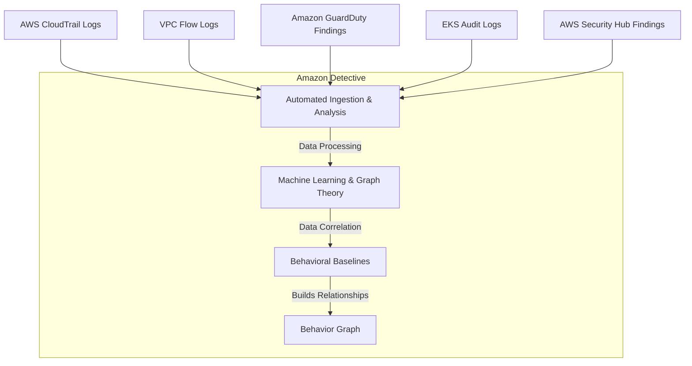
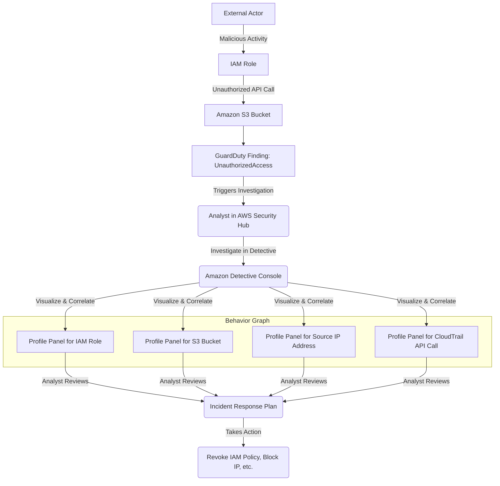
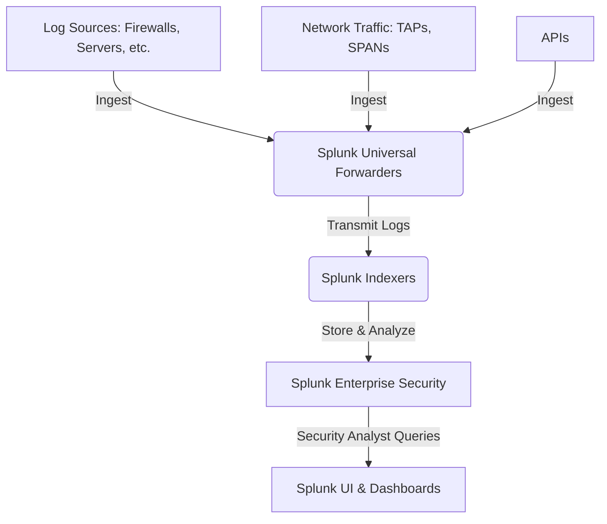

# Detective

## Amazon Detective

### 🌟 Overview: Amazon Detective 🕵️‍♂️

**Amazon Detective** is a fully managed security service that simplifies the process of analyzing, investigating, and quickly identifying the root cause of potential security issues or suspicious activities. While other AWS security services like Amazon GuardDuty, Amazon Inspector, and AWS Security Hub are excellent at _detecting_ threats and vulnerabilities, Detective's purpose is to help you _investigate_ those findings. It automatically collects log data from multiple AWS data sources, including VPC Flow Logs, AWS CloudTrail, and GuardDuty findings. It then uses machine learning, statistical analysis, and graph theory to build a unified, interactive view—a **behavior graph**—of your resources, users, and the interactions between them.

<figure><figcaption></figcaption></figure>

**Innovation Spotlight 💡:**

The core innovation of Amazon Detective is its **behavior graph**. This isn't just a simple dashboard; it's a dynamic, linked data set that visualizes the relationships and interactions between entities like AWS accounts, users, roles, EC2 instances, and IP addresses over time. By automatically ingesting and correlating terabytes of data, Detective creates a "baseline" of normal behavior for each entity. When a security finding occurs, Detective can then highlight deviations from this baseline and show you a visual timeline of all related activities, making it possible to quickly answer critical questions like:

* "Is this API call normal for this user or role?"
* "What other resources has this compromised IP address interacted with?"
* "When did this suspicious activity first start and what was the blast radius?"

This eliminates the need for security analysts to manually sift through raw logs, run complex queries, and manually piece together the narrative of an incident.

***

### ⚡ Problem Statement: Investigating a Suspicious API Call

A company, **"SecureCloud Solutions,"** receives a critical alert from Amazon GuardDuty: "CredentialAccess:IAMUser/AnomalousBehavior." The finding indicates that an IAM user, `DevOps-User`, is making an unusually high volume of API calls from a previously unseen IP address in a foreign country. This single alert is a starting point, but it doesn't provide the full context needed for an effective incident response.

The security team needs to answer questions such as:

* What API calls were made by this user?
* Has `DevOps-User` ever made API calls from this country before?
* What other resources (e.g., S3 buckets, EC2 instances, databases) did this user access or modify?
* Were any new IAM users or roles created?
* Was this activity part of a larger, coordinated attack?

Without a tool like Amazon Detective, the security team would have to manually query multiple log sources (CloudTrail, VPC Flow Logs, etc.), correlate data in spreadsheets, and spend hours or even days to build a clear picture of the incident. This manual process is time-consuming, prone to error, and delays the response to a potential breach.

#### 🤝 Business Use Cases

* **Security Incident Investigation**: Quickly determine the scope, root cause, and impact of a security finding.
* **Threat Hunting**: Proactively explore relationships and patterns in your environment to identify hidden security threats before they escalate.
* **Alert Triage**: Rapidly validate a security alert (e.g., from GuardDuty) to determine if it's a true positive or a false alarm, reducing noise for your security team.
* **Compliance & Auditing**: Provide a clear, visual record of user and resource activity to demonstrate compliance with regulatory requirements.

***

### 🔥 Core Principles

* **Fully Managed**: No servers, software, or agents to deploy or manage. You simply enable the service in your AWS account.
* **Automated Data Ingestion**: Automatically collects and processes data from its configured sources (CloudTrail, VPC Flow Logs, GuardDuty, EKS Audit Logs).
* **Graph Theory**: Uses graph-based data models to represent and visualize the complex relationships between entities and their activities.
* **Behavioral Baselines**: Uses machine learning to establish a baseline of normal behavior for each entity, making it easier to spot anomalous activities.
* **Multi-Account Support**: Can be enabled across multiple accounts within an AWS Organization, with a central management account for investigation.

**Resources & Terms**:

* **Behavior Graph**: The central, linked data set created by Detective that connects all entities and their interactions.
* **Profile Panel**: An interactive visualization that provides a detailed view of a specific entity (e.g., an IAM role, an EC2 instance, an IP address). It shows a timeline of activity, related findings, and a summary of behavior.
* **Scope Time**: The time range for an investigation. It is typically defined by a security finding's start and end times.
* **Entity**: Any item within the behavior graph that can be investigated, such as an IP address, an IAM user, a security group, or a VPC.
* **Findings**: Security alerts generated by services like GuardDuty or Security Hub that can be used as a starting point for an investigation in Detective.

***

### 📋 Pre-Requirements

1. **AWS Account**: An active AWS account.
2. **Enabled Security Services**: Detective works best when integrated with other security services. It's highly recommended to have:
   * **Amazon GuardDuty**: For threat detection.
   * **AWS CloudTrail**: For API activity logs.
   * **VPC Flow Logs**: For network traffic logs.
3. **IAM Permissions**: An IAM user or role with permissions to enable and manage Amazon Detective and access its findings. For a multi-account setup, the management account needs the appropriate permissions to invite member accounts.
4. **AWS Organizations (Optional)**: If you have a multi-account environment, AWS Organizations makes it easier to enable Detective and manage member accounts from a central security account.

***

### 👣 Implementation Steps

1. **Enable Detective**:
   * Log in to the AWS Management Console and navigate to the Amazon Detective service.
   * Click "Enable Detective." If you are using AWS Organizations, you can choose to enable it for your entire organization.
   * Detective will automatically start ingesting data from your enabled accounts and configured sources.
2. **Identify a Finding**:
   * Go to your AWS Security Hub or Amazon GuardDuty console.
   * Identify a security finding that requires investigation, such as a "CredentialAccess" or "UnauthorizedAccess" alert.
3. **Investigate in Detective**:
   * From the finding details page in Security Hub or GuardDuty, click the "Investigate in Detective" link. This will take you directly to the relevant profile panel for the finding.
4. **Analyze the Profile Panel**:
   * The profile panel for the finding will display a timeline of events leading up to and following the incident.
   * It will show a list of related entities (e.g., the IAM user, the source IP address, the EC2 instance) and their interactions.
   * Use the interactive visualizations to filter by time, view API call volumes, and see if there are any unusual patterns. For example, check the "Overall API call volume" chart to see if there was a sudden spike.
5. **Drill Down into Entities**:
   * Click on any entity (e.g., the suspicious IP address) to view its dedicated profile panel.
   * The IP address profile will show you what other resources it has communicated with, its geographic location, and any associated findings.
6. **Formulate a Response**:
   * Based on your findings from the Detective behavior graph, you can now take informed action, such as revoking credentials, isolating an EC2 instance, or updating security group rules.

***

### 🗺️ Data Flow Diagram

#### Diagram 1: How Amazon Detective Works

#### Diagram 2: Security Incident Investigation Use Case

***

### 🔒 Security Measures

* **IAM Least Privilege**: Ensure that only authorized security personnel have access to the Amazon Detective console and its data.
* **Multi-Account Governance**: In an AWS Organization, use a dedicated security account as the delegated administrator for Detective to centralize investigations and maintain a clear separation of duties.
* **Monitoring & Auditing**: Use AWS CloudTrail to log all API calls to Detective, and monitor these logs in Amazon CloudWatch to track who is performing investigations and what data is being accessed.
* **Integrate with other services**: While Detective is a powerful investigative tool, it is not a standalone solution. It works best when integrated with foundational security services like GuardDuty for detection and Security Hub for centralized findings management.

***

### ⚖️ When to use and when not to use

* **✅ When to use**:
  * You need to perform deep-dive investigations into security findings from services like GuardDuty.
  * You want to understand the full context and relationships of a security incident.
  * You have a multi-account AWS environment and need a centralized tool for security investigations.
  * Your security team is spending significant time manually correlating logs to understand an incident.
* **❌ When not to use**:
  * You need a service for proactive _threat detection_ (use Amazon GuardDuty for this).
  * You need a centralized dashboard for _prioritizing and managing_ security alerts from multiple sources (use AWS Security Hub for this).
  * You need a service to perform _data classification_ or discover sensitive data (use Amazon Macie for this).
  * You are looking for a service to prevent or automatically _block_ threats (use services like AWS WAF, Security Groups, and NACLs for this).

***

### 💰Costing Calculation

Amazon Detective's pricing is based on the volume of data ingested from its data sources, measured in GB per account per region per month. There are no additional charges for the storage of the behavior graph or for running queries.

* **Data Ingestion**: The cost is tiered, with a lower price per GB as the volume of ingested data increases. The data sources are:
  * AWS CloudTrail management events
  * VPC Flow Logs
  * Amazon GuardDuty findings
  * Amazon EKS audit logs
  * Findings from AWS Security Hub

**Efficient Way of Handling Cost**:

* **Leverage the 30-day Free Trial**: Use the free trial to understand your typical data ingestion volume and project your monthly costs.
* **Consolidate with AWS Organizations**: If you use AWS Organizations, manage Detective from a single delegated administrator account to simplify billing and get a consolidated view.
* **Monitor Usage**: Regularly check the "Usage" tab in the Detective console to monitor data ingestion volume and understand your spending.

**Sample Calculation**: An organization in the US East (N. Virginia) region with an average monthly data ingestion of 1,500 GB from all sources.

* **Pricing Tiers (example)**:
  * First 1,000 GB: $2.00 per GB
  * Next 4,000 GB: $1.00 per GB
* **Calculation**:
  * Cost for the first 1,000 GB: $1,000 GB \* $2.00/GB = $2,000
  * Cost for the next 500 GB: $500 GB \* $1.00/GB = $500
  * **Total Estimated Monthly Cost**: $2,000 + $500 = $2,500

***

### 🧩 Alternative services in AWS/Azure/GCP/On-Premise

| Service                                  | Platform        | Key Comparison/Difference                                                                                                                                                                                                                                             |
| ---------------------------------------- | --------------- | --------------------------------------------------------------------------------------------------------------------------------------------------------------------------------------------------------------------------------------------------------------------- |
| **AWS Security Hub**                     | AWS             | A centralized hub for managing security alerts and compliance checks from various AWS services and partner solutions. It's a dashboard for findings, not a deep-dive investigative tool.                                                                              |
| **AWS GuardDuty**                        | AWS             | A threat detection service that continuously monitors for malicious activity and unauthorized behavior. It generates the findings that Detective is designed to investigate.                                                                                          |
| **Azure Sentinel (Microsoft Sentinel)**  | Azure           | A cloud-native Security Information and Event Management (SIEM) and Security Orchestration, Automation, and Response (SOAR) solution. It's much broader than Detective, providing log ingestion, analytics, and automated responses from multiple sources.            |
| **Google Cloud Security Command Center** | GCP             | A centralized platform for security and privacy management. It aggregates findings from various Google Cloud services and third-party solutions, providing a similar high-level view to Security Hub.                                                                 |
| **Splunk Enterprise Security**           | On-Premise/SaaS | A Security Information and Event Management (SIEM) platform. It can ingest logs from any source and uses a powerful search language to correlate events. Requires significant management, infrastructure, and expertise compared to a managed service like Detective. |

**On-Premise Splunk Data Flow Diagram**:

***

### ✅ Benefits

* **Accelerated Investigations**: Reduces the time required to investigate a security incident from days to minutes.
* **Simplified Context**: Automatically correlates disparate data points into a single, understandable view, eliminating the need for manual log analysis.
* **Proactive Threat Hunting**: Enables security teams to go beyond reactive investigations and proactively hunt for threats within the environment.
* **Cost-Effective**: Pay-as-you-go model with no upfront costs or additional charges for storing the behavior graph or for running queries.
* **Scalable and Automated**: Fully managed service that automatically scales with your environment and requires no manual data integration.

***

### 📝 Summary

Amazon Detective is a powerful, purpose-built service that transforms the security investigation process. By automatically ingesting and correlating log data from a variety of sources, it creates an interactive behavior graph that provides a unified, visual context for security findings. This allows security analysts to quickly get to the root cause of a potential issue, rather than spending hours sifting through raw data. It works as a vital companion to other AWS security services like GuardDuty and Security Hub, taking an alert from "something is wrong" to a clear "here is what happened and how."

**Top 5 Things to Keep in Mind**:

1. **It's an Investigative Tool, Not a Detection Tool**: Detective is for _investigating_ findings, not for _detecting_ them. It's a complement to services like GuardDuty.
2. **Behavioral Baselines are Key**: The service’s power lies in its ability to understand "normal" and highlight deviations.
3. **Multi-Account is a Major Advantage**: It provides a single pane of glass for investigating security events across your entire AWS Organization.
4. **Pricing is Based on Ingestion**: Be aware of the volume of logs you are generating, as this is the primary cost driver.
5. **No Manual Log Correlation**: The biggest benefit is eliminating the tedious, manual work of piecing together an incident's narrative from multiple log sources.

***

### 🔗 Related Topics

* [Amazon GuardDuty Documentation](https://aws.amazon.com/guardduty/features/)
* [AWS Security Hub Documentation](https://aws.amazon.com/security-hub/features/)
* [AWS CloudTrail Documentation](https://aws.amazon.com/cloudtrail/features/)
* [Amazon Detective - Overview and Demonstration (YouTube)](https://www.youtube.com/watch?v=fmm4PXhg8BY)
* [AWS re:Invent 2019: Dive deep into Amazon Detective (SEC304)](https://www.google.com/search?q=https://www.youtube.com/watch%3Fv%3Dp0vJ4-t34tQ)
