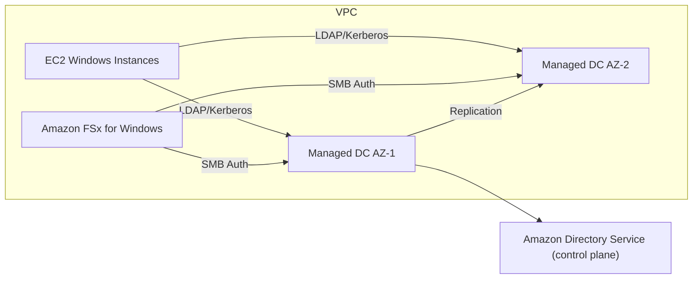
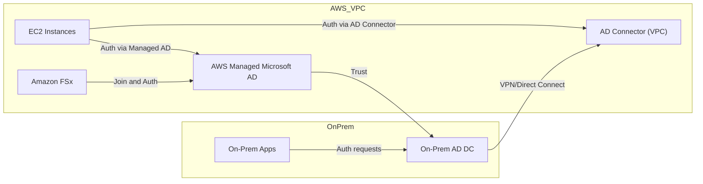
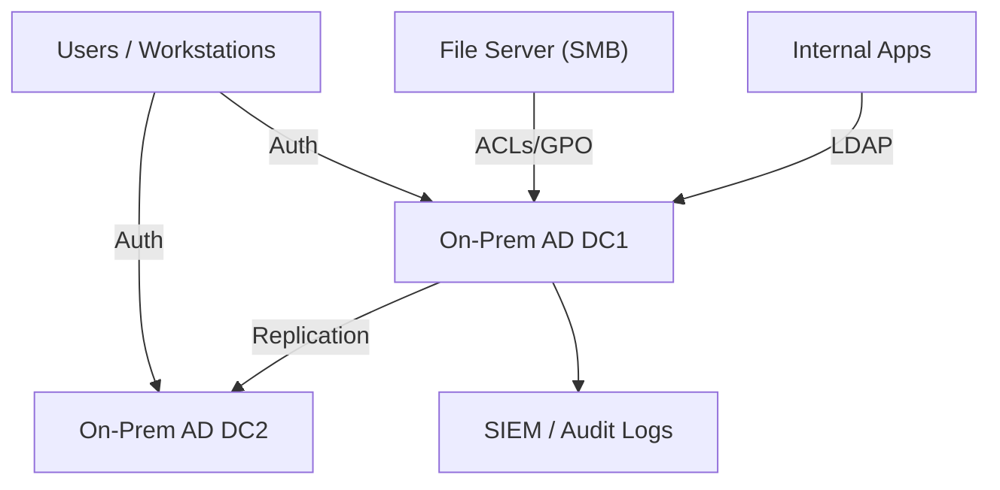

# Directory Service

## 🌟 Amazon Directory Service

**Amazon Directory Service** provides managed directory solutions to simplify authentication, authorization, and LDAP/Active Directory–based identity workloads in AWS. **It offers multiple directory types:** AWS Managed Microsoft AD, Simple AD (deprecated for new deployments), AD Connector, and Microsoft AD (Standard/Enterprise), enabling seamless integration for Windows workloads, AWS Single Sign-On (now IAM Identity Center), applications, and LDAP-aware services.

<figure><figcaption></figcaption></figure>

### 🤖 Innovation Spotlight:

* **Managed Microsoft AD with Nitro-backed performance improvements** for large-scale enterprise domains.
* **Tighter integration with IAM Identity Center (successor to AWS SSO)** for hybrid identity flows and conditional access.
* **Automated cross-account trust setup tools** and simplified AD trust management across AWS accounts and VPCs.
* **Support for schema extensions and AD-aware managed services** (RDS for SQL Server, Amazon FSx, Amazon EMR) with improved scale and failover.

***

### ⚡ Problem Statement

Scenario: A global enterprise migrates Windows applications and file servers to AWS but must maintain existing Active Directory-based authentication, group policies, and LDAP access without operating AD domain controllers on EC2. They need high-availability, cross-VPC connectivity, and secure trust relationships to on-premises AD.

Industries / Applications:

* Enterprise IT (Windows workloads, Group Policy, Kerberos authentication)
* Healthcare & Finance (regulated apps requiring AD auth)
* Education (centralized user management for labs)
* SaaS vendors (multi-tenant AD integration for enterprise customers)

2.1 🤝 Business Use Cases

* Migrate legacy Windows servers and RDS SQL Server to AWS while preserving AD authentication and GPOs.
* Enable AWS-managed file services (Amazon FSx for Windows) joined to AD.
* Provide federated single sign-on for cloud apps using IAM Identity Center and AD trust.
* Use AD Connector to proxy authentication to on-prem AD without syncing credentials to cloud.

***

### 🔥 Core Principles

* Managed control plane: AWS runs domain controllers, replication, patching, snapshots, and failover for AWS Managed Microsoft AD.
* Directory types and roles:
  * AWS Managed Microsoft AD (Active Directory hosted by AWS; supports trusts, GPOs, schema extensions).
  * AD Connector (a proxy that forwards authentication requests to your on-premises Active Directory; no directory data stored in AWS).
  * Simple AD (Lightweight, Samba-based; legacy — avoid for new deployments).
  * Microsoft AD (Standard/Enterprise sizing options based on scale).
* High availability: Multi-AZ deployment with domain controllers in at least two Availability Zones for resilience.
* Network requirements: Directories require VPC subnets with connectivity for clients; AD Connector needs connectivity to on-prem via Direct Connect or VPN.
* Security: Uses secure LDAP (LDAPS) or Kerberos; you can integrate with KMS for encryption of stored secrets and use IAM policies for Directory Service API access.
* Integration points:
  * Amazon FSx, RDS for SQL Server, AWS WorkSpaces, AWS Systems Manager, EC2 Windows instances can join directories.
  * IAM Identity Center and AWS Single Sign-On can federate to directories (via trust or user sync).
* Cost/Scale tradeoffs: Managed AD reduces operational overhead but incurs per-hour directory pricing and per-GB data transfer for on-prem trust/replication.

Key terms/resources:

* Directory (resource representing a managed directory).
* Directory Type (Microsoft AD, AD Connector, Simple AD).
* Trust (AD trust relationship between AWS Managed Microsoft AD and on-premises AD).
* Conditional Forwarder (DNS forwarding to on-prem DNS).
* Domain Controllers (managed by AWS for AWS Managed Microsoft AD).
* VPC Endpoints / Security Groups (network access control for directory traffic).
* LDAPS (LDAP over TLS), Kerberos, SMB (for FSx).
* Schema Extensions (custom attributes added to AD schema for apps).

***

### 📋 Pre-Requirements

* AWS account with permissions to create Directory Service resources and VPC networking.
* VPC with at least two private subnets across different AZs for Managed Microsoft AD.
* Route tables and security groups allowing required ports (TCP/UDP 389 LDAP, 636 LDAPS, 88 Kerberos, 445 SMB, 464, 135 RPC, high ephemeral ports).
* Network connectivity to on-premises AD (if trust or AD Connector): AWS Direct Connect or Site-to-Site VPN.
* DNS resolution strategy: Conditional forwarders or Route 53 Resolver rules to resolve on-prem AD DNS from VPC.
* IAM permissions to manage Directory Service, EC2, VPC, and relevant services (FSx, RDS, WorkSpaces).
* Certificate management (for LDAPS) if you require certificate-based authentication.
* Planning for OU structure, GPOs, and schema changes if extending the schema.

***

### 👣 Implementation Steps

1. Network Prep
   * Create or select a VPC with two private subnets in different AZs.
   * Configure route tables, security groups, and NACLs to permit AD traffic.
   * If on-prem connectivity required, set up VPN or Direct Connect and configure route propagation.
2. Choose Directory Type
   * For fully managed AD: choose **AWS Managed Microsoft AD** (Standard or Enterprise).
   * To proxy to on-premises AD without syncing: choose **AD Connector**.
   * Avoid Simple AD for new workloads.
3. Create Directory
   * Console/CLI: Directory Service → Create directory → Select “AWS Managed Microsoft AD” or “AD Connector”.
   * Provide directory DNS name (e.g., corp.example.com), NetBIOS name, admin password, VPC, and subnets.
4. Configure DNS & Trusts
   * Configure Route 53 Resolver rules / conditional forwarders so EC2 instances resolve directory domain names.
   * For hybrid scenarios: establish AD trust between AWS Managed Microsoft AD and on-prem AD; configure conditional forwarders for DNS.
5. Join Resources
   * For EC2 Windows: use EC2 instance role/SSM to run domain-join scripts or use Systems Manager to join instances automatically.
   * For Amazon FSx: select directory during file system creation to join FSx to the domain.
   * For RDS SQL Server/Aurora: configure Windows authentication where supported.
6. Secure & Harden
   * Enable LDAPS (use certificates) for LDAP over TLS where apps require it.
   * Limit management access to Directory Service via IAM policies and SCPs.
   * Apply security groups to restrict access to domain controllers to only required subnets/services.
7. Monitoring & Backups
   * Monitor directory health via Directory Service console and CloudWatch metrics.
   * Use automated snapshots/backups offered by Directory Service; for extra assurance, export AD data with scheduled scripts if needed.
8. Automation & Scaling
   * Use Infrastructure as Code (CloudFormation / CDK / Terraform) to create directories and associated networking.
   * For large environments, choose Enterprise edition for higher scale and test failover.
9. Maintenance & Schema Changes
   * Plan schema extensions carefully — test in non-production directory before applying to Managed Microsoft AD.
   * Use delegated admin accounts and follow change control for GPOs and OU management.

***

### 🗺️ Data Flow Diagram

Diagram 1 — Basic AWS Managed Microsoft AD (how directory service works)

Diagram 2 — Hybrid scenario: AD Connector with on-prem trust and AWS Managed Microsoft AD

***

### 🔒 Security Measures

* Principle of least privilege: restrict Directory Service API actions to specific IAM principals using resource-level policies.
* Network isolation: place domain controllers in private subnets; restrict inbound traffic via security groups to only necessary ports and sources.
* Use LDAPS to secure LDAP traffic and enforce strong Kerberos policies.
* Protect admin credentials: use Secrets Manager or Systems Manager Parameter Store (with KMS) for storing join passwords or service account secrets.
* Monitor with CloudWatch and CloudTrail: enable logging for Directory Service API calls and set alerts for configuration changes.
* Use multi-region and multi-AZ placement for redundancy; restrict ability to remove directory snapshots via IAM.
* Harden EC2 instances joined to domain: disable unnecessary services, patch OS, and use EDR/host-based controls.

***

### ✅ When to use and when not to use

* ✅ When to use:
  * You need managed Active Directory in AWS with full AD features (GPOs, trusts, Kerberos).
  * You want to join AWS services (FSx, WorkSpaces, RDS for SQL Server) to an Active Directory with minimal ops.
  * You need a proxy to on-prem AD without syncing credentials (AD Connector).
  * You require multi-AZ high availability without running domain controllers on EC2.
* ❌ When not to use:
  * You only need simple LDAP authentication for a small app (consider Cognito or lightweight LDAP alternatives).
  * You have strict requirements to control every AD DC version/patch timeline (self-managed DCs on EC2 give more control).
  * Pure cloud-native identity without AD dependency — use IAM/ IAM Identity Center / Cognito.

***

### 💰 Costing Calculation

How pricing is calculated:

* AWS Managed Microsoft AD: hourly directory instance pricing based on edition (Standard/Enterprise) and region + per-GB data transfer for replication across AZs/regions (where applicable).
* AD Connector: hourly fee per connector + reduced costs since it proxies to on-prem.
* Additional costs: EC2 instances, VPC Flow Logs, Data Transfer (Direct Connect/VPN), Amazon FSx/RDS usage, Route 53 Resolver endpoints if used.

Efficient handling tips:

* Choose Standard vs Enterprise edition based on objects and authentication volume to avoid overpaying.
* Use AD Connector when you don’t want directory data stored in AWS.
* Consolidate directories across accounts where feasible using trusts to reduce per-directory costs.
* Use reserved capacity for dependent services (FSx, RDS) where applicable, and avoid unnecessary cross-region replication.

Sample cost estimate (illustrative — replace with real region pricing):

* AWS Managed Microsoft AD Standard: $0.40/hour ≈ $288/month
* AD Connector: $0.10/hour ≈ $72/month (per connector)
* Additional: VPN $0.05/hour ≈ $36/month, Route 53 Resolver endpoints $0.05/hour ≈ $36/month
* Total ≈ **$432/month** plus service-specific costs (FSx, RDS, EC2). Adjust for regional pricing and scale.

***

### 🧩 Alternative services (AWS / Azure / GCP / On-Premise)

| Category               |                                                          Amazon Directory Service | Azure Equivalent                                                                   | GCP Equivalent                                                                   | On-Premise Alternative                                    |
| ---------------------- | --------------------------------------------------------------------------------: | ---------------------------------------------------------------------------------- | -------------------------------------------------------------------------------- | --------------------------------------------------------- |
| Managed AD / Directory |                                            AWS Managed Microsoft AD, AD Connector | Azure Active Directory Domain Services (Azure AD DS) + Azure AD                    | Managed LDAP/AD not first-class; use AD via Cloud VPN or third-party (JumpCloud) | Self-managed Active Directory on physical/virtual servers |
| Proxy to on-prem       |                                                                      AD Connector | Azure AD Connect (sync) / Azure AD DS (proxy)                                      | Use VPN + on-prem AD                                                             | Direct LDAP/AD on-premise                                 |
| Key Differences        | Full Windows AD feature set managed by AWS; deep integration with FSx, WorkSpaces | Azure AD DS provides managed domain services; Azure AD handles identity/federation | GCP relies on hybrid setups or third-party; less native managed AD               | Full control, but high ops cost and maintenance           |

On-premise alternative data flow (Mermaid):

***

### ✅ Benefits

* **Reduced operational overhead** — AWS manages DCs, replication, patching, and failover.
* **High availability** — Multi-AZ domain controllers without managing EC2 domain controllers.
* **Seamless AWS service integration** — FSx, WorkSpaces, RDS, and other services can join domains easily.
* **Hybrid flexibility** — AD Connector and trust support enable hybrid identity without cloud-stored credentials.
* **Security & Compliance** — Centralized auth with GPOs, Kerberos, and LDAPS support for regulated workloads.

***

### 🔁 Innovation & Example (Hybrid Identity with IAM Identity Center)

* Innovation: **Integration of Managed Microsoft AD with IAM Identity Center** enables conditional access and streamlined federation for cloud and on-prem apps.
* Example: Use Managed Microsoft AD as the identity source for IAM Identity Center so users authenticate with corporate AD while getting cloud application access with fine-grained permissions.

***

### 📝 Summary

Takeaway: **Amazon Directory Service lets you run Microsoft Active Directory features in AWS as a managed service (or proxy to on-premises AD), reducing domain controller ops while preserving AD capabilities for Windows workloads and AWS services.**

Top things to keep in mind:

1. Choose the correct directory type (Managed Microsoft AD vs AD Connector) based on whether you want AD data stored in AWS.
2. Deploy directories in at least two AZs and secure directory traffic with tight security groups.
3. Plan DNS and network routing (Route 53 Resolver/conditional forwarders) for seamless name resolution.
4. Use LDAPS and Kerberos with strong key/certificate management.
5. Test schema extensions and GPO changes in non-production before applying to managed directories.
6. Integrate with IAM Identity Center for single sign-on and conditional access.
7. Monitor directory health and backup/snapshot policies regularly.
8. Consider cost tradeoffs between Standard and Enterprise editions and use selective features to control costs.
9. Use AD Connector when you must not store credentials in the cloud.
10. Harden joined instances and apply EDR/host protections for defense-in-depth.

> **In short** : Amazon Directory Service provides managed Active Directory (AWS Managed Microsoft AD) and proxy (AD Connector) options so AWS resources and applications can use AD authentication, GPOs, and trusts without running domain controllers on EC2. It simplifies hybrid identity, supports high availability, and integrates with many AWS services.

***

### 🔗 Related Topics

* AWS IAM Identity Center (successor to AWS SSO)
* Amazon FSx for Windows File Server (AD integration)
* AWS Systems Manager (automated domain join)
* Route 53 Resolver and conditional forwarding
* Hybrid connectivity: AWS Direct Connect & VPN
* AD schema extension best practices and Microsoft documentation

> 🛠️ 🚀 Amazon Directory Service — pick the right directory type, design network and DNS carefully, and integrate with IAM Identity Center for modern hybrid identity.
