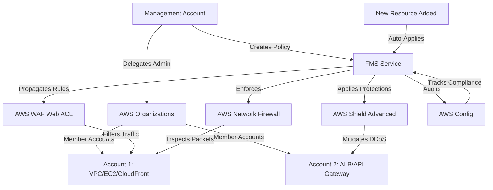
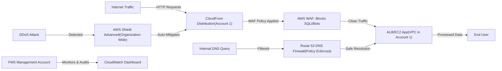
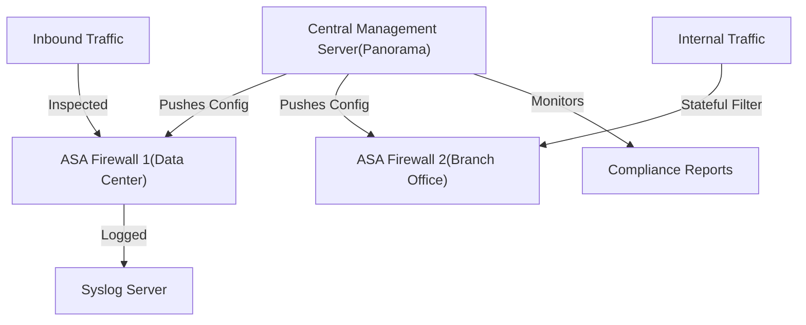

# Firewall Manager

## AWS Firewall Manager

### 🌟 Overview

AWS Firewall Manager (FMS) is a cloud-native security service designed to centrally configure, manage, and monitor firewall rules and protections across multiple AWS accounts and resources within an AWS Organizations structure. It acts as a single pane of glass for deploying consistent security policies at scale, eliminating the need to manually configure protections on individual accounts or regions. FMS supports a variety of AWS security services, enabling automated enforcement of rules for web applications, DDoS mitigation, network traffic inspection, and more.

<figure><figcaption></figcaption></figure>

In a deep dive, FMS operates by delegating administrative control to a management account in AWS Organizations, allowing it to propagate policies to member accounts. It integrates with services like AWS WAF for web application firewalls, AWS Shield Advanced for DDoS protection, AWS Network Firewall for stateful packet inspection, VPC security groups and NACLs for instance-level controls, and Route 53 DNS Firewall for domain-level filtering. This ensures comprehensive coverage from the edge (e.g., CloudFront) to the core (e.g., VPCs). Policies can be tag-based, resource-type specific, or organization-wide, with automatic application to new resources—reducing operational overhead in multi-account environments.

**🤖 Innovation Spotlight**: As per recent study, a key recent enhancement is the "Retrofitting" feature introduced in January 2025, which allows FMS to take over management of existing web ACLs (Access Control Lists) without disrupting ongoing operations. This harmonizes central governance with application team flexibility, enabling gradual migration of legacy configurations to FMS-managed policies while maintaining compliance and reducing drift.

### ⚡ Problem Statement

In large-scale AWS deployments, organizations often manage dozens or hundreds of accounts, each with diverse resources like EC2 instances, ALBs, and CloudFront distributions. Manually configuring firewall rules across these leads to inconsistencies, compliance gaps, and increased vulnerability to threats like SQL injection, DDoS attacks, or unauthorized network access. For instance, a global e-commerce company might struggle to uniformly apply WAF rules to protect against bot traffic during peak sales, resulting in downtime or data breaches.

This service applies to industries like **finance** (securing transaction APIs against fraud), **healthcare** (protecting patient data in HIPAA-compliant VPCs), and **e-commerce/retail** (mitigating DDoS on high-traffic sites). In manufacturing, it safeguards IoT endpoints in edge VPCs from lateral movement attacks.

#### 2.1 🤝 Business Use Cases

* **Centralized Web Protection**: Deploy uniform WAF rules across all CloudFront distributions to block OWASP Top 10 threats, ensuring consistent app security for a SaaS provider.
* **DDoS Mitigation at Scale**: Automatically subscribe all organization accounts to Shield Advanced, providing proactive DDoS response for media streaming services during live events.
* **Network Segmentation**: Enforce security group rules to isolate dev/test/prod environments in a multi-tenant cloud setup for software development firms.
* **Compliance Auditing**: Continuously monitor and audit VPC NACLs for PCI DSS adherence in payment processing pipelines.

### 🔥 Core Principles

AWS Firewall Manager is built on principles of **centralized governance**, **automation**, and **scalability** in a multi-account AWS environment. It leverages event-driven computing via AWS Organizations to propagate changes instantly, ensuring serverless-like efficiency without infrastructure management. Key benefits include reduced administrative toil through policy-as-code and automatic remediation of non-compliant resources.

Core resources and terms:

* **AWS WAF (Web Application Firewall)**: Filters HTTP/HTTPS traffic to web apps; includes Web ACLs (collections of rules), rule groups (pre-configured sets like AWS Managed Rules for bots/SQLi), and rate-based rules.
* **AWS Shield Advanced**: Enhanced DDoS protection with real-time monitoring, automatic mitigation, and visibility into attacks; integrates with WAF for layered defense.
* **AWS Network Firewall**: Managed, stateful firewall for VPCs; supports Suricata-compatible rules for intrusion prevention (IPS) and domain filtering.
* **VPC Security Groups & NACLs (Network ACLs)**: Security Groups act as instance-level firewalls (allow/deny traffic); NACLs are subnet-level stateless filters. FMS audits and applies rules centrally.
* **Route 53 DNS Firewall**: Filters DNS queries at the resolver level to block malicious domains; uses rule groups for allow/deny lists.
* **Policy**: A FMS construct defining protections (e.g., a WAF policy attaches specific Web ACLs to resources).
* **Delegation**: Enabling FMS in the management account to control member accounts.

### 📋 Pre-Requirements

* **AWS Organizations**: Set up with a management account and member accounts for centralized policy delegation (purpose: enables cross-account governance).
* **AWS Config**: Enabled in all accounts/regions (purpose: tracks resource configurations for compliance auditing; FMS creates rules per policy).
* **AWS Identity and Access Management (IAM)**: Roles with FMS permissions (e.g., FirewallManagerFullAccess) for the management account (purpose: secure delegation and API access).
* **Supported Resources**: Existing AWS services like CloudFront, ALB, API Gateway for WAF; VPCs for Network Firewall; all accounts must be in the organization.
* **Tools**: AWS Management Console, AWS CLI, or SDKs for policy creation; optionally, AWS CloudFormation for IaC.

### 👣 Implementation Steps

1. **Enable AWS Organizations**: In the management account, create an organization and add member accounts via the AWS Organizations console.
2. **Delegate Administration for FMS**: Navigate to AWS Firewall Manager console, select "Set up delegation" and choose the AWS Organizations management account as the FMS admin.
3. **Enable AWS Config**: In each account/region, enable AWS Config recording (via console or CLI: `aws configservice put-configuration-recorder`).
4. **Create Security Policies**: In FMS console, choose a protection type (e.g., WAF), define a policy name, select regions/resources (e.g., all CloudFront distributions), attach Web ACLs or rule groups, and set scope (e.g., tag-based).
5. **Apply and Monitor**: Save the policy; FMS auto-deploys to eligible resources. Use Amazon CloudWatch for logs and FMS dashboard for compliance status.
6. **Test and Iterate**: Simulate traffic (e.g., via curl for WAF rules), review non-compliant resources, and update policies as needed. For retrofitting, select existing Web ACLs to migrate under FMS control.

### 🗺️ Data Flow Diagram

#### Diagram 1: How AWS Firewall Manager Works

This diagram illustrates centralized policy creation in the management account, propagation via Organizations, and automated enforcement/auditing across resources.

#### Diagram 2: Example Use Case - Protecting E-Commerce Web Apps

Here, FMS deploys WAF and Shield policies to protect an e-commerce app from web exploits and DDoS, with DNS filtering for internal threats.

### 🔒 Security Measures

* **IAM Least Privilege**: Use dedicated roles (e.g., FMSDelegateAdminAccess) and avoid broad permissions; enable MFA for management accounts.
* **Encryption in Transit/Rest**: Enforce HTTPS for WAF, enable KMS encryption for Network Firewall logs, and use VPC endpoints for private access to FMS APIs.
* **Policy Scoping**: Apply tags (e.g., Environment:Prod) to limit policies to specific resources; regularly audit with AWS Config rules.
* **Logging and Monitoring**: Integrate with CloudTrail for API audits, CloudWatch for metrics, and GuardDuty for threat detection; enable WAF logging to S3.
* **VPC Isolation**: Deploy Network Firewall in dedicated subnets with NACLs; use Shield Advanced for edge protection and retrofitting to avoid policy conflicts.

### 🚀 Advanced Topic: Integrating FMS with AWS Network Firewall for Zero-Trust Architectures

In 2025, pair FMS with AWS Network Firewall's Suricata rules for micro-segmentation in zero-trust models. This innovation allows dynamic rule updates via Lambda triggers, enforcing least-privilege access in hybrid workloads—ideal for DevSecOps pipelines without repetitive configurations.

### ⚖️ When to Use and When Not to Use

* ✅ **When to Use**: In multi-account AWS Organizations for centralized security at scale; when automating protections for dynamic resources (e.g., auto-scaling apps); for compliance-heavy environments needing consistent auditing across regions.
* ❌ **When Not to Use**: For single-account setups (use native service consoles like WAF directly); in non-AWS environments without Organizations; for highly customized, low-volume rules where overhead outweighs benefits.

### 💰 Costing Calculation

AWS Firewall Manager pricing is primarily based on underlying services (e.g., WAF evaluations, Config rules), with no direct hourly charges for FMS itself. However, FMS incurs:

* **$100/month per policy type per AWS Organization delegation set** (covers WAF, Shield, etc., across accounts).
* **Additional AWS Config costs**: \~$0.003 per rule evaluation (2 rules per policy per account/region).
* **Underlying service costs**: E.g., WAF: $5/month per Web ACL + $1 per rule group + $0.60 per million requests; Shield Advanced: $3,000/month per organization + traffic fees; Network Firewall: $0.395/hour per endpoint + $0.065/GB processed.

**Efficient Handling**: Use shared Web ACLs to minimize per-resource costs; tag-based scoping to avoid over-protection; monitor via Cost Explorer and set budgets. Automate policy cleanup for unused resources.

**Sample Calculations** (for a 10-account org, US East-1, one WAF policy):

* FMS Base: $100/month.
* Config (2 rules x 10 accounts x 730 evaluations/month): \~$0.44.
* WAF (1 Web ACL + 1 rule group + 10M requests): $5 + $1 + $6 = $12.
* Total: \~$112.44/month. Scales linearly with accounts/policies; at 100 accounts: \~$1,012/month base + variables.

### 🧩 Alternative Services in AWS/Azure/GCP/On-Premise

| Aspect                    | AWS Firewall Manager                                           | Azure Firewall Manager (via Azure Policy + Firewall)                | Google Cloud Firewall Policies (VPC Firewall + Cloud Armor)              | On-Premise (e.g., Cisco ASA)                              |
| ------------------------- | -------------------------------------------------------------- | ------------------------------------------------------------------- | ------------------------------------------------------------------------ | --------------------------------------------------------- |
| **Central Management**    | Native for AWS Orgs; policy propagation to accounts/resources. | Azure Policy for compliance; Firewall Central for hub-spoke models. | Organization Policies + Folder-level VPC firewalls; Cloud Armor for WAF. | Manual via Panorama/central console; no auto-propagation. |
| **Supported Protections** | WAF, Shield, Network FW, SG/NACL, DNS FW.                      | NSGs, Azure Firewall (stateful), DDoS Protection.                   | Hierarchical firewalls, Armor for DDoS/WAF.                              | Stateful inspection, VPN, IPS; hardware-based.            |
| **Automation/Scaling**    | Auto-applies to new resources; tag-based.                      | Blueprints for IaC; scales with subscriptions.                      | Auto-scale with projects; Anthos for hybrid.                             | Scripted (e.g., Ansible); limited auto-scaling.           |
| **Cost Model**            | $100/policy/month + underlying (\~$0.003/eval).                | $1.25/hour per Firewall instance + $0.02/GB; Policy free.           | $0.025/hour per rule + Armor $20/policy/month.                           | Upfront hardware $10K+; annual support $2K+.              |
| **Key Difference**        | Deep AWS integration; retrofitting for legacy.                 | Better hybrid Azure/On-Prem; app-aware routing.                     | Strong ML-based threat intel; global anycast.                            | Full control but high maintenance; no cloud-native.       |

For on-premise alternative (Cisco ASA), data flow uses manual centralization:

This shows policy push from a central server to distributed firewalls, contrasting FMS's automated cloud propagation.

### ✅ Benefits

* **Cost Savings**: Reduces manual ops by 50-70% through automation; pay-only-for-use underlying services.
* **Scalability**: Handles thousands of accounts/resources effortlessly, auto-scaling with AWS growth.
* **Automation & Consistency**: Eliminates config drift, ensuring uniform security policies.
* **Performance**: Low-latency protections (e.g., Shield mitigates in <1s); integrates seamlessly without app changes.
* **Quality/Compliance**: Centralized auditing simplifies audits (e.g., SOC 2); retrofitting enhances governance without downtime.

### 🔍 Advanced Topic: FMS Integration with GuardDuty for Threat Response

Leverage FMS with Amazon GuardDuty (2025 updates include ML-enhanced malware detection) to auto-remediate threats—e.g., dynamically update WAF rules on anomaly detection. This non-repetitive innovation boosts proactive security in CI/CD pipelines.

### 📝 Summary

AWS Firewall Manager streamlines multi-account security by automating policy deployment across AWS services, ensuring consistent protection with minimal overhead—ideal for enterprise-scale governance.

**Top 8 Points to Keep in Mind**:

1. Requires AWS Organizations for full functionality; enable in management account first.
2. Policies auto-apply but monitor compliance via AWS Config to catch drifts.
3. Use tag-based scoping to avoid over-enforcement on dev environments.
4. Retrofitting (2025 feature) eases migration of existing ACLs.
5. Costs scale with policies/accounts; optimize by sharing ACLs.
6. Integrate logging with CloudWatch for real-time visibility.
7. Test policies in staging before org-wide rollout.
8. Regularly review rules against evolving threats like zero-days.

> <mark style="color:blue;">**In Short**</mark><mark style="color:blue;">:</mark> AWS Firewall Manager is a centralized service for managing firewall policies across AWS accounts, supporting WAF, Shield, and network protections to automate security at scale. It propagates rules via Organizations, audits compliance, and handles new resources automatically—reducing complexity in multi-account setups while enhancing threat defense.

### 🔗 Related Topics

* Official Docs: [AWS Firewall Manager Overview](https://docs.aws.amazon.com/waf/latest/developerguide/fms-chapter.html)
* Pricing Details: [AWS Firewall Manager Pricing](https://aws.amazon.com/firewall-manager/pricing/)
* Best Practices Guide: [Automations for AWS Firewall Manager](https://aws.amazon.com/solutions/implementations/automations-for-aws-firewall-manager/)
* Blog on Retrofitting: [Harmonizing Security with Flexibility](https://aws.amazon.com/blogs/security/aws-firewall-manager-retrofitting-harmonizing-central-security-with-application-team-flexibility/)
* Related Services: AWS WAF, AWS Shield, AWS Network Firewall (explore via AWS Console for hands-on).
