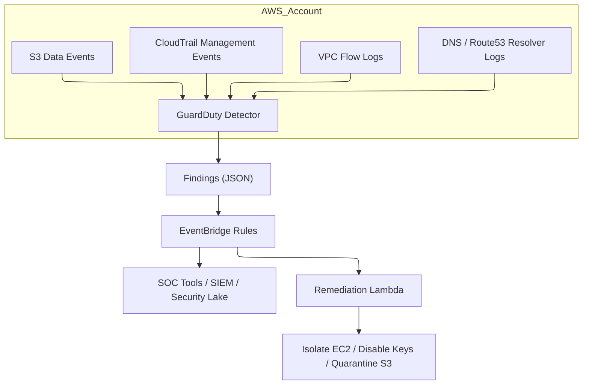
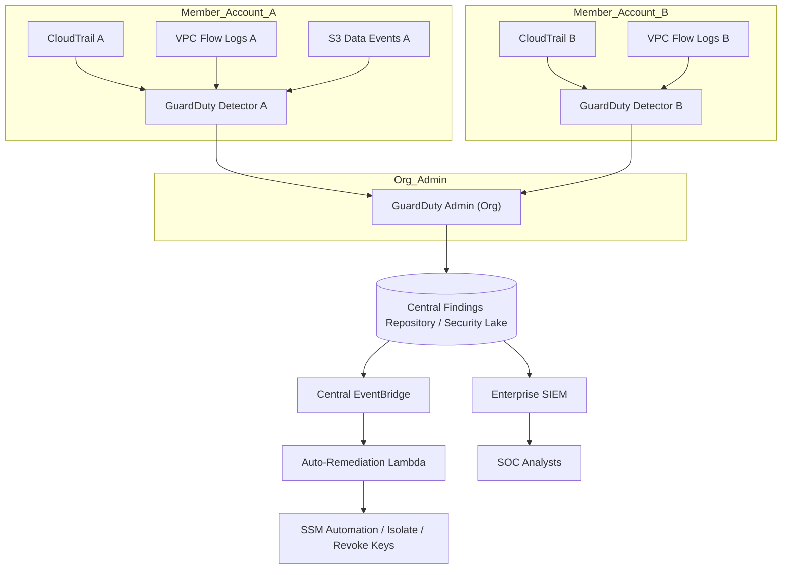

# GuardDuty

## 🌟 Amazon GuardDuty&#x20;

**Amazon GuardDuty** is a managed threat detection service that continuously monitors for malicious or unauthorized behavior across your AWS accounts, workloads, and data stored in Amazon S3. **It uses machine learning, anomaly detection, and integrated threat intelligence** to identify suspicious activity such as unusual API calls, unauthorized deployments, crypto-mining, or data exfiltration attempts.

<figure><figcaption></figcaption></figure>

#### &#x20;✨**Innovation Spotlight**:

* **Adaptive ML models** that incorporate cross-account telemetry and global threat signals for faster, lower-false-positive detection.
* **Deep integration with Nitro-based telemetry** and enhanced VPC flow log analytics for network-level insight.
* **Automated response playbooks** via integrated GuardDuty Remediations (detector + response templates) and tighter orchestration with Amazon Security Lake and SIEMs.
* **Custom threat lists & ML tuning**: more fine-grained control allowing customers to inject internal indicators and tune model sensitivity per-account or organizational unit.

***

### ⚡ Problem Statement

Scenario: A fintech company running microservices across multiple AWS accounts needs continuous detection of account compromise, data exfiltration from S3, and reconnaissance by attackers. They must minimize false positives, enable automated containment, and feed findings into an enterprise SOAR/SIEM.

Industries / Applications:

* Financial services (fraud, account takeover)
* Healthcare (PHI leak detection)
* SaaS providers (multi-tenant threat isolation)
* e‑commerce (payment fraud, credential stuffing)
* Critical infrastructure / OT backends hosted in AWS

2.1 🤝 Business Use Cases

* Detect compromised IAM credentials used to create new EC2 instances for crypto-mining.
* Identify suspicious S3 object access patterns indicating data exfiltration.
* Alert on reconnaissance patterns (port scans, unusual Describe API calls) across multiple accounts.
* Feed prioritized findings to SOC tools and trigger automated isolation of suspect EC2 instances or user access revocation.

***

### 🔥 Core Principles

* Continuous, managed monitoring: GuardDuty ingests AWS CloudTrail Management events, VPC Flow Logs, DNS logs, and S3 Data Events (optionally) to detect threats.
* Threat intelligence + ML: Combines third-party and AWS threat lists (malicious IPs, domains), reputation feeds, and anomaly detection models.
* Detector model: A GuardDuty detector is the central resource that evaluates account activity; one per AWS account or enabled centrally for multiple via AWS Organizations.
* Findings: Structured JSON objects with severity, resource(s) affected, evidence, and recommended remediation steps.
* Auto-remediation integration: Findings can trigger EventBridge rules, Lambda functions, Systems Manager Automation, or partner SOARs.
* Least-privilege visibility: Only needs read-only telemetry access; GuardDuty itself is a managed service that does not require deploying agents to workloads.

Key GuardDuty Resources/Terms:

* Detector — the resource that enables GuardDuty in an account/region.
* Finding — a JSON threat alert (severity: 0.1–8.9 scale mapped to low/medium/high).
* Archive — store old findings.
* Filter — saved query to subset findings.
* Threat Intel Sets — customer-managed list of IPs, domains, hashes to prioritize.
* Trusted IP lists — internal IPs (e.g., partner scanners) to suppress.
* Organization Admin — central account that enables GuardDuty across AWS Organizations.
* S3 Protection (S3 Data Events) — optional feature that analyzes object-level read/write/delete.
* EKS Runtime Monitoring (if enabled) — provides container runtime threat detection (where supported).
* Response and Remediation templates — prebuilt steps to automate actions from findings.

***

### 📋 Pre-Requirements

* AWS Organizations (optional but recommended for centralized management).
* AWS CloudTrail (Management Events enabled across accounts).
* VPC Flow Logs enabled (for traffic-level detections).
* DNS logs (Route 53 Resolver query logs) or VPC DNS logs for DNS-based detections.
* S3 Data Event logging if S3 protection is required.
* IAM role/policies: permissions to enable GuardDuty and configure delegated admin (if centralizing).
* EventBridge and AWS Lambda (for automation/remediation).
* Amazon Security Lake, SIEM, or SNS for forwarding findings (optional).
* Optional: Threat Intel feeds you want to import (URL accessible).

***

### 👣 Implementation Steps

1. Enable AWS Organizations and set an Organization management / admin account (if not already).
2. In the chosen Admin account, go to GuardDuty → “Enable GuardDuty” and set it as an Organizations delegated administrator.
3. From the Admin account, invite member accounts (or auto-enable for all accounts in Org) to the GuardDuty detector.
4. Enable necessary data sources per-region:
   * Ensure CloudTrail Management events captured organization-wide.
   * Turn on VPC Flow Logs for all VPCs (centralized delivery to CloudWatch or S3).
   * Enable DNS query logging (Route 53 Resolver) or use VPC resolver logs.
   * Enable S3 data events for sensitive buckets (note: may incur costs).
5. Configure Threat Intel Sets and Trusted IP Lists: upload internal indicators or third-party lists.
6. Create Filters and Notifications:
   * Use GuardDuty filters to surface high-severity findings.
   * Create EventBridge rules that match finding types or severities.
7. Automate Remediation:
   * Create Lambda playbooks invoked by EventBridge rules to isolate EC2 (modify Security Groups, stop instance), disable IAM keys, or quarantine S3 objects.
   * Integrate with Systems Manager Automation or Step Functions for multi-step workflows.
8. Central Logging and Analytics:
   * Forward findings to Security Lake, Kinesis, or directly to SIEM (Splunk, Sumo Logic).
9. Tune and Iterate:
   * Review false positives, update Trusted IP lists and Threat Intel.
   * Adjust S3 data events scope to balance visibility vs cost.
10. Continuous Review:

* Regularly review the GuardDuty findings dashboard, update response playbooks, and run red-team exercises.

***

### 🗺️ Data Flow Diagrams

Diagram 1 — How GuardDuty works (detector and telemetry sources):



Diagram 2 — Example use case: Multi-account fintech with automated response



***

### 🔒 Security Measures

* Enable least-privilege IAM roles to allow GuardDuty admin operations only where needed.
* Use AWS Organizations delegated admin to centralize management and reduce cross-account privileges.
* Encrypt S3 buckets that store logs and findings (SSE-KMS).
* Enable CloudTrail multi-region logging and protect CloudTrail logs (restrict access).
* Use VPC Flow Logs stored in secure S3 with lifecycle policies.
* Restrict who can modify GuardDuty settings and ThreatIntel sets via IAM policies and SCPs.
* Use trusted IP lists to suppress known internal scanners and reduce noise.
* Apply cross-account access controls carefully if forwarding findings to Security Lake or external SIEM.

***

### ✅ When to use and when not to use

* ✅ When to use:
  * You need continuous, managed threat detection across AWS accounts and VPCs.
  * You want integrated findings from CloudTrail, VPC Flow Logs, DNS, and S3.
  * You require rapid SOC integration and automated remediation.
  * You prefer a managed service with minimal operational overhead.
* ❌ When not to use:
  * If you require host-based forensics or deep endpoint EDR (GuardDuty is not a full EDR).
  * Pure on-premises environments without AWS telemetry.
  * If you need custom in-host instrumentation not covered by GuardDuty signals (combine with other tools).

***

### 💰 Costing Calculation

How pricing is calculated:

* GuardDuty pricing is usage-based per GB of analyzed CloudTrail, VPC Flow Logs, DNS logs, and per S3 data events processed. Pricing components:
  * Data processing volume (GB) for each telemetry type.
  * Additional fees for EKS runtime monitoring or extra features (where applicable).
  * Threat Intel sets and detectors themselves have no separate per-detector charge, but associated data ingestion does.

Efficient handling tips:

* Enable S3 data event logging selectively for sensitive buckets to limit cost.
* Use VPC Flow Logs sampling or selective aggregation if allowed by detection needs.
* Centralize logs and enable multi-region only where needed.
* Regularly review findings and disable noisy data sources or tune trusted IP lists.

Sample calculation (illustrative — replace with current AWS regional rates):

* Assume monthly:
  * CloudTrail analyzed: 50 GB
  * VPC Flow Logs analyzed: 200 GB
  * DNS logs analyzed: 20 GB
  * S3 Data Events analyzed: 10 GB
* If rates are (example): CloudTrail $4/GB, VPC $1.5/GB, DNS $2/GB, S3 $0.25/GB
  * CloudTrail: 50 \* $4 = $200
  * VPC Flow Logs: 200 \* $1.5 = $300
  * DNS: 20 \* $2 = $40
  * S3: 10 \* $0.25 = $2.50
  * Total ≈ **$542.50 / month** Note: Replace with actual AWS GuardDuty pricing per region. Use S3 event selectivity and filters to reduce the S3-related costs.

***

### 🧩 Alternative services (AWS / Azure / GCP / On-Premise)

| Category                       |                                                                AWS (GuardDuty) | Azure Equivalent                                                                                         | GCP Equivalent                                                      | On-Premise Alternative                                      |
| ------------------------------ | -----------------------------------------------------------------------------: | -------------------------------------------------------------------------------------------------------- | ------------------------------------------------------------------- | ----------------------------------------------------------- |
| Managed cloud threat detection | Amazon GuardDuty — ML + threat intel across CloudTrail, VPC Flow Logs, DNS, S3 | Microsoft Defender for Cloud (formerly Azure Security Center + Defender) — cloud-native threat detection | Google Cloud Security Command Center (SCC) + Event Threat Detection | SIEM + IDS/IPS (Splunk/Elastic + Suricata/Zeek)             |
| Key strengths                  |            Deep AWS telemetry integration, Org-level admin, automatic findings | Strong Azure-native integration, workload & tenant protection                                            | Integrated with Google telemetry, native GCP signals                | Total control, on-prem data privacy, customizable pipelines |
| Weaknesses                     |                                                  Focused on AWS telemetry only | Focused on Azure; cross-cloud requires integration                                                       | Similar cloud-limited visibility                                    | High ops cost, scaling complexity                           |

On-premise alternative data flow (Mermaid):

````mermaid
---
config:
  layout: dagre
---
flowchart TB
    Logs["Network & Host Logs"] --> LogCollector["Central Log Collector (syslog/Fluentd)"]
    IDS["Suricata/Zeek (Network IDS)"] --> LogCollector
    EDR["Endpoint EDR Agents"] --> LogCollector
    LogCollector --> SIEM["SIEM (Elastic / Splunk)"]
    SIEM --> SOAR["SOAR / Playbooks (TheHive/Shuffle)"]
    SOAR --> SOC["SOC Analysts"]
```
````

***

### ✅ Benefits

* **Continuous, managed threat detection** without deploying agents.
* **Centralized multi-account visibility** via AWS Organizations.
* **Automatic, structured findings** with severity and remediation guidance.
* **Integration-friendly**: EventBridge, Lambda, Security Lake, SIEMs.
* **Threat intelligence + ML** reduces time-to-detect and false positives.

***

### 🔁 GuardDuty — Innovation & Use Case (automated remediation)

* Innovation: **Automated remediation with prebuilt playbooks and Security Lake integration** enables near real-time containment and enterprise analytics.
* Use Case: Detect compromised IAM keys creating EC2 instances → automated EventBridge → Lambda revokes keys + isolates instances + creates ticket.

***

### 📝 Summary

Takeaway: **Amazon GuardDuty provides managed, scalable threat detection across AWS using telemetry, ML, and threat intelligence, with centralized management, automated responses, and SIEM integration.**

Top things to keep in mind:

1. Ensure multi-region CloudTrail and VPC Flow Logs are enabled for full coverage.
2. Use AWS Organizations for centralized administration and cost control.
3. Enable S3 data events selectively to balance visibility vs cost.
4. Configure Threat Intel and Trusted IP lists to reduce false positives.
5. Integrate with EventBridge + Lambda for automated containment.
6. Protect and audit access to logs and GuardDuty settings.
7. Regularly review and tune detectors and filters.
8. Complement GuardDuty with host-based EDR for full coverage.
9. Forward findings to Security Lake or SIEM for long-term analytics.
10. Validate response playbooks with tabletop and red-team exercises.

In short (max 5 lines): Amazon GuardDuty is a managed AWS-native threat detection service that analyzes CloudTrail, VPC Flow Logs, DNS, and optional S3 data events using ML and threat intelligence. It produces prioritized findings, supports organizational centralization, and integrates with automation and SIEM tools for containment and investigation.

***

### 🔗 Related Topics

* AWS Security Hub (aggregation and compliance)
* Amazon Security Lake (centralized security logs)
* AWS CloudTrail, VPC Flow Logs, Route 53 Resolver logs
* AWS IAM best practices (least privilege, key rotation)
* SOAR integrations (EventBridge + Lambda playbooks)

🛠️ 🚀 Amazon GuardDuty — keep it enabled, tuned, and integrated for effective cloud threat detection.
