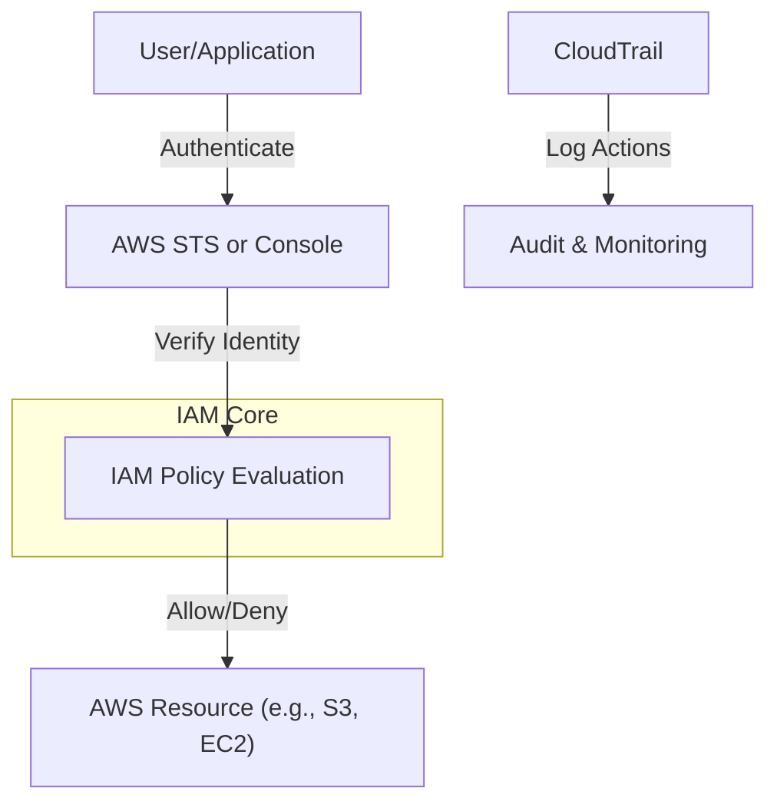
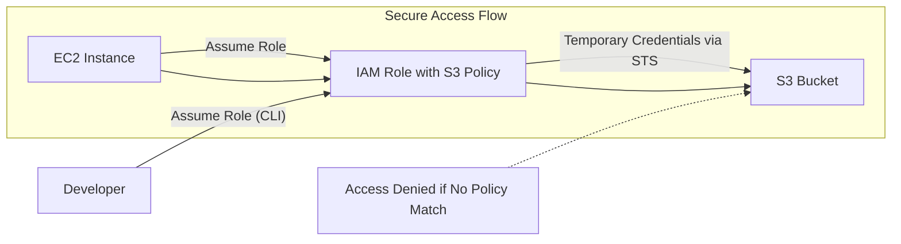
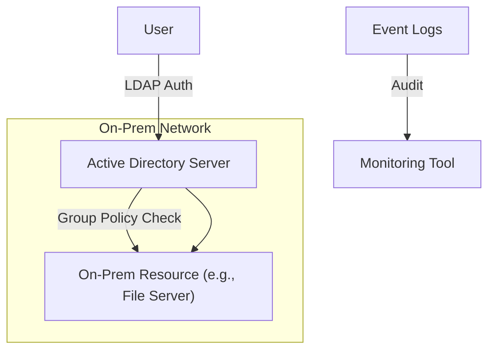

# IAM

## AWS Identity and Access Management (IAM)

### 🌟 Overview

AWS Identity and Access Management (IAM) is a foundational AWS service that enables you to securely control access to AWS resources. It provides fine-grained permissions management, allowing you to specify who or what can access specific resources and under what conditions. IAM supports identities like users, groups, roles, and federated identities, integrating with authentication mechanisms such as multi-factor authentication (MFA) and single sign-on (SSO). At its core, IAM uses JSON-based policies to define permissions, which can be attached to identities or resources. It scales seamlessly for enterprises, supporting features like temporary credentials via AWS Security Token Service (STS), policy evaluation logic, and auditing through AWS CloudTrail.

<figure><figcaption></figcaption></figure>

> `Deep dive:` IAM operates on a deny-by-default model, where access is only granted if explicitly allowed. It handles authentication (verifying identity) and authorization (granting permissions). Key components include IAM users for long-term credentials, roles for temporary access (e.g., for EC2 instances or Lambda functions), groups for managing multiple users, and policies that define actions, resources, and conditions. IAM also supports attribute-based access control (ABAC) using tags, enabling dynamic permissions based on attributes like project or environment. It integrates with AWS Organizations for multi-account management and AWS IAM Identity Center for centralized SSO.

**🤖 Innovation Spotlight**: As of 2025, AWS has enhanced IAM with new capabilities in IAM Access Analyzer, including Internal Access Findings that identify internal access to critical resources within your AWS organization, helping prevent unintended access. Additionally, AWS now enforces MFA for root users across all accounts, bolstering security postures. Modern authentication approaches beyond access keys, like using GitHub Actions or AWS CLI with SSO, streamline secure access.

### ⚡ Problem Statement

In a growing e-commerce company, developers and applications need access to resources like S3 buckets and EC2 instances, but without proper controls, this leads to over-privileged accounts, increasing risks of data breaches or unauthorized actions. For example, a misconfigured user could accidentally delete production data, causing downtime and financial loss.

Industries/applications: IAM is crucial in finance for compliant access to sensitive data, healthcare for HIPAA-regulated resource control, and SaaS platforms for multi-tenant isolation.

#### 2.1 🤝 Business Use Cases

* **Financial Services**: Banks use IAM roles for EC2 to access DynamoDB without storing credentials, ensuring secure transactions.
* **Healthcare**: Hospitals implement ABAC to restrict access to patient records based on user department tags.
* **DevOps Teams**: CI/CD pipelines assume IAM roles for temporary deployment access, reducing long-term key exposure.
* **Multi-Account Environments**: Enterprises use IAM with AWS Organizations to delegate administration while maintaining central oversight.

### 🔥 Core Principles

IAM is built on event-driven, scalable, and serverless principles, emphasizing least privilege, zero trust, and centralized management. It enables scalability by handling millions of requests without infrastructure overhead and supports serverless benefits like automatic scaling of policy evaluations.

* **Users**: Individual AWS accounts with credentials (access keys, passwords) for console or programmatic access.
* **Groups**: Collections of users for bulk policy assignment, simplifying management (e.g., "Admins" group).
* **Roles**: Temporary identities assumed by users, services, or applications; no permanent credentials, ideal for cross-account access.
* **Policies**: JSON documents defining permissions (actions like "s3:GetObject", resources like ARNs, conditions like IP restrictions).
* **Permissions Boundaries**: Limits maximum permissions for users/roles, preventing privilege escalation.
* **Service Control Policies (SCPs)**: Used in AWS Organizations to restrict actions across accounts.
* **IAM Access Analyzer**: Analyzes policies to identify unintended access, now with internal findings.
* **AWS STS**: Issues temporary security credentials for roles.
* **IAM Identity Center**: Manages SSO and workforce identities.

### 📋 Pre-Requirements

* **AWS Account**: Root or IAM user with administrative privileges to create resources.
* **AWS Management Console/CLI/SDK**: For configuration; CLI requires installation and configuration with access keys.
* **MFA Device**: For enabling multi-factor authentication on users/roots.
* **AWS Organizations (Optional)**: For multi-account setups, to apply SCPs.

### 👣 Implementation Steps

1. **Sign in to AWS Console**: Navigate to IAM dashboard.
2. **Create an IAM Policy**: Go to Policies > Create policy > JSON tab; define permissions (e.g., {"Version": "2012-10-17", "Statement": \[{"Effect": "Allow", "Action": "s3:ListBucket", "Resource": "arn:aws:s3:::example-bucket"}]}).
3. **Create an IAM Role**: Roles > Create role > Select trusted entity (e.g., EC2) > Attach policy > Name the role.
4. **Create IAM User/Group**: Users > Add users > Set username, access type > Attach policies or add to group.
5. **Enable MFA**: Users > Select user > Security credentials > Assign MFA device.
6. **Test Access**: Use AWS CLI with user credentials or assume role to verify permissions.
7. **Monitor with Access Analyzer**: Enable IAM Access Analyzer to scan for findings.

### 🗺️ Data Flow Diagram

#### Diagram 1: How IAM Works

#### Diagram 2: Example Use Case - EC2 Assuming Role for S3 Access

### 🔒 Security Measures

* Enable MFA for all users, especially root.
* Use least privilege: Start with minimal permissions and use IAM Access Analyzer to refine.
* Rotate access keys regularly and prefer roles over users for services.
* Implement VPC endpoints for private IAM access.
* Use permissions boundaries and SCPs in multi-account setups.
* Enable CloudTrail for logging all IAM actions.

### 🚀 IAM and Attribute-Based Access Control (ABAC) Innovations

Explore ABAC for dynamic permissions using tags (e.g., "Environment: Prod"). Recent enhancements allow more granular conditions, integrating with machine learning services for automated policy generation, reducing manual overhead in large-scale environments.

### ⚖️ When to Use and When Not to Use

* ✅ **When to Use**: For any AWS workload requiring secure, fine-grained access control; ideal for multi-user/team environments, compliance needs (e.g., GDPR, PCI), or integrating with federated identities like SAML/OIDC.
* ❌ **When Not to Use**: In simple, single-user hobby projects where default root access suffices; or for non-AWS cloud environments—use provider-specific IAM equivalents instead.

### 💰 Costing Calculation

* **How it is Calculated?**: IAM is free for core features like users, roles, policies, and evaluations. Costs may arise from integrated services (e.g., AWS Directory Service for SSO) or excessive API requests beyond free tier.
* **Efficient Way of Handling**: Use roles instead of users to avoid key management; leverage Access Analyzer to optimize policies, reducing unnecessary evaluations.
* **Sample Calculations**: Creating 100 users and 50 roles: $0. If using IAM Identity Center with 10,000 authentications/month: Free tier covers most; excess at $0.03 per MFA prompt (hypothetical, check pricing).

### 🧩 Alternative Services in AWS/Azure/GCP/On-Premise

| Service                      | Provider               | Key Features                                   | Differences/Comparisons                                                            |
| ---------------------------- | ---------------------- | ---------------------------------------------- | ---------------------------------------------------------------------------------- |
| IAM                          | AWS                    | Fine-grained policies, roles, ABAC             | Native AWS integration; focuses on resource-based access.                          |
| Entra ID (formerly Azure AD) | Azure                  | Hybrid identity, conditional access            | Stronger in enterprise SSO; integrates with Microsoft ecosystem.                   |
| Cloud IAM                    | GCP                    | Hierarchical policies, short-lived credentials | Emphasizes organization/folder-level inheritance; better for multi-project setups. |
| Active Directory             | On-Premise (Microsoft) | LDAP-based, group policies                     | No cloud scaling; requires server management; suitable for legacy apps.            |

**On-Premise Alternative Data Flow (Active Directory)**:

### ✅ Benefits

* **Cost Savings**: Free core service reduces identity management expenses.
* **Scalability**: Handles enterprise-scale without performance degradation.
* **Automation**: Roles enable seamless service-to-service access.
* **Security**: Least privilege and auditing minimize breach risks.
* **Performance**: Fast policy evaluations with no latency impact.

### 🔍 Monitoring IAM with AWS Config and CloudTrail

Innovate by integrating IAM with AI-driven anomaly detection in Amazon GuardDuty, automatically flagging unusual access patterns as of 2025 updates, enhancing proactive threat response.

### 📝 Summary

IAM ensures secure, scalable access management in AWS, minimizing risks through granular controls.

**Top 5-10 Points to Keep in Mind**:

1. Always enable MFA.
2. Prefer roles over access keys.
3. Use least privilege principle.
4. Regularly review Access Analyzer findings.
5. Integrate with CloudTrail for audits.
6. Leverage ABAC for dynamic access.
7. Enforce policies at organization level.
8. Rotate credentials periodically.
9. Test policies before deployment.
10. Stay updated on features like internal access findings.

> **In Short** : IAM is AWS's central service for managing identities and permissions. It authenticates users/services and authorizes actions on resources via policies. Supports users, roles, groups for flexibility. Free and scalable, with innovations like enhanced Access Analyzer. Essential for secure cloud operations.

### 🔗 Related Topics

* AWS IAM Documentation: https://docs.aws.amazon.com/IAM/latest/UserGuide/introduction.html
* IAM Best Practices: https://docs.aws.amazon.com/IAM/latest/UserGuide/best-practices.html
* AWS re:Inforce Sessions on IAM: https://reinforce.awsevents.com/
* IAM Access Analyzer Guide: https://aws.amazon.com/iam/features/analyze-access/
