# Identity Center

## AWS IAM Identity Center: Centralized Identity Management for Secure Multi-Account Access

### 🌟 Overview

AWS IAM Identity Center is a cloud-native service that provides centralized management of user access to multiple AWS accounts, applications, and resources. It enables single sign-on (SSO) for your workforce, allowing users to access AWS services using their existing corporate credentials from integrated identity providers (IdPs) like Microsoft Entra ID, Okta, Google Workspace, or Active Directory. Unlike traditional IAM, which focuses on fine-grained permissions within a single account, IAM Identity Center scales to organizations with AWS Organizations, offering a unified directory view, permission sets, and audit trails.

<figure><figcaption></figcaption></figure>

At its core, it federates identities, propagates user context for secure data access, and supports multi-account governance. Key resources include:

* **Identity Sources**: The foundation—either the built-in IAM Identity Center directory (for up to 100,000 users) or external IdPs to sync users and groups.
* **Permission Sets**: Reusable IAM policies bundled for roles, assignable across accounts (e.g., a "Developer" set granting read/write to S3 and EC2).
* **Assignment**: Links users/groups to permission sets in specific accounts.
* **User Portal**: A customizable web interface for users to view and switch between assigned AWS accounts.
* **Trusted Identity Propagation**: A feature that passes user identity from apps (like Amazon QuickSight) to data services (e.g., Amazon Redshift) for fine-grained authorization and logging without sharing long-term credentials.

> <mark style="color:yellow;">`Deep dive:`</mark> IAM Identity Center integrates seamlessly with AWS Organizations for hierarchical access control, supports SCIM (System for Cross-domain Identity Management) for automated provisioning, and now includes advanced features like just-in-time (JIT) elevation for temporary privileged access. It handles up to 10,000 permission sets and scales automatically without infrastructure management.

**🤖 Innovation Spotlight**: As of September 2025, a standout update is the enhanced integration with Microsoft Entra ID Privileged Identity Management (PIM) for JIT privileged access, announced in June 2025. This allows time-bound role elevations (e.g., 1-hour admin access) with approval workflows, reducing standing privileges by 90% in multi-account setups. Combined with Amazon Q Developer (AI-powered coding assistant), it enables secure, context-aware access to generative AI tools—imagine developers signing in once to query code insights across accounts without credential sprawl. This positions IAM Identity Center as a leader in zero-trust identity for AI-driven enterprises.

### ⚡ Problem Statement

In a growing organization with multiple AWS accounts (e.g., dev, staging, prod), managing user access becomes chaotic: admins juggle IAM users per account, risking credential fatigue, compliance gaps, and security breaches. A real-world scenario: A fintech company with 500 employees needs secure access to analytics tools across 20 accounts but faces delays from manual provisioning and inconsistent MFA enforcement, leading to audit failures under regulations like SOX.

Industries/applications:

* **Finance**: Centralized access for compliance teams to audit logs across accounts.
* **Healthcare**: HIPAA-compliant SSO for clinicians accessing patient data in Amazon HealthLake.
* **E-commerce**: Scalable permissions for devs deploying to global regions via AWS Organizations.
* **Manufacturing**: IoT data access via AWS IoT SiteWise with propagated identities.

#### 2.1 🤝 Business Use Cases

* **Multi-Account Governance**: A retail giant uses it to assign "View-Only" permissions to executives across 50+ accounts for real-time sales dashboards in Amazon QuickSight.
* **Third-Party App Integration**: A media company syncs Okta users for SSO to AWS apps like SageMaker Studio, automating access revocation on employee offboarding.
* **JIT Privileged Access**: An enterprise enables temporary admin rights for incident response teams, integrating with Entra PIM to approve elevations via mobile notifications.
* **Data Analytics Security**: Trusted identity propagation lets BI analysts query Amazon Redshift datasets with their QuickSight session context, logging access for GDPR compliance.

### 🔥 Core Principles

IAM Identity Center is built on event-driven, federated identity management, emphasizing scalability, least privilege, and zero-trust security. Foundational concepts:

* **Federated Authentication**: Users authenticate via IdP (e.g., SAML 2.0 or OIDC), avoiding AWS-native credentials; tokens are short-lived for security.
* **Centralized vs. Decentralized Balance**: Manages identities centrally but delegates permissions via AWS Organizations, allowing account owners to approve assignments.
* **Scalability & Serverless Benefits**: Auto-scales to millions of authentications; no servers to manage, with global availability across regions.
* **Identity Propagation**: Ensures user context (e.g., username, groups) flows to services like S3 or Lambda for dynamic authorization.

Key resources/terms explained:

* **Identity Source**: The user directory—built-in (simple, no external setup) or external (e.g., Active Directory via AD Connector for on-prem sync).
* **Permission Sets**: Pre-defined IAM role templates (e.g., AWS-managed like "PowerUserAccess" or custom); include inline/session policies for conditions like IP restrictions.
* **Assignments**: Granular mappings (user/group → permission set → account); supports multi-account targets.
* **Multi-Account Permissions (MAP)**: Boundary for cross-account roles, ensuring assignments don't exceed organizational units (OUs).
* **SCIM Provisioning**: Automates user lifecycle (create/update/delete) from IdP to AWS, reducing manual errors.

### 📋 Pre-Requirements

* **AWS Account with Organizations**: Enabled AWS Organizations for multi-account support (free service).
* **Identity Provider (IdP)**: External like Microsoft Entra ID, Okta, or Google Workspace; or use built-in directory for starters. Purpose: Source of truth for users/groups.
* **IAM Roles**: Pre-create roles in target accounts if not using managed policies. Purpose: Define baseline permissions.
* **Tools**: AWS Management Console or CLI (aws sso-admin); optional: SCIM endpoint for provisioning. Purpose: Configuration and automation.
* **Network Setup**: VPC or Direct Connect for on-prem AD integration if needed. Purpose: Secure connectivity.

### 👣 Implementation Steps

1. **Enable IAM Identity Center**: In the AWS Console, navigate to IAM Identity Center > Enable. Choose your region (e.g., us-east-1) and select identity source (built-in or external IdP).
2. **Configure Identity Source**: For external, set up SAML/OIDC metadata exchange (e.g., upload IdP metadata XML to AWS). For AD, deploy AD Connector in a VPC. Enable SCIM if automating provisioning.
3. **Create Permission Sets**: Go to Permission Sets > Create. Select AWS-managed (e.g., ReadOnlyAccess) or custom; attach policies and session duration (1-12 hours).
4. **Assign Access**: Under AWS Accounts > Assign users/groups to permission sets in target accounts/OUs. Use the multi-account permission boundary.
5. **Customize User Portal**: Enable/disable features like account grouping; set up MFA enforcement via IdP.
6. **Integrate Applications**: For apps like QuickSight, enable IAM Identity Center in their settings; configure trusted propagation if needed.
7. **Test & Monitor**: Sign in via user portal (e.g., https://d-abc123.awsapps.com/start); use CloudTrail for audits. For JIT, integrate Entra PIM via API.
8. **Automate with CLI/API**: Use `aws sso-admin create-permission-set` for scripting.

### 🗺️ Data Flow Diagram

#### Diagram 1: How AWS IAM Identity Center Works

```mermaid
graph TD
    A["User authenticates at IdP(e.g., Entra ID)"] --> B[SAML/OIDC Token to IAM Identity Center]
    B --> C[Identity Federation:Sync Users/Groups via SCIM]
    C --> D[Permission Assignment:User/Group → Permission Set → AWS Account]
    D --> E["AWS Services/Apps(e.g., S3, QuickSight)"]
    E --> F["Trusted Propagation:User Context to Data Services(e.g., Redshift Authorization)"]
    F --> G["Access Granted + Audit Log(CloudTrail)"]
    style A stroke:#2F97C1
    style G stroke:#15E6CD
```

This diagram illustrates the end-to-end flow: from IdP authentication to secure access and logging.

#### Diagram 2: Example Use Case - Multi-Account Developer Access

Here, a developer accesses resources across accounts via SSO, with centralized auditing.

### 🔒 Security Measures

* **Enable MFA Everywhere**: Mandate via IdP (e.g., Entra ID conditional access) for all SSO logins; use hardware keys for high-privilege roles.
* **Least Privilege IAM**: Use permission sets with scoped policies; implement session policies for time/IP/MFA conditions.
* **VPC Isolation & Encryption**: Deploy AD Connector in private subnets; enable AWS KMS for token encryption in transit (TLS 1.2+).
* **Audit & Monitoring**: Integrate with CloudTrail (note: post-July 2025, no more userName/principalId in events—use sessionId instead); set up Amazon GuardDuty for anomaly detection.
* **JIT & Approval Workflows**: Leverage Entra PIM integration for temporary elevations; revoke access automatically on IdP deprovisioning.
* **Zero-Trust Practices**: Use service control policies (SCPs) in Organizations to deny unauthorized assignments; regularly review assignments via Access Analyzer.

### 🚀 Innovation: Just-In-Time Privileged Access with Entra Integration

Building on the June 2025 update, JIT access via Microsoft Entra PIM allows dynamic role activation (e.g., elevate to admin for 30 mins with manager approval). This innovation cuts persistent privileges, ideal for DevSecOps teams—pair it with Amazon Verified Access for app-level controls, reducing breach risks by enforcing context-aware auth.

### ⚖️ When to Use and When Not to Use

* ✅ **When to Use**: For organizations with 5+ AWS accounts needing centralized SSO; hybrid identity setups (on-prem + cloud); compliance-heavy industries requiring audit trails and propagation (e.g., finance, healthcare). Ideal for scaling from IAM users to federated access without rearchitecting.
* ❌ **When Not to Use**: Single-account setups (stick to IAM); highly customized, non-SAML IdPs (limited support); low-user-volume scenarios where setup overhead outweighs benefits. Avoid if you need per-resource granular control beyond permission sets—use IAM Policies instead.

### 💰 Costing Calculation

* **How It Is Calculated?**: IAM Identity Center itself is free (no charge for SSO, assignments, or portal). Costs stem from underlying services: IdP integration (e.g., Okta licensing ~~$8/user/month), AWS Organizations ($/account/month if >100), CloudTrail storage (~~$0.10/100K events), and API calls (e.g., SCIM provisioning at $0.005/operation). For JIT, Entra PIM adds \~$6/user/month.
* **Efficient Way of Handling**: Use built-in directory for small teams (<500 users) to avoid IdP costs; automate assignments with Lambda to minimize manual API calls; monitor via Cost Explorer for CloudTrail spikes—set budgets and alerts.
* **Sample Calculations**:
  * **Basic Setup (10 accounts, 100 users)**: Organizations: $0 (under 100 accts). CloudTrail: 1M events/month = $1. Total: \~$1/month + IdP costs.
  * **Enterprise (50 accounts, 1K users, SCIM)**: Organizations: $200/month. SCIM: 10K ops/month = $50. CloudTrail: 5M events = $5. Entra PIM: $6K/month. Total: \~$6.3K/month—optimize by batching provisions.
  * **With Propagation (QuickSight + Redshift)**: Add QuickSight (\~$5/user/month) + Redshift query costs; for 500 queries/day: \~$100/month extra.

### 🧩 Alternative Services in AWS/Azure/GCP/On-Premise

| Provider       | Service                                | Key Comparison/Differences                                                                                                        | Strengths                                  | Weaknesses                              |
| -------------- | -------------------------------------- | --------------------------------------------------------------------------------------------------------------------------------- | ------------------------------------------ | --------------------------------------- |
| **AWS**        | IAM (Native)                           | IAM focuses on account-level roles/policies; no built-in SSO/multi-account. IAM Identity Center adds federation & centralization. | Granular, free for basics.                 | No IdP integration out-of-box.          |
| **Azure**      | Microsoft Entra ID (formerly Azure AD) | Full IdP with PIM/JIT; integrates natively with AWS via SAML. More app ecosystem (e.g., Office 365).                              | Advanced conditional access, global scale. | Higher cost (\~$6/user); Azure-centric. |
| **GCP**        | Cloud Identity                         | SSO for Google Workspace; federates to AWS but less multi-account depth. Supports SCIM.                                           | Seamless with Google apps; free tier.      | Limited AWS-specific integrations.      |
| **On-Premise** | Active Directory (AD)                  | Self-hosted directory; sync to AWS via AD Connector. No cloud-native scaling.                                                     | Full control, legacy app support.          | High maintenance; no auto-scale.        |

For on-premise alternative (Active Directory), here's a data flow diagram:

Flow: Users auth on-prem → sync via Connector → federate to AWS for access.

### ✅ Benefits

* **Cost Savings**: Eliminates duplicate IAM users; free core service reduces licensing needs vs. third-party SSO tools (up to 50% savings).
* **Scalability**: Handles 10K+ users/accounts auto; global endpoints for low-latency SSO.
* **Automation**: SCIM/JIT reduces manual tasks by 80%; integrates with CI/CD for dynamic assignments.
* **Security & Compliance**: Zero-trust propagation and audits ensure GDPR/SOX adherence; MFA enforcement cuts unauthorized access risks.
* **Performance**: Sub-second token validation; personalized portal boosts user productivity by 30% (per AWS case studies).
* **Quality**: Consistent experience across apps; easier onboarding/offboarding.

### 🔍 Deep Dive: Permission Sets vs. IAM Roles

Permission sets are essentially portable IAM roles for multi-account use—define once, assign many. Unlike static IAM roles (account-bound), they support inline policies for dynamic conditions (e.g., tag-based access). Innovation tip: Use AWS Policy Generator to create custom sets, then automate via CDK for IaC, ensuring version control and drift detection.

### 📝 Summary

AWS IAM Identity Center simplifies secure, centralized access in multi-account AWS environments, enabling SSO and identity propagation for efficient governance.

**Top 5-10 Points to Keep in Mind**:

1. Always start with AWS Organizations for multi-account leverage.
2. Choose external IdPs for existing setups; built-in for quick starts.
3. Enforce MFA and session limits to mitigate risks.
4. Monitor CloudTrail changes (e.g., post-2025 event format updates).
5. Use JIT for privileges to align with zero-trust.
6. Automate provisioning with SCIM to avoid drifts.
7. Test assignments in a sandbox OU first.
8. Integrate with tools like Entra PIM for advanced workflows.
9. Review costs from ancillary services like CloudTrail.
10. Stay updated via AWS re:Inforce for IAM evolutions.

> <mark style="color:purple;">**`In Short`**</mark>` ``:` IAM Identity Center centralizes workforce SSO across AWS accounts using IdPs for federated auth. It manages permission sets for scalable access, propagates identities for data security, and supports JIT elevations. Free core service with pay-for-use integrations; ideal for enterprises scaling compliance. Boosts productivity via user portal while enforcing zero-trust. Evolving with AI integrations like Amazon Q for innovative workflows.

### 🔗 Related Topics

* [AWS IAM Identity Center Documentation](https://docs.aws.amazon.com/singlesignon/latest/userguide/what-is.html)
* [Just-In-Time Access with Entra ID Guide](https://aws.amazon.com/blogs/security/implementing-just-in-time-privileged-access-to-aws-with-microsoft-entra-and-aws-iam-identity-center/)
* [Permission Sets Best Practices](https://docs.aws.amazon.com/singlesignon/latest/userguide/manage-permission-sets.html)
* [CloudTrail Updates for IAM Identity Center](https://aws.amazon.com/blogs/security/modifications-to-aws-cloudtrail-event-data-of-iam-identity-center/)
* [AWS re:Inforce 2025 IAM Track](https://aws.amazon.com/blogs/security/building-identity-first-security-a-guide-to-the-identity-and-access-management-track-at-aws-reinforce-2025/)
