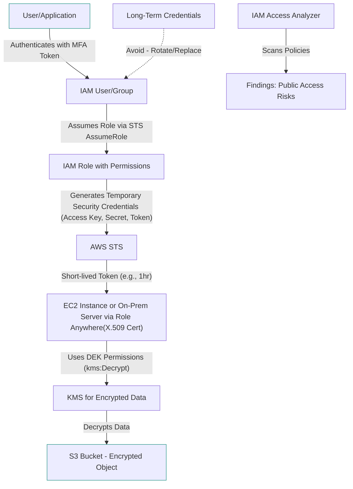
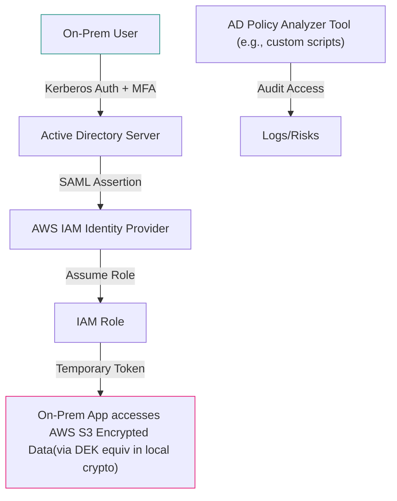

# Resource

## AWS IAM: Identity and Access Management Fundamentals

### 🌟 Overview

AWS Identity and Access Management (IAM) is a core service that enables secure control over access to AWS resources. It allows you to manage users, groups, roles, and permissions to define who (or what) can access which resources and under what conditions. IAM is foundational for implementing the principle of least privilege, ensuring compliance, and preventing unauthorized actions in your AWS environment.

Here's a deep dive into the key concepts you mentioned:

**IAM Resources**: These are the AWS entities IAM protects, such as EC2 instances, S3 buckets, or Lambda functions. IAM policies specify actions (e.g., read, write) on these resources using ARNs (Amazon Resource Names) like `arn:aws:s3:::my-bucket/*`.

<table><thead><tr><th width="564.4000244140625">IAM Resources</th><th>Icons</th></tr></thead><tbody><tr><td><strong>Add-on</strong>: In IAM context, this often refers to optional features or integrations like IAM Identity Center (formerly AWS SSO) add-ons for federated access, or extensions like AWS Managed Policies that "add on" predefined permissions without custom creation.</td><td>
<figure><figcaption></figcaption></figure>
</td></tr><tr><td><strong>Permissions</strong>: These are the core building blocks of IAM, defined in JSON policies attached to users, groups, or roles. Permissions grant or deny actions (e.g., <code>s3:GetObject</code>) on resources. Types include identity-based (for users/roles), resource-based (e.g., S3 bucket policies), and session policies (temporary overrides).</td><td>
<figure><figcaption></figcaption></figure>
</td></tr><tr><td><strong>MFA Token</strong>: Multi-Factor Authentication (MFA) tokens add an extra security layer, requiring a second factor (e.g., hardware device like YubiKey or virtual app like Authy) alongside passwords. MFA is enforced for root users and can be required for sensitive actions like password changes or billing access.</td><td>
<figure><figcaption></figcaption></figure>
</td></tr><tr><td><strong>Role</strong>: An IAM role is a set of permissions that can be assumed by trusted entities (e.g., AWS services, users, or applications) without long-term credentials. Roles use temporary security tokens, ideal for cross-account access or service delegation (e.g., EC2 assuming a role to access S3).</td><td>
<figure><figcaption></figcaption></figure>
</td></tr><tr><td><strong>AWS STS (Security Token Service)</strong>: STS provides temporary security credentials (access key, secret key, session token) for users, roles, or federated identities. It supports actions like <code>AssumeRole</code> to generate short-lived tokens (up to 12 hours), enhancing security over permanent keys.</td><td>
<figure><figcaption></figcaption></figure>
</td></tr><tr><td><strong>AWS STS Alternate</strong>: This likely refers to alternative STS operations or integrations, such as <code>GetSessionToken</code> for MFA-secured temporary credentials, or federated access via SAML/OIDC. Alternatives include using IAM roles directly instead of explicit STS calls for simpler workflows.</td><td>
<figure><figcaption></figcaption></figure>
</td></tr><tr><td><strong>Long-Term Security Credential</strong>: These are permanent credentials like access keys or passwords issued to IAM users. They don't expire automatically (unlike temporary ones) but should be rotated regularly and avoided for applications; use roles instead for better security.</td><td>
<figure><figcaption></figcaption></figure>
</td></tr><tr><td><strong>IAM Access Analyzer</strong>: A feature that analyzes IAM policies to identify unintended resource access (e.g., public exposures or cross-account risks). It scans policies against external access findings and generates actionable insights, integrating with EventBridge for alerts.</td><td>
<figure><figcaption></figcaption></figure>
</td></tr><tr><td><strong>Encrypted Data</strong>: In IAM, this ties to access controls for encrypted resources (e.g., S3 objects with SSE-KMS). IAM permissions must include <code>kms:Decrypt</code> for KMS-encrypted data, ensuring only authorized principals can access plaintext.</td><td>
<figure><figcaption></figcaption></figure>
</td></tr><tr><td><strong>Data Encryption Key (DEK)</strong>: A symmetric key used to encrypt/decrypt actual data (e.g., in S3 or EBS). DEKs are managed by AWS services or customer KMS; IAM roles/users need permissions to use them via KMS policies, distinct from master keys.</td><td>
<figure><figcaption></figcaption></figure>
</td></tr><tr><td><strong>Temporary Security Credential</strong>: Short-lived credentials from STS (e.g., 15 minutes to 36 hours), including access keys and tokens. They're scoped to specific permissions and automatically expire, reducing breach risks compared to long-term ones.</td><td>
<figure><figcaption></figcaption></figure>
</td></tr><tr><td><strong>IAM Role Anywhere</strong>: This extends IAM roles to on-premises or non-AWS environments, allowing workloads (e.g., servers in your data center) to assume AWS roles using X.509 certificates instead of IAM users. It bridges hybrid setups without VPC connectivity.</td><td>
<figure><figcaption></figcaption></figure>
</td></tr></tbody></table>

IAM integrates across AWS (e.g., with KMS for encryption, CloudTrail for auditing) and supports ABAC (Attribute-Based Access Control) for dynamic policies based on tags or context.

### ⚡ Key Usage and Applicable Areas

IAM is used for:

* **Secure Access Control**: Managing who accesses what in multi-user environments, like dev teams accessing specific S3 buckets.
* **Automation and CI/CD**: Roles for services like CodePipeline to deploy without hardcoding keys.
* **Compliance and Auditing**: Enforcing MFA, analyzing access with Access Analyzer, and logging via CloudTrail.
* **Hybrid/Multi-Cloud**: Role Anywhere for on-prem integration; STS for federated identity (e.g., with Active Directory). Applicable areas: Cloud infrastructure, application development, data security (e.g., encrypted S3 access), and enterprise governance.

### 🗺️ Data Flow Diagram

Below is a Mermaid diagram illustrating the IAM workflow, focusing on roles, STS, temporary credentials, MFA, and Role Anywhere for a typical scenario: An EC2 instance (or on-prem server) assuming a role to access encrypted S3 data.

**Implementation Steps in Diagram**:

1. User authenticates (MFA optional but recommended).
2. Assume role via STS for temporary creds.
3. Entity (EC2/on-prem) uses creds to request KMS DEK.
4. Decrypt and access S3 data.
5. Access Analyzer continuously audits for anomalies.

### ⚖️ When to Use and When Not to Use

✅ **When to Use**:

* For granular access in shared AWS accounts (e.g., roles for services).
* Hybrid environments needing AWS resource access without VPN (Role Anywhere).
* Temporary access scenarios (STS) or policy auditing (Access Analyzer).
* Encrypting sensitive data with controlled DEK access.

❌ **When Not to Use**:

* Simple single-user setups (overkill; use root with MFA).
* Non-AWS environments without integration needs (stick to local auth).
* When permanent creds suffice and rotation is managed (but prefer temporary for apps).
* High-frequency, low-security access (use resource policies instead for simplicity).

### 🧩 Alternative Services in AWS/Azure/GCP/On-Premise

| Provider/Service                                      | Key Features                                                                                                                                  | Differences/Comparisons                                                                                                                             | Pricing/Notes                                                |
| ----------------------------------------------------- | --------------------------------------------------------------------------------------------------------------------------------------------- | --------------------------------------------------------------------------------------------------------------------------------------------------- | ------------------------------------------------------------ |
| **AWS IAM**                                           | Roles, STS, MFA, Access Analyzer, Role Anywhere; JSON policies; integrates with KMS for DEK/encryption.                                       | Native to AWS; temporary creds via STS; strong hybrid support.                                                                                      | Free core; STS calls \~$0.0001/req.                          |
| **Azure RBAC (Role-Based Access Control) + Entra ID** | Assignments to users/groups/apps; PIM for just-in-time access; MFA via Entra. No direct STS equiv (uses tokens via MSAL).                     | More UI-focused; integrates with Azure Key Vault for encryption keys (similar to DEK). Lacks Role Anywhere analog but has hybrid via Entra Connect. | Free for basic; Entra P2 \~$6/user/mo for advanced auditing. |
| **GCP IAM**                                           | Service accounts (like roles), short-lived tokens via Metadata Service; Policy Analyzer (like Access Analyzer); Workload Identity for hybrid. | Tag-based policies; no explicit STS but uses OAuth2. Encryption via CMEK (DEK equiv). Weaker on-prem bridging.                                      | Free; token ops minimal cost.                                |
| **On-Premise: Active Directory (AD) or LDAP**         | Users/groups/roles; Kerberos for tickets (temp creds); MFA via extensions. Encryption via local KMS-like tools (e.g., Windows CNG).           | Centralized auth; no cloud-native STS (use SAML federation). For hybrid, sync to cloud IAM. Lacks built-in analyzers.                               | License-based (e.g., Windows Server \~$500+/server).         |

**On-Premise Alternative Data Flow (Active Directory Example)**: Using Mermaid for a hybrid flow where AD federates to AWS IAM Role via SAML.

***

> **In Short**:\
> AWS IAM manages identities and permissions for secure AWS access.\
> Key elements include roles for delegation, STS for temporary creds, and MFA for protection.\
> Tools like Access Analyzer audit risks, while Role Anywhere enables hybrid use.\
> Handle encryption via DEK permissions in KMS-integrated policies.\
> Overall, it enforces least privilege, preventing unauthorized resource actions.

***

### 📝 Summary

This IAM framework ensures secure, scalable access management with temporary credentials minimizing risks—ideal for modern cloud/hybrid setups.

**Top 8 Points to Keep in Mind**:

1. Always prefer roles and STS temporary credentials over long-term keys to reduce exposure.
2. Enforce MFA for all users, especially root, to prevent account takeovers.
3. Use IAM Access Analyzer weekly to detect over-permissions or external exposures.
4. For encrypted data, explicitly grant KMS permissions for DEKs in policies.
5. IAM Role Anywhere is key for on-prem without network changes—use certs for trust.
6. Policies should follow least privilege: Test with IAM Policy Simulator.
7. Rotate long-term credentials quarterly; automate with Lambda if needed.
8. Audit logs via CloudTrail; integrate with SIEM for compliance.

***
