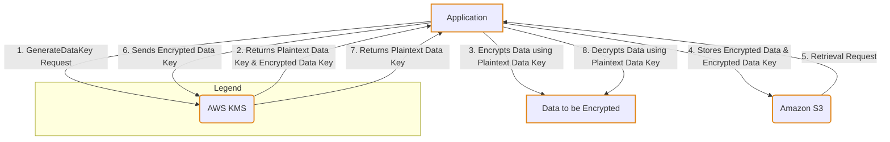
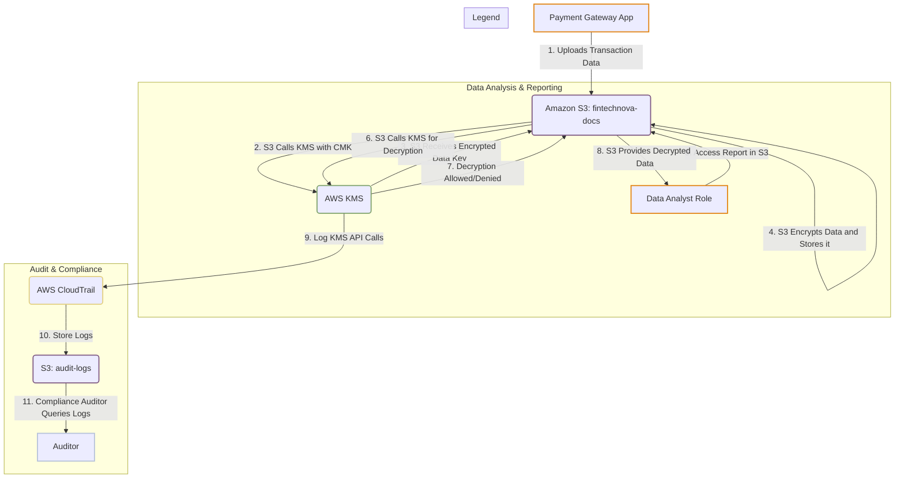
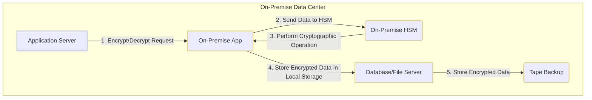

# KMS

## AWS KMS

### 🌟 Overview: AWS Key Management Service (KMS) 🔑

AWS Key Management Service (KMS) is a managed service that makes it easy for you to create and control cryptographic keys used to encrypt your data. It provides a secure, highly available, and scalable solution for managing encryption keys and integrating them with your applications and a wide range of AWS services. At its core, KMS is the **root of trust** for your data protection in the cloud.

KMS keys, often referred to as Customer Master Keys (CMKs), are the logical representation of a key that can be used for cryptographic operations. The actual key material is stored within FIPS 140-2 validated Hardware Security Modules (HSMs), ensuring that the key never leaves the secure boundaries of the service. This is a crucial security guarantee.

<figure><figcaption></figcaption></figure>

#### 🤖 Innovation Spotlight: Multi-Region Keys

One of the most significant innovations in AWS KMS is the introduction of **Multi-Region Keys**. This feature allows you to create a set of interoperable KMS keys with the same key ID and key material across multiple AWS Regions. This solves a major challenge for organizations building globally distributed applications, particularly for disaster recovery, multi-Region high-availability architectures, and services like DynamoDB Global Tables. With multi-Region keys, you can encrypt data in one Region and decrypt it in another without needing to re-encrypt the data or make a cross-Region call, which can introduce latency and complexity.

***

### ⚡ Problem Statement: Securing Sensitive Customer Data 🔒

Imagine a global fintech company, **FinTechNova**, that operates a platform for secure digital payments and financial transactions. They handle vast amounts of sensitive customer data, including credit card numbers, personal identifiable information (PII), and transaction history. This data is stored across various AWS services like Amazon S3, Amazon RDS, and Amazon DynamoDB.

The challenge for FinTechNova is to implement a robust and centralized data encryption strategy that meets stringent regulatory compliance requirements (like PCI DSS and GDPR) and protects customer trust. They need a solution that:

1. Provides a single, centralized point of control for all encryption keys.
2. Ensures that the keys are highly secure and never exposed.
3. Allows for fine-grained access control over who can use which key to decrypt data.
4. Provides a comprehensive audit trail of all key usage for compliance.
5. Is scalable and highly available to support their global operations without performance bottlenecks.

#### 🤝 Business Use Cases

* **Fintech & Financial Services:** Encrypting payment card data (PCI DSS), PII, and financial transaction records stored in databases and data lakes.
* **Healthcare:** Securing patient health information (PHI) in compliance with HIPAA by encrypting data stored in services like Amazon S3 for medical images or Amazon RDS for patient records.
* **SaaS Providers:** Offering "Bring Your Own Key" (BYOK) functionality to customers, allowing them to maintain control over the keys used to encrypt their data within the SaaS platform.
* **Government & Public Sector:** Protecting classified or sensitive government data that requires FIPS 140-2 compliance.

***

### 🔥 Core Principles of AWS KMS 🛡️

The fundamental concepts of AWS KMS revolve around a hierarchical approach to key management known as **envelope encryption**.

* **Envelope Encryption:** This is a two-step process. Instead of directly encrypting a large amount of data with a single, high-value key, you encrypt the data with a **Data Key**. Then, you encrypt this data key with a different key, the **KMS key (or CMK)**. This practice is more efficient and secure. The KMS key never leaves KMS unencrypted.
* **KMS Keys (CMKs):** These are the primary resources in KMS. They are the root of the trust. There are three types:
  * **Customer Managed Keys:** Keys you create, own, and manage. You control their policies, grants, rotation, and aliases.
  * **AWS Managed Keys:** Keys created on your behalf by an AWS service (e.g., `aws/s3`, `aws/rds`). You can view their usage and policies, but you don't control them.
  * **AWS Owned Keys:** Keys owned and managed by an AWS service for use in multiple accounts. You cannot view or manage these keys.
* **Data Keys:** These are encryption keys that are used to encrypt large amounts of data outside of KMS. KMS generates, encrypts, and decrypts these data keys but does not store or manage them.
* **Aliases:** A user-friendly name for a KMS key. They are useful for managing keys across different environments (e.g., `alias/prod/app-data-key`, `alias/dev/app-data-key`).
* **Key Policies:** The primary way to control access to a KMS key. This resource-based policy specifies who can use the key and for what cryptographic operations. Key policies are used in conjunction with IAM policies.
* **Grants:** A mechanism to provide temporary, fine-grained permissions to a principal for a specific KMS key.

***

### 📋 Pre-Requirements 🛠️

* **An AWS Account:** You need an active AWS account with appropriate permissions.
* **AWS CLI or AWS Management Console:** For managing resources.
* **IAM Policies:** To control who can create and manage KMS keys.
* **S3 Bucket (Optional but Recommended):** To store CloudTrail logs for auditing key usage.
* **AWS CloudTrail:** Must be enabled to log all API calls to KMS, which is essential for security and compliance.

***

### 👣 Implementation Steps: Encrypting Data in S3 📁

Let's walk through a simple, practical example of using AWS KMS to encrypt sensitive documents uploaded to an S3 bucket.

1. **Create a Customer Managed Key (CMK) in KMS:**
   * Navigate to the AWS KMS console.
   * Click "Create key."
   * Choose a key type (e.g., Symmetric) and key usage (Encrypt and Decrypt).
   * Give it an alias (e.g., `fintechnova-documents-key`) and a description.
   * Define the key administrators (IAM users/roles who can manage the key).
   * Define the key users (IAM users/roles who can use the key for cryptographic operations).
   * Review and create the key.
2. **Create an S3 Bucket:**
   * Navigate to the Amazon S3 console.
   * Create a new bucket (e.g., `fintechnova-documents-bucket`).
   * In the bucket properties, go to **Default encryption**.
   * Select **AWS Key Management Service key (SSE-KMS)**.
   * Choose the CMK you created in step 1 from the dropdown list.
   * Save the changes. Now, any object uploaded to this bucket will be automatically encrypted using your CMK.
3. **Configure IAM Role for Application:**
   * Create an IAM role for your application (e.g., an EC2 instance or a Lambda function) that needs to upload and retrieve files.
   * Attach a policy to this role that grants permissions to the specific S3 bucket (`s3:PutObject`, `s3:GetObject`).
   * Most importantly, add permissions to use the KMS key: `kms:GenerateDataKey`, `kms:Decrypt`, and `kms:Encrypt` for your specific CMK ARN. This is a critical step to follow the principle of least privilege.
4. **Upload and Access Encrypted Data:**
   * Your application, assuming the configured IAM role, can now upload files to the S3 bucket. S3 will automatically handle the encryption using KMS.
   * When the application needs to retrieve a file, it makes an S3 GET request. S3 will call KMS to decrypt the data key, which is then used to decrypt the file before it's streamed back to the application.
   * All these KMS API calls are logged to CloudTrail, providing an auditable record of every key usage.

***

### 🗺️ Data Flow Diagram:

**Diagram 1: How AWS KMS Works (Envelope Encryption)**

**Diagram 2: FinTechNova's Payment Document Flow**

***

### 🔒 Security Measures ✨

* **Principle of Least Privilege:** Use IAM policies and KMS key policies to grant only the necessary permissions to users and roles. For example, a Lambda function only needs `kms:Decrypt` for a specific key, not `kms:*` or `kms:CreateKey`.
* **Separation of Duties:** Have different IAM roles for key administrators (who can create/delete keys) and key users (who can only use them for crypto operations). This prevents a single person from both managing and using keys in a malicious way.
* **CloudTrail Integration:** Always enable and monitor AWS CloudTrail logs for KMS. This provides an immutable record of all key usage, which is vital for auditing and detecting suspicious activity.
* **Automated Key Rotation:** Enable automatic key rotation for Customer Managed Keys. AWS KMS will generate new key material every year, reducing the risk of a long-lived key being compromised.
* **VPC Endpoints:** For applications running in a VPC, use a VPC endpoint for KMS to ensure all API calls stay within the AWS network, improving security and potentially reducing latency.
* **Encryption Context:** Use encryption context, which is a set of key-value pairs, to provide additional authenticated data for cryptographic operations. This can be used to enforce specific access policies and is logged in CloudTrail for a richer audit trail.

***

### ⚖️ When to use and when not to use

| ✅ When to Use                                                                                                                                                                    | ❌ When Not to Use                                                                                                                                                                                   |
| -------------------------------------------------------------------------------------------------------------------------------------------------------------------------------- | --------------------------------------------------------------------------------------------------------------------------------------------------------------------------------------------------- |
| **Centralized Key Management:** When you need a single, auditable service to manage keys for multiple applications and AWS services.                                             | **For Large-Scale File Encryption:** Don't use KMS to directly encrypt large files (over 4 KB). Use it for envelope encryption with a data key, which is the standard practice.                     |
| **Automated Encryption for AWS Services:** When you want to seamlessly encrypt data stored in services like S3, EBS, RDS, and DynamoDB with minimal effort.                      | **Local Key Management:** If your application requires managing cryptographic keys and operations entirely within a self-hosted or on-premises environment due to strict regulatory requirements.   |
| **High Security & Compliance:** When your application handles sensitive data (e.g., PII, PHI) and needs FIPS 140-2 validated HSMs for key protection and a detailed audit trail. | **Simple Password/Secret Storage:** For simple application secrets and credentials (e.g., database passwords, API keys), AWS Secrets Manager is often a more appropriate and purpose-built service. |
| **Multi-Region Workloads:** When you need to build globally-distributed, highly available applications that require consistent encryption across multiple Regions.               | **Static Data:** For data that is not sensitive and doesn't have regulatory requirements for encryption. Encryption adds a small amount of overhead and cost.                                       |

***

### 💰 Costing Calculation 💸

AWS KMS pricing is based on two primary factors:

1. **Storage of KMS Keys:** Each customer-managed key (CMK) costs **$1 per month**. This is a flat fee, regardless of how often the key is used.
2. **API Requests:** You are charged per request to the KMS API (e.g., `Encrypt`, `Decrypt`, `GenerateDataKey`). The cost is typically **$0.03 per 10,000 requests** for symmetric keys. Asymmetric and HMAC key requests have different, slightly higher rates. There is a generous **free tier** of 20,000 requests per month.

### # **Efficient Way of Handling:**

* **Caching Data Keys:** For applications with high transaction rates, avoid calling KMS for every single cryptographic operation. Instead, use a data key caching mechanism. You can generate a plaintext data key and its encrypted counterpart once, cache it securely in your application's memory, and reuse it for a short duration. This drastically reduces the number of expensive KMS API calls.
* **S3 Bucket Keys:** For S3, enable S3 Bucket Keys. This feature reduces the request traffic from S3 to KMS by using a temporary, shorter-lived key at the bucket level instead of per-object keys. This can lead to a significant cost reduction.

### # **Sample Calculation**

Let's calculate the monthly cost for FinTechNova's document encryption scenario, assuming the US East (N. Virginia) Region.

* **Scenario:** FinTechNova creates a single customer-managed KMS key and uses it to encrypt 5 million documents per month, with each document being decrypted 10 times on average.
* **KMS Key Storage Cost:**
  * 1 CMK at $1.00/month = **$1.00**
* **API Request Costs:**
  * `GenerateDataKey` calls: 5,000,000 documents
  * `Decrypt` calls: 5,000,000 documents \* 10 decryptions/document = 50,000,000 calls
  * **Total API Calls:** 55,000,000
  * **Free Tier:** 20,000 requests/month (ignored here for simplicity, but a factor)
  * **Chargeable Requests:** 55,000,000
  * **Cost per 10,000 requests:** $0.03
  * **Total API Request Cost:** $(55,000,000 / 10,000) \* $0.03 = 5,500 \* $0.03 = **$165.00**
* **Total Monthly Cost:** $1.00 (key storage) + $165.00 (requests) = **$166.00**

***

### 🧩 Alternative Services

| Service Name                                  | Cloud Provider   | Key Differences & Comparisons                                                                                                                                                                                                                                                                                                                                                   |
| --------------------------------------------- | ---------------- | ------------------------------------------------------------------------------------------------------------------------------------------------------------------------------------------------------------------------------------------------------------------------------------------------------------------------------------------------------------------------------- |
| **Azure Key Vault**                           | **Azure**        | **Similarities:** Centralized key management, HSM-backed keys, integration with other services. \  **Differences:** Azure Key Vault also manages secrets (passwords, certificates) in a single service, whereas AWS has a separate service for this (Secrets Manager). The pricing model is similar but has different tiers and pricing points.                              |
| **Google Cloud KMS**                          | **GCP**          | **Similarities:** Fully managed, hierarchical key management, used for data encryption across the platform. \  **Differences:** GCP KMS uses a different pricing model based on "Key versions" and the number of cryptographic operations. It also has a distinct permission model and a different set of integrations.                                                      |
| **Fortanix Data Security Manager**            | **SaaS/On-Prem** | **Similarities:** A unified platform for key management, secrets management, and digital certificates. \  **Differences:** This is a third-party, multi-cloud solution. It offers a single management interface across various cloud and on-premises environments, providing more vendor independence but also introducing a new management layer.                           |
| **On-Premise HSM (Hardware Security Module)** | **On-Premise**   | **Similarities:** Provides a secure, tamper-resistant environment for storing and using cryptographic keys. \  **Differences:** On-prem HSMs require a significant upfront capital expenditure (CapEx), physical security, and ongoing operational overhead for management, maintenance, and scaling. There's no managed service aspect; you are responsible for everything. |

### **On-Premise HSM Data Flow Diagram**

***

### ✅ Benefits 🎉

* **Enhanced Security:** Your keys are protected by FIPS 140-2 validated HSMs, providing a strong security guarantee that would be expensive and difficult to achieve on your own.
* **Centralized Control:** Simplifies key management by providing a single point of control and auditing for all your encryption keys across AWS services and applications.
* **Seamless Integration:** Deep integration with over 100 AWS services makes it easy to enable encryption with a few clicks.
* **Scalability & High Availability:** Automatically scales to meet your cryptographic needs and is designed for extreme availability, ensuring your applications can always access their keys.
* **Cost-Effective:** Pay-as-you-go pricing model avoids large upfront capital expenditures associated with on-premises HSMs.
* **Auditability:** Comprehensive logging via AWS CloudTrail provides a detailed record of every key usage, which is essential for compliance and security forensics.
* **Multi-Region Functionality:** Simplifies the design of global applications by allowing for seamless encryption and decryption across different AWS Regions.

***

### 📝 Summary 📝

AWS Key Management Service is a fully managed, highly secure, and scalable service that helps you create and manage cryptographic keys to protect your data. It provides a centralized control plane for your encryption strategy and integrates deeply with other AWS services. By using envelope encryption and hardware-based security, it removes the heavy lifting of key management, allowing you to focus on your application's logic while ensuring data security and compliance.

**Top 5 Things to Keep in Mind:**

1. **KMS doesn't directly encrypt large data:** It uses envelope encryption. You call KMS to generate and decrypt data keys, which then encrypt/decrypt your data.
2. **IAM & Key Policies work together:** Both are needed to define who can do what with a KMS key. The most restrictive policy wins.
3. **Auditing is key:** Always enable CloudTrail to monitor and log all KMS API calls for security and compliance purposes.
4. **Use a caching strategy:** For high-volume applications, caching data keys can significantly reduce costs by minimizing the number of KMS API calls.
5. **Separate your keys:** Create different CMKs for different applications or data types to follow the principle of least privilege and simplify management.

***

### 🔗 Related Topics

* **AWS Secrets Manager:** For storing and managing application secrets, credentials, and API keys.
* **AWS CloudHSM:** For customers who need exclusive, single-tenant hardware security modules for key management.
* **AWS Certificate Manager (ACM):** For managing SSL/TLS certificates for your AWS services.
* **AWS Encryption SDK:** A client-side encryption library that simplifies using KMS for your applications.
