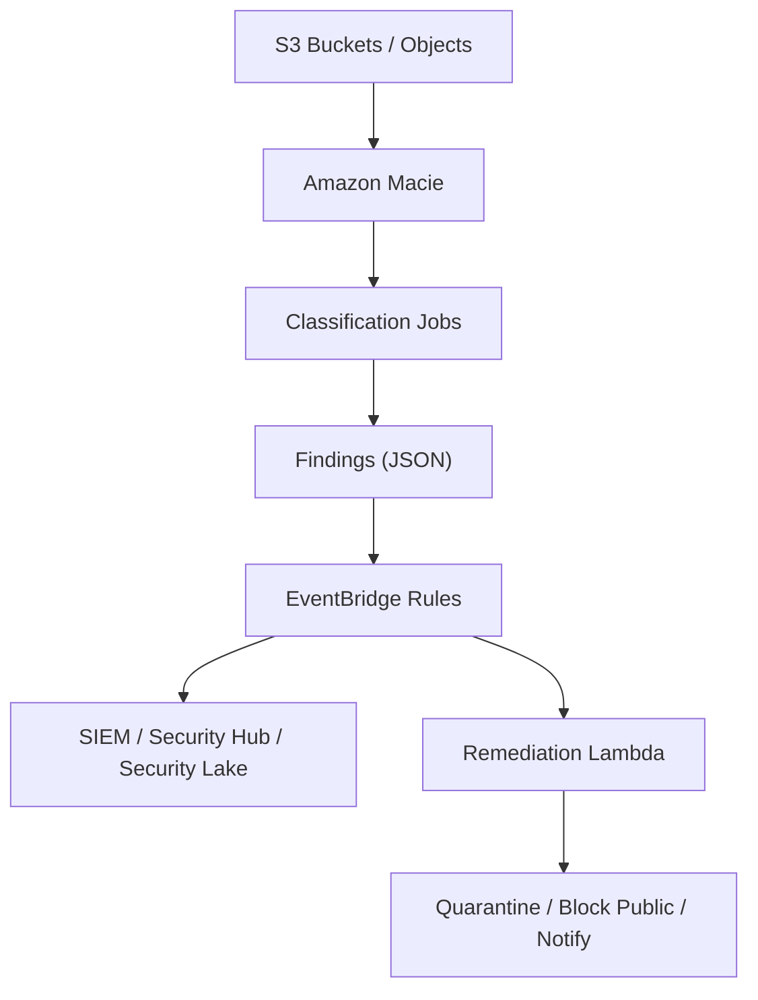
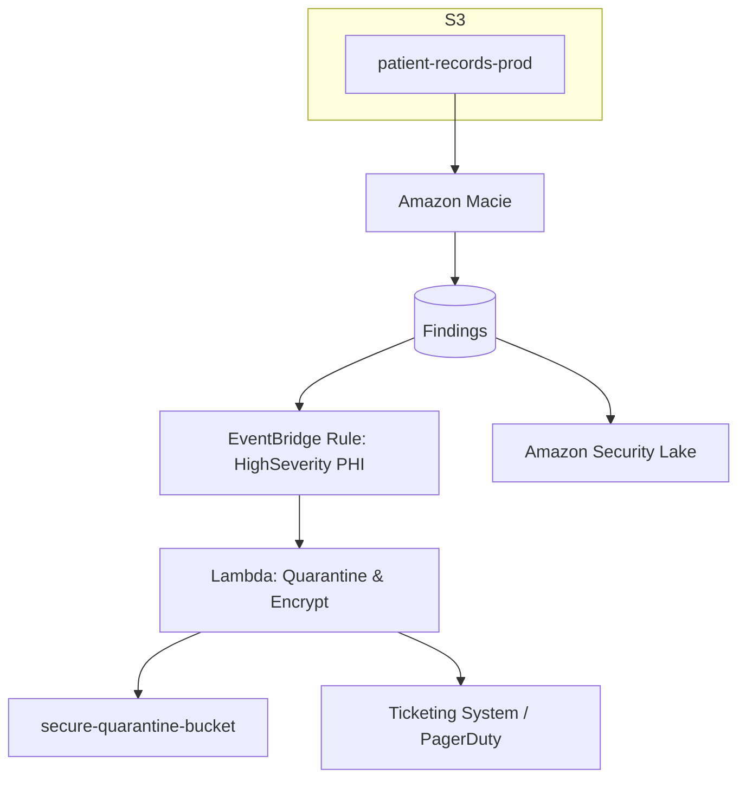
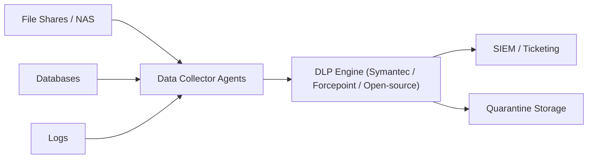

# Macie

### 🌟 Amazon Macie

**Amazon Macie** is a managed data security and data privacy service that uses machine learning and pattern matching to discover, classify, and protect sensitive data in Amazon S3. **It identifies sensitive PII/PHI, intellectual property, and access anomalies**, assigns risk scores to S3 buckets, and produces findings that integrate with Security Hub, EventBridge, and SIEM/SOAR workflows.

<figure><figcaption></figcaption></figure>

### 💡Innovation Spotlight:

* **Adaptive ML classification** that blends prebuilt and custom classifiers with contextual risk scoring across account/org-level telemetry.
* **Automated data protection actions** via EventBridge-driven remediation playbooks (quarantine buckets, rotate credentials, revoke public access).
* **Fine-grained custom data identifiers** (regex, dictionaries, and ML-based entity models) and tagging-aware scanning to reduce noise.
* **Integration with Amazon Security Lake** and faster bulk classification APIs for large-scale enterprise migrations.

***

### ⚡ Problem Statement

A healthcare SaaS vendor has migrated petabytes of historical records to S3. They must detect and protect PHI/PII, ensure regulatory compliance (HIPAA, GDPR), reduce data-exposure risk, and automate remediation for accidental public exposure or overly permissive ACLs/policies.

Industries/applications:

* Healthcare (PHI scanning, HIPAA)
* Financial services (PII, account numbers, PCI scope reduction)
* Legal/IP management (sensitive contracts, trade secrets)
* Education (student records)
* Retail/Marketing (customer PII, loyalty data)

2.1 🤝 Business Use Cases

* Discover and classify PII/PHI across S3 to prioritize encryption & access controls.
* Continuously monitor for public buckets, risky object-level permissions, or unusual data access patterns.
* Automate remediation: block public access, move sensitive objects to a secure bucket, notify data owners.
* Support privacy requests (data subject access) by locating all objects containing a subject’s identifier.

***

### 🔥 Core Principles

* Data discovery & classification: Macie scans S3 objects metadata and content to detect predefined and custom sensitive data types (PII, PHI, credentials, keys, identification numbers).
* ML + deterministic detection: Combines machine learning for contextual classification with deterministic pattern matching (regex, dictionaries).
* Continuous monitoring vs on‑demand: Supports scheduled/classification jobs and continuous monitoring for new/modified objects.
* Risk scoring: Buckets and findings receive risk scores based on sensitivity, exposure (public access), and access patterns.
* Findings & integration: Findings emitted as structured alerts; integrate via EventBridge, CloudWatch, Security Hub, or push to SIEM.
* Data residency & privacy: Macie inspects object contents in-place in S3; service is managed by AWS and respects region/data residency controls.
* Scope control: You can limit scanning to specific buckets, prefixes, tags, or object types to reduce cost and noise.
* Custom data identifiers: Build enterprise-specific detectors using regex, keywords, dictionaries, or training data.

Key Macie resources/terms:

* Macie Session / Account-level enablement — enable Macie per account/region (can be centralized via Organizations).
* Classification jobs — on-demand or scheduled jobs that scan objects.
* Sensitive data discovery — the engine that inspects object content and metadata.
* Findings — structured results with severity, type, location (bucket/key), and remediation recommendations.
* Buckets page & risk scores — UI for bucket-level exposure and sensitivity.
* Custom data identifiers — user-defined patterns/wordlists/ML models.
* Exclusions & scope masks — prefix/tag-based exclusions to avoid scanning non-relevant data.
* Data identifiers library — built-in detectors (SSNs, credit cards, names, emails, medical terms).
* EventBridge integration — route findings to workflows for automation.

***

### 📋 Pre-Requirements

* Amazon S3 with objects to scan (ensure Macie has read access).
* IAM permissions to enable Macie and create classification jobs (Administrator or specific Macie IAM policies).
* AWS Organizations (optional) to centrally manage Macie across accounts (delegate admin).
* KMS keys if scanning encrypted objects with SSE-KMS (Macie needs decrypt permissions).
* EventBridge, Lambda, SNS, Security Hub, or Security Lake for alerting and remediation flows.
* Defined classification policies: list of buckets/prefixes/tags to include/exclude.
* Sample data for custom identifier training or dictionaries if using custom detectors.
* Optional: Data catalog metadata (Glue) to correlate findings.

***

### 👣 Implementation Steps

1. Enable Macie
   * Console/CLI: Enable Macie in target region(s) and designate delegated admin if using Organizations.
2. Configure Access
   * Ensure Macie service principal has read permissions to S3 objects (and decrypt permissions for SSE-KMS if needed).
   * Set up IAM roles/policies for operators and automation playbooks.
3. Scope & Exclusions
   * Define which buckets/prefixes/tags to include or exclude.
   * Configure S3 object criteria (size, file types, last modified) to reduce noise and cost.
4. Use Built-in Identifiers
   * Start with Macie’s built-in detectors (SSN, credit card, email, names, medical terms).
   * Review sample findings and tune thresholds.
5. Create Custom Data Identifiers
   * Add regex/dictionaries or train custom ML identifiers for company-specific sensitive items (customer IDs, contract IDs).
   * Test identifiers on sample objects before broad scans.
6. Run Classification Jobs
   * Create on‑demand or scheduled classification jobs for selected buckets/prefixes.
   * Monitor job progress and review result counts.
7. Continuous Monitoring
   * Enable continuous monitoring for new S3 objects in scope.
8. Integrate with Alerting & Remediation
   * Create EventBridge rules for high-severity findings to trigger Lambda or Step Functions playbooks.
   * Playbook examples: block public access, add a deny bucket policy via automation, copy object to quarantine bucket, notify data owner.
9. Risk-based Prioritization
   * Use bucket risk scores and finding severity to triage remediation.
   * Export findings to Security Hub or Security Lake for centralized correlation.
10. Operationalize & Tune

* Review false positives, refine custom identifiers, update exclusions.
* Periodically re-run classification for changing datasets and new file types.

***

### 🗺️ Data Flow Diagram

Diagram 1 — How Macie works (core flow)

Diagram 2 — Example use case: Healthcare org auto-remediation workflow

***

### 🔒 Security Measures

* Principle of least privilege: grant Macie only the S3 read/list and KMS decrypt permissions required for scoped buckets.
* Use KMS with key policies that explicitly allow Macie usage only for required keys.
* Exclude non-sensitive or log buckets to avoid unnecessary content exposure.
* Encrypt findings at rest (S3/Security Lake) and in transit using TLS.
* Limit who can create/modify custom data identifiers and classification jobs (use IAM and SCPs).
* Audit Macie activity with CloudTrail and monitor changes to Macie settings.
* Use tagging and resource-based policies to isolate sensitive datasets and control scanning surface.
* Review and harden remediation playbooks to avoid disruptive false-positive automated actions.

***

### ✅ When to use and when not to use

* ✅ When to use:
  * You need automated discovery/classification of PII/PHI across S3 at scale.
  * You require continuous monitoring and risk-based prioritization for data protection.
  * You want integration with EventBridge/Lambda/Security Hub for automated containment.
  * You must support compliance (HIPAA, GDPR, PCI) evidence and reporting.
* ❌ When not to use:
  * Your sensitive data is primarily outside S3 (on-prem databases, other cloud storage) — Macie focuses on S3.
  * You need real-time inline prevention at application level — Macie is discovery and monitoring, not an inline WAF.
  * Extremely strict data residency rules that forbid managed service access to object contents (verify regional/residency constraints first).

***

### 💰 Costing Calculation

How pricing is calculated:

* Two primary components:
  * Sensitive data discovery (scanning/classification) charges — typically per GB of content inspected.
  * Classification job scheduling and continuous monitoring — may add per-object or per-job costs; additional charges for custom identifiers and API usage.
* Additional costs: KMS decrypt (if scanning SSE-KMS objects), S3 GET/HEAD request costs when Macie reads objects, data transfer if cross-region scanning, Security Lake/SIEM ingestion costs.

Efficient handling tips:

* Scope scans to specific buckets/prefixes/tags to limit data scanned.
* Exclude large non-sensitive binary blobs (media, backups) via exclusions or object size limits.
* Use sample or incremental scanning for very large datasets, then full scans only periodically.
* Use lifecycle policies to archive/compress older objects out of scan scope when appropriate.

Sample calculation (illustrative — replace with current regional pricing):

* Dataset: 10 TB (10,240 GB) of S3 objects to classify once.
* If Macie classification = $1.50 per GB scanned (example), classification cost = 10,240 \* $1.50 = **$15,360** for a full scan.
* Continuous monitoring of new objects: assume 200 GB/month new data → 200 \* $1.50 = **$300/month**.
* KMS decrypt calls and S3 GET requests might add a few dollars to tens of dollars depending on object count. Note: Use selective scans and exclusions to drastically reduce costs; always consult up-to-date Macie pricing for accurate estimates.

***

### 🧩 Alternative services (AWS / Azure / GCP / On-Premise)

| Category                                             |                                                                         Amazon Macie | Azure Equivalent                                                                                                                 | GCP Equivalent                                                                               | On-Premise Alternative                                                                                     |
| ---------------------------------------------------- | -----------------------------------------------------------------------------------: | -------------------------------------------------------------------------------------------------------------------------------- | -------------------------------------------------------------------------------------------- | ---------------------------------------------------------------------------------------------------------- |
| Cloud-native data discovery & DLP for object storage |     **Amazon Macie** — S3-focused sensitive data discovery + ML-based classification | **Azure Purview** (now Microsoft Purview Data Loss Prevention + Data Map) — data discovery across Azure Blob, SQL, Microsoft 365 | **Google Cloud DLP** & Data Loss Prevention API — inspect Cloud Storage, BigQuery, Datastore | Open-source/custom DLP: Apache Tika + custom regex pipelines; commercial DLP: Symantec DLP, Forcepoint DLP |
| Strengths                                            | Deep S3 integration, bucket risk scoring, custom identifiers, EventBridge automation | Broad data catalog + governance across Microsoft services                                                                        | Strong API-based inspection, integrates with BigQuery, Cloud Storage                         | Full control, on-prem discovery across file shares                                                         |
| Weaknesses                                           |                                          S3-only focus; costs scale with data volume | Complexity for non-Microsoft environments                                                                                        | Requires integration work for enterprise governance                                          | High operational overhead, integration complexity                                                          |

On-premise alternative data flow (Mermaid):

***

### ✅ Benefits

* **Automated, scalable discovery** of sensitive data across S3 without writing custom scanners.
* **Risk-based prioritization** via bucket risk scores and finding severity to focus remediation.
* **Customizability**: custom identifiers and scope controls reduce false positives.
* **Integration-ready**: EventBridge, Lambda, Security Hub, Security Lake enable automated responses.
* **Compliance support** for data protection regulations with discoverability and reporting.

***

### 🔁 Innovation & Use Case (Automated PHI Containment)

* Innovation: **EventBridge-triggered remediation** that pairs Macie findings with Lambda and Security Lake to enable near real-time quarantine and audit trails for PHI exposure.
* Use Case: Macie finds PHI in a newly uploaded object → EventBridge triggers Lambda → Lambda copies object to an encrypted quarantine bucket, sets restrictive ACL/policy, alerts data owner, and logs action in Security Lake.

***

### 📝 Summary

Takeaway: **Amazon Macie automates discovery, classification, and monitoring of sensitive data in Amazon S3 using ML and custom identifiers, producing prioritized findings that integrate with remediation and governance workflows.**

🧠 Top things to keep in mind

1. Macie focuses on S3 — plan coverage and exclusions carefully to control cost.
2. Use custom data identifiers to detect enterprise-specific sensitive patterns.
3. Limit Macie’s KMS decrypt permissions to only keys needed and monitor KMS usage.
4. Scope scans by bucket/prefix/tag and object size/type to reduce noise and cost.
5. Integrate findings with EventBridge + Lambda for automated remediation playbooks.
6. Centralize management via AWS Organizations for consistent policies.
7. Regularly tune detectors to reduce false positives and update dictionaries.
8. Retain findings in Security Lake or SIEM for long-term audit and analytics.
9. Test remediation workflows to avoid data-loss from false positives.
10. Validate compliance reporting needs and data residency before scanning.

> <mark style="color:$success;">In short</mark>: Amazon Macie discovers and classifies sensitive data in Amazon S3 using ML and custom identifiers, assigns bucket-level risk scores, and emits findings you can automate or ingest into security tooling. It’s ideal for data-loss prevention, compliance, and prioritizing remediation for exposed PII/PHI.

***

### 🔗 Related Topics

* Amazon Security Lake (centralize Macie findings)
* AWS EventBridge + Lambda automation playbooks
* AWS KMS (encrypting S3 objects scanned by Macie)
* AWS Organizations (centralized Macie administration)
* Data governance tools: Amazon Glue / Lake Formation
* Azure Purview / Google Cloud DLP for cross-cloud comparisons

> 🛠️ 🔐 Amazon Macie — design scope smartly, use custom identifiers, and automate remediation to protect sensitive S3 data at scale.
