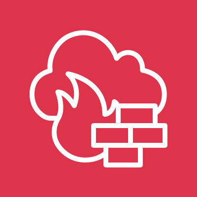
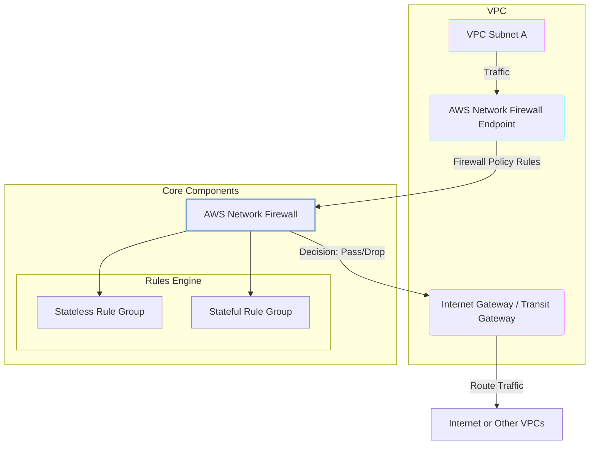
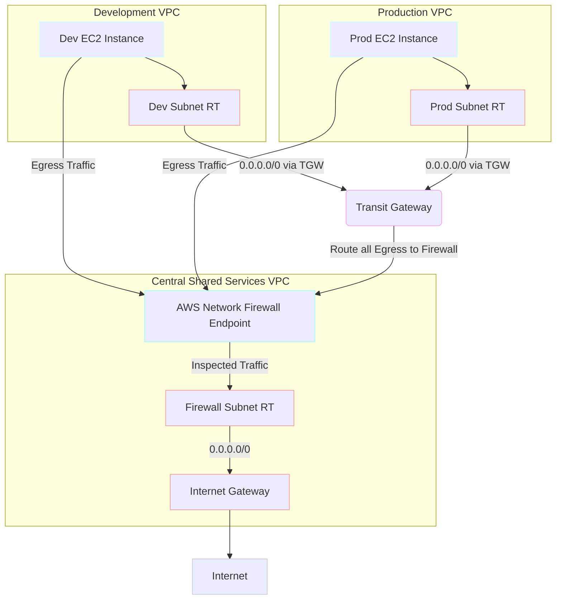
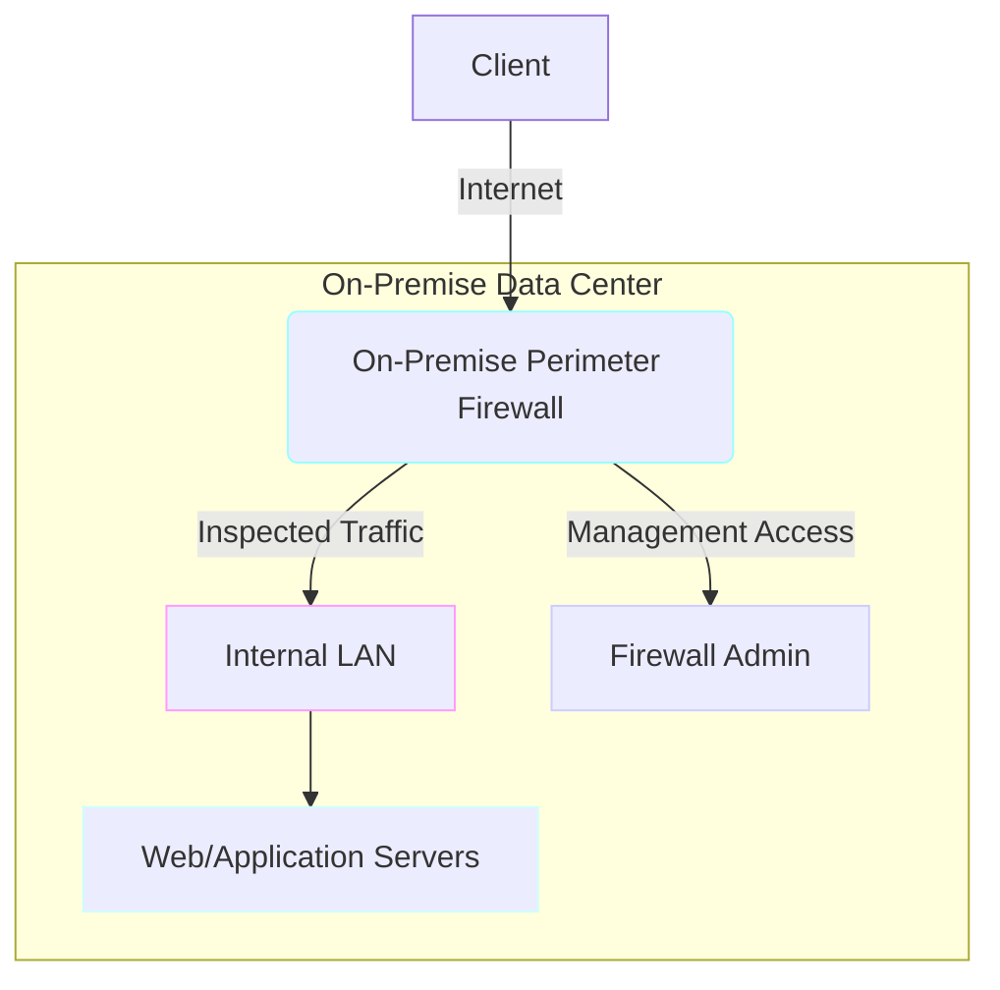

# Network Firewall

## Network Firewall

### 🌟 Overview: AWS Network Firewall 🛡️

**AWS Network Firewall** is a managed service that simplifies the deployment, maintenance, and scaling of network protections for your Amazon Virtual Private Clouds (VPCs). It's a highly available, transparent, and scalable firewall that enables you to filter traffic at the network and transport layers (Layers 3 and 4) and even at the application layer. By integrating directly into your VPC, it provides a crucial layer of defense, automatically scaling with your network traffic without the need for you to manage the underlying infrastructure. It's a significant advancement over traditional network ACLs and security groups, which offer more basic packet filtering.

<figure><figcaption></figcaption></figure>

### 🤖 Innovation Spotlight: Suricata-compatible Rules

A key innovation is its compatibility with **Suricata**, an open-source intrusion detection and prevention system (IDS/IPS). This means you're not locked into a proprietary rule format. You can bring your own custom rules, leverage a vast community-maintained ruleset, and integrate with existing security operations. This flexibility allows for rapid adaptation to new threats and the implementation of highly specific security policies for unique application requirements. AWS also provides its own managed rule groups, which are regularly updated with threat intelligence from Amazon.

***

### ⚡ Problem Statement: Securing a Multi-VPC Enterprise Network 🏢

Consider **SecureCorp**, a large enterprise with a complex AWS environment. They have multiple VPCs across different business units—one for development, one for production, and another for a shared services hub. All internet-bound traffic from these VPCs must be centrally inspected for malware, unauthorized data exfiltration, and compliance with corporate policies. They face several challenges:

* **Decentralized Security:** Each VPC has its own set of security groups and network ACLs, making it difficult to enforce a consistent security posture across the organization.
* **Operational Overhead:** Managing and patching third-party firewall appliances in each VPC is a manual, time-consuming process that doesn't scale well.
* **Compliance:** The company must meet strict regulatory requirements (e.g., for finance or healthcare) that demand deep packet inspection and detailed logging of all network traffic.
* **Scalability:** The firewall solution must automatically scale to handle traffic spikes without manual intervention or performance degradation.

### # 🤝 Business Use Cases

* **Large Enterprises:** Centralizing security policies for east-west (VPC-to-VPC) and north-south (internet ingress/egress) traffic across multiple accounts and VPCs.
* **Fintech & Healthcare:** Enforcing strict data exfiltration rules and meeting compliance standards by inspecting all outbound traffic for sensitive data.
* **Managed Service Providers (MSPs):** Offering a fully managed security solution to their clients, allowing them to provide consistent, enterprise-grade protection without managing individual firewall instances.
* **E-commerce:** Protecting against distributed denial-of-service (DDoS) attacks, botnets, and other threats by inspecting incoming traffic at a granular level.

***

### 🔥 Core Principles: How it Works ⚙️

AWS Network Firewall operates on a layered, hierarchical model of firewall policies and rules.

* **Firewall:** The primary resource you deploy in a VPC. It is associated with a specific firewall policy.
* **Firewall Policy:** A reusable resource that defines the core security logic. It contains stateless and stateful rule groups. Policies can be shared across multiple VPCs and accounts via AWS Firewall Manager.
* **Rule Groups:**
  * **Stateless Rules:** These rules are processed first and apply to individual packets without regard for connection state. They are ideal for allowing or denying known-good or known-bad traffic based on simple attributes like source/destination IP addresses, protocols, and ports. They are used for high-speed, simple filtering.
  * **Stateful Rules:** These rules evaluate traffic in the context of a connection. They inspect the entire session, which is crucial for deep packet inspection (DPI), domain name filtering (FQDN), and intrusion prevention system (IPS) capabilities. They can identify and block threats that span multiple packets. AWS offers managed stateful rule groups, and you can also import custom Suricata-compatible rules.
* **Firewall Endpoints:** Network Firewall is deployed in a dedicated subnet in each Availability Zone (AZ) of your VPC. The firewall creates an endpoint in this subnet, which is an elastic network interface (ENI). You then configure VPC route tables to route all relevant traffic through this endpoint for inspection.
* **Centralized Management:** For large-scale deployments, AWS Network Firewall integrates seamlessly with **AWS Firewall Manager**, allowing you to centrally deploy and manage firewall policies across multiple accounts and VPCs from a single console.

***

### 📋 Pre-Requirements 🛠️

* **An AWS Account:** With permissions to create VPCs, subnets, route tables, and Network Firewall resources.
* **A VPC:** The network you want to protect.
* **Subnets:** You need to create at least one dedicated subnet per Availability Zone for the Network Firewall endpoints. These subnets should be separate from your application subnets.
* **VPC Route Tables:** You must configure route tables to direct traffic from your application subnets to the Network Firewall endpoints and from the endpoints to their final destination (e.g., Internet Gateway or Transit Gateway).

***

### 👣 Implementation Steps: Securing a VPC 🗺️

1. **Prepare the VPC:** In your target VPC, create a new public subnet in each Availability Zone where your application subnets are located. These will be your "firewall subnets."
2. **Create Rule Groups:**
   * Go to the AWS VPC console, navigate to "Network Firewall" and "Rule groups."
   * Create a **stateless rule group** to allow or drop high-volume, simple traffic. For example, you can create a rule to "allow" all HTTPS traffic from a specific IP range.
   * Create a **stateful rule group** for deeper inspection. You can add a managed rule group (e.g., "AWS Managed Threat Signatures") or define your own custom rules.
3. **Create a Firewall Policy:**
   * In the "Firewall policies" section, create a new policy.
   * Attach the stateless and stateful rule groups you created.
   * Configure the **default actions** for stateless and stateful traffic (e.g., `Forward to stateful rules` for stateless traffic that doesn't match a rule).
4. **Create the Firewall:**
   * Go to the "Firewalls" section and create a new firewall.
   * Select your VPC and the firewall subnets you created.
   * Associate the firewall with the firewall policy from the previous step.
5. **Update Route Tables:**
   * This is the most critical step. For each application subnet, you need to create a route that directs all outbound internet traffic (or a specific IP range) to the Network Firewall endpoint.
   * In the route table associated with your application subnet, edit the routes and add a new route with a destination of `0.0.0.0/0` and a target of the Network Firewall endpoint.
   * Create a separate route table for the firewall subnet itself. This route table will have a route from the firewall endpoint to the Internet Gateway.

***

### 🗺️ Data Flow Diagram

**Diagram 1: How AWS Network Firewall Works**

***

**Diagram 2: SecureCorp's Centralized Egress Inspection**

***

### 🔒 Security Measures 🚨

* **IAM Least Privilege:** Use IAM policies to grant only the necessary permissions for managing firewalls, policies, and rule groups. For example, a developer shouldn't have permissions to modify production firewall rules.
* **Logging:** Enable logging for your firewall. You can send logs to Amazon S3, Amazon CloudWatch Logs, or Amazon Kinesis Data Firehose. This is crucial for auditing, threat detection, and compliance.
* **AWS Firewall Manager:** For multi-account and multi-VPC environments, use AWS Firewall Manager to centrally apply and monitor firewall policies, ensuring a consistent security posture and quick detection of non-compliant resources.
* **VPC Flow Logs:** Complement your Network Firewall logs with VPC Flow Logs to get a comprehensive view of all network traffic in your VPCs.
* **Managed Rules:** Leverage AWS-managed rule groups for a baseline of threat intelligence and signatures that are regularly updated by Amazon.
* **Suricata Rule Best Practices:** If you use custom Suricata rules, ensure they're well-tested, up-to-date, and don't introduce performance bottlenecks or false positives.

***

### ⚖️ When to use and when not to use

| ✅ When to Use                                                                                                                                                                | ❌ When Not to Use                                                                                                                                                                                                                                                                      |
| ---------------------------------------------------------------------------------------------------------------------------------------------------------------------------- | -------------------------------------------------------------------------------------------------------------------------------------------------------------------------------------------------------------------------------------------------------------------------------------- |
| **Deep Packet Inspection (DPI):** When you need to inspect traffic at the application layer to block specific content, domain names, or detect threats.                      | **Simple Network Filtering:** If your only requirements are basic port and IP-based filtering, VPC security groups and network ACLs are often sufficient and more cost-effective.                                                                                                      |
| **Centralized Egress/Ingress:** When you need a single, consistent policy to control all traffic entering or leaving your VPCs, especially in multi-account environments.    | **Layer 7 Application-Specific Attacks:** For protecting web applications against threats like SQL injection or cross-site scripting (XSS), **AWS WAF** is the more appropriate service. Network Firewall is not a replacement for a WAF.                                              |
| **Automated Threat Prevention:** When you need a managed IPS to protect against known threats and vulnerabilities without the operational burden of a self-managed solution. | **When full control is required:** If your organization needs to deploy a specific third-party firewall appliance for full control over the operating system, kernel, and specialized features, you might opt for a self-managed solution on EC2, possibly with Gateway Load Balancer. |

***

### 💰 Costing Calculation 💸

AWS Network Firewall pricing has two main components:

1. **Endpoint Hourly Charges:** You pay a fixed hourly rate for each firewall endpoint provisioned in an Availability Zone. This cost is constant regardless of traffic volume.
2. **Data Processing Charges:** You are charged per gigabyte of data processed by the firewall. This is a variable cost that scales with your network traffic.

### # **Efficient Way of Handling:**

* **Consolidate Traffic:** Use a centralized deployment model with a Transit Gateway to route traffic from multiple VPCs to a single Network Firewall VPC. This helps reduce the number of firewall endpoints and simplifies management.
* **Use Stateful Rules Sparingly:** While powerful, stateful rules consume more resources. Use stateless rules for simple `ALLOW` or `DENY` actions to offload a significant portion of traffic and optimize performance and cost.

### # **Sample Calculation (US East - N. Virginia)**

* **Scenario:** An application deployed in one VPC that processes 5 TB (5,000 GB) of data per month and is set up in a single Availability Zone.
* **Endpoint Cost:**
  * Hourly rate: $0.395 per hour
  * Monthly cost: $0.395/hour \* 730 hours/month = **$288.35**
* **Data Processing Cost:**
  * Data processed: 5,000 GB
  * Rate: $0.065 per GB
  * Total cost: 5,000 GB \* $0.065/GB = **$325.00**
* **Total Monthly Cost:** $288.35 (endpoint) + $325.00 (data) = **$613.35**

This example is for a single AZ. A multi-AZ setup would multiply the endpoint cost by the number of AZs.

***

### 🧩 Alternative services in AWS/Azure/GCP/On-Premise

| Service Name                       | Cloud Provider    | Key Comparison/Difference                                                                                                                                                                                                                                                                                                                                                 |
| ---------------------------------- | ----------------- | ------------------------------------------------------------------------------------------------------------------------------------------------------------------------------------------------------------------------------------------------------------------------------------------------------------------------------------------------------------------------- |
| **AWS WAF**                        | **AWS**           | AWS WAF is a Web Application Firewall that protects web applications from common web exploits (e.g., OWASP Top 10) at Layer 7. It's application-specific and not a general-purpose network firewall like Network Firewall. They are complementary services.                                                                                                               |
| **Azure Firewall**                 | **Azure**         | Azure's managed firewall service. It offers similar features like stateful inspection, threat intelligence, and a centralized management console. It's tightly integrated with the Azure ecosystem, including Azure Monitor for logging.                                                                                                                                  |
| **Google Cloud Firewall**          | **GCP**           | GCP provides a distributed and globally available firewall service. Its rules are managed at the VPC level. It's a fundamental part of the VPC and is more similar to security groups and NACLs, while lacking the deep packet inspection capabilities of AWS Network Firewall. GCP's equivalent for advanced threat inspection would be a third-party virtual appliance. |
| **Third-Party Virtual Appliances** | **AWS/Azure/GCP** | Vendors like Palo Alto Networks, Fortinet, and Check Point offer their firewalls as virtual appliances in the cloud marketplaces. They provide full control over the appliance but require you to manage the infrastructure, patching, and scaling. In AWS, this is often deployed with a **Gateway Load Balancer**.                                                      |

### # On-Premise Data Flow Diagram

***

### ✅ Benefits 🎉

* **Fully Managed:** AWS handles the undifferentiated heavy lifting of scaling, patching, and managing the firewall infrastructure.
* **High Availability:** The service is highly available by design, automatically deploying endpoints in multiple AZs for redundancy.
* **Scalability:** It automatically scales with network traffic, ensuring consistent performance without manual intervention.
* **Deep Traffic Inspection:** Provides advanced security features like stateful inspection, Suricata-compatible IPS, and FQDN filtering.
* **Centralized Management:** Integrates with AWS Firewall Manager for easy, consistent policy deployment across a large number of VPCs and accounts.
* **Cost-Effective:** Avoids the significant upfront capital expenditure and ongoing operational costs of self-managed firewall appliances.

***

### 📝 Summary 📝

AWS Network Firewall is a powerful, fully managed, and scalable firewall service that provides robust network protection for your AWS VPCs. It enables deep packet inspection and intrusion prevention by integrating with the VPC's routing, allowing you to centrally enforce security policies across your cloud environment. Its key advantage is the operational simplicity and automatic scalability it offers, making it an excellent choice for organizations that need a consistent, enterprise-grade security posture without the overhead of managing their own firewalls.

**Top 5 Things to Keep in Mind:**

1. **It's a network firewall, not a WAF:** Use it for network-level filtering (L3/L4) and deep packet inspection, but use AWS WAF for application-specific attacks (L7).
2. **Routing is paramount:** Proper configuration of VPC route tables is essential to ensure traffic is correctly routed through the firewall endpoint.
3. **Suricata rules are powerful:** You can use a vast library of open-source rules, but managing and testing them is your responsibility.
4. **Cost scales with traffic:** The more data you process, the higher your data processing costs will be.
5. **Centralize with Firewall Manager:** For multi-VPC or multi-account setups, AWS Firewall Manager is a game-changer for enforcing consistent policies.

***

### 🔗 Related Topics

* **AWS Transit Gateway:** To connect multiple VPCs and centralize traffic routing for inspection.
* **AWS Firewall Manager:** For centrally managing firewall policies across multiple AWS accounts and VPCs.
* **AWS WAF:** To protect web applications at the application layer.
* **VPC Security Groups & Network ACLs:** The foundational network security controls in AWS that can be used in conjunction with Network Firewall.
