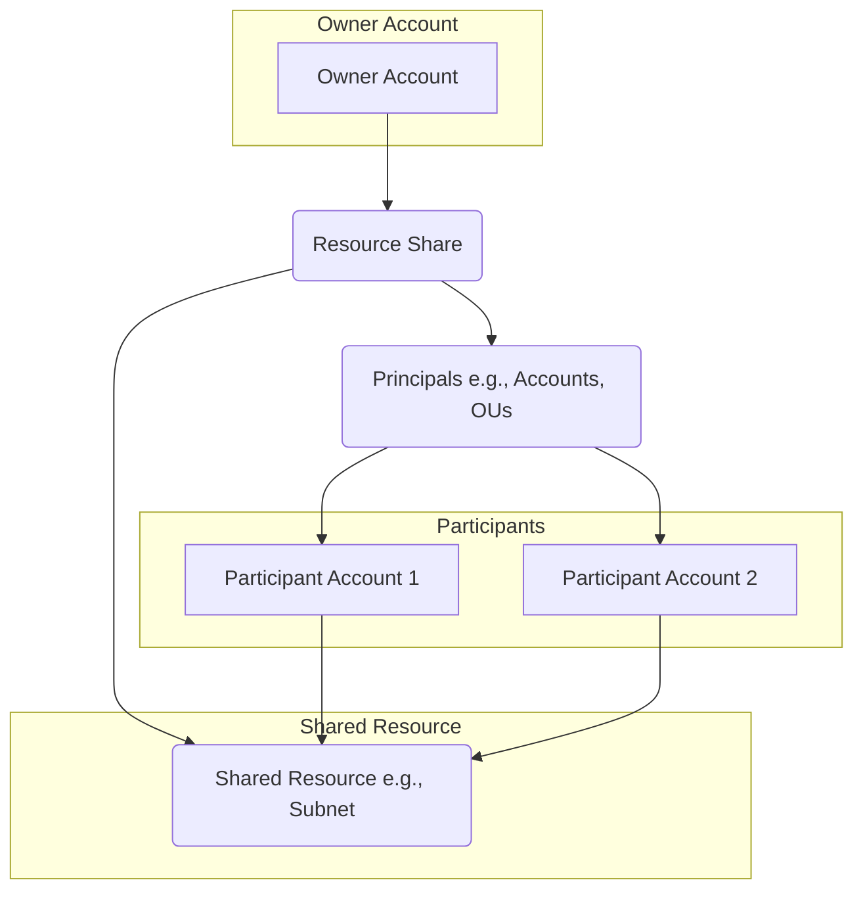
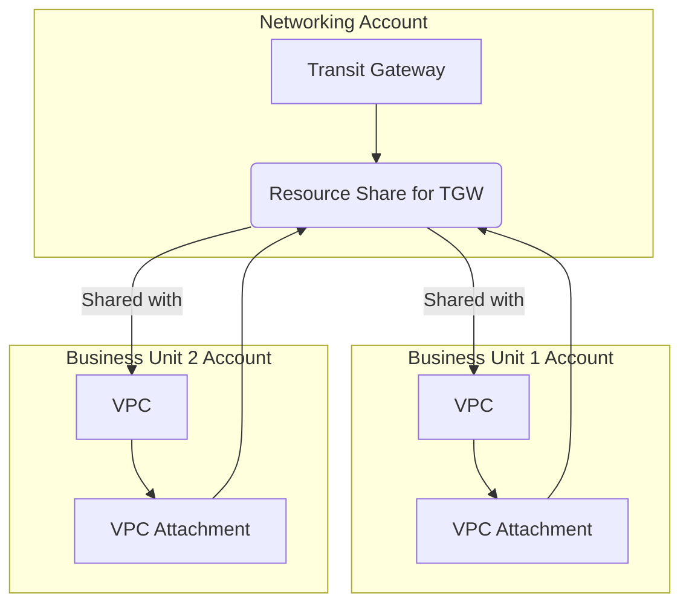

# Resource Access Manager (RAM)

## Resource Access Manager (RAM)

### 🌟 Overview: AWS Resource Access Manager (RAM) 🤝

AWS Resource Access Manager (RAM) is a free, managed service that makes it easy to securely share your AWS resources with any AWS account or within your AWS Organization. In a multi-account environment, it's a game-changer that centralizes the creation and management of key resources in a single "owner" account and allows other "participant" accounts to access and use them. This eliminates the need for resource duplication, reduces operational overhead, and helps enforce a consistent security and governance posture. With RAM, the shared resources appear as if they were provisioned directly in the participant accounts.

<figure><figcaption></figcaption></figure>

### # 🤖 Innovation Spotlight: Centralized Infrastructure Management

The most significant benefit of AWS RAM is its ability to enable a **centralized network hub and spoke model** without complex manual configurations. For instance, an organization can create a Transit Gateway in a dedicated networking account and share it with multiple application VPCs in different accounts. This allows all traffic to be routed through a central hub for inspection and management, simplifying network architecture, and improving security without building complex peering connections.

***

### ⚡ Problem Statement: Siloed Infrastructure in a Multi-Account Environment 🧱

Imagine **Global Tech Solutions**, a large, multi-national company with an AWS multi-account strategy. Each of their business units—Fintech, Healthcare, and E-commerce—has its own AWS account. Over time, this has led to a fragmented and inefficient infrastructure.

* **Duplication of Resources:** Each team is independently creating its own VPCs, subnets, and Transit Gateways. This leads to wasted resources and increased costs.
* **Operational Inefficiency:** Managing and updating network configurations across dozens of accounts is a nightmare. A simple change, like updating a route, requires manual intervention in every single account.
* **Lack of Standardization:** The different teams use inconsistent network layouts, security groups, and naming conventions, making it difficult to maintain a consistent security posture and troubleshoot issues.

### # 🤝 Business Use Cases

* **Shared Services:** Create a central account for shared services like a Transit Gateway, AWS Direct Connect, or a managed VPN connection. Share these resources with all other accounts in the organization to provide a consistent networking backbone.
* **Centralized Logging and Monitoring:** Share a centralized S3 bucket or a CloudWatch log group with other accounts to aggregate all logs and metrics in one place.
* **Shared Data Lakes:** Share access to a centralized Amazon S3 data lake or an Amazon Redshift cluster with data scientists and analysts in different accounts, enabling collaborative data analysis without duplicating data.
* **Disaster Recovery:** A centralized backup account can share resources, like an Amazon S3 bucket, for all other accounts to store their backups.

***

### 🔥 Core Principles: Sharing Resources with Principals 🗝️

AWS RAM operates on the principle of a **resource share**, which is the central object that defines what to share and with whom.

* **Resource Share:** A container for the resources you want to share. A resource share must contain at least one resource and at least one principal.
* **Resources:** The actual AWS services you want to share. This could be a VPC subnet, a Transit Gateway, a License Manager configuration, or a Route 53 private hosted zone, among others.
* **Principals:** The AWS accounts, Organizational Units (OUs), or an entire AWS Organization that you want to share the resources with. You can also share with IAM roles and users for certain resource types.
* **Managed Permissions:** AWS RAM uses managed permissions to define what actions the principals can perform on the shared resources. AWS provides a set of default managed permissions for each resource type, following the principle of least privilege. You can also create your own customer-managed permissions.

***

### 📋 Pre-Requirements 🛠️

* **An AWS Account:** You need an AWS account that owns the resources you want to share (the "owner" account).
* **AWS Organizations (Recommended):** For sharing resources across multiple accounts, especially with entire OUs, integration with AWS Organizations is highly recommended. You must enable resource sharing in the Organizations console first.
* **IAM Permissions:** The IAM user or role performing the actions must have permissions to create and manage resource shares and to access the resources to be shared.

***

### 👣 Implementation Steps: Sharing a VPC Subnet 🗺️

1. **Enable RAM in AWS Organizations:** If you are using AWS Organizations, navigate to the RAM console in your management account and enable resource sharing with AWS Organizations. This allows implicit acceptance of resource shares within the organization.
2. **Create a Resource Share:**
   * In the **owner account**, go to the AWS RAM console.
   * Click "Create a resource share."
   * Give it a name (e.g., `Shared-VPC-Subnets`).
3. **Add Resources:**
   * Under "Resources," select the resource type you want to share (e.g., "Subnets").
   * Select the specific subnets from your VPC that you want to make available to other accounts.
4. **Specify Principals:**
   * Under "Principals," select the accounts, OUs, or the entire organization you want to share with.
   * If you're sharing with accounts outside of your organization, you'll need to enter their AWS account IDs, and they will receive an invitation to accept the share.
5. **Review and Create:**
   * Review the details, including the managed permissions, and create the resource share.
6. **Access Shared Resources:**
   * In a **participant account** (e.g., the E-commerce team's account), the shared subnets will now appear in the VPC console under "Subnets" with the owner account ID.
   * The E-commerce team can now launch EC2 instances, RDS databases, or other resources directly into the shared subnets, even though the VPC and subnets are physically owned by the central account.

***

### 🗺️ Data Flow Diagram

**Diagram 1: How AWS RAM Works**

**Diagram 2: Centralized Networking with AWS RAM**

***

### 🔒 Security Measures 🚨

* **Least Privilege:** Use AWS-managed permissions or create your own to ensure principals only have the necessary permissions. For example, a shared subnet might only have permissions for `ec2:RunInstances`, not `ec2:DeleteSubnet`.
* **AWS Organizations Integration:** Use AWS Organizations to share resources with entire OUs, which simplifies management and automatically provides access to new accounts added to that OU.
* **Audit with CloudTrail:** AWS CloudTrail logs all AWS RAM API calls, providing an auditable history of who shared which resources and with whom.
* **Principle of Separation of Duties:** The owner account maintains full administrative control over the shared resources. Participant accounts can only use them based on the granted permissions, ensuring a clear separation of duties.

***

### ⚖️ When to use and when not to use

| ✅ When to Use                                                                                                                                                       | ❌ When Not to Use                                                                                                                                                                                                                      |
| ------------------------------------------------------------------------------------------------------------------------------------------------------------------- | -------------------------------------------------------------------------------------------------------------------------------------------------------------------------------------------------------------------------------------- |
| **Centralizing Infrastructure:** When you want to avoid duplicating network resources like VPCs, Transit Gateways, and subnets across multiple accounts.            | **Data with High Security Requirements:** For data that must reside exclusively within a single account for regulatory or security reasons (e.g., PII in a single account).                                                            |
| **Enforcing Standardized Configurations:** When you need to ensure all your development teams or business units use a consistent network or security configuration. | **Non-Supported Resource Types:** AWS RAM only supports a specific list of resources (e.g., VPC subnets, Transit Gateways, License Manager configurations, etc.). If your resource is not on this list, you can't use RAM to share it. |
| **Streamlining Management:** When you want to simplify operations and reduce the management overhead of a multi-account environment.                                | **For IAM Identity and Access:** RAM shares resources, not IAM users or roles. You should use AWS IAM Identity Center (formerly AWS SSO) to manage user access across accounts.                                                        |

***

### 💰Costing Calculation 💸

AWS Resource Access Manager is a **free service**. There are no additional charges for using AWS RAM or for creating and managing resource shares.

* You only pay for the **resources themselves** and any usage fees associated with them.
* For example, if you share a VPC subnet, you pay for the **compute instances and data transfer costs** within that subnet, as if they were in the owner's account.

### # **Efficient Way of Handling:**

* AWS RAM promotes cost efficiency by allowing you to provision resources once and share them, eliminating the need for expensive duplication.
* By using a centralized Transit Gateway, for instance, you can save money by not having to set up dozens of individual VPC peering connections.

***

### 🧩 Alternative services in AWS/Azure/GCP/On-Premise

| Service Name               | Cloud Provider | Key Comparison/Difference                                                                                                                                                                                                                                                                                                                        |
| -------------------------- | -------------- | ------------------------------------------------------------------------------------------------------------------------------------------------------------------------------------------------------------------------------------------------------------------------------------------------------------------------------------------------ |
| **AWS Organizations**      | **AWS**        | AWS Organizations is a central service for managing multiple accounts, creating a hierarchy with OUs, and applying Service Control Policies (SCPs). **RAM is a feature of Organizations** that enables resource sharing. You often use them together, but they are not alternatives to each other.                                               |
| **VPC Peering**            | **AWS**        | A network connection between two VPCs. This is a manual, one-to-one process. AWS RAM, used with Transit Gateway, is a one-to-many solution that scales more effectively and is easier to manage in large environments.                                                                                                                           |
| **Azure Resource Manager** | **Azure**      | Azure Resource Manager (ARM) is Azure's deployment and management service. While its name is similar, it's not a direct equivalent. **ARM templates** are used to deploy resources consistently, but cross-tenant resource sharing is handled differently, often through **Azure Lighthouse** or Service Provider accounts for managed services. |
| **Google Cloud IAM**       | **GCP**        | Google Cloud's Identity and Access Management (IAM) is used to manage permissions for principals. While it's used to grant access to resources, it is not a direct resource-sharing mechanism like AWS RAM. GCP handles multi-account/project resource management differently, often through shared VPCs.                                        |
| **On-Premise Solutions**   | **On-Premise** | On-premise resource sharing is typically handled through a combination of a private cloud, network segmentation, and Active Directory or LDAP for authentication and authorization. It requires manual provisioning and management of physical or virtual infrastructure, lacking the automated, centralized, and scalable nature of AWS RAM.    |

***

### ✅ Benefits 🎉

* **Cost Savings:** Avoids the cost of provisioning and maintaining duplicate resources across multiple accounts.
* **Simplified Management:** Centralizes the management of core resources, simplifying network and security administration.
* **Increased Agility:** Allows development teams to quickly deploy applications into a pre-configured and secure environment without waiting for manual network provisioning.
* **Improved Governance:** Enforces a consistent security and compliance posture by standardizing the shared infrastructure.
* **Scalability:** Scales effortlessly from a few accounts to thousands, leveraging AWS Organizations for central management.

***

### 📝 Summary 📝

AWS Resource Access Manager (RAM) is a fundamental service for any organization running a multi-account AWS environment. It allows you to create and manage key resources like subnets, Transit Gateways, and License Manager configurations in a central account and securely share them with other accounts. This eliminates resource duplication, reduces operational overhead, and promotes a standardized, scalable architecture. It is a free service, with costs only applying to the shared resources themselves.

**Top 5 Things to Keep in Mind:**

1. **It's a free service:** You are only charged for the resources you share, not for the act of sharing itself.
2. **RAM vs. Organizations:** RAM is often used in conjunction with AWS Organizations, which enables you to share with entire OUs, but it is not a replacement for it.
3. **Owner vs. Participant:** The owner account retains full control, while the participant account can only use the resource as defined by the permissions.
4. **Not for all resources:** Only a specific list of resource types can be shared via RAM, so check the documentation first.
5. **Audit Everything:** Use AWS CloudTrail to log and audit all RAM activities for security and compliance purposes.

***
