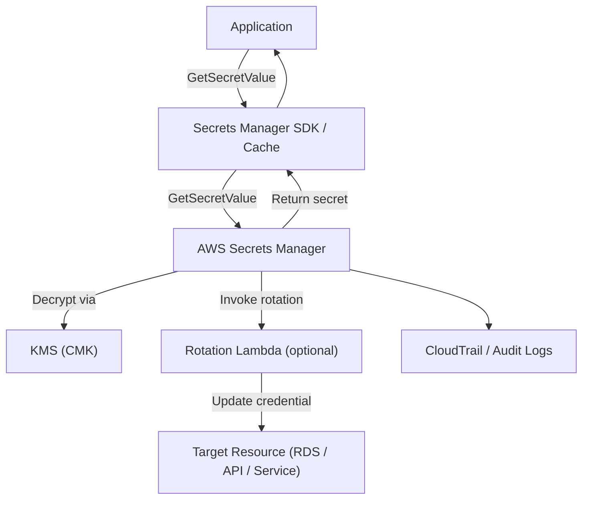
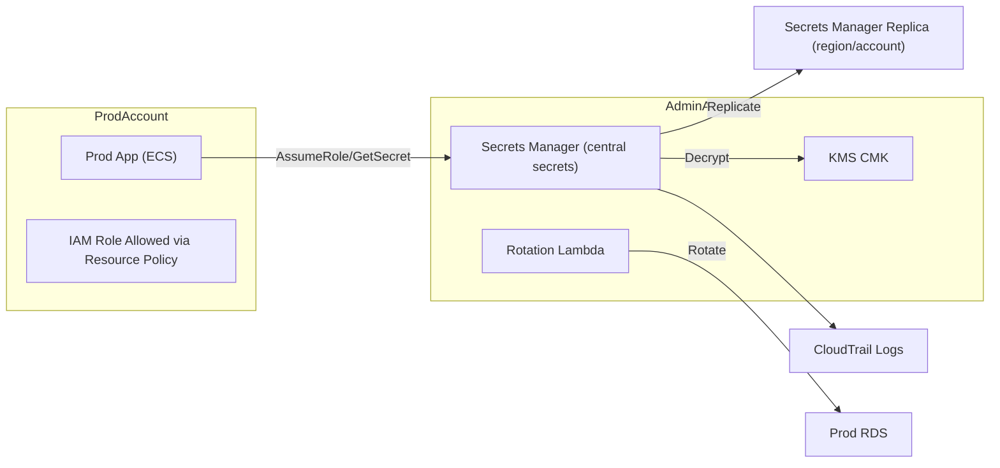
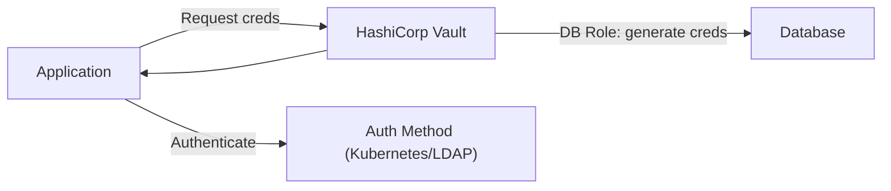

# Secrets Manager

## 🌟 AWS Secrets Manager&#x20;

**AWS Secrets Manager** is a fully managed service for storing, rotating, and tightly controlling access to secrets — e.g., database credentials, API keys, OAuth tokens, and SSH keys. **It provides automatic secrets rotation, fine‑grained IAM access, encryption with AWS KMS, versioning, and secure retrieval via SDKs and APIs**, reducing secret sprawl and human error.

<figure><figcaption></figcaption></figure>

### ✨Innovation Spotlight

* **Automated rotation for many AWS and custom targets** with built‑in Lambda rotation templates and enhanced secret-rotation scheduling.
* **Fine-grained resource-based policies + attribute-based access control (ABAC)** for per-secret access control.
* **Integrated replication** across regions for DR and lower-latency secret retrieval.
* **Higher-throughput GetSecretValue optimizations** and SDK caching guidance to reduce cost and latency.
* **Tighter integration with AWS IAM Identity Center and Amazon Security Lake** for auditability and centralized monitoring.

***

### ⚡ Problem Statement

Scenario: A SaaS company runs microservices across multiple AWS accounts and regions. Secrets (DB passwords, third-party API keys) are hard-coded, stored in code repos, or in Parameter Store with poor rotation policies. This causes security risks (leaked keys), operational friction (manual rotations), and compliance gaps.

Industries/applications:

* SaaS & fintech (database credentials, payment API keys)
* Healthcare (PHI access tokens)
* DevOps pipelines (CI/CD credentials)
* IoT (device credentials)
* Enterprises using cross-account services and federated access

2.1 🤝 Business Use Cases

* Centralize credentials for RDS, Redshift, MongoDB Atlas, third‑party APIs, and service accounts.
* Automate secret rotation (DB credentials or API tokens) with zero-downtime rotation workflows.
* Provide short-lived credentials for applications via dynamic secrets pattern (rotate often, revoke if compromised).
* Securely inject secrets into ECS/EKS tasks, Lambda functions, and EC2 instances.
* Enforce audit trails and meet compliance (e.g., PCI, SOC2) with encryption and CloudTrail logs.

***

### 🔥 Core Principles

* Secure storage: Secrets are stored encrypted using AWS KMS customer-managed or AWS-managed CMKs. Secrets Manager never exposes plaintext in logs unless explicitly retrieved.
* Fine-grained access control: Use IAM policies and resource-based policies to control which principals can retrieve, rotate, or manage secrets.
* Automatic rotation: Built-in rotation workflows via Lambda enable scheduled, atomic rotations while updating target services.
* Versioning and staging labels: Secrets support multiple versions with staging labels (AWSCURRENT, AWSPREVIOUS) enabling safe rollbacks.
* Replication: Optional cross-region replication for resilience and locality.
* Integration points: SDK (AWS SDKs/CLI), Secrets Manager cache libraries, AWS Lambda rotation functions, Amazon RDS integration (built-in rotation), Amazon EKS/ECS integration via Secrets Manager support, SSM Parameter Store (when appropriate).
* Auditability: API calls are logged via AWS CloudTrail; use CloudWatch Events/EventBridge for change notifications.
* Secret types: arbitrary key-value, binary blobs, SOAP/REST tokens, database credentials (username/password object), and text strings.

Key resources/terms:

* Secret — the top-level resource storing secret data and metadata.
* SecretString / SecretBinary — stored secret payload forms.
* Version — each secret change creates a new version (versionId + staging labels).
* Staging labels — AWSCURRENT, AWSPENDING, AWSPREVIOUS used for rotation lifecycle.
* Rotation Lambda — a Lambda function that implements create/set/test/finish rotation steps.
* KMS Key — CMK used to encrypt secret material.
* Resource policy — secrets-specific resource policy to allow cross-account retrieval.
* Replication configuration — rules to replicate secrets to other regions.
* GetSecretValue — API used by apps to retrieve plaintext secrets.
* Secret caching library — SDK-side cache to reduce API calls and costs.

***

### 📋 Pre-Requirements

* AWS account(s) & IAM permissions to create and manage Secrets Manager resources.
* KMS CMK (AWS-managed or customer-managed) for encryption.
* Lambda execution role and permissions to manage target resources (for rotation).
* VPC configuration (if rotation Lambda needs access to RDS in private subnets) — Lambda in VPC or access via RDS Data API for serverless DBs.
* Target system credentials or API for rotation (e.g., DB user with permissions to create/rotate user/password).
* CI/CD/Deployment tooling (ECS task role, EKS service account, Lambda execution role) configured to retrieve secrets.
* CloudTrail enabled for audit logging.
* Optional: AWS Config rules, Security Hub, Amazon Security Lake for compliance/monitoring.

***

### 👣 Implementation Steps

1. Plan secret design
   * Identify secret types, rotation cadence, access principals, and KMS key.
   * Decide per-environment secrets (prod/staging/dev) and cross-account patterns.
2. Create KMS key
   * Create or choose CMK with key policy allowing Secrets Manager and authorized principals to use it.
3. Create secret
   * Console / CLI / SDK:
     * Provide name (e.g., prod/db/mydb), optional description and tags.
     * Store SecretString as JSON or plaintext (e.g., {"username":"app","password":"P@ssw0rd"}).
     * Choose encryption key.
4. Set resource policy (optional cross-account)
   * Add resource-based policy to allow other accounts or principals to GetSecretValue.
5. Enable automatic rotation (recommended)
   * Use built-in rotation templates for RDS or provide custom rotation Lambda:
     * Rotation Lambda should implement createSecret, setSecret, testSecret, finishSecret handlers.
     * Assign Lambda an IAM role that can modify target credentials (DB, API, etc.).
     * Configure rotation schedule (e.g., 30 days).
6. Integrate with applications
   * Use AWS SDKs to call GetSecretValue in application code or use Secrets Manager caching client (for Java/Python/.NET).
   * For ECS/EKS: use native Secrets Manager integrations (ECS task definitions, Kubernetes External Secrets / Secrets Store CSI Driver).
   * For Lambda: fetch secrets at cold start or use cached client.
7. Minimize secret exposure
   * Avoid logging secrets; ensure application logging filters secret values.
   * Use environment variables only for secret reference tokens, not plaintext secrets.
8. Test rotation and failover
   * Validate rotation Lambda updates both the secret and the target credential reliably and that AWSCURRENT points correctly.
   * Test rollback: ensure AWSPREVIOUS can be promoted if rotation fails.
9. Monitor & Audit
   * Enable CloudTrail logging for all Secrets Manager APIs.
   * Set EventBridge rules to notify on secret changes, rotation failures, or replication events.
   * Use CloudWatch metrics (number of API calls, rotation errors) and alarms.
10. Operationalize

* Tag secrets for ownership, compliance classification, cost allocation.
* Define lifecycle: retire / schedule deletion (secret deletion window up to 30 days).
* Regularly review resource policies, secrets usage, and rotate non-automated secrets.

***

### 🗺️ Data Flow Diagrams

Diagram 1 — How Secrets Manager works (core flow)



Diagram 2 — Example use case: Multi-account central secrets with cross-account access & rotation



```mermaid
flowchart LR
  subgraph AdminAccount
    SM_Admin[Secrets Manager (central secrets)]
    KMS_Admin[KMS CMK]
    RotationLambda[Rotation Lambda]
  end
  subgraph ProdAccount
    AppProd[Prod App (ECS)]
    IAMRoleProd[IAM Role Allowed via Resource Policy]
  end
  SM_Admin -->|Replicate| SM_Replica[Secrets Manager Replica (region/account)]
  AppProd -->|AssumeRole/GetSecret| SM_Admin
  SM_Admin -->|Decrypt| KMS_Admin
  RotationLambda -->|Rotate| TargetDB[Prod RDS]
  SM_Admin --> CloudTrail[CloudTrail Logs]
```

***

### 🔒 Security Measures

* Use a customer-managed KMS CMK with strict key policy and key rotation enabled; restrict CMK usage to specific principals.
* Apply least-privilege IAM: grant GetSecretValue only to principals that need it; separate manage/rotate permissions from retrieve permissions.
* Use resource-based policies for controlled cross-account access rather than broad IAM roles when appropriate.
* Use staging labels and versioning: require AWSCURRENT moves only after successful update verification in rotation Lambda.
* Store only minimal required secret material; prefer ephemeral tokens and short rotation intervals.
* Protect Lambdas used for rotation: VPC placement, secure environment variables, and least-privilege roles.
* Avoid embedding secrets in code or logs; enforce logging filters and code-review checks.
* Enable CloudTrail and monitor Secret-related API usage with alerts for anomalous access.
* Use Secrets Manager replication to keep secrets in-region for DR while protecting access with region-scoped IAM/KMS.
* Consider MFA-protected IAM principals for highly sensitive manual secret access.

***

### ✅ When to use and when not to use

* ✅ When to use:
  * You need managed secret storage with automatic rotation and auditability.
  * Applications require secure programmatic retrieval of credentials (RDS, third-party APIs).
  * You need cross-account secret sharing with fine-grained resource policies.
  * You require versioning, staging labels, and safe rotation workflows.
* ❌ When not to use:
  * Extremely high-volume, short-lived secrets for which an in-memory token service or ephemeral credential provider (like STS) is more efficient.
  * Use cases demanding host-level secret injection only at boot where a local vault (HashiCorp Vault) with agent-side caching is preferred.
  * Environments that must avoid any managed service storing secret contents (policy or regulatory constraints).

***

### 💰 Costing Calculation

How costs are calculated:

* Secrets Manager pricing components:
  * Monthly per-secret charge (per secret stored).
  * Per-10,000 API calls or per-API-call pricing for GetSecretValue? (historically Secrets Manager billed a per-secret monthly fee and additional charges per 10,000 API calls; verify current region pricing).
  * Additional KMS API usage and KMS key costs (per-decrypt charges).
  * Lambda, Data Transfer, and replication charges if used.

Efficient handling tips:

* Cache secrets in application (use Secrets Manager client cache) to reduce GetSecretValue calls and lower API costs.
* Consolidate related keys into a single secret JSON to reduce per-secret monthly charges, but balance with rotation requirements (rotating different credentials independently may require separate secrets).
* Use short-lived tokens where possible (AWS STS, RDS IAM auth) to reduce reliance on stored long-lived secrets.
* Use replication selectively (only to regions needed) to avoid extra replication costs.

Sample calculation (illustrative — replace with current AWS rates):

* Per-secret monthly fee: $0.40/secret-month (example)
* API request rate: 1,000 GetSecretValue calls/day → 30,000/month
* If API calls priced at $0.05 per 10k calls (example): 3 \* $0.05 = $0.15/month
* KMS decrypts: 30,000 decrypts/month @ $0.03 per 10k = 3 \* $0.03 = $0.09/month
* Secrets count: 10 secrets → 10 \* $0.40 = $4.00/month
* Total ≈ **$4.24 / month** (plus Lambda rotation, replication, and data transfer).\
  Note: Replace example unit prices with current AWS regional pricing for precise estimates.

***

### 🧩 Alternative services (AWS / Azure / GCP / On-Premise)

| Category             |                                        AWS Secrets Manager |             AWS Systems Manager Parameter Store (SecureString) |                                         Azure Key Vault |                              GCP Secret Manager | On-Premise Alternative                               |
| -------------------- | ---------------------------------------------------------: | -------------------------------------------------------------: | ------------------------------------------------------: | ----------------------------------------------: | ---------------------------------------------------- |
| Primary use          | Managed secrets storage, rotation, replication, versioning | Secure parameter storage (no built-in rotation or replication) | Secrets & key management with rotation & access control | Secrets storage with versions, replication, IAM | HashiCorp Vault, CyberArk, Thycotic, self-hosted K/V |
| Rotation             |                     Built-in automatic rotation via Lambda |                 No native rotation (can script via Lambda/SSM) | Managed rotation (Key Vault + Managed HSM integrations) |             Supports rotation via API/workflows | Vault offers dynamic secrets & leases                |
| Cross-account access |                                Resource policies supported |                     Cross-account possible via IAM but limited |                              Supported via RBAC and AAD |                      Supported via IAM policies | More custom; network-level controls                  |
| Cost                 |                                 Per-secret + API/KMS costs |                     Free tier; lower cost but limited features |                    Per-operation & key management costs |                    Per-secret & per-access cost | Operational & licensing overhead                     |
| Strengths            |  Automatic rotation templates, staging labels, replication |              Good for low-cost config + secrets for simple use |        Enterprise-grade secrets + keys w/ Azure AD ties |          Native GCP integration and replication | Dynamic secrets, plugins, full control               |
| Weaknesses           |                    Higher cost at scale vs Parameter Store |                            Lacks rotation/replication features |           Azure-centric; cross-cloud integration needed |                GCP-centric; different IAM model | Operational complexity, high maintenance             |

On-premise alternative data flow (Mermaid — example HashiCorp Vault with dynamic DB creds)



***

### ✅ Benefits

* **Automatic rotation** reduces credential exposure risk and operational overhead.
* **Fine-grained access control** and resource policies for secure retrieval and cross-account sharing.
* **Encrypted at rest by KMS** and auditable via CloudTrail.
* **Versioning & staging labels** for safe rollouts and rollbacks.
* **Integration-ready** with Lambda, ECS/EKS, RDS, SDKs, and replication for DR.

***

### 🔁 Innovation & Example (Dynamic DB Rotation)

* Innovation: **Rotation Lambda templates with zero-downtime rotation** and cross-region replication enable resilient, automated credential lifecycle management.
* Example: Secrets Manager rotates an RDS user's password via rotation Lambda. AWSCURRENT is updated only after Lambda verifies the new password works, ensuring app continuity.

***

### 📝 Summary

Takeaway: **AWS Secrets Manager centrally secures, rotates, version-controls, and audits secrets with KMS encryption and integrated rotation workflows — reducing risk and operational burden of secret management.**

<details>

<summary>Top things to keep in mind</summary>

1. Use customer-managed KMS keys for stronger control and restrict key usage.
2. Implement least-privilege IAM and resource policies; separate retrieve vs manage permissions.
3. Enable automatic rotation where supported; implement robust rotation Lambda with idempotent handlers.
4. Cache secrets in clients to reduce GetSecretValue/KMS decrypt costs and latency.
5. Use staging labels (AWSCURRENT/AWSPENDING) and test rotations before enabling in production.
6. Tag secrets for ownership, environment, and compliance; enforce naming conventions.
7. Monitor CloudTrail for anomalous secret access and set EventBridge alerts.
8. For dynamic secrets/ephemeral needs, prefer STS/RDS IAM auth or Vault-style dynamic creds.
9. Use replication for DR but limit to required regions to control costs.
10. Plan lifecycle (rotation cadence, retirement, scheduled deletion windows).

</details>


> In short: AWS Secrets Manager stores and encrypts secrets, supports automatic rotation via Lambda, provides versioning and staging labels for safe rollouts, and enforces fine-grained access with IAM and resource policies. It’s designed to centralize secret lifecycle management, improve security posture, and integrate with AWS services and automation.

***

### 🔗 Related Topics

* AWS KMS (Customer Managed Keys)
* AWS IAM (roles, policies, ABAC)
* AWS Lambda rotation templates & best practices
* Amazon RDS IAM Authentication (for short-lived DB creds)
* AWS Systems Manager Parameter Store (SecureString comparative)
* HashiCorp Vault (dynamic secrets / self-hosted alternative)
* AWS EventBridge & CloudWatch for monitoring and alerts

> 🛠️ 🔐 AWS Secrets Manager — adopt automated rotation, enforce least privilege, cache wisely, and audit accesses for robust secret lifecycle security.
