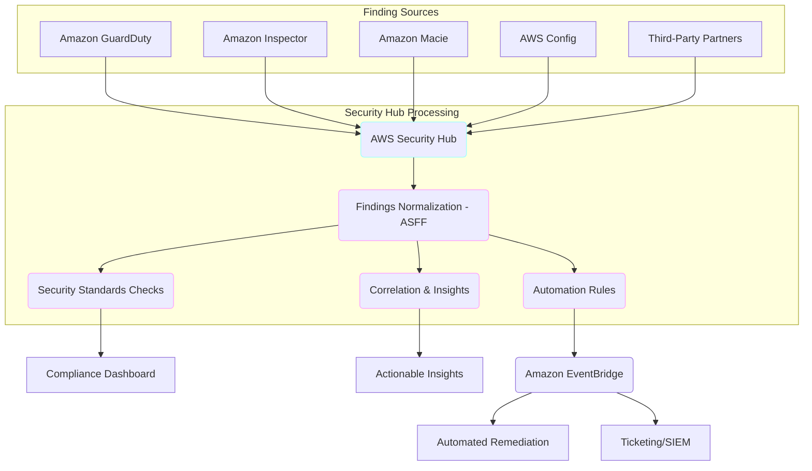
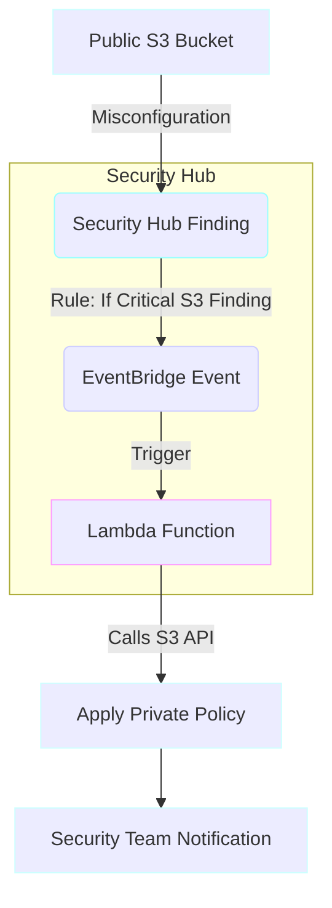

# Security Hub

## Security Hub

### 🌟 Overview: AWS Security Hub 🛡️

AWS Security Hub is a cloud security posture management (CSPM) service that gives you a comprehensive view of your security alerts and security posture across your AWS accounts. It works as a central security command center, aggregating, organizing, and prioritizing security findings from various AWS services (like Amazon GuardDuty, Amazon Inspector, Amazon Macie, and AWS IAM Access Analyzer) and third-party security products. Security Hub's value lies in its ability to normalize these findings into a standard format, allowing for centralized management, automated checks against security standards (e.g., CIS AWS Foundations Benchmark, AWS Foundational Security Best Practices), and automated remediation.

<figure><figcaption></figcaption></figure>

### # 🤖 Innovation Spotlight: Attack Path Analysis & Contextualization

The latest innovation in AWS Security Hub focuses on **contextualizing and enriching security findings** to help you prioritize and respond to critical issues more effectively. Instead of presenting a long, flat list of alerts, Security Hub now correlates findings from multiple services (e.g., a vulnerability from Inspector, a misconfiguration from Security Hub CSPM, and a threat from GuardDuty) to identify a potential **"attack path."** This graphical visualization shows how a misconfiguration could be exploited by a threat, helping you understand the real-world impact of a security issue. This transforms raw findings into actionable intelligence, reducing the time and expertise needed to identify and address the most critical risks.

***

### ⚡ Problem Statement: Security Alert Fatigue 😵

Consider **FusionCorp**, a fast-growing tech company with a multi-account AWS environment. Their security team is a small, dedicated group that faces a daily deluge of security alerts from various sources:

* **Amazon GuardDuty** flags potential threats.
* **Amazon Inspector** reports on software vulnerabilities in EC2 instances.
* **Amazon Macie** finds sensitive data in S3 buckets.
* **AWS Config** checks for resource misconfigurations.

The security analysts are overwhelmed. They spend most of their time manually sifting through thousands of raw findings, trying to correlate them and figure out what to prioritize. This leads to **alert fatigue**, and the most critical security issues—those that could lead to a breach—might get missed in the noise. They need a way to centralize, normalize, and prioritize these findings to act on the most critical threats first.

### # 🤝 Business Use Cases

* **Cloud Security Operations:** A central dashboard for security analysts to monitor the overall security posture, investigate incidents, and respond to threats in a unified way.
* **Compliance and Auditing:** Continuously monitor compliance against industry standards like CIS, PCI DSS, or NIST, generating reports that streamline the audit process.
* **Security Automation:** Automatically trigger remediation actions for common security findings, reducing the mean time to resolution and freeing up security teams for more complex tasks.
* **Third-Party Integration:** Ingest findings from third-party security tools (e.g., SIEM, ticketing systems, vulnerability scanners) into a single, standardized dashboard.

***

### 🔥 Core Principles: Aggregation, Normalization, and Automation 🧩

* **Findings:** The fundamental unit of information in Security Hub. Findings are security alerts or compliance violations. They are normalized into a standard **AWS Security Finding Format (ASFF)**, which makes it easy to consume and process data from different sources.
* **Security Standards:** These are a set of security best practices or compliance controls. Security Hub continuously runs automated checks against these standards.
  * **AWS Foundational Security Best Practices:** A set of checks created by AWS security experts.
  * **CIS AWS Foundations Benchmark:** Industry-recognized best practices for securing AWS accounts.
  * **Payment Card Industry Data Security Standard (PCI DSS):** For organizations handling cardholder data.
* **Insights:** A collection of related findings that help you identify security issues that are specific to your environment. You can use default insights or create your own.
* **Automation Rules:** Security Hub's built-in automation allows you to automatically update or suppress findings and send them to Amazon EventBridge based on criteria you define (e.g., severity, resource type). This is a powerful feature for automating a response.
* **Integration Partners:** Security Hub is a hub for a reason. It has deep integrations with a vast ecosystem of AWS services and third-party security products, which can both send and receive findings.

***

### 📋 Pre-Requirements 🛠️

* **An AWS Account:** With appropriate IAM permissions to enable and configure Security Hub.
* **AWS Organizations (Recommended):** For managing Security Hub across a multi-account environment. You can designate a single administrator account to manage findings for all other member accounts.
* **Other AWS Security Services:** To get the most out of Security Hub, you should enable other security services like Amazon GuardDuty, Amazon Inspector, and Amazon Macie, as these are the primary sources of findings.

***

### 👣 Implementation Steps: Centralizing Security Findings 🌐

1. **Enable Security Hub:**
   * In the AWS Management Console, navigate to the Security Hub service.
   * Click "Go to Security Hub" and then "Enable Security Hub."
   * If using AWS Organizations, you can designate a delegated administrator account to manage Security Hub for your entire organization.
2. **Enable Integrated Services:**
   * Go to the "Integrations" section in the Security Hub console.
   * Enable integrations for AWS services like **GuardDuty**, **Inspector**, and **Macie**. This allows these services to automatically send their findings to Security Hub.
3. **Enable Security Standards:**
   * Go to "Security standards" in the console.
   * Select the standards you want to monitor, such as the "AWS Foundational Security Best Practices" or "CIS AWS Foundations Benchmark." Security Hub will immediately start running checks.
4. **Create Automation Rules (Optional but Recommended):**
   * Go to "Automation rules" and click "Create rule."
   * Define a rule to automatically suppress low-severity findings. For example, if a finding has a severity of `LOW` and a specific workflow status, automatically change its status to `SUPPRESSED`.
   * Another powerful use is to trigger a custom action. For instance, if a `CRITICAL` finding is detected (e.g., a public S3 bucket), use EventBridge to trigger a Lambda function that automatically applies a bucket policy to make it private.
5. **Monitor the Dashboard:**
   * The Security Hub dashboard provides a high-level view of your security posture, including the number of findings by severity, compliance status, and insights.
   * Drill down into specific findings to view details, recommended remediation steps, and to take action.

***

### 🗺️ Data Flow Diagram

**Diagram 1: Security Hub Data Flow**

**Diagram 2: Automated Remediation Workflow**

***

### 🔒 Security Measures 🚨

* **IAM Least Privilege:** Use IAM policies to restrict who can enable, disable, and modify Security Hub settings and findings.
* **Designated Administrator Account:** In a multi-account setup, designate a single, trusted account as the Security Hub administrator. This account will have a centralized view of all findings across the organization, simplifying management and security.
* **Cross-Region Aggregation:** For a global view, configure cross-region aggregation in Security Hub to consolidate findings from all AWS regions into a single home region.
* **Automation with EventBridge:** Use automation rules with EventBridge to not only suppress findings but also to trigger automated remediation workflows, reducing human error and response time.
* **Integration with SIEM/SOAR:** Integrate Security Hub with your existing Security Information and Event Management (SIEM) or Security Orchestration, Automation, and Response (SOAR) solutions to centralize security operations and analysis.

***

### ⚖️ When to use and when not to use

| ✅ When to Use                                                                                                                               | ❌ When Not to Use                                                                                                                                                                                            |
| ------------------------------------------------------------------------------------------------------------------------------------------- | ------------------------------------------------------------------------------------------------------------------------------------------------------------------------------------------------------------ |
| **Consolidating Findings:** When you need a single dashboard to view security findings from multiple AWS services and third-party tools.    | **As a Standalone Service:** Security Hub's primary value comes from aggregating findings from other services. It's not a replacement for services like GuardDuty or Inspector; rather, it complements them. |
| **Auditing & Compliance:** When you need to continuously monitor your AWS environment against industry standards like CIS or PCI DSS.       | **For Manual Security Checks:** If you only need to run ad-hoc, manual security checks, AWS Config or open-source tools might be sufficient.                                                                 |
| **Automating Security Workflows:** When you want to automate the process of triaging, suppressing, or remediating common security findings. | **For Threat Hunting:** While Security Hub provides findings, a service like Amazon Detective is a better choice for in-depth, graph-based security investigation and threat hunting.                        |
| **Centralizing Multi-Account Security:** For organizations with a multi-account strategy that want a unified security view and management.  | **For Non-AWS Resources:** Security Hub's native checks and integrations are for AWS resources. For a multi-cloud or hybrid-cloud security solution, you'll need a third-party CSPM.                         |

***

### 💰Costing Calculation 💸

AWS Security Hub pricing is based on two main components:

1. **Security Checks:** The number of automated checks that Security Hub performs against your resources for a given standard.
2. **Finding Ingestion Events:** The number of security findings ingested from integrated services and third-party products.

* There's a generous **free tier** of 10,000 findings per account per region per month.
* After the free tier, the cost is a few cents per 10,000 findings. The cost per check is tiered and decreases as the volume increases.

### # **Efficient Way of Handling:**

* **Be Selective with Standards:** Only enable the security standards and controls that are relevant to your business. Disabling irrelevant checks can reduce your costs.
* **Manage Member Accounts:** In a multi-account setup, ensure all accounts are linked to the central administrator account. This allows you to manage costs and configurations centrally.
* **Fine-Tune Integrations:** If a third-party tool generates a very high volume of low-value findings, consider filtering them before they are sent to Security Hub to save on ingestion costs.

### # **Sample Calculation (US East - N. Virginia)**

* **Scenario:** A company has one AWS account and enables Security Hub.
  * Security Hub performs 500,000 security checks per month.
  * It ingests 20,000 security findings from GuardDuty and Inspector.
* **Security Checks Cost:**
  * First 100,000 checks: 100,000 \* $0.0010 per check = $100.00
  * Next 400,000 checks: 400,000 \* $0.0008 per check = $320.00
  * **Total Checks Cost:** $100.00 + $320.00 = **$420.00**
* **Finding Ingestion Cost:**
  * Ingestion events: 20,000
  * Free Tier: 10,000 events
  * Chargeable events: 10,000 events
  * Cost per event: $0.00003
  * **Total Ingestion Cost:** 10,000 \* $0.00003 = **$0.30**
* **Total Monthly Cost:** $420.00 (checks) + $0.30 (ingestion) = **$420.30**

***

### 🧩 Alternative services in AWS/Azure/GCP/On-Premise

| Service Name                                                       | Cloud Provider          | Key Comparison/Difference                                                                                                                                                                                                                                                                                                |
| ------------------------------------------------------------------ | ----------------------- | ------------------------------------------------------------------------------------------------------------------------------------------------------------------------------------------------------------------------------------------------------------------------------------------------------------------------ |
| **AWS Config**                                                     | **AWS**                 | AWS Config continuously monitors and records your AWS resource configurations and allows you to audit them against desired configurations. It is the underlying engine for many of Security Hub's compliance checks, but it is not a centralized security dashboard for all findings.                                    |
| **Microsoft Defender for Cloud**                                   | **Azure**               | A Cloud-Native Application Protection Platform (CNAPP) that provides security posture management and threat protection for Azure, multi-cloud, and on-premises environments. It is a direct competitor, offering a unified security view, vulnerability management, and threat intelligence.                             |
| **Google Cloud Security Command Center**                           | **GCP**                 | GCP's centralized security and risk management platform. It aggregates security findings from various GCP services and partners, similar to Security Hub, allowing for a single pane of glass for security operations.                                                                                                   |
| **Third-Party CSPMs (e.g., Wiz, Palo Alto Networks Prisma Cloud)** | **Multi-Cloud/On-Prem** | These are multi-cloud and hybrid-cloud solutions that provide a single platform to manage security posture, vulnerability, and threat detection across AWS, Azure, GCP, and on-premises environments. They often offer more advanced features like agent-based workload protection and data security posture management. |

***

### ✅ Benefits 🎉

* **Centralized Visibility:** A single pane of glass for all your security alerts and compliance status.
* **Actionable Insights:** Normalizes and prioritizes findings, turning a flood of alerts into a manageable list of actionable insights.
* **Automated Auditing:** Continuously monitors your environment against security standards, simplifying compliance efforts.
* **Operational Efficiency:** Reduces security alert fatigue and enables automated remediation, freeing up security teams to focus on high-priority threats.
* **Ecosystem Integration:** Seamlessly integrates with a wide range of AWS and partner security services.

***

### 📝 Summary 📝

AWS Security Hub is an essential service for managing your cloud security posture. It acts as a security command center, aggregating findings from various services, normalizing them into a standard format, and helping you prioritize and respond to critical issues. By automating security checks and enabling integrated remediation workflows, Security Hub empowers security teams to maintain a strong security and compliance posture with less manual effort and a clearer view of their risks.

**Top 5 Things to Keep in Mind:**

1. **It's an aggregator, not a detector:** Its value is in centralizing findings from other services. You must enable those services to get a rich data set.
2. **ASFF is key:** The AWS Security Finding Format (ASFF) is what makes findings from different sources understandable in a single console.
3. **Use it with AWS Organizations:** Centralizing management with a delegated administrator account is the best practice for multi-account environments.
4. **Automation saves time and money:** Use EventBridge and automation rules to automatically handle low-priority findings and trigger remediation for high-priority ones.
5. **Cost is based on volume:** Be mindful of the number of security checks and ingested findings as they directly impact your monthly bill.

***

### 🔗 Related Topics

* **Amazon GuardDuty:** A threat detection service that monitors for malicious activity and unauthorized behavior.
* **Amazon Inspector:** A vulnerability management service that scans for software vulnerabilities and unintended network exposure.
* **Amazon Macie:** A data security and privacy service that uses machine learning to discover and protect sensitive data.
* **AWS Control Tower:** A service that helps you set up and govern a secure, multi-account AWS environment.
* **AWS Config:** A service that provides a detailed inventory of your AWS resources and their configurations.
