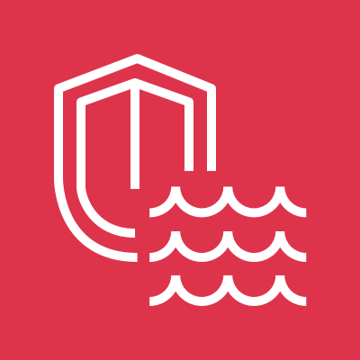
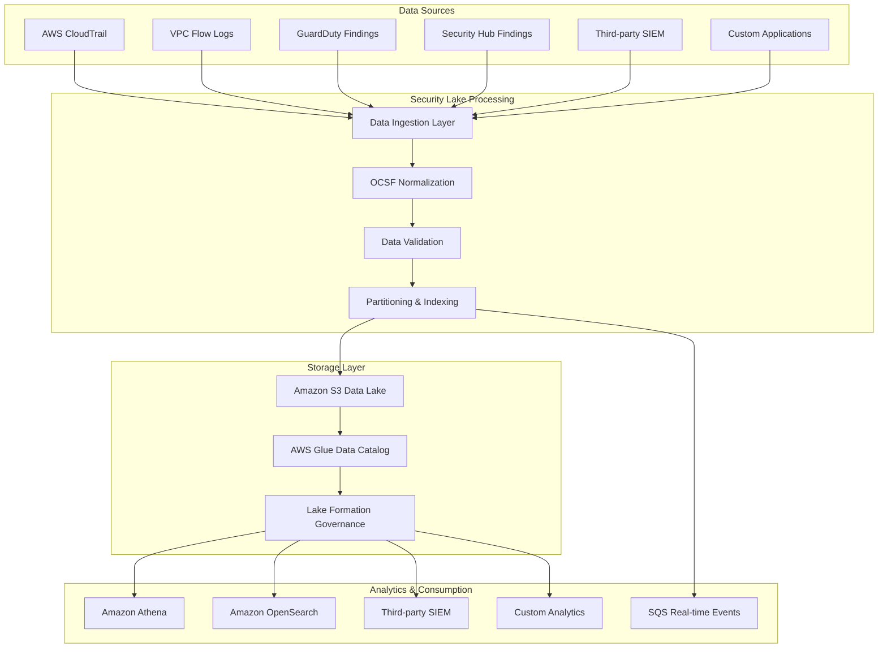
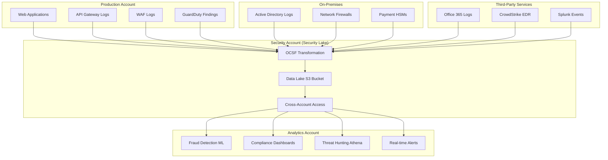
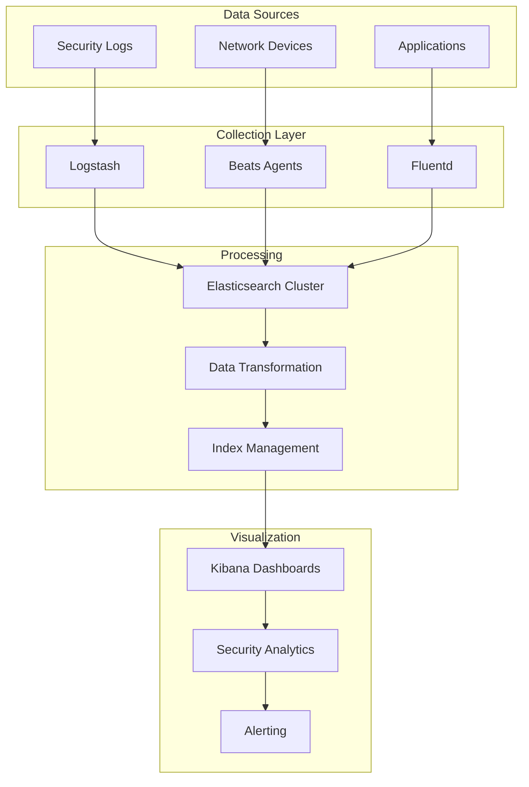

# Security Lake

## 🛡️ AWS Security Lake: Centralized Security Data Analytics at Cloud Scale

### 🌟 Overview

**Amazon Security Lake** is a purpose-built data lake service that automatically centralizes security data from AWS environments, SaaS providers, on-premises sources, and cloud sources into a customer-owned data lake stored in their account. It normalizes security data into the **Open Cybersecurity Schema Framework (OCSF)** format, enabling unified security analytics, threat detection, and incident response across your entire digital ecosystem.

<figure><figcaption></figcaption></figure>

#### Deep Dive Architecture

Security Lake acts as a centralized repository that ingests, transforms, and stores security logs and events from multiple sources. It leverages Amazon S3 for storage, AWS Glue for data cataloging, and integrates seamlessly with analytics services like Amazon Athena, Amazon OpenSearch, and third-party SIEM solutions.

#### 🤖 Innovation Spotlight 2024

* **OCSF 1.3 Support** with enhanced threat intelligence integration
* **Custom Source Integration** now supports 200+ third-party security tools
* **Real-time Analytics** with sub-second query performance for threat hunting
* **AI-Powered Anomaly Detection** using Amazon Bedrock integration
* **Multi-Region Replication** for global security operations centers

### ⚡ Problem Statement

**Scenario**: A multinational financial services company operates across multiple cloud providers, on-premises data centers, and uses 50+ security tools. Their security team struggles with:

* Fragmented security data across silos
* Different log formats causing analysis delays
* Manual correlation taking hours during incidents
* Compliance reporting requiring weeks of data aggregation
* Inability to detect sophisticated multi-stage attacks spanning different environments

#### Real-World Case Study

**Global Bank XYZ** implemented Security Lake to consolidate security data from:

* 500+ AWS accounts across 15 regions
* Microsoft 365 and Google Workspace logs
* On-premises Active Directory and network devices
* Third-party security tools (CrowdStrike, Splunk, Palo Alto)

**Result**: Reduced incident response time from 4 hours to 15 minutes, achieved real-time compliance reporting, and detected 300% more sophisticated threats.

### 🤝 Business Use Cases

#### Industries & Applications

**Financial Services**

* PCI DSS compliance monitoring
* Fraud detection across payment systems
* Real-time transaction monitoring

**Healthcare**

* HIPAA compliance reporting
* Medical device security monitoring
* Patient data access auditing

**Retail/E-commerce**

* Customer data protection
* Supply chain security monitoring
* Payment fraud prevention

**Government/Defense**

* FedRAMP compliance
* National security threat analysis
* Critical infrastructure protection

### 🔥 Core Principles

#### Foundational Concepts

**1. Data Lake Architecture**

* **Centralized Storage**: Single source of truth for security data
* **Schema-on-Read**: Flexible data analysis without predefined schemas
* **Scalable Storage**: Petabyte-scale capacity with S3

**2. Open Cybersecurity Schema Framework (OCSF)**

* **Standardization**: Unified data format across all sources
* **Interoperability**: Seamless integration with security tools
* **Extensibility**: Custom schema extensions for specific needs

**3. Multi-Source Integration**

* **Native AWS Sources**: CloudTrail, VPC Flow Logs, GuardDuty, Security Hub
* **Third-Party Sources**: Splunk, CrowdStrike, Palo Alto Networks, Microsoft Sentinel
* **Custom Sources**: On-premises SIEM, network devices, applications

#### Core Components Explained

**Security Lake Regions**

* Primary regions where data lake is established
* Cross-region replication for disaster recovery

**Data Sources**

* **AWS Native**: Automatic collection from AWS security services
* **Custom Sources**: API-based integration for third-party tools
* **Subscriber Sources**: Partner integrations via AWS Marketplace

**Subscribers**

* **Query-based**: Amazon Athena, Amazon OpenSearch
* **SQS-based**: Real-time event processing
* **Lake Formation**: Advanced data governance and access control

**Rollup Regions**

* Centralized data aggregation from multiple Security Lake regions
* Simplified multi-region security operations

### 📋 Pre-Requirements

| Service/Tool           | Purpose                                 | Mandatory/Optional |
| ---------------------- | --------------------------------------- | ------------------ |
| **AWS Organizations**  | Multi-account management and delegation | Mandatory          |
| **AWS CloudTrail**     | API activity logging                    | Mandatory          |
| **Amazon S3**          | Data lake storage backend               | Automatic          |
| **AWS Lake Formation** | Data governance and access control      | Automatic          |
| **AWS Glue**           | Data cataloging and ETL                 | Automatic          |
| **Amazon Athena**      | SQL-based querying                      | Optional           |
| **Amazon OpenSearch**  | Real-time search and analytics          | Optional           |
| **AWS IAM**            | Access management and permissions       | Mandatory          |
| **Amazon SQS**         | Real-time event delivery                | Optional           |

### 👣 Implementation Steps

#### Step 1: Enable Security Lake

```bash
# Using AWS CLI
aws securitylake create-data-lake \
    --configurations region=us-east-1,encryptionConfiguration='{sseKmsConfiguration={kmsMasterKeyId=alias/security-lake-key}}' \
    --meta-store-manager-role-arn arn:aws:iam::123456789012:role/SecurityLakeMetaStoreManager
```

#### Step 2: Configure Data Sources

```bash
# Enable AWS native sources
aws securitylake create-aws-log-source \
    --sources '[{"regions":["us-east-1","us-west-2"],"sourceType":"VPC_FLOW","sourceVersion":"2.0"}]'
```

#### Step 3: Set Up Custom Sources

```json
{
  "customLogSource": {
    "sourceName": "CorporateFirewall",
    "sourceVersion": "1.0",
    "eventClasses": ["Network Activity"],
    "configuration": {
      "crawlerConfiguration": {
        "roleArn": "arn:aws:iam::123456789012:role/SecurityLakeCrawler"
      }
    }
  }
}
```

#### Step 4: Create Subscribers

```bash
# Create Athena subscriber
aws securitylake create-subscriber \
    --subscriber-name "ThreatHuntingTeam" \
    --sources '[{"awsLogSource":{"sourceType":"CLOUD_TRAIL"}}]' \
    --access-types LAKEFORMATION
```

#### Step 5: Configure Cross-Region Rollup

```bash
# Set up rollup region
aws securitylake create-data-lake \
    --configurations region=us-east-1,rollupRegion=us-west-2
```

### 🗺️ Data Flow Diagram

#### Diagram 1: Security Lake Core Architecture



#### Diagram 2: Multi-Account Financial Services Use Case



### 🔒 Security Measures

#### Best Practices

**1. Data Encryption**

```json
{
  "encryptionConfiguration": {
    "sseKmsConfiguration": {
      "kmsMasterKeyId": "arn:aws:kms:region:account:key/key-id"
    }
  }
}
```

**2. Access Control**

* **Least Privilege IAM**: Grant minimum required permissions
* **Lake Formation Policies**: Column and row-level security
* **Cross-Account Access**: Secure subscriber access patterns

**3. Network Security**

* **VPC Endpoints**: Private connectivity to Security Lake
* **PrivateLink**: Secure third-party integrations
* **Network Isolation**: Separate security workloads

**4. Audit and Monitoring**

* **CloudTrail Integration**: Log all Security Lake API calls
* **EventBridge Rules**: Monitor data source health
* **CloudWatch Metrics**: Track ingestion rates and errors

**5. Data Governance**

* **Data Classification**: Automatic PII detection and masking
* **Retention Policies**: Automated lifecycle management
* **Compliance Controls**: SOC, PCI, HIPAA compliance frameworks

### 🛡️ Advanced Threat Detection Integration

**Machine Learning Enhancement**

* Amazon Bedrock integration for AI-powered threat analysis
* Custom ML models for behavior analytics
* Automated threat intelligence correlation

### ⚖️ When to Use and When Not to Use

#### ✅ When to Use

* **Multi-source Security Data**: Need to correlate data from 10+ security tools
* **Compliance Requirements**: Regular audit and compliance reporting
* **Large Scale Operations**: Managing 100+ AWS accounts or multi-cloud
* **Advanced Threat Hunting**: Need SQL-based security analytics
* **Real-time Security Operations**: Sub-second threat detection requirements
* **Cost Optimization**: Reducing SIEM licensing costs
* **Standardization Needs**: Requiring unified security data format

#### ❌ When Not to Use

* **Simple Single-Source Monitoring**: Basic CloudTrail analysis only
* **Small Organizations**: Less than 10 AWS accounts with minimal security tools
* **Real-time Processing Only**: Need millisecond latency (use Kinesis instead)
* **Non-Security Data**: General application logging (use CloudWatch)
* **Limited Budget**: Cost-sensitive environments without compliance requirements
* **Existing SIEM Investment**: Recent large SIEM investments with sufficient capacity

### 💰 Costing Calculation

#### How It's Calculated

**1. Data Ingestion**: $0.50 per GB ingested **2. Data Storage**: Standard S3 pricing (varies by storage class) **3. Data Processing**: AWS Glue crawler and transformation costs **4. Query Costs**: Athena query pricing ($5 per TB scanned)

#### Sample Calculations

**Medium Enterprise (500 GB/month)**

```
Monthly Costs:
- Data Ingestion: 500 GB × $0.50 = $250
- S3 Storage (IA): 500 GB × $0.0125 = $6.25
- Glue Processing: ~$50
- Athena Queries: 100 GB scanned × $5/TB = $0.50
Total: ~$307/month
```

**Large Enterprise (10 TB/month)**

```
Monthly Costs:
- Data Ingestion: 10,000 GB × $0.50 = $5,000
- S3 Storage (IA): 10,000 GB × $0.0125 = $125
- Glue Processing: ~$500
- Athena Queries: 2 TB scanned × $5/TB = $10
Total: ~$5,635/month
```

#### Efficient Cost Handling

**1. Lifecycle Policies**

```json
{
  "Rules": [{
    "Transitions": [{
      "Days": 30,
      "StorageClass": "STANDARD_IA"
    }, {
      "Days": 90,
      "StorageClass": "GLACIER"
    }]
  }]
}
```

**2. Data Partitioning**: Reduce query costs by 80% **3. Compression**: Use GZIP to reduce storage by 70% **4. Reserved Capacity**: Pre-purchase for predictable workloads

### 🧩 Alternative Services Comparison

| Feature            | AWS Security Lake   | Azure Sentinel        | GCP Chronicle       | Splunk Enterprise   |
| ------------------ | ------------------- | --------------------- | ------------------- | ------------------- |
| **Data Format**    | OCSF Standard       | CEF/Custom            | UDM                 | Custom              |
| **Storage**        | Customer S3         | Microsoft Managed     | Google Managed      | On-Premise/Cloud    |
| **Pricing Model**  | Pay per GB ingested | Pay per GB ingested   | Pay per GB ingested | License based       |
| **ML Integration** | Bedrock/SageMaker   | Azure ML              | Vertex AI           | Built-in MLTK       |
| **Query Language** | SQL (Athena)        | KQL                   | SQL                 | SPL                 |
| **Real-time**      | SQS/EventBridge     | Logic Apps            | Pub/Sub             | Streaming           |
| **Compliance**     | SOC/PCI/HIPAA       | SOC/PCI/HIPAA/FedRAMP | SOC/PCI/HIPAA       | All major standards |

#### On-Premise Alternative: ELK Stack



### ✅ Benefits

**Cost Savings**

* 60-80% reduction in SIEM licensing costs
* Pay-per-use model vs. fixed licensing
* Reduced infrastructure management overhead

**Scalability**

* Petabyte-scale storage capacity
* Auto-scaling query performance
* Global multi-region deployment

**Automation**

* Automatic OCSF normalization
* Built-in data lifecycle management
* Self-healing infrastructure

**Quality & Performance**

* Sub-second query performance at scale
* 99.9% availability SLA
* Built-in data validation and quality checks

**Security & Compliance**

* Customer-owned encryption keys
* Fine-grained access controls
* Comprehensive audit trails

### 🔍 AI-Powered Security Analytics

**Advanced Capabilities**

* Behavioral anomaly detection using Amazon Bedrock
* Natural language threat hunting queries
* Automated incident response playbooks
* Predictive threat intelligence

### 📝 Summary

Amazon Security Lake revolutionizes security operations by providing a centralized, cost-effective, and scalable solution for security data analytics. It eliminates data silos, standardizes formats through OCSF, and enables advanced threat detection capabilities at cloud scale. This service is essential for organizations seeking to modernize their security operations while maintaining control over their data and reducing operational complexity.

<details>

<summary>Top Key Points to Remember</summary>

1. **Customer Data Ownership**: Unlike SaaS SIEM solutions, your data stays in your AWS account
2. **OCSF Standardization**: Eliminates the need for custom log parsers and transformations
3. **Multi-Source Integration**: Native support for 200+ security tools and data sources
4. **Cost Predictability**: Pay-per-GB model with transparent pricing structure
5. **Real-time Capabilities**: Sub-second analytics with SQS-based event delivery
6. **Global Scale**: Multi-region deployment with centralized rollup capabilities
7. **AI Integration**: Built-in machine learning for advanced threat detection
8. **Compliance Ready**: Pre-built templates for major compliance frameworks
9. **Query Flexibility**: SQL-based analytics familiar to security analysts
10. **Future-Proof**: Extensible architecture supporting emerging security technologies

</details>

####

> <mark style="color:$success;">Amazon Security Lake</mark> is a purpose-built data lake that centralizes security data from multiple sources into a standardized OCSF format within your AWS account. It enables unified security analytics, threat hunting, and compliance reporting across cloud and on-premises environments. The service provides cost-effective, scalable security operations with built-in AI capabilities and real-time processing. It eliminates vendor lock-in while maintaining customer data ownership and control. Security Lake transforms fragmented security data into actionable intelligence for modern threat detection and response.

### 🔗 Related Topics

* [**AWS Security Hub**](https://docs.aws.amazon.com/securityhub/) - Centralized security findings management
* [**Amazon GuardDuty**](https://docs.aws.amazon.com/guardduty/) - Threat detection service integration
* [**AWS Lake Formation**](https://docs.aws.amazon.com/lakeformation/) - Data lake security and governance
* [**OCSF Framework**](https://ocsf.io/) - Open Cybersecurity Schema Framework documentation
* [**Amazon Athena**](https://docs.aws.amazon.com/athena/) - Serverless query service for Security Lake
* [**AWS Well-Architected Security Pillar**](https://docs.aws.amazon.com/wellarchitected/latest/security-pillar/) - Security best practices
* [**Amazon Bedrock**](https://docs.aws.amazon.com/bedrock/) - AI/ML integration for security analytics
* [**AWS Organizations**](https://docs.aws.amazon.com/organizations/) - Multi-account management for Security Lake

***
