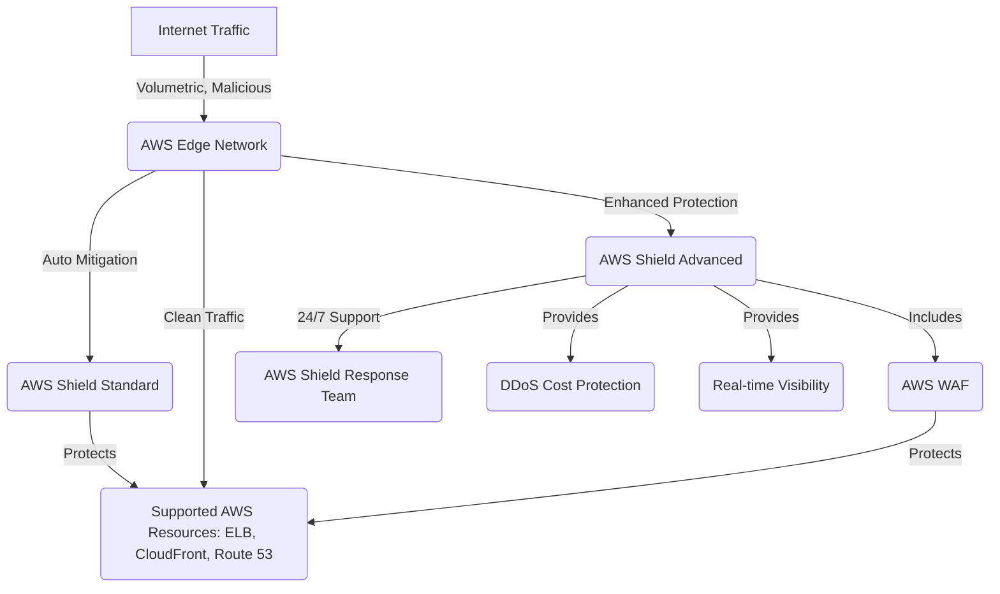
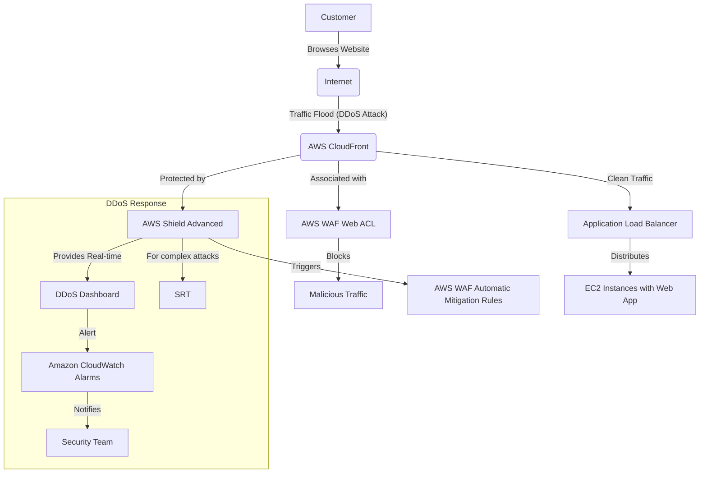
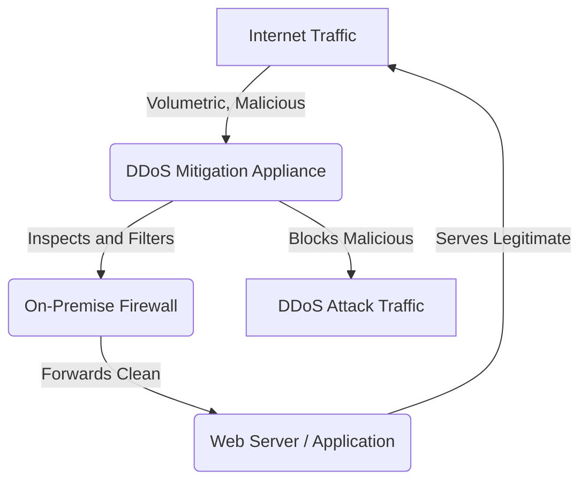

# Shield

## Shield

### 🌟 Overview: AWS Shield

**AWS Shield** is a managed Distributed Denial of Service (DDoS) protection service that safeguards applications running on AWS. DDoS attacks are malicious attempts to disrupt the normal traffic of a server, service, or network by overwhelming the target with a flood of Internet traffic. AWS Shield provides always-on detection and automatic inline mitigations, ensuring your applications remain highly available and performant. It operates in two tiers:

* **AWS Shield Standard:** This is the default, no-cost protection that is automatically enabled for all AWS customers. It provides baseline protection against the most common, frequently occurring network and transport layer (Layer 3 and 4) DDoS attacks. This includes attacks like SYN floods and UDP floods.
* **AWS Shield Advanced:** This is a paid service for higher levels of protection against larger and more sophisticated attacks. It provides enhanced DDoS detection and mitigation for Layers 3, 4, and 7. It also includes 24/7 access to the AWS Shield Response Team (SRT), DDoS cost protection, and advanced real-time attack visibility. A key feature is the inclusion of AWS WAF (Web Application Firewall) at no extra cost for resources protected by Shield Advanced.

<figure><figcaption></figcaption></figure>

### # 🤖 Innovation Spotlight

The latest innovation in AWS Shield is the **Automatic Application Layer DDoS Mitigation** and **Protection Groups**. This new capability with Shield Advanced automatically creates and manages AWS WAF rules to mitigate application-layer (Layer 7) DDoS attacks like HTTP floods. Previously, this often required manual intervention from the Shield Response Team. Protection Groups allow you to group related resources (e.g., all load balancers for an application) and apply a single, unified set of DDoS protections, treating them as a single entity. This simplifies management and provides more cohesive defense.

***

### ⚡ Problem Statement

A popular e-commerce platform, **"ElectroMart,"** is preparing for its biggest online sale of the year. Historically, they've experienced periods of high traffic, but they are concerned about the potential for a DDoS attack that could cripple their website during this critical period, leading to significant revenue loss and damage to their brand reputation. They need a robust, scalable, and automated solution to protect their web application without manual intervention or a complete overhaul of their infrastructure.

### # 🤝 Business Use Cases

* **E-commerce:** Protecting online storefronts during peak events (e.g., Black Friday, flash sales) from HTTP flood attacks that could make the site unavailable.
* **Gaming:** Ensuring uninterrupted gameplay for online multiplayer games by protecting against volumetric attacks that can degrade player experience and cause disconnections.
* **Financial Services:** Maintaining the availability and integrity of banking portals and trading platforms, where downtime could lead to significant financial loss and a loss of customer trust.
* **Media and Entertainment:** Safeguarding video streaming services and content delivery networks (CDNs) from attacks that could disrupt streams and degrade quality for viewers.

***

### 🔥 Core Principles

* **Always-on Detection:** AWS Shield is a managed service that continuously monitors traffic to your protected resources for DDoS attack signatures.
* **Inline Mitigation:** It automatically applies inline mitigations without requiring any manual intervention to block malicious traffic at the AWS network edge.
* **Global Threat Environment Dashboard:** Provides a consolidated view of potential threats across the AWS global network, allowing for faster response.
* **DDoS Cost Protection (Shield Advanced):** A unique benefit that protects you from potential cost spikes from AWS services (like Amazon EC2 or Amazon CloudFront) scaling up in response to a DDoS attack. AWS will provide a credit for usage charges resulting from the attack.
* **AWS Shield Response Team (SRT):** A dedicated team of DDoS experts available 24/7 for Shield Advanced customers to assist during and after an attack, applying custom mitigations for complex attacks.
* **Protection Groups:** Allows you to manage a collection of resources as a single unit for DDoS protection, applying a single set of policies and enabling aggregate visibility.

***

### 📋 Pre-Requirements

* **An AWS Account:** With appropriate IAM permissions to configure AWS Shield and associated services.
* **AWS Resources:** Your application must be running on one of the supported AWS resources:
  * **Elastic Load Balancing (ELB)**
  * **Amazon CloudFront distributions**
  * **Amazon Route 53 hosted zones**
  * **AWS Global Accelerator**
  * **Elastic IP addresses** (for Amazon EC2 instances)
* **AWS WAF (for Layer 7 Protection):** For Shield Advanced, AWS WAF is a critical companion service. AWS WAF Web ACLs (Web Access Control Lists) are used to define rules to block, allow, or count web requests based on conditions you specify.

***

### 👣 Implementation Steps

1. **Select Your Tier:** Decide whether AWS Shield Standard (automatically enabled) is sufficient or if your application requires the enhanced protection of AWS Shield Advanced. For business-critical applications, Shield Advanced is recommended.
2. **Enable AWS Shield Advanced (if needed):** Navigate to the AWS WAF & Shield console and subscribe to AWS Shield Advanced.
3. **Create a Protection Group:** If your application is composed of multiple resources (e.g., an Application Load Balancer and a CloudFront distribution), create a Protection Group to apply unified protection.
4. **Add Resources:** Add your ELB, CloudFront distribution, or other supported resources to the Protection Group or individually protect them within the Shield Advanced dashboard.
5. **Configure AWS WAF:** If you are using Shield Advanced, create an AWS WAF Web ACL and associate it with your protected resource. Use AWS Managed Rules (e.g., `AWS-AWSManagedRulesCommonRuleSet`) and create custom rules to address specific threats or rate-based rules to limit traffic from specific sources.
6. **Set up Monitoring and Alarms:** Configure Amazon CloudWatch alarms to notify you of detected DDoS events. For Shield Advanced, the Global Threat Environment Dashboard provides detailed real-time metrics.
7. **Contact SRT (if needed):** For Shield Advanced customers, contact the Shield Response Team through AWS Support during a major attack for expert assistance.

***

### 🗺️ Data Flow Diagram

### Diagram 1: How AWS Shield Works

_Description: This diagram illustrates how incoming internet traffic is first inspected at the AWS Edge Network. AWS Shield Standard provides basic, automatic protection, while Shield Advanced offers enhanced capabilities, including integration with AWS WAF for Layer 7 protection, access to the Shield Response Team, and cost protection._

### Diagram 2: "ElectroMart" Use Case

_Description: This diagram shows the data flow for the "ElectroMart" e-commerce platform. Incoming traffic is routed through CloudFront, which is protected by AWS Shield Advanced and a Web ACL. Shield and WAF automatically block malicious traffic before it reaches the application, ensuring only legitimate requests are served by the EC2 instances behind the Application Load Balancer._

***

### 🔒 Security Measures

* **Enable AWS WAF:** Use AWS WAF with Shield Advanced to protect against application-layer attacks. Configure rate-based rules and use managed rule sets like the "Core Rule Set" and "IP Reputation List" to block common threats.
* **Least Privilege IAM Roles:** Ensure that IAM users and roles have only the necessary permissions to configure and manage AWS Shield and WAF.
* **Configure VPC Security Groups:** Use strict security group rules on your EC2 instances to only allow traffic from the Application Load Balancer, not directly from the internet. This provides an additional layer of defense.
* **Logging and Monitoring:** Enable logging for AWS WAF and VPC Flow Logs. Send these logs to Amazon S3 or CloudWatch for analysis and auditing. This helps you identify the source and nature of attacks.
* **Health-Based Detection (Shield Advanced):** Use Route 53 health checks to inform Shield Advanced about the health of your application. This allows Shield to more quickly detect and mitigate attacks that are impacting application health.

***

### ⚖️ When to use and when not to use

**✅ When to Use AWS Shield:**

* For any internet-facing application, as Shield Standard is automatically included at no cost and provides a baseline of protection.
* For business-critical applications where downtime is unacceptable, use AWS Shield Advanced. This is especially true for e-commerce, financial services, and media platforms.
* When you need to protect against all three layers of a DDoS attack (Network, Transport, and Application).
* If you require 24/7 expert assistance during a live attack.

**❌ When not to Use AWS Shield:**

* It's a security service, not a substitute for a well-architected application. Shield protects against DDoS attacks, but it won't fix poor application code, misconfigured databases, or other vulnerabilities.
* For protecting resources that are not internet-facing or are part of a private network. It is designed to protect public endpoints.

***

### 💰 Costing Calculation

* **AWS Shield Standard:** This is **free** for all AWS customers. There are no additional costs beyond what you already pay for other AWS services.
* **AWS Shield Advanced:** Pricing is structured as follows:
  * **Monthly Subscription Fee:** A flat monthly fee of **$3,000 per month** per organization.
  * **Data Transfer Out Fee:** You may incur additional fees based on data transfer out, though some usage is included.
  * **AWS WAF Costs:** The subscription includes up to 50 billion AWS WAF requests per month at no additional cost for protected resources. Beyond this, standard AWS WAF request costs apply.

**Efficient Way of Handling This Service:**

* Utilize AWS Shield Advanced's **DDoS Cost Protection** feature. During an attack, it protects your bill from high usage charges resulting from your resources scaling up to absorb the attack traffic.
* Leverage the included AWS WAF with Shield Advanced. This waives the typical WAF fees for the protected resources, making the service more cost-effective for security-conscious customers.

**Sample Calculation (Shield Advanced):**

* **Scenario:** An e-commerce business that is subscribed to AWS Shield Advanced to protect its website.
* **Monthly Cost:** $3,000 (monthly subscription) + $0 (since AWS WAF costs are covered for protected resources under the 50 billion request limit) + $0 (DDoS cost protection is in effect during an attack).
* **Total Monthly Cost:** **$3,000**. This demonstrates that the primary cost is the fixed monthly fee, providing predictable spending for robust protection.

***

### 🧩 Alternative Services

| Service Provider | Service Name                       | Key Comparison/Difference                                                                                                                                                                                                                    |
| ---------------- | ---------------------------------- | -------------------------------------------------------------------------------------------------------------------------------------------------------------------------------------------------------------------------------------------- |
| **AWS**          | **AWS Shield**                     | Deeply integrated with the AWS ecosystem. Provides managed DDoS protection for Layers 3, 4, and 7. The Advanced tier includes a dedicated response team.                                                                                     |
| **Azure**        | **Azure DDoS Protection**          | Offers a Standard tier with enhanced protection and a Basic tier that's automatically enabled. It provides protection against volumetric and protocol attacks, and integrates with Azure Application Gateway.                                |
| **GCP**          | **Cloud Armor**                    | A security service that provides WAF and DDoS protection for Google Cloud applications. It's highly scalable and integrates with Load Balancing to provide protection at the edge.                                                           |
| **On-Premise**   | **Hardware-based DDoS Mitigation** | Requires significant upfront investment in hardware appliances (e.g., F5 BIG-IP, Arbor Networks) and requires specialized staff to configure and maintain. It can be a single point of failure and lacks the scale of cloud-based solutions. |

### On-Premise Data Flow Diagram (DDoS Appliance)

_Description: In an on-premise setup, all internet traffic first passes through a dedicated DDoS mitigation appliance. This appliance inspects and filters traffic, blocking malicious requests before they can reach the internal network and the web server, which is protected by a traditional firewall._

***

### ✅ Benefits

* **Scalability & Performance:** AWS Shield leverages the vast, global AWS network to absorb and mitigate massive DDoS attacks, ensuring application performance isn't degraded.
* **Automation:** Both Standard and Advanced tiers provide automatic, inline mitigation, freeing up security teams from manual intervention during an attack.
* **Cost Savings:** The DDoS Cost Protection feature of Shield Advanced prevents unexpected billing spikes from legitimate services scaling up in response to an attack.
* **Expert Support:** Shield Advanced provides 24/7 access to the Shield Response Team, offering expert help for complex and persistent attacks.
* **Integrated Security:** It works seamlessly with other AWS services like AWS WAF, CloudFront, and Route 53, creating a comprehensive and multi-layered security posture.

***

### 📝 Summary

AWS Shield is a critical managed service for defending your AWS applications against DDoS attacks. It operates in two tiers: a free, automatic **Standard** tier for basic protection and an **Advanced** tier for business-critical applications, offering enhanced mitigation, cost protection, and access to a 24/7 response team. The latest innovations, like automatic application-layer mitigation and protection groups, simplify and strengthen your defenses. This service is essential for maintaining application availability and performance in an increasingly hostile online environment.

**Top 5 things to keep in mind:**

1. **Shield Standard is automatic and free,** but only protects against common L3/L4 attacks.
2. **Shield Advanced is a must-have for critical applications** due to its enhanced protection, cost benefits, and expert support.
3. **WAF is your partner for Layer 7 attacks,** and its fees are included with a Shield Advanced subscription for protected resources.
4. **DDoS Cost Protection** is a key feature of Shield Advanced that can save you significant money during an attack.
5. **Always use Shield with a well-architected, multi-layered security strategy,** including security groups and proper logging.

AWS Shield is a fully managed service that provides DDoS protection for applications running on the AWS platform. It offers an automatic and always-on defense that helps mitigate volumetric, state-exhaustion, and application-layer attacks. With its two tiers, it provides a foundational level of security for all customers and an advanced, comprehensive defense for those with mission-critical workloads.

***

### 🔗 Related Topics

* **AWS WAF, AWS Firewall Manager, AWS Shield Advanced, and AWS Shield network security director:** [https://docs.aws.amazon.com/waf/latest/developerguide/what-is-aws-waf.html](https://docs.aws.amazon.com/waf/latest/developerguide/what-is-aws-waf.html)
* **AWS Shield Advanced pricing:** [https://aws.amazon.com/shield/pricing/](https://aws.amazon.com/shield/pricing/)
* **AWS DDoS Resiliency Framework:** [https://aws.amazon.com/shield/ddos-resiliency-framework/](https://www.google.com/search?q=https://aws.amazon.com/shield/ddos-resiliency-framework/)
