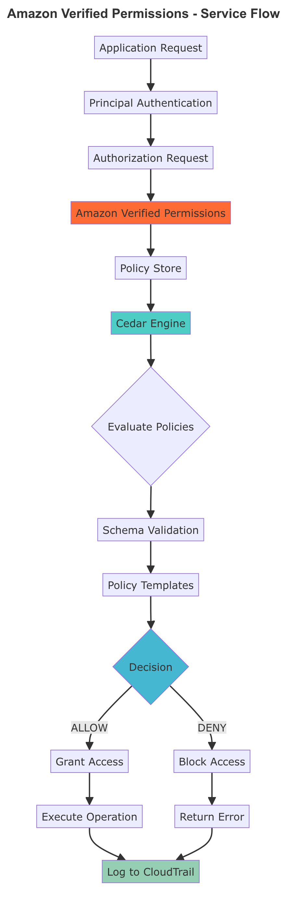
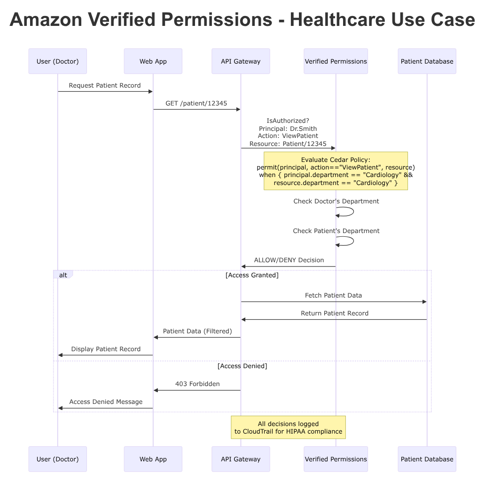
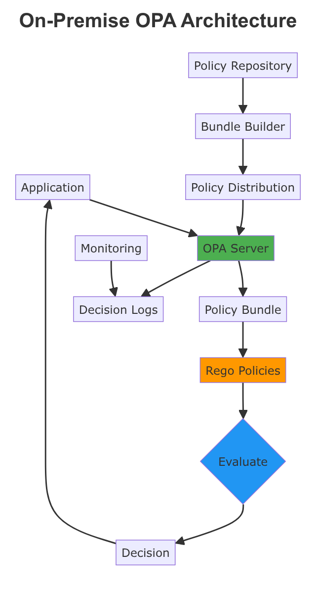

# Verified Permission

## 🛡️ **Amazon Verified Permissions: Fine-Grained Authorization at Scale**

### 1. 🌟 **Overview**

**Amazon Verified Permissions** is a fully managed, scalable authorization service that revolutionizes how developers implement fine-grained access control in applications. Launched as AWS's answer to complex permission management challenges, this service leverages the open-source **Cedar policy language** to externalize authorization logic from application code.

<figure><figcaption></figcaption></figure>

The service acts as a centralized **Policy Decision Point (PDP)**, enabling applications to make authorization decisions through simple API calls rather than embedding complex permission logic within business code. With support for both Role-Based Access Control (RBAC) and Attribute-Based Access Control (ABAC), Verified Permissions offers unprecedented flexibility in defining access policies.

#### 🤖 **Innovation Spotlight 2025**

As of September 2025, Amazon Verified Permissions has introduced significant innovations:

* **97% Price Reduction**: Single authorization requests now cost only **$5 per million API calls** (down from $150)
* **Enhanced Cedar Language Support**: Version 2.4 with improved policy templating
* **Low-Latency Local Agent**: `avp-local-agent` for high-frequency applications with sub-millisecond response times
* **Kubernetes Integration Patterns**: Four architectural patterns for containerized workloads
* **Express.js Quickstart**: Streamlined integration for Node.js applications

***

### 2. ⚡ **Problem Statement**

#### Real-World Scenario

**TechCorp**, a SaaS company with 10,000+ users, faces authorization chaos:

* **Scattered Logic**: Permission checks embedded in 50+ microservices
* **Inconsistent Policies**: Different teams implementing varying access rules
* **Security Gaps**: Hard-coded permissions leading to privilege escalation
* **Audit Nightmares**: No centralized view of who can access what
* **Development Slowdown**: 3-6 months to implement new permission features

#### Industry Applications

* **Healthcare**: HIPAA-compliant patient data access controls
* **Financial Services**: Multi-tenant trading platform permissions
* **EdTech**: Student-teacher-admin role hierarchies
* **E-commerce**: Vendor-customer-admin access segmentation
* **Government**: Classified document access control

### 2.1 🤝 **Business Use Cases**

| **Use Case**             | **Description**                  | **Cedar Policy Example**                                                                                   |
| ------------------------ | -------------------------------- | ---------------------------------------------------------------------------------------------------------- |
| **Multi-Tenant SaaS**    | Isolate tenant data access       | `permit(principal in Tenant::"tenant1", action, resource in Tenant::"tenant1")`                            |
| **Document Management**  | File-level access control        | `permit(principal, action=="View", resource) when { resource.classification <= principal.clearanceLevel }` |
| **API Gateway Security** | Endpoint-level permissions       | `permit(principal, action=="POST", resource) when { principal has role && role=="admin" }`                 |
| **Microservices Auth**   | Service-to-service authorization | `permit(principal, action, resource) when { principal.service in ["order-service", "payment-service"] }`   |

***

### 3. 🔥 **Core Principles**

#### **Foundational Concepts**

**Cedar Policy Language**

* **Human-readable**: Natural language-like syntax
* **Mathematically precise**: Formal verification capabilities
* **Fast evaluation**: Sub-millisecond policy decisions
* **Type-safe**: Compile-time error detection

**Key Components**

| **Component**        | **Purpose**                              | **Example**                     |
| -------------------- | ---------------------------------------- | ------------------------------- |
| **Policy Store**     | Container for policies and schema        | Isolated per application/tenant |
| **Schema**           | Defines entity types, actions, resources | JSON-based authorization model  |
| **Policy Templates** | Reusable policy patterns                 | Role-based access templates     |
| **Principal**        | The entity requesting access             | User, service, or application   |
| **Action**           | The operation being performed            | READ, WRITE, DELETE             |
| **Resource**         | The object being accessed                | File, API endpoint, database    |

**Authorization Models**

* **RBAC (Role-Based Access Control)**: Traditional role assignments
* **ABAC (Attribute-Based Access Control)**: Context-aware decisions
* **Hybrid Approach**: Combines RBAC and ABAC seamlessly

***

### 4. 📋 **Pre-Requirements**

#### **AWS Services & Tools**

| **Service/Tool**   | **Purpose**                     | **Required**   |
| ------------------ | ------------------------------- | -------------- |
| **AWS Account**    | Basic AWS access                | ✅ Yes          |
| **Amazon Cognito** | Identity provider (recommended) | 🔶 Optional    |
| **API Gateway**    | API endpoint protection         | 🔶 Optional    |
| **CloudTrail**     | Audit logging                   | 🔶 Recommended |
| **IAM Roles**      | Service permissions             | ✅ Yes          |

#### **Development Environment**

* **Programming Language**: Any AWS SDK supported language
* **Cedar CLI** (optional): Policy validation and testing
* **JSON Schema Knowledge**: For defining authorization models

***

### 5. 👣 **Implementation Steps**

#### **Step 1: Create Policy Store**

```bash
aws verifiedpermissions create-policy-store \
    --validation-settings mode=STRICT
```

#### **Step 2: Define Schema**

```json
{
  "MyApp": {
    "entityTypes": {
      "User": {
        "shape": {
          "type": "Record",
          "attributes": {
            "department": {"type": "String"},
            "clearanceLevel": {"type": "Long"}
          }
        }
      },
      "Document": {
        "shape": {
          "type": "Record",
          "attributes": {
            "classification": {"type": "Long"},
            "owner": {"type": "Entity", "name": "User"}
          }
        }
      }
    },
    "actions": {
      "ViewDocument": {"appliesTo": {"resourceTypes": ["Document"]}}
    }
  }
}
```

#### **Step 3: Create Policies**

```cedar
permit(
    principal,
    action == Action::"ViewDocument",
    resource
) when {
    resource.classification <= principal.clearanceLevel &&
    resource.owner == principal
};
```

#### **Step 4: Integrate with Application**

```python
import boto3

client = boto3.client('verifiedpermissions')

response = client.is_authorized(
    policyStoreId='store-123',
    principal={'entityType': 'User', 'entityId': 'user123'},
    action={'actionType': 'ViewDocument'},
    resource={'entityType': 'Document', 'entityId': 'doc456'}
)

if response['decision'] == 'ALLOW':
    # Grant access
    print("Access granted")
else:
    # Deny access
    print("Access denied")
```

***

### 6. 🗺️ **Data Flow Diagrams**

Let me create the Mermaid diagrams for you:

Great! I've created the first diagram showing how Amazon Verified Permissions works internally. Now let me create the second diagram with a specific use case example.

**Diagram 1: How Amazon Verified Permissions Works**

<figure><figcaption></figcaption></figure>

**Diagram 2: Healthcare Use Case - Doctor-Patient Access Control**

<figure><figcaption></figcaption></figure>

***

### 7. 🔒 **Security Measures**

#### **Best Practices**

| **Security Layer**    | **Implementation**                 | **Cedar Example**                                                                  |
| --------------------- | ---------------------------------- | ---------------------------------------------------------------------------------- |
| **Least Privilege**   | Grant minimum required permissions | `permit(principal, action=="Read", resource) when { resource.owner == principal }` |
| **Encryption**        | TLS 1.2+ for all API calls         | AWS SDK handles automatically                                                      |
| **Audit Logging**     | CloudTrail integration             | Enable for all policy stores                                                       |
| **Schema Validation** | Strict mode enforcement            | Set `validationSettings.mode=STRICT`                                               |
| **Policy Testing**    | Use Test Bench before deployment   | Simulate authorization requests                                                    |
| **Access Control**    | IAM policies for service access    | Restrict who can manage policies                                                   |

#### **Recommended Security Configuration**

```json
{
  "policyStoreConfig": {
    "validationSettings": {"mode": "STRICT"},
    "description": "Production policy store with strict validation"
  },
  "auditSettings": {
    "cloudTrailEnabled": true,
    "logLevel": "INFO"
  }
}
```

***

### 8. 🔥 **Innovation Spotlight: Cedar Local Agent**

The **avp-local-agent** represents a breakthrough in authorization latency, enabling:

* **Sub-millisecond response times** for high-frequency trading
* **Local policy caching** with automatic updates
* **Offline authorization** capabilities
* **99.99% availability** for mission-critical applications

***

### 9. ⚖️ **When to Use and When Not to Use**

#### ✅ **When to Use**

* **Complex Permission Models**: Multiple roles, attributes, and resources
* **Multi-tenant Applications**: Need for tenant isolation
* **Compliance Requirements**: Audit trails and centralized control
* **Microservices Architecture**: Service-to-service authorization
* **Rapid Development**: Externalize auth logic from business code
* **Fine-grained Control**: Resource-level permissions needed

#### ❌ **When Not to Use**

* **Simple Applications**: Basic read/write permissions sufficient
* **Single-tenant Solutions**: Simple IAM roles adequate
* **Legacy Systems**: Cannot integrate with external APIs
* **Ultra-low Latency**: <1ms requirements without local agent
* **Limited AWS Commitment**: Vendor lock-in concerns
* **Small Scale**: <1000 authorization requests/month

***

### 10. 💰 **Costing Calculation**

#### **Pricing Structure**

| **Request Type**                 | **Price**                    | **Use Case**           |
| -------------------------------- | ---------------------------- | ---------------------- |
| **Single Authorization**         | $5 per million requests      | Individual API calls   |
| **Batch Authorization (Tier 1)** | $150 per million (first 40M) | Bulk processing        |
| **Batch Authorization (Tier 2)** | $75 per million (next 60M)   | High volume            |
| **Batch Authorization (Tier 3)** | $40 per million (over 100M)  | Enterprise scale       |
| **Policy Management**            | $40 per million requests     | Policy CRUD operations |

#### **Sample Calculations**

**Scenario 1: E-commerce Platform**

```
Monthly Authorization Requests: 5 million single requests
Calculation: 5,000,000 × $0.000005 = $25/month
```

**Scenario 2: Healthcare System**

```
Patient Data Access (Batch): 900,000 requests/month
Microservice Auth (Single): 5,000,000 requests/month

Batch Cost: 900,000 × $0.00015 = $135
Single Cost: 5,000,000 × $0.000005 = $25
Total: $160/month
```

**Scenario 3: High-Frequency Trading**

```
Local Agent Authorizations: 200M/month (FREE)
Policy Management: 4.32M requests/month

Cost: 4,320,000 × $0.00004 = $172.80/month
```

#### **Cost Optimization Strategies**

* **Use Batch APIs** for multiple authorization checks
* **Implement Local Agent** for high-frequency scenarios
* **Cache Decisions** when appropriate for your use case
* **Optimize Policy Complexity** to reduce evaluation time

***

### 11. 🧩 **Alternative Services Comparison**

| **Feature**              | **AWS Verified Permissions** | **Azure Authorization** | **GCP IAM**         | **On-Premise (OPA)**  |
| ------------------------ | ---------------------------- | ----------------------- | ------------------- | --------------------- |
| **Policy Language**      | Cedar (purpose-built)        | JSON-based              | IAM policy language | Rego                  |
| **Latency**              | <10ms (1ms with agent)       | 50-100ms                | 20-50ms             | <1ms                  |
| **Scalability**          | Millions of requests/sec     | Moderate                | High                | Depends on deployment |
| **Fine-grained Control** | Excellent                    | Good                    | Moderate            | Excellent             |
| **Learning Curve**       | Low                          | High                    | Moderate            | High                  |
| **Vendor Lock-in**       | High                         | High                    | High                | None                  |
| **Compliance Features**  | Built-in CloudTrail          | Available               | Available           | Custom implementation |
| **Cost Model**           | Pay-per-request              | Subscription            | Pay-per-request     | Infrastructure only   |

#### **On-Premise Alternative: Open Policy Agent (OPA)**

**On-Premise OPA Data Flow**

<figure><figcaption></figcaption></figure>

***

### 12. ✅ **Benefits**

#### **🚀 Accelerated Development**

* **50% faster** authorization feature development
* **Zero-code** policy changes for business users
* **Plug-and-play** integrations with popular frameworks

#### **🔒 Enhanced Security**

* **Centralized** policy management reduces security gaps
* **Formal verification** prevents policy conflicts
* **Real-time** policy updates without code deployment

#### **💰 Cost Optimization**

* **97% price reduction** in 2025 (from $150 to $5 per million)
* **No infrastructure** management overhead
* **Pay-per-use** model scales with business growth

#### **📊 Operational Excellence**

* **Built-in auditing** with CloudTrail integration
* **Policy testing** before production deployment
* **Multi-region** availability for global applications

***

### 13. 🌐 **Innovation Spotlight: Kubernetes Integration**

Amazon Verified Permissions now supports four architectural patterns for Kubernetes:

1. **Sidecar Pattern**: Authorization proxy per pod
2. **Gateway Pattern**: Centralized authorization at ingress
3. **Admission Controller**: Policy-based pod deployment
4. **Service Mesh Integration**: Istio/Envoy integration

***

### 14. 📝 **Summary**

Amazon Verified Permissions revolutionizes application authorization by providing a **centralized, scalable, and cost-effective** solution for fine-grained access control. With its **Cedar policy language** and **cloud-native architecture**, organizations can implement complex permission models without embedding authorization logic in application code.

#### **Key Takeaways:**

1. **🎯 Externalize Authorization**: Decouple permission logic from business code
2. **💡 Cedar Language**: Human-readable yet mathematically precise policies
3. **⚡ Performance**: Sub-millisecond decisions with local agent
4. **💰 Cost-Effective**: 97% price reduction makes it accessible for all scales
5. **🔒 Security-First**: Built-in auditing and formal verification
6. **🚀 Developer-Friendly**: Quick integrations with popular frameworks
7. **📈 Scalable**: Handles millions of requests per second
8. **🌍 Multi-tenant**: Perfect for SaaS applications
9. **🔄 Real-time Updates**: Policy changes without code deployment
10. **📊 Observable**: Comprehensive logging and monitoring

#### **Service Essence:**

Amazon Verified Permissions is a **managed authorization service** that uses the **Cedar policy language** to provide **fine-grained access control** for applications. It **externalizes permission logic**, enabling **faster development**, **better security**, and **centralized policy management** while scaling to handle millions of authorization decisions per second at industry-leading low costs.

***

### 15. 🔗 **Related Topics**

#### **📚 Essential References**

* [Cedar Policy Language Documentation](https://docs.cedarpolicy.com/)
* [AWS Verified Permissions User Guide](https://docs.aws.amazon.com/verifiedpermissions/latest/userguide/)
* [Cedar GitHub Repository](https://github.com/cedar-policy/)
* [Express.js Integration Guide](https://aws.amazon.com/blogs/security/secure-your-express-application-apis-in-minutes-with-amazon-verified-permissions/)
* [API Gateway Integration Tutorial](https://aws.amazon.com/about-aws/whats-new/2024/04/amazon-cognito-customers-access-apis-verified-permissions/)

#### **🔗 Related AWS Services**

* **Amazon Cognito**: Identity provider integration
* **AWS IAM Identity Center**: Workforce identity management
* **Amazon API Gateway**: API security and management
* **AWS CloudTrail**: Audit logging and compliance
* **AWS WAF**: Web application firewall integration

#### **📖 Further Learning**

* [AWS Security Best Practices](https://docs.aws.amazon.com/security/)
* [Zero Trust Architecture Patterns](https://aws.amazon.com/architecture/security-identity-compliance/)
* [SaaS Multi-tenant Authorization Patterns](https://docs.aws.amazon.com/prescriptive-guidance/latest/saas-multitenant-api-access-authorization/)
