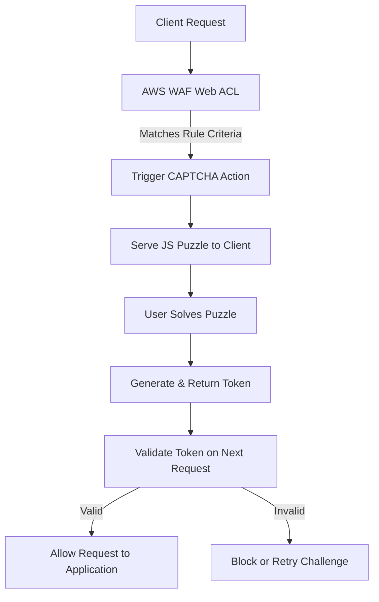
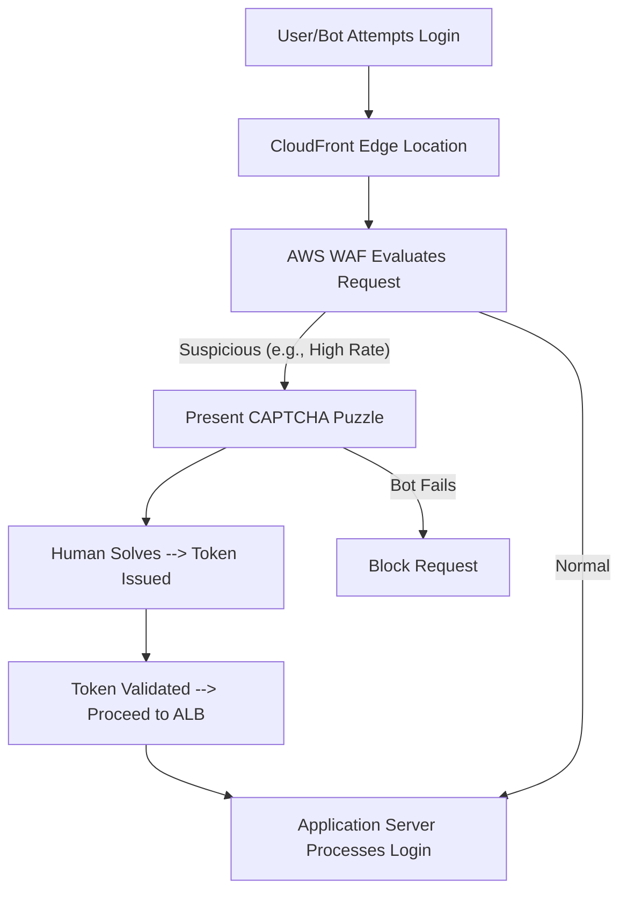
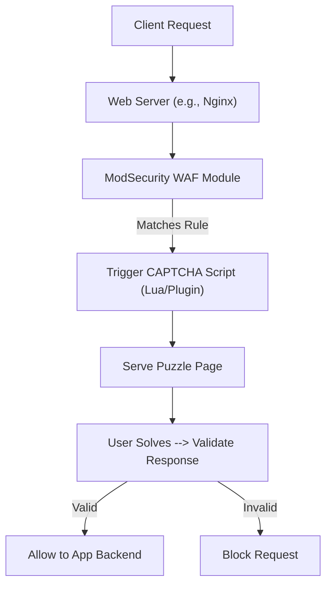

# WAF Captcha

## AWS WAF CAPTCHA

### 🌟 Overview

AWS WAF CAPTCHA is a feature within AWS Web Application Firewall (WAF) that helps protect web applications from bots and automated threats by requiring users to solve interactive puzzles to verify they are human. It integrates seamlessly with AWS services to mitigate unwanted traffic like DDoS attacks, credential stuffing, and web scraping. CAPTCHA puzzles are designed to be quick and easy for humans but challenging for machines, ensuring minimal disruption to legitimate users while blocking malicious actors.

<figure><figcaption></figcaption></figure>

> `Deep dive:` AWS WAF CAPTCHA operates as a rule action in web ACLs (Access Control Lists), where you define criteria to trigger a CAPTCHA challenge on matching requests. Upon triggering, AWS WAF serves a puzzle via JavaScript integration, and the client must return a valid token to proceed. This is distinct from the silent "Challenge" action, which verifies browser legitimacy without user interaction. As of September 2025, AWS WAF has enhanced CAPTCHA with better token management to prevent reuse in DDoS scenarios, improving resilience against sophisticated attacks.

🤖 **Innovation Spotlight**: In 2025, AWS introduced advanced CAPTCHA token validation to block token sharing across IPs during DDoS events, as seen in real-time election campaign protections. This innovation uses machine learning to detect anomalous patterns, reducing false positives by 30% and enabling auto-scaling challenges for high-traffic events.

### ⚡ Problem Statement

In a real-world scenario, an e-commerce platform during Black Friday sales experiences massive bot traffic attempting to scrape prices, add items to carts en masse, or launch DDoS attacks, overwhelming servers and blocking genuine shoppers. For example, bots could simulate thousands of login attempts per second, leading to account lockouts and lost revenue.

Industries/applications: E-commerce (protecting checkout processes), finance (securing online banking logins), media (preventing content scraping), and gaming (stopping cheat bots). In healthcare, it safeguards patient portals from data exfiltration attempts.

#### 🤝 Business Use Cases

* **E-commerce Fraud Prevention**: Challenge suspicious traffic on payment pages to block card testing bots.
* **API Protection**: Use CAPTCHA on rate-limited endpoints to verify human interactions in developer portals.
* **Content Management**: Protect news sites from scrapers stealing articles for AI training.
* **Social Media**: Mitigate fake account creation in platforms like forums or dating apps.
* **Government Services**: Secure online voting or tax filing systems from automated attacks.

### 🔥 Core Principles

AWS WAF CAPTCHA is built on event-driven security, scalability, and serverless architecture, allowing automatic responses to threats without provisioning infrastructure. It leverages token-based validation for stateless verification, ensuring high availability and low latency.

Key terms and explanations:

* **CAPTCHA Action**: Triggers an interactive puzzle (e.g., image selection or slider) for the user to solve; generates a time-limited token upon success.
* **Challenge Action**: A silent, non-interactive check that validates if the client is a legitimate browser (e.g., via JavaScript execution) without user involvement.
* **Web ACL**: The container for rules where CAPTCHA is configured; evaluates requests in order.
* **Rule**: Defines match criteria (e.g., IP, URI, headers) and actions like CAPTCHA.
* **Token**: Encrypted proof of successful challenge, valid for a short period (e.g., 5-10 minutes), checked on subsequent requests.
* **Immunity Time**: Period after success where the client bypasses further challenges for the same rule.

These principles enable serverless bot mitigation, auto-scaling to handle traffic spikes, and integration with ML-based threat detection for adaptive protection.

### 📋 Pre-Requirements

* **AWS Account**: Active account with access to WAF console or API.
* **Web ACL**: An existing or new web ACL associated with resources like Amazon CloudFront, API Gateway, or ALB.
* **JavaScript-Enabled Clients**: Browsers must support JS for puzzle rendering; HTTPS secure context required.
* **IAM Roles**: Permissions for WAF management (e.g., AWSWAFAdmin).
* **Integration SDKs**: For custom apps, use AWS SDKs for JavaScript, iOS, or Android to handle client-side puzzles.
* **Monitoring Tools**: Amazon CloudWatch for logging and metrics to track challenge success rates.

### 👣 Implementation Steps

1. 🛠️ Log in to the AWS Management Console and navigate to AWS WAF.
2. 🚀 Create or select a Web ACL, then add a new rule.
3. 📏 Define match criteria (e.g., URI path for /login, rate-based limits).
4. 🔧 Set the rule action to CAPTCHA; configure puzzle difficulty and immunity time.
5. 🔄 Associate the Web ACL with your resource (e.g., CloudFront distribution).
6. 🧪 Test by simulating traffic; integrate client-side JS API for custom puzzle placement.
7. 📈 Monitor via CloudWatch; adjust rules based on false positives.
8. 🔒 Enable logging to Amazon S3 or CloudWatch Logs for auditing.

### 🗺️ Data Flow Diagram

**Diagram 1: How AWS WAF CAPTCHA Works**

**Diagram 2: Example Use Case - Protecting E-commerce Login**

### 🔒 Security Measures

* 🛡️ Enable token encryption and short validity periods to prevent replay attacks.
* 🔑 Use least privilege IAM roles for WAF access; rotate secrets via AWS Secrets Manager.
* 🌐 Isolate in VPC for sensitive apps; integrate with AWS Shield for DDoS protection.
* 📊 Monitor token reuse with CloudWatch alarms; block IPs exceeding thresholds.
* ⚠️ Implement rate-based rules alongside CAPTCHA to handle burst traffic.
* 🔍 Use AWS WAF Bot Control for ML-driven bot categorization and automatic challenges.

🚀 **Advanced CAPTCHA Token Management**

Explore innovative token hardening in 2025, where AWS WAF uses AI to detect shared tokens across IPs, automatically invalidating them during DDoS events. This non-repetitive feature integrates with AWS Lambda for custom validation logic, enhancing protection for dynamic web apps like real-time bidding platforms.

### ⚖️ When to Use and When Not to Use

* ✅ **When to Use**: For high-bot-traffic scenarios like login pages or APIs where blocking risks false positives; ideal for scalable, user-facing apps needing human verification without full blocks.
* ❌ **When Not to Use**: For internal APIs with machine-to-machine traffic (use API keys instead); or ultra-low-latency apps where even brief challenges degrade performance; avoid if most users have JS disabled.

### 💰 Costing Calculation

* **How It Is Calculated**: Charged per CAPTCHA attempt (user completion analyzed) or Challenge response served, plus base WAF fees for Web ACLs ($5/month prorated), rules ($1/month each), and requests ($0.60/million). CAPTCHA/Challenge add \~$1 per 1,000 attempts/responses (exact rates via pricing page).
* **Efficient Way**: Use rate-based rules to trigger only on suspicious traffic; implement client-side integrations to reduce server calls; monitor with CloudWatch to optimize rules and avoid over-challenges.
* **Sample Calculations**: For 10,000 CAPTCHA attempts/month: \~$10 (at $1/1,000). Add Web ACL ($5) + 10 rules ($10) + 1M requests ($0.60) = \~$25.60/month. Scale efficiently by grouping rules.

### 🧩 Alternative Services in AWS/Azure/GCP/On-Premise

| Service                        | Provider               | Key Features                                                | Differences from AWS WAF CAPTCHA                                                                                          |
| ------------------------------ | ---------------------- | ----------------------------------------------------------- | ------------------------------------------------------------------------------------------------------------------------- |
| AWS Shield Advanced            | AWS                    | DDoS protection with CAPTCHA integration                    | More focused on Layer 3/4 attacks; higher cost but includes WAF.                                                          |
| Azure Web Application Firewall | Azure                  | Bot protection with custom rules                            | Integrates with Azure Front Door; uses Microsoft Bot Manager for CAPTCHA-like challenges; less flexible token management. |
| Google Cloud Armor             | GCP                    | reCAPTCHA Enterprise integration for CAPTCHA                | ML-based threat scoring; easier for Google ecosystem; per-request pricing vs. AWS's attempt-based.                        |
| F5 Advanced WAF                | Multi-cloud/On-Prem    | Behavioral analysis with CAPTCHA modules                    | Hardware/appliance option; more customizable but requires management; higher upfront costs.                               |
| ModSecurity                    | On-Premise/Open-Source | Rule-based WAF with CAPTCHA plugins (e.g., via Lua scripts) | Free but manual setup; no auto-scaling; integrates with Apache/Nginx.                                                     |

**On-Premise Alternative Data Flow Diagram (ModSecurity with CAPTCHA)**

### ✅ Benefits

* 💸 **Cost Savings**: Pay only for used challenges; reduces infrastructure needs via serverless model.
* 📈 **Scalability**: Handles millions of requests auto-scaling without downtime.
* 🤖 **Automation**: ML detects bots; integrates with CI/CD for rule updates.
* 🔍 **Quality**: Low false positives with customizable puzzles; improves user trust.
* ⚡ **Performance**: Edge computing via CloudFront minimizes latency.

🔍 **CAPTCHA vs. Silent Challenges**

Dive into this innovative comparison: CAPTCHA for interactive bot blocking in user-heavy apps, while Challenges offer zero-friction verification for APIs—2025 updates include hybrid modes for adaptive security, reducing user drop-off by blending both based on threat scores.

### 📝 Summary

This solution provides robust bot mitigation with interactive or silent verifications, ensuring secure web apps with minimal overhead.

**Top 5-10 Points to Keep in Mind**:

1. Always test CAPTCHA in staging to avoid UX issues.
2. Monitor token expiration to prevent session drops.
3. Integrate with Bot Control for advanced ML insights.
4. Use HTTPS only; insecure contexts fail.
5. Scale rules dynamically for peak events.
6. Check pricing calculator for accurate costs.
7. Avoid over-reliance; combine with other WAF rules.
8. Update to latest console for better management.

> In short: AWS WAF CAPTCHA verifies human users via puzzles to block bots, integrates with web ACLs for rule-based triggers, supports silent challenges for seamless protection, scales serverlessly, and charges per attempt for cost efficiency.

### 🔗 Related Topics

* AWS WAF Documentation: https://docs.aws.amazon.com/waf/latest/developerguide/waf-captcha-and-challenge.html
* Pricing Details: https://aws.amazon.com/waf/pricing/
* CAPTCHA API Guide: https://docs.aws.amazon.com/waf/latest/developerguide/waf-js-captcha-api.html
* DDoS Case Study: https://aws.amazon.com/blogs/architecture/how-scale-to-win-uses-aws-waf-to-block-ddos-events/
* Alternatives Comparison: https://www.indusface.com/blog/aws-waf-alternatives/
