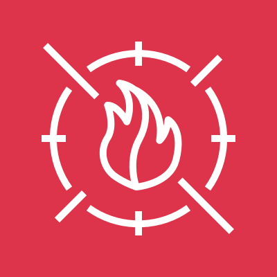
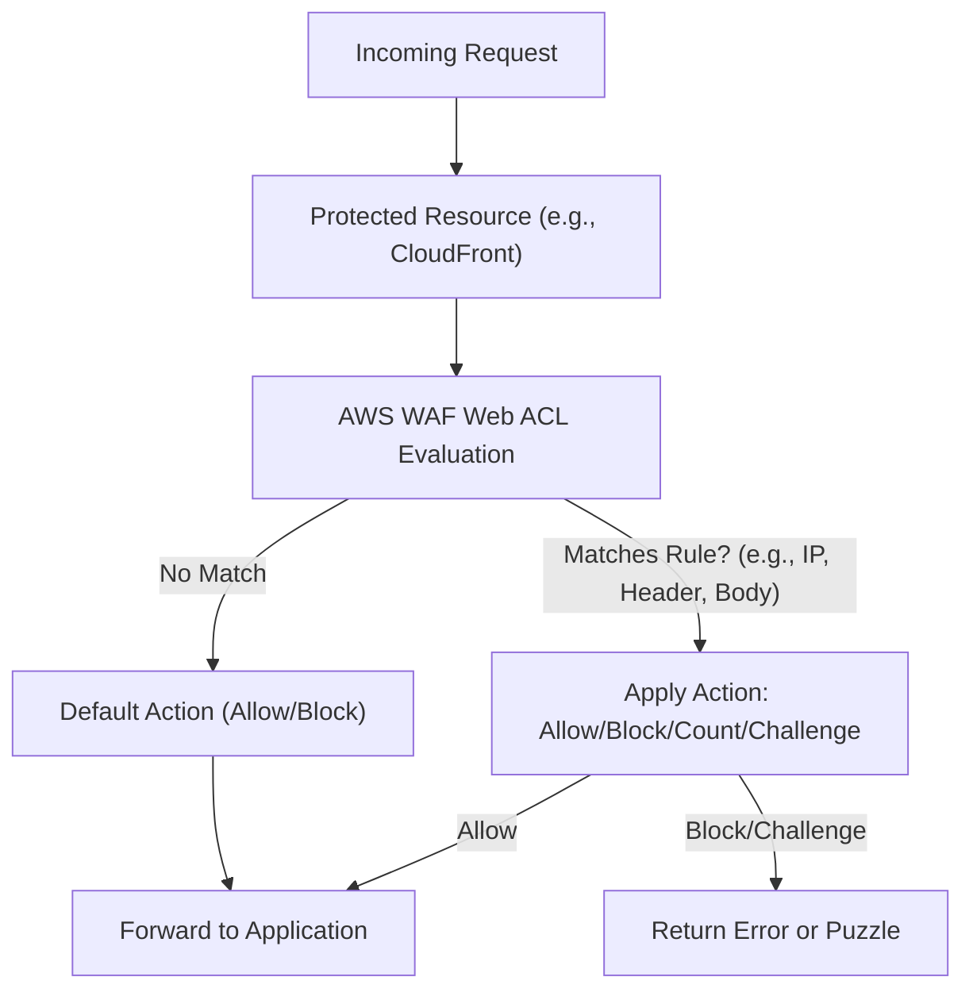
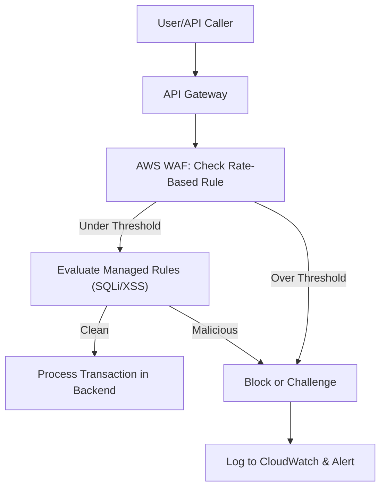
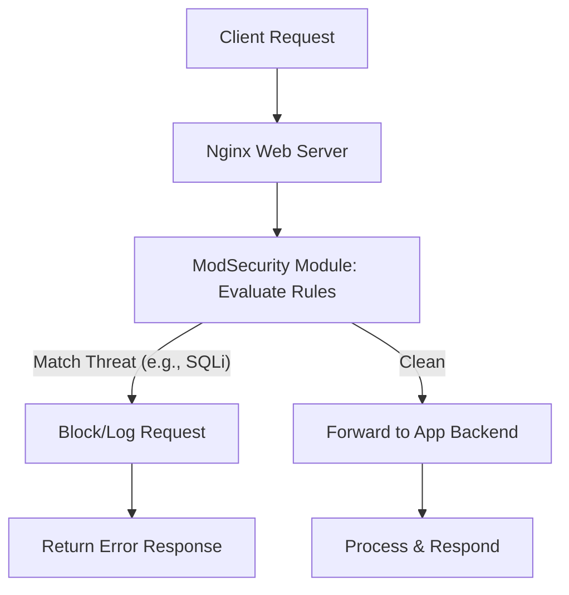

# WAF

## AWS WAF

### 🌟 Overview

AWS WAF (Web Application Firewall) is a managed service that safeguards web applications and APIs from common web exploits, bots, and malicious traffic by monitoring and controlling HTTP/HTTPS requests forwarded to protected resources. It integrates with services like Amazon CloudFront, API Gateway, Application Load Balancer (ALB), AWS AppSync, Amazon Cognito, AWS App Runner, AWS Verified Access, and AWS Amplify, allowing users to define custom rules for allowing, blocking, or challenging requests based on criteria such as IP addresses, headers, body content, URI strings, or geographic origins.

<figure><figcaption></figcaption></figure>

> Deep dive: AWS WAF uses a rule-based system where requests are evaluated against Web ACLs (Access Control Lists) in a prioritized order, supporting managed rule groups from AWS and Marketplace sellers for protections against OWASP Top 10 vulnerabilities like SQL injection and cross-site scripting (XSS). It also includes advanced features like rate-based rules to mitigate DDoS-like floods, labeling for request tagging, and versioning for rule groups to enable safe updates without disrupting traffic. As of September 2025, AWS WAF has fully transitioned from the deprecated WAF Classic (EOL on September 30, 2025), emphasizing a unified console experience for easier management across regions and resources.

🤖 **Innovation Spotlight**: In 2025, AWS WAF introduced enhanced AI-driven anomaly detection within Bot Control rule groups, with a June 2025 update (version 1.18) improving cross-site scripting signatures by 25% through machine learning models that adapt to emerging threats in real-time. This innovation, seen in protections for global events like elections, integrates with AWS Firewall Manager for automated, organization-wide deployment, reducing manual tuning by 40% and enabling predictive blocking of zero-day exploits.

### ⚡ Problem Statement

In a real-world scenario, a fintech platform handling millions of daily transactions faces persistent SQL injection and XSS attacks from automated scripts, leading to data breaches, session hijacking, and service disruptions during peak hours like market openings. For instance, attackers could exploit unfiltered user inputs to steal sensitive financial data, resulting in compliance violations and revenue loss exceeding $500K per incident.

Industries/applications: Finance (securing online banking portals), e-commerce (protecting checkout flows from cart manipulation), healthcare (safeguarding patient data APIs), media (preventing content scraping), and gaming (blocking cheat scripts in multiplayer environments).

### 🤝 Business Use Cases

* **API Security**: Block malicious requests to REST APIs in developer platforms to prevent data exfiltration.
* **DDoS Mitigation**: Use rate-based rules on high-traffic sites like news portals to throttle floods during viral events.
* **Fraud Detection**: Challenge suspicious logins in banking apps to stop credential stuffing.
* **Content Protection**: Restrict access to premium content in streaming services from unauthorized regions.
* **Compliance Enforcement**: Enforce geo-blocking for government services to meet data sovereignty regulations.

### 🔥 Core Principles

AWS WAF is founded on scalable, rule-driven security with pay-as-you-go pricing, enabling real-time threat response without provisioning servers. It leverages edge computing for low-latency inspections and integrates machine learning for adaptive protections.

Key terms and explanations:

* **Web ACL**: The primary container for rules; evaluates requests in sequence and applies actions like allow, block, count, CAPTCHA, or challenge.
* **Rule**: Defines match conditions (e.g., IP sets, regex patterns) and actions; supports statements for AND/OR logic and scope-down for targeted filtering.
* **Rule Group**: A reusable collection of rules, including AWS Managed Rules for common threats like SQLi or XSS.
* **Bot Control**: ML-based feature to categorize and manage bot traffic, with common and targeted protections.
* **CAPTCHA/Challenge**: Interactive (CAPTCHA) or silent (Challenge) verifications to confirm human users.
* **Rate-Based Rule**: Triggers on request volume from IPs or sessions, ideal for brute-force prevention.
* **Labeling**: Tags requests for further analysis in subsequent rules, enabling complex workflows.

These principles ensure high availability, auto-scaling during attacks, and seamless integration with monitoring tools like CloudWatch.

### 📋 Pre-Requirements

* **AWS Account**: Active with billing enabled for WAF usage.
* **Protected Resource**: An existing integration point like CloudFront distribution, API Gateway, or ALB.
* **IAM Permissions**: Roles with AWSWAFAdmin for creating/managing Web ACLs.
* **Monitoring Setup**: CloudWatch for metrics and logs; optional S3 for request sampling.
* **SDK/CLI**: AWS CLI or SDKs (e.g., Boto3 for Python) for programmatic management.
* **HTTPS Configuration**: Secure origins for request inspections.

### 👣 Implementation Steps

1. 🛠️ Log into AWS Console and navigate to WAF & Shield.
2. 🚀 Create a new Web ACL, selecting the resource type (e.g., CloudFront) and region.
3. 📏 Add rules: Start with AWS Managed Rules, then custom rules for specific matches like IP blocks.
4. 🔧 Configure default action (e.g., allow) and priorities; enable Bot Control or CAPTCHA as needed.
5. 🔄 Associate the Web ACL with your resource and enable logging to CloudWatch.
6. 🧪 Test with sample traffic using tools like curl; monitor dashboards for matches.
7. 📈 Optimize based on logs: Adjust rules to reduce false positives.
8. 🔒 Deploy via Firewall Manager for multi-account scaling.

### 🗺️ Data Flow Diagram

**Diagram 1: How AWS WAF Works**

**Diagram 2: Example Use Case - Protecting Fintech API**

### 🔒 Security Measures

* 🛡️ Use least-privilege IAM policies; avoid broad permissions for WAF management.
* 🔑 Enable request body inspection with limits to prevent evasion; encrypt logs in S3.
* 🌐 Deploy in regional scopes for compliance; integrate with VPC endpoints for private traffic.
* 📊 Set CloudWatch alarms for high block rates; use AWS Shield for Layer 3/4 synergy.
* ⚠️ Version rule groups to test changes; rotate API keys for integrations.
* 🔍 Regularly update managed rules to latest versions for emerging threat coverage.

🚀 **AI-Enhanced Rule Tuning**: As of 2025, AWS WAF's new ML-based auto-tuning feature analyzes traffic patterns to suggest rule optimizations, reducing false positives by up to 35% in dynamic environments like e-commerce during sales events.

### ⚖️ When to Use and When Not to Use

* ✅ **When to Use**: For internet-facing apps vulnerable to web exploits, bots, or DDoS; ideal for scalable protections in multi-region setups needing quick rule deployments.
* ❌ **When Not to Use**: For purely internal networks (use security groups instead); or latency-sensitive apps where inspections add unacceptable delays; avoid if no web traffic exists.

### 💰 Costing Calculation

* **How It Is Calculated**: Billed per Web ACL ($5/month prorated), per rule ($1/month each), per million requests ($0.60), plus add-ons like Bot Control ($1/1,000 labeled requests after free tier), CAPTCHA ($1/1,000 attempts), and extra WCUs ($0.20/million per 500 units over 1,500).
* **Efficient Way**: Use managed rules to minimize custom ones; enable only on high-risk paths; monitor with CloudWatch to prune ineffective rules and leverage free tiers (e.g., 10M Bot Control requests/month).
* **Sample Calculations**: For 1 Web ACL, 5 rules, 5M requests/month: ACL ($5) + Rules ($5) + Requests ($3) = $13. Add Bot Control for 1M labeled: $1, total \~$14. Scale to 50M requests: \~$35 base + extras.

### 🧩 Alternative Services in AWS/Azure/GCP/On-Premise

| Service                        | Provider               | Key Features                                     | Differences from AWS WAF                                                                                            |
| ------------------------------ | ---------------------- | ------------------------------------------------ | ------------------------------------------------------------------------------------------------------------------- |
| AWS Shield Advanced            | AWS                    | DDoS mitigation with WAF integration             | Focuses on Layers 3/4/7; includes rapid response team; higher cost but bundled protections.                         |
| Azure Web Application Firewall | Azure                  | OWASP rules, bot protection via Azure Front Door | Tighter Azure ecosystem integration; per-gateway pricing vs. AWS's per-request; less flexible rule nesting.         |
| Google Cloud Armor             | GCP                    | ML threat detection, reCAPTCHA integration       | Adaptive protection with auto-scaling; per-request billing; stronger in Google-native apps but fewer managed rules. |
| F5 Advanced WAF                | Multi-cloud/On-Prem    | Behavioral analysis, API security                | Appliance-based for on-prem; more granular policies but requires hardware management; higher TCO.                   |
| ModSecurity                    | On-Premise/Open-Source | Custom rules with OWASP CRS                      | Free, integrates with Nginx/Apache; no auto-scaling; manual updates vs. AWS managed.                                |

**On-Premise Alternative Data Flow Diagram (ModSecurity with Nginx)**

### ✅ Benefits

* 💸 **Cost Savings**: Pay-per-use model avoids over-provisioning; free tiers for initial Bot Control.
* 📈 **Scalability**: Handles global traffic spikes auto-scaling at edge locations.
* 🤖 **Automation**: Managed rules update automatically; API for CI/CD integration.
* 🔍 **Quality**: Reduces attack surface with ML detections; improves compliance.
* ⚡ **Performance**: Sub-millisecond latency via CloudFront edges.

🔍 **Versioned Deployments**: 2025's static versioning for managed rules allows rollback-free testing, innovating safe updates for mission-critical apps by isolating changes to release candidates.

### 📝 Summary

This solution delivers layered web security with customizable rules, ensuring resilient protections against evolving threats.

**Top 5-10 Points to Keep in Mind**:

1. Migrate from WAF Classic before EOL in September 2025.
2. Prioritize rules to optimize evaluation order.
3. Use labeling for advanced workflows.
4. Monitor WCUs to avoid capacity limits.
5. Integrate with Shield for comprehensive DDoS defense.
6. Test rules in staging to minimize disruptions.
7. Leverage free tiers for cost control.
8. Update to latest managed rule versions regularly.
9. Enable logging for audit and forensics.

> In short: AWS WAF is a scalable firewall for web apps, using rules to block exploits like SQLi/XSS; integrates with AWS services for edge protections; supports bots/CAPTCHA management; charges per ACL/rule/request; evolved in 2025 with AI enhancements and unified console.

### 🔗 Related Topics

* AWS WAF Documentation: https://docs.aws.amazon.com/waf/latest/developerguide/what-is-aws-waf.html
* Pricing Details: https://aws.amazon.com/waf/pricing/
* Managed Rules Changelog: https://docs.aws.amazon.com/waf/latest/developerguide/aws-managed-rule-groups-changelog.html
* Migration Guide: https://docs.aws.amazon.com/waf/latest/developerguide/waf-migrating-why-migrate.html
* Alternatives Comparison: https://www.indusface.com/blog/aws-waf-alternatives/
