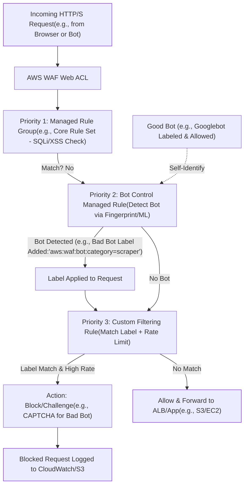
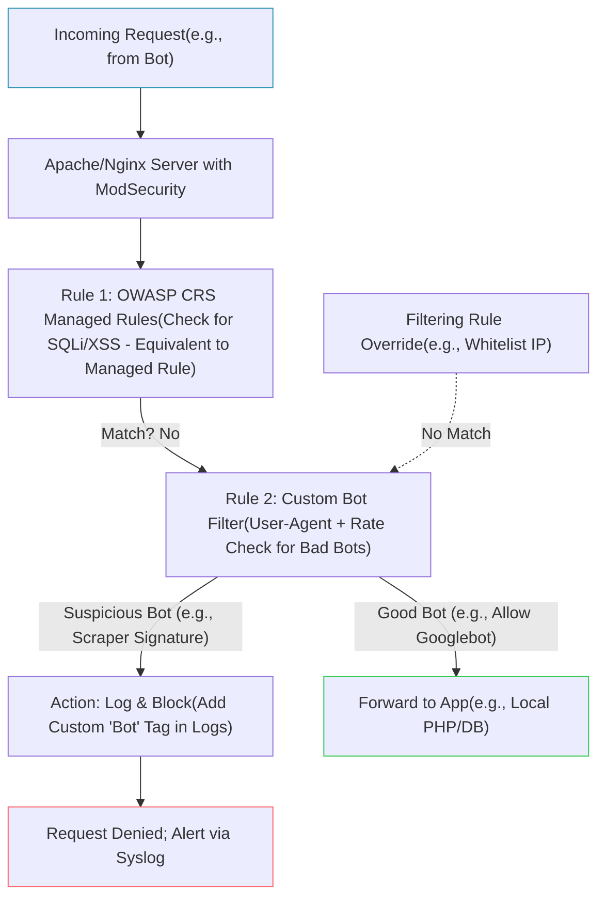

# WAF Resource

## Web Application Firewall Essentials

### 🌟 Overview

🚀 AWS Web Application Firewall (WAF) is a managed service that protects web applications from common exploits like SQL injection, cross-site scripting (XSS), and bots by inspecting HTTP(S) requests and applying customizable rules. It integrates seamlessly with services like ALB, API Gateway, CloudFront, and AppSync, offering global or regional deployment. A deep dive reveals WAF's rule-based architecture: requests flow through a Web ACL (Access Control List) where rules evaluate traffic against criteria, triggering actions like allow, block, or count.

Key components include:

<table><thead><tr><th width="526.7999877929688">Resource</th><th align="center">Icon</th></tr></thead><tbody><tr><td><strong>Rule</strong>: A fundamental unit in a Web ACL that inspects requests (e.g., via IP, geo, headers, body) using statements like string matches or regex. Rules aren't standalone resources but are defined within rule groups or Web ACLs, supporting nested logic (AND/OR/NOT) for complex filtering. Actions can be immediate (block) or deferred, with priorities determining evaluation order.</td><td align="center">
<figure><figcaption></figcaption></figure>
</td></tr><tr><td><strong>Managed Rule</strong>: Pre-built, AWS-maintained rules in rule groups (e.g., Core Rule Set for OWASP Top 10 threats, Bot Control for automated traffic). These are updated automatically for emerging threats, reducing custom maintenance—e.g., the Bot Control group detects bots via signatures and ML as of version 1.18 (June 2025 update improved XSS detection).</td><td align="center"></td></tr><tr><td><strong>Filtering Rule</strong>: Synonymous with Rule in WAFv2; it filters traffic by matching criteria (e.g., URI paths, query strings) to enforce security policies. Often used in rate-based rules to throttle excessive requests, preventing DDoS-like abuse.</td><td align="center"></td></tr><tr><td><strong>Labels</strong>: Key-value metadata (e.g., "aws:waf:bot:name=Googlebot") added to requests by matching rules, persisting through the Web ACL evaluation. Labels enable chained logic—subsequent rules can match them for refined actions—and generate CloudWatch metrics for monitoring/auditing. They're crucial for managed rules, allowing overrides without editing vendor groups.</td><td align="center">
<figure><figcaption></figcaption></figure>
</td></tr><tr><td><strong>Bot</strong>: Automated software (e.g., crawlers, scrapers) generating web requests, which can be benign (search engines) or resource-intensive. WAF detects them via User-Agent inspection, behavior analysis, or ML on traffic patterns like timestamps and fingerprints.</td><td align="center">
<figure><figcaption></figcaption></figure>
</td></tr><tr><td><strong>Bad Bot</strong>: Malicious or abusive bots (e.g., credential stuffers, content scrapers) that evade detection, consume bandwidth, skew analytics, or launch attacks. They often mimic human behavior but are identified by anomalies like rapid requests from single IPs.</td><td align="center">
<figure><figcaption></figcaption></figure>
</td></tr><tr><td><strong>Bot Control</strong>: A specialized managed rule group providing tiered protection (Basic for self-identifying bots; Targeted for sophisticated ones using browser challenges and heuristics; with optional ML for custom sites). It labels bots (e.g., category: scraper), allows actions like CAPTCHA or block, and offers dashboards for visibility. As of 2025, it supports real-time sampling and integrates with Firewall Manager for multi-account rollout.</td><td align="center">
<figure><figcaption></figcaption></figure>
</td></tr></tbody></table>

WAF's latest enhancements, include an updated console for easier rule building and expanded ML for bot heuristics, ensuring adaptive defense without false positives.

### ⚡ Key Usage and Applicable Areas

🛡️ AWS WAF is pivotal for web security in high-traffic apps, e.g., e-commerce sites blocking bots to protect inventory APIs or media platforms filtering XSS in user uploads. Applicable areas:

* **API Protection**: Rate-limiting bad bots on REST/GraphQL endpoints via API Gateway.
* **Content Delivery**: Shielding global sites from exploits with CloudFront integration.
* **Compliance**: OWASP compliance using managed rules for PCI-DSS or GDPR.
* **Bot Management**: Allowing good bots (SEO crawlers) while blocking scrapers in dynamic sites.
* **Analytics Integrity**: Labeling traffic to exclude bots from metrics in marketing dashboards.

### 🗺️ Data Flow Diagram

Below is a Mermaid diagram depicting a request's journey through AWS WAF, focusing on rules, managed rules, labels, and Bot Control for filtering a web request to an ALB-protected app.

**Implementation Steps in Diagram**:

1. Request hits Web ACL; evaluate managed rules first for broad threats.
2. Bot Control inspects for bots, adding labels if matched (e.g., verify User-Agent, challenge suspicious ones).
3. Custom rule filters using labels (e.g., block if "bad bot" label + >100 req/min).
4. Action applied: Log blocks, allow clean traffic to backend.
5. Monitor via CloudWatch metrics on labels for tuning (e.g., adjust thresholds quarterly).

### ⚖️ When to Use and When Not to Use

✅ **When to Use**:

* High-volume web apps needing automated threat mitigation (e.g., managed rules for OWASP compliance).
* Bot-heavy sites like e-commerce to preserve resources and data integrity.
* Multi-account setups via Firewall Manager for consistent labeling and filtering.
* When integrating with ALB/CloudFront for edge protection against DDoS precursors.

❌ **When Not to Use**:

* Low-traffic internal apps where basic VPC security suffices (overkill and adds latency \~1-5ms).
* Static sites without dynamic content (use CloudFront DDoS protection instead).
* Environments requiring zero false positives without tuning (initial setup may block legit bots).
* Cost-sensitive prototypes; Bot Control incurs extra fees (\~$1/million requests).

### 🧩 Alternative Services in AWS/Azure/GCP/On-Premise

| Provider/Service                                | Key Features                                                                                                                            | Differences/Comparisons                                                                                                                  | Pricing/Notes                                                                 |
| ----------------------------------------------- | --------------------------------------------------------------------------------------------------------------------------------------- | ---------------------------------------------------------------------------------------------------------------------------------------- | ----------------------------------------------------------------------------- |
| **AWS WAF**                                     | Rules/managed groups for filtering; labels for chaining; Bot Control with ML detection/labeling. Integrates natively with AWS services. | Rule priorities and labels enable modular logic; Bot Control offers targeted tiers vs. basic blocking. Strong for hybrid bot management. | $5/ACL/mo + $1/million requests; Bot Control +$20/million. Free tier limited. |
| **Azure WAF (Application Gateway/Front Door)**  | Managed rulesets (OWASP); bot manager with JS challenges; labels via custom rules.                                                      | More integrated with Azure AD for auth; bot detection uses ML but lacks AWS's granular labeling. Weaker on custom rule nesting.          | $0.0135/GB processed + rule eval costs; bot manager \~$0.30/1K challenges.    |
| **GCP Cloud Armor**                             | Security policies with rules; adaptive protection for bots/DDoS; labels via metadata.                                                   | Backend-focused; ML auto-tunes rules but no dedicated Bot Control—uses rate limiting. Less emphasis on request labeling.                 | $0.75/policy/mo + $0.005/1K rules; ML features extra.                         |
| **On-Premise: ModSecurity (with Apache/Nginx)** | Open-source WAF rules (OWASP CRS); custom filters; bot detection via plugins (e.g., fail2ban). No native labels—use logs.               | Rule-based like WAF but self-managed; lacks cloud ML for bots. Scalable with hardware but high maintenance.                              | Free software; hardware costs vary (\~$5K+ server).                           |

**On-Premise Alternative Data Flow (ModSecurity Example)**: Mermaid diagram for a request filtered by ModSecurity rules on an Apache server, mimicking WAF bot/bad bot handling.

### 📝 Summary

This WAF setup delivers robust, low-latency web protection by layering rules and labels to intelligently handle threats like bad bots, ensuring app availability without over-blocking.

**Top 8 Points to Keep in Mind**:

1. Start with managed rules (e.g., Bot Control) for quick coverage, then customize with labels to avoid editing vendor groups.
2. Prioritize rules logically: Broad managed rules first, then label-based filters to reduce false positives.
3. Enable logging to S3/Firehose for all blocks; analyze labels in CloudWatch for bot trends.
4. Tune Bot Control levels—Basic for starters, Targeted+ML for high-value sites—to balance security and UX.
5. Test rules in Count mode before blocking to monitor impacts via metrics.
6. Rotate Web ACL associations quarterly; use Firewall Manager for org-wide consistency.
7. Watch costs: Bot Control adds fees—scope to specific paths if budget-constrained.
8. Stay updated via changelog; 2025 versions enhanced bot heuristics for evasive threats.

> **In Short**:\
> AWS WAF safeguards web apps with rules that filter malicious traffic.\
> Managed rules handle common threats; custom filtering rules add precision.\
> Labels tag requests for advanced chaining and monitoring.\
> Bot Control detects/manages good/bad bots via signatures and ML.\
> Overall, it blocks exploits and bots at the edge, integrating seamlessly with AWS services.

***
