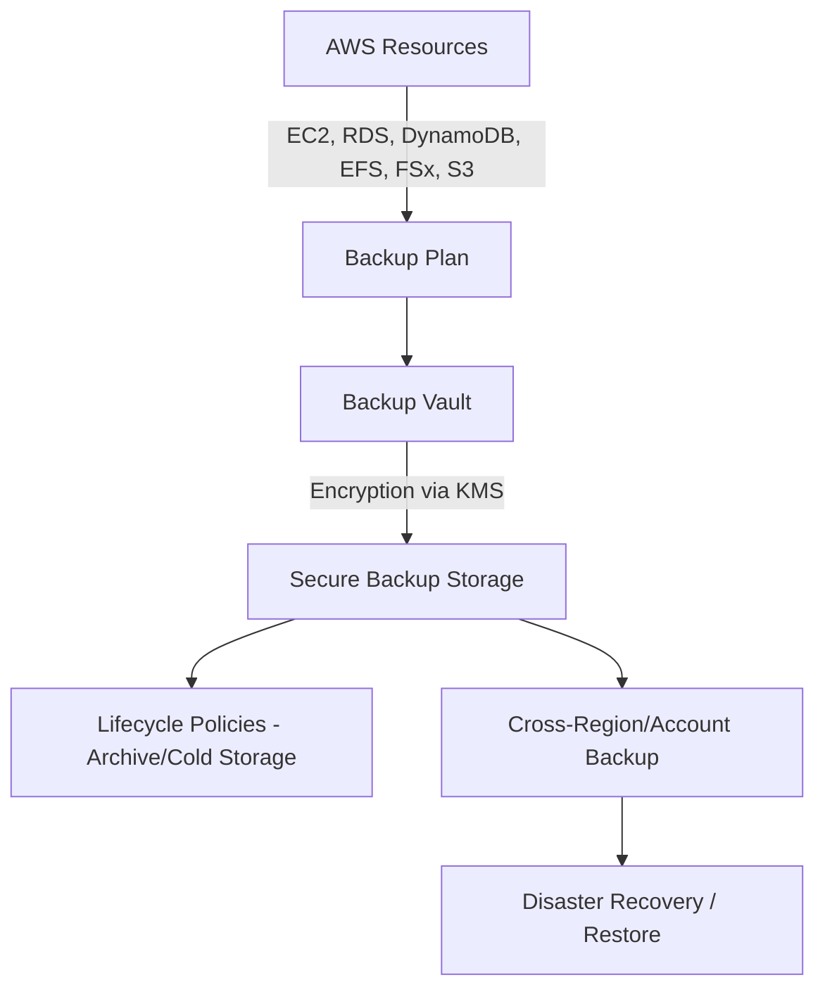
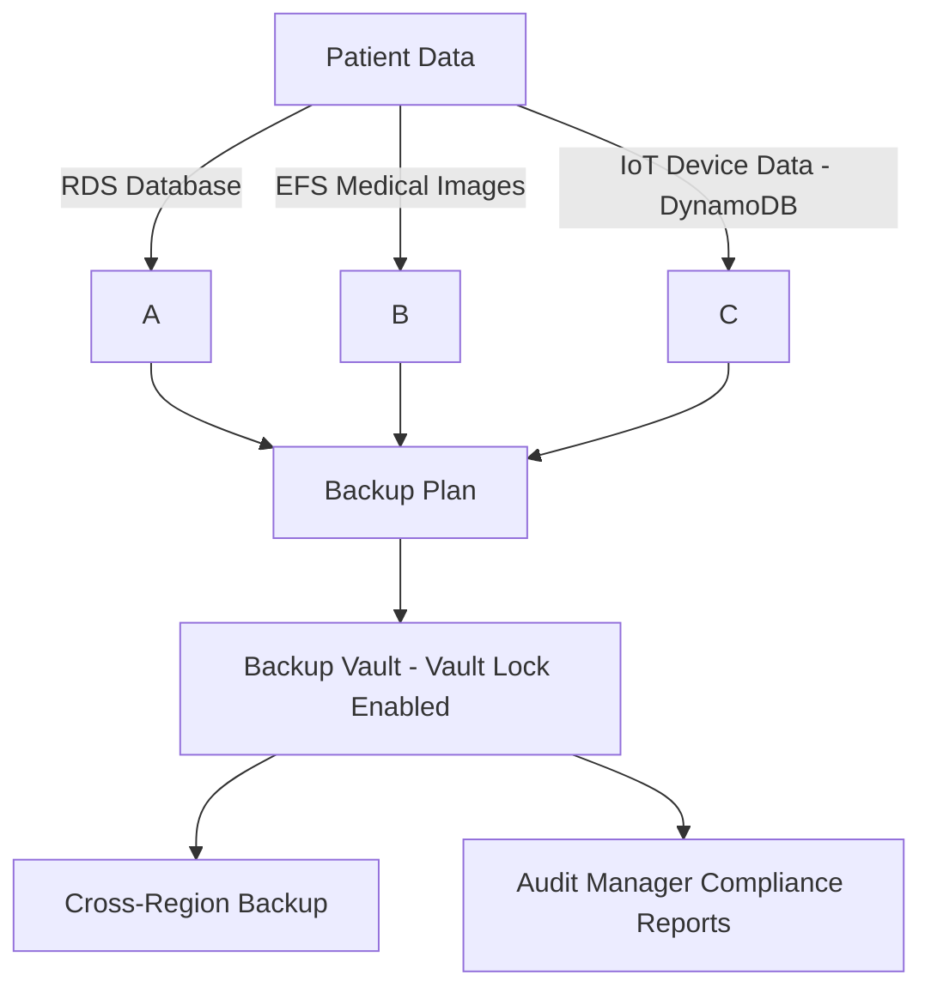
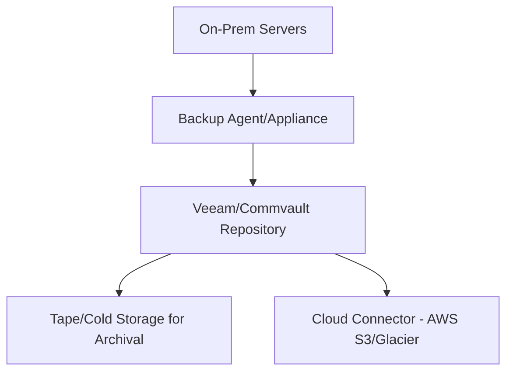

# AWS Backup

## **🛠️ AWS Backup – Unified, Automated, and Secure Data Protection 🚀**

### **🌟 Overview**

AWS Backup is a fully managed, policy-driven service that centralizes and automates data backup across AWS services and hybrid workloads. It eliminates the need for custom scripts and manual processes by providing consistent backup management for resources like Amazon EC2, Amazon RDS, Amazon EFS, Amazon DynamoDB, Amazon FSx, Amazon S3, and even on-premises workloads through AWS Storage Gateway.

<figure><figcaption></figcaption></figure>

With features like backup vaults, backup plans, cross-region & cross-account backups, lifecycle policies, and immutable backups, AWS Backup enables enterprises to meet compliance, disaster recovery, and business continuity requirements with ease.

🤖 Innovation Spotlight (2025 Update):

* Backup Audit Manager for compliance reporting.
* Immutable backups with AWS Backup Vault Lock (protection against ransomware).
* Cross-account backup orchestration using AWS Organizations.
* EBS Snapshots Archive for cost-efficient long-term storage.

***

### **⚡ Problem Statement**

Imagine a healthcare organization storing patient data across Amazon RDS (databases), EFS (medical imaging), and DynamoDB (patient monitoring IoT data). Regulatory compliance (HIPAA/GDPR) requires automated daily backups, retention up to 7 years, and protection from tampering (ransomware attacks).

Manually managing these backups with scripts is error-prone, inconsistent, and costly.

#### **2.1 🤝 Business Use Cases**

* Healthcare: Protect EHR (Electronic Health Records) with immutable backups for compliance.
* Financial Services: Meet audit requirements with centralized backup compliance reports.
* E-commerce: Ensure continuity by backing up product catalogs (DynamoDB) and transactions (RDS).
* Gaming: Safeguard player progress and game state data (EFS/FSx).

***

### **🔥 Core Principles**

* Centralized Backup Management – Create backup plans & policies across AWS accounts.
* Backup Vaults – Encrypted storage for backups with fine-grained IAM access.
* Lifecycle Management – Transition backups to cheaper storage tiers.
* Cross-Region & Cross-Account Backups – Disaster recovery at scale.
* Backup Audit Manager – Governance and compliance visibility.
* Vault Lock (WORM) – Write-once-read-many model for ransomware protection.

***

### **📋 Pre-Requirements**

* AWS Backup Service – For defining policies & vaults.
* IAM Roles & Policies – Least privilege for backup operations.
* KMS Keys – Encryption for backup data.
* AWS Organizations – (Optional) For multi-account backup governance.
* Storage Gateway – To extend AWS Backup to on-prem workloads.

***

### **👣 Implementation Steps**

1. Open AWS Backup Console.
2. Create a Backup Vault (choose KMS encryption).
3. Define a Backup Plan (schedule, retention, lifecycle).
4. Assign Resources (RDS, DynamoDB, EFS, FSx, S3, etc.).
5. Enable Cross-Region/Account Backups if required.
6. Enable Vault Lock for ransomware protection.
7. Monitor & Audit using Backup Audit Manager.

***

### **🗺️ Data Flow Diagram**

#### **Diagram 1 – How AWS Backup Works**

#### **Diagram 2 – Example Use Case (Healthcare Data)**

***

### **🔒 Security Measures**

* Enable KMS encryption for all backups.
* Use Vault Lock to enforce WORM protection.
* Apply least-privilege IAM policies for backup/restore.
* Restrict access with resource-based policies.
* Use Cross-Account isolation for disaster recovery.
* Enable CloudTrail & CloudWatch logs for monitoring.

***

### **⚖️ When to use and when not to use**

✅ When to Use:

* You need centralized, automated backups.
* Compliance requires immutable backups & reporting.
* You want cross-region or cross-account disaster recovery.
* You want to extend backup to on-premises workloads.

❌ When Not to Use:

* You only need ad-hoc, manual snapshots (e.g., one-off testing).
* Your workload already uses third-party enterprise backup suites with AWS integration.

***

### **💰 Costing Calculation**

* Charges based on:
  * Backup storage (per GB-month).
  * Restore (per GB restored).
  * Backup Audit Manager evaluations.
  * Cross-Region transfer costs.

📌 Sample Calculation:

* 2TB RDS Backup in us-east-1 = \~$0.05/GB → \~$100/month.
*   Lifecycle move to Archive Tier (EBS snapshot archive) = \~$0.0125/GB → \~$25/month.

    ➡️ Saving \~75% with lifecycle policies.

***

### **🧩 Alternative Services**

| Platform | Equivalent Service          | Key Difference                                            |
| -------- | --------------------------- | --------------------------------------------------------- |
| AWS      | AWS Backup                  | Native, centralized, multi-service integration            |
| Azure    | Azure Backup                | Strong VM & SQL backup, limited cross-account flexibility |
| GCP      | Google Backup & DR          | Good for VM workloads, fewer integrations than AWS        |
| On-Prem  | Veeam, Commvault, NetBackup | Rich feature set, needs infrastructure & licensing        |

#### **On-Prem Backup Flow Example**

***

### **✅ Benefits**

* Centralized policy-driven backup.
* Compliance-ready with immutability & audit.
* Cost savings via lifecycle tiering.
* Seamless hybrid backup support.
* Disaster recovery with cross-region resilience.

***

### **📝 Summary**

AWS Backup is a unified, automated, and secure way to protect AWS and on-prem workloads. It enables compliance, cost efficiency, and disaster recovery with minimal management overhead.

Top 5 Takeaways:

1. Centralized backup for AWS & hybrid workloads.
2. Immutable vault lock protects against ransomware.
3. Lifecycle management saves costs.
4. Audit Manager ensures compliance visibility.
5. Scales seamlessly across accounts & regions.

👉 In short: AWS Backup automates, secures, and optimizes data protection across the cloud and hybrid environments.

***

### **🔗 Related Topics**

* [AWS Backup Documentation](https://docs.aws.amazon.com/aws-backup/)
* [AWS Backup Pricing](https://aws.amazon.com/backup/pricing/)
* [AWS Storage Gateway](https://aws.amazon.com/storagegateway/)
* [AWS Well-Architected Framework – Reliability Pillar](https://docs.aws.amazon.com/wellarchitected/latest/reliability-pillar/)

***
