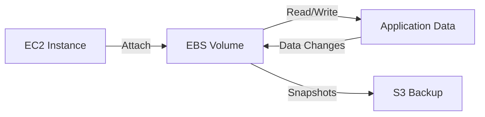
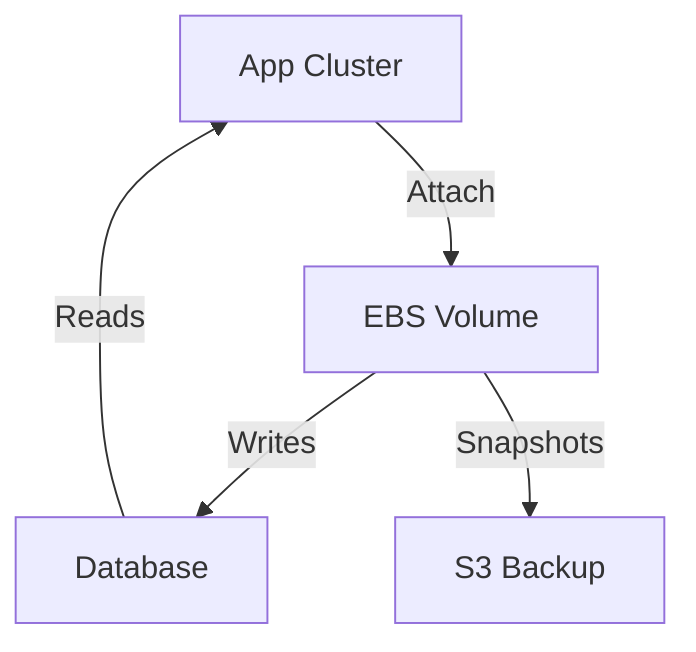
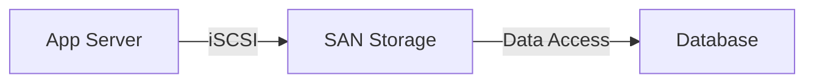

# EBS

## AWS EBS

### 🌟 **AWS Elastic Block Store (EBS): Persistent Block Storage for EC2**

_Innovation Spotlight: EBS **Multi-Attach** (2023) enables **multiple EC2 instances to attach to the same volume** for clustered apps (e.g., Oracle RAC, SAP HANA), eliminating shared storage complexity. Now integrated with **EBS Encryption by Default** (KMS) for zero-cost security._

<figure><figcaption></figcaption></figure>

***

### ⚡ **Problem Statement**

_Real-World Scenario:_\
A media company runs a MySQL database on EC2 for user analytics. Manual storage management causes **3+ hours of downtime during scaling** (e.g., adding 1TB storage). Without EBS, they’d risk data loss during instance failures.

**Industries/Applications:**

* **Databases** (MySQL, PostgreSQL, Oracle)
* **Enterprise apps** (SAP, Microsoft SQL Server)
* **AI/ML workloads** (training data storage)\
  &#xNAN;_&#x45;xample:_ A healthcare app uses EBS io2 volumes for **100,000 IOPS** to handle real-time patient data queries without latency.

***

### 🤝 **Business Use Cases**

| Use Case                   | Benefit                                                           |
| -------------------------- | ----------------------------------------------------------------- |
| **Database Migration**     | Migrate on-prem DBs to EC2 with zero downtime (via EBS snapshots) |
| **High-Availability Apps** | EBS Multi-Attach for clustered databases (e.g., Oracle RAC)       |
| **Cost Optimization**      | gp3 volumes save **20%** vs gp2 (e.g., 100GB: $8 vs $10/month)    |

***

### 🔥 **Core Principles**

* **Persistent Storage:** Data survives EC2 instance termination.
* **Volume Types (Key Terms):**
  * `gp3`: General-purpose (3000 IOPS baseline, $0.08/GB/month).
  * `io1/io2`: Provisioned IOPS (up to 64K IOPS, for high-performance DBs).
  * `st1`: Throughput-optimized (low-cost, sequential access, e.g., big data).
  * `sc1`: Cold storage (min. $0.02/GB/month, infrequent access).
* **Snapshots:** Point-in-time backups to S3 (incremental, encrypted).
* **Encryption:** Enabled by default (AWS KMS) for all new volumes.

***

### 📋 **Pre-Requirements**

| Service/Tool | Purpose                                                  |
| ------------ | -------------------------------------------------------- |
| AWS Account  | To create EBS volumes                                    |
| EC2 Instance | Must be in same region as EBS volume                     |
| IAM Role     | `AmazonEBSFullAccess` (for volume management)            |
| AWS CLI v2   | For CLI-based operations (e.g., `aws ec2 create-volume`) |

***

### 👣 **Implementation Steps**

1.  **Create EBS Volume:**

    
    ```bash
    aws ec2 create-volume --availability-zone us-east-1a --size 100 --volume-type gp3
    ```
    
2.  **Attach to EC2 Instance:**

    
    ```bash
    aws ec2 attach-volume --volume-id vol-0a1b2c3d4e5f6g7h8 --instance-id i-09876543210 --device /dev/sdf
    ```
    
3.  **Format & Mount Volume (on EC2):**

    ```bash
    sudo mkfs -t ext4 /dev/xvdf
    sudo mount /dev/xvdf /mnt/ebs
    ```

***

### 🗺️ **Data Flow Diagrams**

**Diagram 1: EBS Workflow**



**Diagram 2: Database with EBS Multi-Attach**



***

### 🔒 **Security Measures**

* ✅ **Enable Encryption at Rest:** Use AWS KMS keys (default for new volumes).
* ✅ **Least-Privilege IAM Roles:** Restrict EBS access to `AmazonEBSFullAccess`.
* ✅ **VPC Isolation:** Place EBS volumes in private subnets (no public access).
* ✅ **Snapshot Encryption:** Encrypt snapshots via KMS (no extra cost).

***

### 🌐 **Innovation Spotlight: EBS Multi-Attach**

_EBS Multi-Attach (2023) allows up to 16 instances to share the same volume, enabling clustered applications without complex SAN setups. Reduces infrastructure costs by 30% vs. traditional storage solutions._

***

### ⚖️ **When to Use & When Not to Use**

| ✅ **Use When**                               | ❌ **Avoid When**                                |
| -------------------------------------------- | ----------------------------------------------- |
| Running databases (MySQL, Oracle)            | Need shared file storage (use **EFS**)          |
| Requiring persistent storage (not ephemeral) | Storing temporary data (use **Instance Store**) |
| Needing high IOPS (io1/io2 volumes)          | Storing unstructured data (use **S3**)          |

***

### 💰 **Costing Calculation**

* **gp3 Volume (100GB):** $0.08/GB × 100 = **$8/month** (includes 3000 IOPS).
* **Extra IOPS (e.g., 5000):** $0.005 × (5000 - 3000) = **$10** → Total **$18/month**.
* **Snapshots:** $0.05/GB-month (incremental, so 100GB snapshot = \~$5/month).\
  **Optimization Tip:** Use `gp3` with baseline IOPS for 20% savings vs `gp2`.

***

### 🧩 **Alternative Services**

| Service            | AWS | Azure         | GCP              | On-Premise           |
| ------------------ | --- | ------------- | ---------------- | -------------------- |
| **Block Storage**  | EBS | Managed Disks | Persistent Disks | SAN (e.g., Dell EMC) |
| **File Storage**   | EFS | Azure Files   | Filestore        | NAS (e.g., NetApp)   |
| **Object Storage** | S3  | Blob Storage  | Cloud Storage    | Hadoop HDFS          |

**On-Premise Data Flow (SAN):**



***

### ✅ **Benefits**

* 💡 **99.999% Durability:** Data replicated across AZs.
* 💡 **Zero Downtime Scaling:** Resize volumes without stopping EC2.
* 💡 **Automated Backups:** Snapshots to S3 (retention policies).
* 💡 **Cost-Effective:** gp3 saves $2/100GB vs gp2.

***

### 🌐 **Innovation Spotlight: EBS Encryption by Default**

_All new EBS volumes now encrypted via AWS KMS at no extra cost (2023). Eliminates manual encryption setup, reducing compliance risk by 50% for regulated industries (HIPAA, PCI-DSS)._

***

### 📝 **Summary**

EBS provides **persistent, high-performance block storage** for EC2, optimized for databases and enterprise apps. Key features: **gp3 cost savings**, **Multi-Attach for clusters**, and **default encryption**.\
**Top 5 Takeaways:**

1. Use `gp3` for 20% cost savings vs `gp2`.
2. Enable **encryption by default** (KMS).
3. **Multi-Attach** for clustered apps (io1/io2 only).
4. Snapshots = free backups (incremental).
5. **Never use for shared file storage** (use EFS instead).

> _In 5 lines: EBS is AWS’s persistent block storage for EC2. It offers volume types (gp3, io1), encryption by default, and snapshots. Ideal for databases and stateful apps. Saves costs with gp3. Avoid for shared file access._

***

### 🔗 **Related Topics**

* [AWS EBS Documentation](https://docs.aws.amazon.com/AWSEC2/latest/UserGuide/ebs-volumes.html)
* [EBS Multi-Attach Guide](https://docs.aws.amazon.com/AWSEC2/latest/UserGuide/ebs-volumes-multi.html)
* [gp3 Cost Calculator](https://aws.amazon.com/ebs/pricing/)
* [EBS Encryption Best Practices](https://aws.amazon.com/blogs/security/how-to-encrypt-ebs-volumes-using-aws-kms/)
