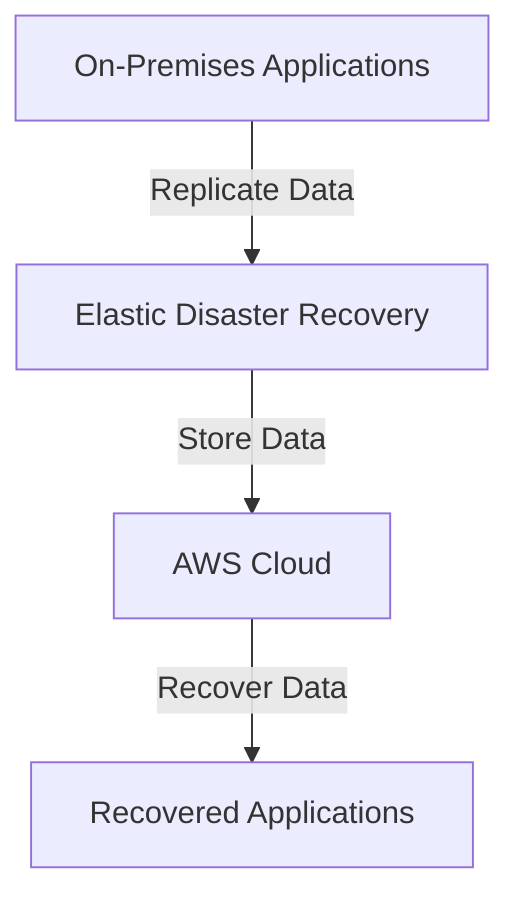
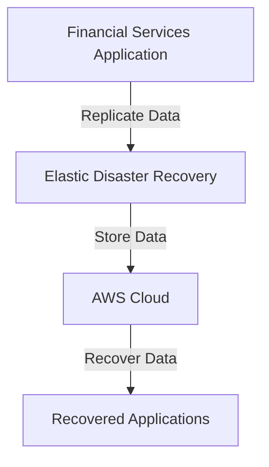

# EDR

## AWS Elastic Disaster Recovery

### 🌟 Overview

**AWS Elastic Disaster Recovery (DRS)** is a service that helps you prepare for and recover from disasters by enabling you to quickly and easily recover your applications and data in the event of an outage or disaster. It provides a cost-effective and scalable solution for disaster recovery, allowing you to replicate your critical applications and data to AWS and recover them in minutes.

<figure><figcaption></figcaption></figure>

**🤖 Innovation Spotlight** As of today, AWS Elastic Disaster Recovery has introduced several innovative features, including enhanced automation for recovery processes, improved integration with other AWS services like Amazon RDS and Amazon EBS, and support for cross-region replication.

### ⚡ Problem Statement

Consider a scenario where a company needs to ensure business continuity in the event of a disaster. They require a solution that allows them to quickly recover their critical applications and data with minimal downtime.

For example, a financial services company wants to ensure that their critical applications and data are protected and can be quickly recovered in the event of a disaster. They need a solution that provides automated recovery processes and minimal downtime.

### 🤝 Business Use Cases

1. **Disaster Recovery**: Using AWS Elastic Disaster Recovery to recover critical applications and data in the event of a disaster.
2. **Business Continuity**: Ensuring business continuity by replicating critical applications and data to AWS.
3. **Data Protection**: Protecting critical data by replicating it to AWS and ensuring it can be quickly recovered.
4. **Compliance**: Meeting compliance requirements by implementing a robust disaster recovery solution.

### 🔥 Core Principles

**Foundational Concepts:**

* **Disaster Recovery**: Elastic Disaster Recovery helps you prepare for and recover from disasters by enabling you to quickly and easily recover your applications and data.
* **Automation**: Elastic Disaster Recovery provides automated recovery processes to minimize downtime.
* **Scalability**: Elastic Disaster Recovery is designed to scale horizontally, allowing you to protect and recover any amount of data.
* **Cost-Effectiveness**: Elastic Disaster Recovery provides a cost-effective solution for disaster recovery.

**Resource Services Terms:**

* **Recovery Plan**: A plan that defines the recovery process for your applications and data.
* **Replication Configuration**: The configuration that defines how your data is replicated to AWS.
* **Recovery Point Objective (RPO)**: The maximum amount of data loss that is acceptable in the event of a disaster.
* **Recovery Time Objective (RTO)**: The maximum amount of time that is acceptable for recovery in the event of a disaster.

### 📋 Pre-Requirements

1. **AWS Account**: You need an AWS account to create and manage Elastic Disaster Recovery resources.
2. **AWS CLI**: The AWS Command Line Interface (CLI) is useful for managing Elastic Disaster Recovery resources from the command line.
3. **AWS SDKs**: The AWS Software Development Kits (SDKs) are useful for integrating Elastic Disaster Recovery with your applications.
4. **IAM Permissions**: Proper IAM permissions are required to access and manage Elastic Disaster Recovery resources.

### 👣 Implementation Steps

1. **Set Up Replication**:
   * Log in to the AWS Management Console.
   * Navigate to the Elastic Disaster Recovery service.
   * Click on "Set Up Replication" and follow the prompts to configure your replication settings.
2. **Create a Recovery Plan**:
   * Define the recovery process for your applications and data by creating a recovery plan.
   * Specify the Recovery Point Objective (RPO) and Recovery Time Objective (RTO) for your applications and data.
3. **Monitor and Manage**:
   * Use the AWS Management Console to monitor and manage your Elastic Disaster Recovery resources.
4. **Test Recovery**:
   * Regularly test your recovery plan to ensure that your applications and data can be quickly recovered in the event of a disaster.

### 🗺️ Data Flow Diagram

**Diagram 1: How Elastic Disaster Recovery Works**

**Diagram 2: Example Use Case**

### 🔒 Security Measures

1. **Encryption at Rest**: Enable encryption at rest to protect your data when it is stored on disk.
2. **Encryption in Transit**: Enable encryption in transit to protect your data as it travels over the network.
3. **IAM Policies**: Use IAM policies to manage access to your Elastic Disaster Recovery resources.
4. **Network Security**: Use network security groups and firewalls to control access to your Elastic Disaster Recovery resources.
5. **Regular Backups**: Set up regular backups to ensure you can recover your data in case of a failure.

### 💰 Costing Calculation

**How it is calculated?** Elastic Disaster Recovery pricing is based on the amount of data replicated, the number of recovery plans, and the amount of storage used. You pay for the data replicated, the recovery plans you create, and the storage you use.

**Efficient way of handling this service:**

* Use Elastic Disaster Recovery for applications that require minimal downtime in the event of a disaster.
* Monitor your usage with Amazon CloudWatch to identify opportunities for cost savings.

**Sample Calculations:**

* **Replication Cost**: Suppose you replicate 1 TB of data, which costs $0.02 per GB-month. The cost would be approximately $20 per month.
* **Recovery Plan Cost**: Suppose you create 10 recovery plans, which cost $0.10 per plan-month. The cost would be approximately $1 per month.

### 🧩 Alternative Services in AWS/Azure/GCP/On-Premise

| Service                        | Provider   | Key Differences                                                                            |
| ------------------------------ | ---------- | ------------------------------------------------------------------------------------------ |
| Azure Site Recovery            | Azure      | A disaster recovery solution that helps you protect and recover your applications and data |
| Google Cloud Disaster Recovery | GCP        | A disaster recovery solution that helps you protect and recover your applications and data |
| On-Premise Disaster Recovery   | On-Premise | Local disaster recovery solutions with full control over data                              |

### ✅ Benefits

1. **Disaster Recovery**: Elastic Disaster Recovery helps you prepare for and recover from disasters by enabling you to quickly and easily recover your applications and data.
2. **Automation**: Elastic Disaster Recovery provides automated recovery processes to minimize downtime.
3. **Scalability**: Elastic Disaster Recovery is designed to scale horizontally, allowing you to protect and recover any amount of data.
4. **Cost-Effectiveness**: Elastic Disaster Recovery provides a cost-effective solution for disaster recovery.
5. **Integration**: Elastic Disaster Recovery integrates with other AWS services like Amazon RDS and Amazon EBS.

### 📝 Summary

**Top 5 Points to Keep in Mind:**

1. Elastic Disaster Recovery is a service that helps you prepare for and recover from disasters by enabling you to quickly and easily recover your applications and data.
2. Elastic Disaster Recovery provides automated recovery processes to minimize downtime.
3. Elastic Disaster Recovery pricing is based on the amount of data replicated, the number of recovery plans, and the amount of storage used.
4. Elastic Disaster Recovery provides a cost-effective solution for disaster recovery.
5. Elastic Disaster Recovery integrates with other AWS services like Amazon RDS and Amazon EBS.

> **In Short:** AWS Elastic Disaster Recovery is a service that helps you prepare for and recover from disasters by enabling you to quickly and easily recover your applications and data in the event of an outage or disaster.

***

### 🔗 Related Topics

* [AWS Elastic Disaster Recovery Documentation](https://docs.aws.amazon.com/drs/latest/userguide/what-is-drs.html)
* [Elastic Disaster Recovery Best Practices](https://docs.aws.amazon.com/drs/latest/userguide/best-practices.html)
* [Elastic Disaster Recovery Pricing](https://aws.amazon.com/disaster-recovery/pricing/)
