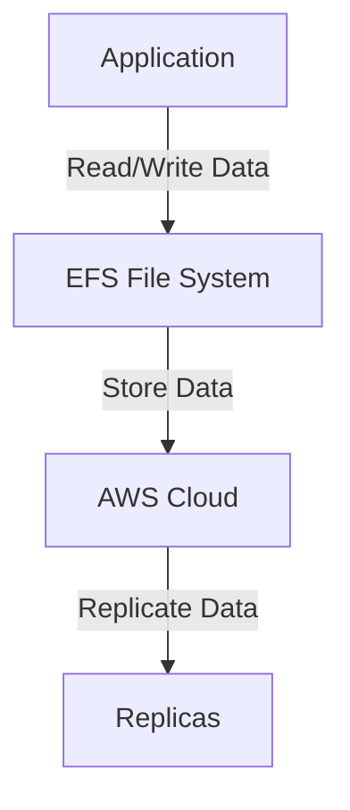

# EFS

## AWS - EFS

### 🌟 Overview

**AWS Elastic File System (EFS)** is a fully managed, scalable, and elastic file storage service for use with AWS Cloud services and on-premises resources. It is designed to provide a simple, serverless, set-and-forget elastic file system that grows and shrinks automatically as you add and remove files.

<figure><figcaption></figcaption></figure>

**🤖 Innovation Spotlight** As of today, AWS EFS has introduced several innovative features, including enhanced performance with faster data access, improved integration with other AWS services like Amazon EC2 and Amazon RDS, and support for Amazon EFS Access Points, which simplify the management of application access to shared datasets.

### ⚡ Problem Statement

Consider a scenario where a company needs to store and manage large amounts of unstructured data, such as images, videos, and log files, that need to be accessed by multiple applications and users concurrently. They require a storage solution that provides low-latency access, scalability, and high availability.

For example, a media company wants to store and serve high-definition videos to users around the world. They need a storage solution that can handle large files and provide low-latency access to multiple users and applications simultaneously.

### 🤝 Business Use Cases

1. **Media Storage and Delivery**: Storing and serving media files like images, videos, and music.
2. **Content Management Systems**: Managing content for websites and mobile applications.
3. **Big Data Analytics**: Storing data for big data analytics and processing.
4. **Enterprise Applications**: Supporting enterprise applications that require shared file storage.

### 🔥 Core Principles

**Foundational Concepts:**

* **Elasticity**: EFS automatically grows and shrinks as you add and remove files.
* **Scalability**: EFS is designed to scale horizontally, allowing you to store and retrieve any amount of data.
* **High Availability**: EFS provides high availability with multiple availability zones.
* **Durability**: EFS provides high durability with multiple copies of data stored across different facilities.

**Resource Services Terms:**

* **File System**: A collection of files and directories that is stored in EFS.
* **Mount Target**: A resource that allows you to mount an EFS file system on an EC2 instance or on-premises server.
* **Access Point**: A resource that simplifies the management of application access to shared datasets.
* **Lifecycle Management**: A feature that automatically moves files to different storage classes based on access patterns.

### 📋 Pre-Requirements

1. **AWS Account**: You need an AWS account to create and manage EFS resources.
2. **AWS CLI**: The AWS Command Line Interface (CLI) is useful for managing EFS resources from the command line.
3. **AWS SDKs**: The AWS Software Development Kits (SDKs) are useful for integrating EFS with your applications.
4. **IAM Permissions**: Proper IAM permissions are required to access and manage EFS resources.

### 👣 Implementation Steps

1. **Create an EFS File System**:
   * Log in to the AWS Management Console.
   * Navigate to the EFS service.
   * Click on "Create File System" and follow the prompts to configure your file system.
2. **Create Mount Targets**:
   * Create mount targets to allow your EC2 instances or on-premises servers to access the EFS file system.
3. **Mount the File System**:
   * Use the Amazon EFS mount helper or standard Linux mount commands to mount the file system on your EC2 instances or on-premises servers.
4. **Configure Access Points**:
   * Create access points to simplify the management of application access to shared datasets.
5. **Set Up Lifecycle Management**:
   * Configure lifecycle management to automatically move files to different storage classes based on access patterns.

### 🗺️ Data Flow Diagram

**Diagram 1: How EFS Works**

**Diagram 2: Example Use Case**

### 🔒 Security Measures

1. **Encryption at Rest**: Enable encryption at rest to protect your data when it is stored on disk.
2. **Encryption in Transit**: Enable encryption in transit to protect your data as it travels over the network.
3. **IAM Policies**: Use IAM policies to manage access to your EFS resources.
4. **Network Security**: Use network security groups and firewalls to control access to your EFS resources.
5. **Regular Backups**: Set up regular backups to ensure you can recover your data in case of a failure.

### 💰 Costing Calculation

**How it is calculated?** EFS pricing is based on the amount of data stored and the amount of data read and written. You pay for the storage you use and the data you read and write.

**Efficient way of handling this service:**

* Use EFS for applications that require low-latency access to data.
* Monitor your usage with Amazon CloudWatch to identify opportunities for cost savings.

**Sample Calculations:**

* **Storage Cost**: Suppose you store 1 TB of data in the EFS Standard storage class, which costs $0.30 per GB-month. The cost would be approximately $300 per month.
* **Data Transfer Cost**: Suppose you read and write 100 GB of data, which costs $0.30 per GB. The cost would be approximately $30 per month.

### 🧩 Alternative Services in AWS/Azure/GCP/On-Premise

| Service                 | Provider   | Key Differences                                                                          |
| ----------------------- | ---------- | ---------------------------------------------------------------------------------------- |
| Azure Files             | Azure      | Fully managed file shares in the cloud accessible via the industry standard SMB protocol |
| Google Cloud Filestore  | GCP        | Managed file storage for applications running on Google Cloud or on-premises             |
| On-Premise File Storage | On-Premise | Local file storage solutions with full control over data                                 |

### ✅ Benefits

1. **Elasticity**: EFS automatically grows and shrinks as you add and remove files.
2. **Scalability**: EFS is designed to scale horizontally, allowing you to store and retrieve any amount of data.
3. **High Availability**: EFS provides high availability with multiple availability zones.
4. **Durability**: EFS provides high durability with multiple copies of data stored across different facilities.
5. **Cost-Effective**: EFS is cost-effective with pay-as-you-go pricing and multiple storage classes to choose from.

### 📝 Summary

**Top 5 Points to Keep in Mind:**

1. EFS is a fully managed, scalable, and elastic file storage service for use with AWS Cloud services and on-premises resources.
2. EFS automatically grows and shrinks as you add and remove files.
3. EFS pricing is based on the amount of data stored and the amount of data read and written.
4. EFS provides high availability with multiple availability zones.
5. EFS provides high durability with multiple copies of data stored across different facilities.

> **In Short:** AWS Elastic File System (EFS) is a fully managed, scalable, and elastic file storage service that grows and shrinks automatically as you add and remove files. It is designed to provide a simple, serverless, set-and-forget elastic file system.

### 🔗 Related Topics

* [AWS EFS Documentation](https://docs.aws.amazon.com/efs/latest/ug/whatisefs.html)
* [EFS Best Practices](https://docs.aws.amazon.com/efs/latest/ug/best-practices.html)
* [EFS Pricing](https://aws.amazon.com/efs/pricing/)
