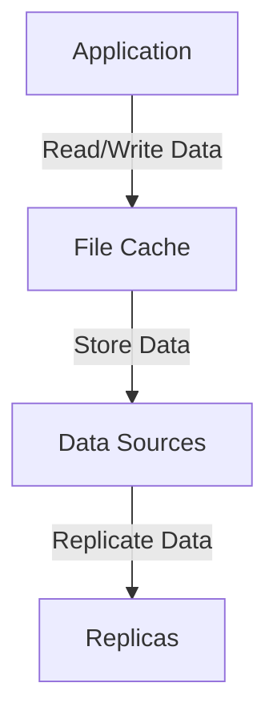
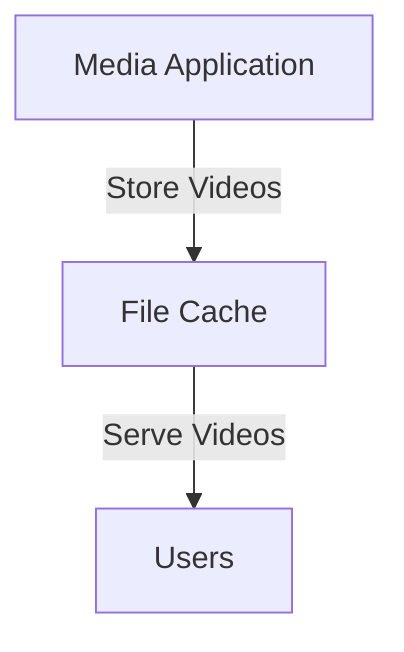

# File Cache

## File Cache

### 🌟 Overview

**AWS File Cache** is a fully managed service that provides a high-performance, scalable file storage solution for your applications. It is designed to provide low-latency access to your data, making it ideal for applications that require fast access to large amounts of data.

<figure><figcaption></figcaption></figure>

**🤖 Innovation Spotlight**

As of today, AWS File Cache has introduced several innovative features, including enhanced performance with faster data access and improved integration with other AWS services like Amazon S3 and Amazon EFS.

### ⚡ Problem Statement

Consider a scenario where a company needs to store and manage large amounts of unstructured data, such as images, videos, and log files. They require a storage solution that provides low-latency access to their data while also being scalable and cost-effective.

For example, a media company wants to store and serve high-definition videos to users around the world. They need a storage solution that can handle large files and provide low-latency access.

### 🤝 Business Use Cases

1. **Media Storage and Delivery**: Storing and serving media files like images, videos, and music.
2. **Data Backup and Archival**: Backing up critical data and archiving old data for compliance purposes.
3. **Big Data Analytics**: Storing data for big data analytics and processing.
4. **Disaster Recovery**: Storing critical data for disaster recovery purposes.

### 🔥 Core Principles

**Foundational Concepts:**

* **File Storage**: File Cache provides a file storage solution that is designed for low-latency access.
* **Scalability**: File Cache is designed to scale horizontally, allowing you to store and retrieve any amount of data.
* **Durability**: File Cache provides high durability with multiple copies of data stored across different facilities.
* **Availability**: File Cache offers high availability with multiple availability zones.

**Resource Services Terms:**

* **Cache**: A high-performance storage layer that provides low-latency access to your data.
* **Dataset**: The collection of data that is stored in your cache.
* **Endpoint**: The network endpoint that is used to access your cache.

### 📋 Pre-Requirements

1. **AWS Account**: You need an AWS account to create and manage File Cache resources.
2. **AWS CLI**: The AWS Command Line Interface (CLI) is useful for managing File Cache resources from the command line.
3. **AWS SDKs**: The AWS Software Development Kits (SDKs) are useful for integrating File Cache with your applications.
4. **IAM Permissions**: Proper IAM permissions are required to access and manage File Cache resources.

### 👣 Implementation Steps

1. **Create a File Cache**:
   * Log in to the AWS Management Console.
   * Navigate to the File Cache service.
   * Click on "Create Cache" and follow the prompts to configure your cache.
2. **Configure Data Sources**:
   * Configure the data sources for your cache, including the type of data (e.g., files, objects) and the location of the data.
3. **Set Up Data Synchronization**:
   * Configure data synchronization between your cache and your data sources.
4. **Monitor and Manage**:
   * Use the AWS Management Console to monitor and manage your File Cache resources.

### 🗺️ Data Flow Diagram

**Diagram 1: How File Cache Works**

**Diagram 2: Example Use Case**

### 🔒 Security Measures

1. **Encryption at Rest**: Enable encryption at rest to protect your data when it is stored on disk.
2. **Encryption in Transit**: Enable encryption in transit to protect your data as it travels over the network.
3. **IAM Policies**: Use IAM policies to manage access to your File Cache resources.
4. **Network Security**: Use network security groups and firewalls to control access to your File Cache.
5. **Regular Backups**: Set up regular backups to ensure you can recover your data in case of a failure.

### 💰 Costing Calculation

**How it is calculated?**

File Cache pricing is based on the amount of data stored, the number of requests made, and data transfer. You pay for the storage you use, the requests you make, and the data you transfer.

**Efficient way of handling this service:**

* Use File Cache for applications that require low-latency access to data.
* Monitor your usage with Amazon CloudWatch to identify opportunities for cost savings.

**Sample Calculations:**

* **Storage Cost**: Suppose you store 1 TB of data in the File Cache, which costs $0.10 per GB-month. The cost would be approximately $100 per month.
* **Request Cost**: Suppose you make 10,000 GET requests, which cost $0.0004 per 1,000 requests. The cost would be approximately $4 per month.

### 🧩 Alternative Services in AWS/Azure/GCP/On-Premise

| Service                 | Provider   | Key Differences                                                                           |
| ----------------------- | ---------- | ----------------------------------------------------------------------------------------- |
| Azure File Storage      | Azure      | Fully managed file shares in the cloud accessible via the industry standard SMB protocol. |
| Google Cloud Filestore  | GCP        | Managed file storage for applications running on Google Cloud or on-premises              |
| On-Premise File Storage | On-Premise | Local file storage solutions with full control over data                                  |

### ✅ Benefits

1. **Low-Latency Access**: File Cache provides low-latency access to your data.
2. **Scalability**: File Cache is designed to scale horizontally, allowing you to store and retrieve any amount of data.
3. **Durability**: File Cache provides high durability with multiple copies of data stored across different facilities.
4. **Availability**: File Cache offers high availability with multiple availability zones.
5. **Cost-Effective**: File Cache is cost-effective with pay-as-you-go pricing and multiple storage classes to choose from.

### 📝 Summary

**Top 5 Points to Keep in Mind:**

1. File Cache is a fully managed service that provides a high-performance, scalable file storage solution for your applications.
2. File Cache provides low-latency access to your data.
3. File Cache pricing is based on the amount of data stored, the number of requests made, and data transfer.
4. File Cache provides high durability with multiple copies of data stored across different facilities.
5. File Cache is cost-effective with pay-as-you-go pricing and multiple storage classes to choose from.

&#x20;

> **In Short:** AWS File Cache is a fully managed service that provides a high-performance, scalable file storage solution for your applications. It is designed to provide low-latency access to your data, making it ideal for applications that require fast access to large amounts of data.

### 🔗 Related Topics

* [AWS File Cache Documentation](https://docs.aws.amazon.com/filecache/latest/userguide/what-is-file-cache.html)
* [File Cache Best Practices](https://docs.aws.amazon.com/filecache/latest/userguide/best-practices.html)
* [File Cache Pricing](https://aws.amazon.com/filecache/pricing/)
