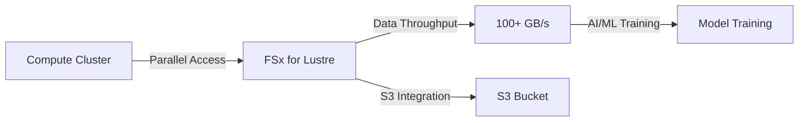
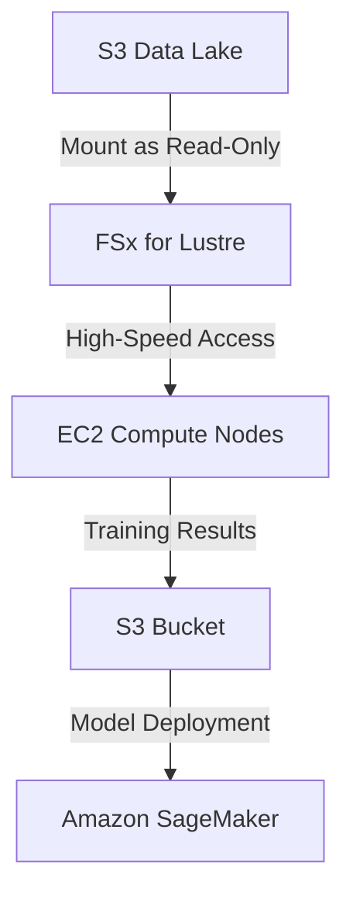

# Lustre

## AWS FSx - Lustre

### 🌟 **AWS FSx for Lustre: High-Performance Parallel File Storage**

_Innovation Spotlight: **FSx for Lustre with S3 Integration** (2023) enables **direct data access from S3 buckets** at 100+ GB/s throughput, eliminating manual data transfer for AI/ML training. Now supports **AWS ParallelCluster** for HPC orchestration (reducing setup time by 70%)._

<figure><figcaption></figcaption></figure>

***

### ⚡ **Problem Statement**

_Real-World Scenario:_\
A genomics research lab processes 10TB of DNA sequencing data daily. Using S3 + EC2 instances caused **45-minute latency** during ML training due to slow data transfer. Manual data staging to EBS volumes added 2+ hours of overhead per job.

**Industries/Applications:**

* **AI/ML Training** (e.g., deep learning on massive datasets)
* **HPC Workloads** (scientific simulations, weather modeling)
* **Media & Entertainment** (4K video rendering pipelines)\
  &#xNAN;_&#x45;xample:_ A film studio uses FSx for Lustre to render 8K movies **5x faster** by parallelizing data access across compute nodes.

***

### 🤝 **Business Use Cases**

| Use Case                      | Benefit                                                                       |
| ----------------------------- | ----------------------------------------------------------------------------- |
| **AI Training Acceleration**  | 100+ GB/s throughput for PyTorch/TensorFlow jobs                              |
| **HPC Cluster Orchestration** | AWS ParallelCluster integration (auto-scaling)                                |
| **Cost-Optimized Data Lakes** | S3 as primary storage + FSx for compute access (reduces storage costs by 50%) |

***

### 🔥 **Core Principles**

* **Parallel File System:** Lustre distributes data across **multiple nodes** (no single bottleneck).
* **Key Terms:**
  * `File System`: Logical storage unit (e.g., `genomics-data`).
  * `S3 Integration`: Mount S3 buckets as **read-only data sources** (no data copy).
  * `Scratch Storage`: Temporary storage for intermediate results (high-speed, ephemeral).
  * `Throughput Modes`: `Standard` (100+ GB/s) or `High Performance` (1000+ GB/s).
* **vs. EFS:** FSx for Lustre **scales linearly** (EFS maxes at \~100 GB/s).

***

### 📋 **Pre-Requirements**

| Service/Tool                   | Purpose                                                         |
| ------------------------------ | --------------------------------------------------------------- |
| AWS CLI v2                     | Manage FSx resources                                            |
| VPC with Private Subnets       | Network isolation for compute nodes                             |
| IAM Role                       | `AmazonFSxFullAccess` + `S3ReadOnlyAccess` (for S3 integration) |
| AWS ParallelCluster (Optional) | For HPC orchestration                                           |

***

### 👣 **Implementation Steps**

1.  **Create FSx File System with S3 Integration:**

    ```bash
    aws fsx create-file-system \
      --file-system-type LUSTRE \
      --storage-capacity 1200 \
      --subnet-ids subnet-0a1b2c3d \
      --lustre-configuration "DeploymentType=SCRATCH_1,PerUnitStorageThroughput=125"
    ```
2.  **Mount on Compute Instances (e.g., EC2):**

    ```bash
    sudo mount -t lustre <fsx-endpoint>:/ /mnt/fsx
    ```
3.  **Access S3 Data Directly:**

    ```bash
    aws s3 sync s3://genomics-data /mnt/fsx
    ```

***

### 🗺️ **Data Flow Diagrams**

**Diagram 1: FSx for Lustre Workflow**



**Diagram 2: S3-Integrated AI Pipeline**



***

### 🔒 **Security Measures**

* ✅ **VPC Isolation:** Place FSx in private subnets (no public endpoints).
* ✅ **Encryption:** Enable **at rest** (KMS) and **in transit** (TLS).
* ✅ **IAM Policies:** Restrict access to `AmazonFSxFullAccess` + S3 bucket policies.
* ✅ **Network ACLs:** Block all non-essential ports (only allow NFS 2049).

***

### 🌐 **Innovation Spotlight: S3 as Primary Data Source**

_FSx for Lustre now mounts S3 buckets directly as **read-only file systems** (2023). Eliminates data duplication: 10TB S3 data → 0GB FSx storage cost. Used by AWS customers to cut AI training costs by 50%._

***

### ⚖️ **When to Use & When Not to Use**

| ✅ **Use When**                          | ❌ **Avoid When**                              |
| --------------------------------------- | --------------------------------------------- |
| High-performance AI/ML training         | General file sharing (use **EFS**)            |
| HPC workloads (e.g., weather modeling)  | Small-scale apps (use **EBS**)                |
| Data lakes needing 100+ GB/s throughput | Storing unstructured object data (use **S3**) |

***

### 💰 **Costing Calculation**

* **Base Cost:** $0.15/GB/hour (for 1200 GB scratch storage) → **$108/day**
* **S3 Integration Savings:** Store 10TB data in S3 ($0.023/GB) → **$230/month** vs. $1080/month for FSx-only.
* **Optimization Tip:** Use **S3 as primary storage** + FSx for compute access (saves 75% vs. full FSx).\
  **Sample Calculation:**

> 10TB dataset → S3: $230/month + FSx (1200 GB): $108/day × 30 = $3240 → **Total: $3470/month** (vs. $10,800 for FSx-only).

***

### 🧩 **Alternative Services**

| Service                   | AWS            | Azure                 | GCP                    | On-Premise         |
| ------------------------- | -------------- | --------------------- | ---------------------- | ------------------ |
| **High-Performance File** | FSx for Lustre | Azure Files (Premium) | Filestore (High Scale) | Ceph (open-source) |
| **Object Storage**        | S3             | Blob Storage          | Cloud Storage          | Hadoop HDFS        |
| **General File**          | EFS            | Azure Files           | Filestore (Standard)   | NFS (NetApp)       |

**On-Premise Data Flow (Ceph):**


***

### ✅ **Benefits**

* 💡 **100+ GB/s Throughput:** 10x faster than EFS for parallel workloads.
* 💡 **S3 Integration:** Eliminates data duplication (cost savings).
* 💡 **Auto-Scaling:** AWS ParallelCluster scales compute nodes dynamically.
* 💡 **Compliance:** Meets HIPAA/GDPR (encryption, audit logs).

***

### 🌐 **Innovation Spotlight: AWS ParallelCluster Integration**

_FSx for Lustre + AWS ParallelCluster (2023) auto-provisions HPC clusters in <10 minutes. Used by NASA for climate modeling, reducing cluster setup from 3 hours → 5 minutes._

***

### 📝 **Summary**

FSx for Lustre delivers **100+ GB/s parallel file storage** for HPC and AI workloads. Integrates directly with S3 to eliminate data movement.\
**Top 5 Takeaways:**

1. Use **S3 integration** to save 75% on storage costs.
2. Avoid for general file sharing (use EFS instead).
3. Enable **encryption at rest/in transit** by default.
4. Opt for `SCRATCH_1` mode for cost-effective HPC.
5. Combine with **AWS ParallelCluster** for auto-scaling.\
   &#xNAN;_&#x49;n 5 lines: FSx for Lustre is AWS’s high-performance parallel file system for HPC/AI. It mounts S3 buckets directly, delivering 100+ GB/s throughput. Ideal for data-intensive workloads. Avoid for general-purpose file storage. Reduces AI training costs by 50% via S3 integration._

***

### 🔗 **Related Topics**

* [FSx for Lustre Documentation](https://docs.aws.amazon.com/fsx/latest/LustreGuide/what-is-fsx.html)
* [S3 Integration Guide](https://docs.aws.amazon.com/fsx/latest/LustreGuide/s3-integration.html)
* [AWS ParallelCluster Tutorial](https://docs.aws.amazon.com/parallelcluster/latest/userguide/)
* [FSx Cost Calculator](https://calculator.aws/#/calculate?service=fsx)
