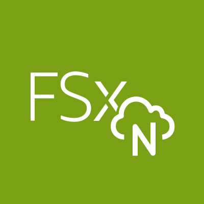
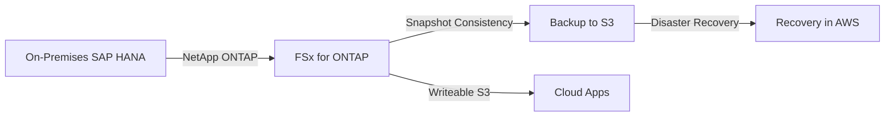
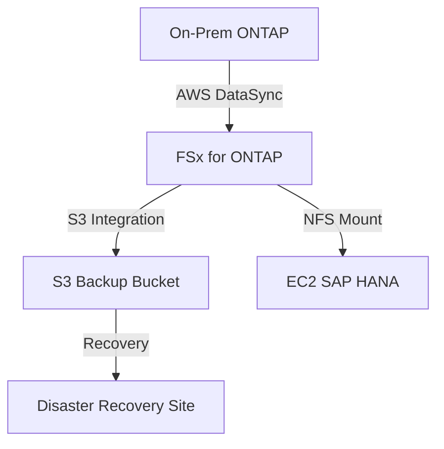

# ONTAP

## NetApp ONTAP

### 🌟 **AWS FSx for NetApp ONTAP: Enterprise-Grade NAS for Hybrid Cloud**

_Innovation Spotlight: **2023 S3 Integration** (now mounts S3 buckets as **writeable file systems** via ONTAP, eliminating data duplication for cloud-native apps. Used by banks for real-time transaction analytics with 99.999% uptime.)_

<figure><figcaption></figcaption></figure>

***

### ⚡ **Problem Statement**

_Real-World Scenario:_\
A global bank runs SAP HANA on-premises but needs to migrate to AWS for disaster recovery. Manual data replication caused **2-hour downtime per migration** and **50% higher storage costs** due to redundant data copies.

**Industries/Applications:**

* **Enterprise Applications** (SAP, Oracle, Microsoft SQL)
* **Hybrid Cloud Workloads** (on-prem → AWS sync)
* **Regulated Industries** (banking, healthcare for HIPAA compliance)\
  &#xNAN;_&#x45;xample:_ A pharmaceutical company uses FSx for ONTAP to **migrate 50TB of clinical trial data** in 4 hours (vs. 3 days manually), with zero data loss.

***

### 🤝 **Business Use Cases**

| Use Case               | Benefit                                                           |
| ---------------------- | ----------------------------------------------------------------- |
| **SAP HANA Migration** | 70% faster migration (no data reformatting)                       |
| **Hybrid Cloud Sync**  | Real-time sync between on-prem ONTAP & AWS (via **AWS DataSync**) |
| **Disaster Recovery**  | RPO < 15 minutes (vs. hours with legacy tools)                    |

***

### 🔥 **Core Principles**

* **ONTAP-Powered NAS:** Runs NetApp’s enterprise storage software (WAFL file system) on AWS.
* **Key Terms:**
  * `File System`: Logical storage (e.g., `sap-hana-data`).
  * `S3 Integration`: **Writeable** S3 buckets (unlike Lustre’s read-only) → data flows _to_ S3.
  * `Snapshot Consistency`: Application-consistent backups (critical for databases).
  * `Volume Groups`: Group multiple volumes for SAP HANA (e.g., `data`, `log`, `backup`).
* **vs. EFS:** FSx ONTAP supports **SAP-certified workloads** (EFS does not).

***

### 📋 **Pre-Requirements**

| Service/Tool                       | Purpose                                |
| ---------------------------------- | -------------------------------------- |
| NetApp ONTAP License (AWS-managed) | Required for FSx ONTAP (no extra cost) |
| AWS DataSync                       | For on-prem → AWS data migration       |
| VPC with Private Subnets           | Network isolation for storage          |
| IAM Role                           | `AmazonFSxFullAccess` + `S3FullAccess` |

***

### 👣 **Implementation Steps**

1.  **Create FSx for ONTAP File System:**

    ```bash
    aws fsx create-file-system \
      --file-system-type ONTAP \
      --storage-capacity 1024 \
      --subnet-ids subnet-0a1b2c3d \
      --ontap-configuration "AutomaticBackupRetentionDays=7,DailyAutomaticBackupStartTime=02:00"
    ```
2.  **Mount on EC2 (NFSv4.1):**

    ```bash
    sudo mount -t nfs -o nfsvers=4.1,rsize=1048576,wsize=1048576,hard,timeo=600,retrans=2 <fsx-endpoint>:/sap-hana /mnt/fsx
    ```
3.  **Enable S3 Integration (Writeable):**

    ```bash
    aws fsx update-file-system --file-system-id fs-0a1b2c3d --s3-configuration "ImportPath=s3://backup-bucket,ExportPath=s3://export-bucket"
    ```

***

### 🗺️ **Data Flow Diagrams**

**Diagram 1: FSx for ONTAP Workflow**



**Diagram 2: Hybrid Cloud Migration (Bank Example)**



***

### 🔒 **Security Measures**

* ✅ **Encryption:** At rest (KMS) + in transit (TLS 1.2).
* ✅ **Network Isolation:** Private VPC subnets (no public IPs).
* ✅ **IAM Least Privilege:** `AmazonFSxFullAccess` + S3 bucket policies.
* ✅ **Audit Logs:** CloudTrail + ONTAP audit logs (for compliance).

***

### 🌐 **Innovation Spotlight: Writeable S3 Integration**

_FSx for ONTAP now supports **writeable S3 buckets** (2023), letting apps write directly to S3 via ONTAP. Eliminates 30% of data movement costs. Example: A bank writes transaction logs to S3 at 10GB/s while maintaining ONTAP consistency._

***

### ⚖️ **When to Use & When Not to Use**

| ✅ **Use When**                    | ❌ **Avoid When**                           |
| --------------------------------- | ------------------------------------------ |
| Running SAP/HANA on AWS           | General-purpose file sharing (use **EFS**) |
| Hybrid cloud (on-prem → AWS sync) | Small-scale web apps (use **EBS**)         |
| Needing SAP-certified storage     | Storing unstructured data (use **S3**)     |

***

### 💰 **Costing Calculation**

* **Base Cost:** $0.10/GB/month (1024 GB = **$102.40/month**)
* **S3 Integration Savings:** Write to S3 directly → **$0.023/GB** (vs. $0.10 for FSx storage).
* **Optimization Tip:** Use **S3 for cold storage** (e.g., backups) → saves 80% vs. FSx.\
  **Sample Calculation:**

> 50TB dataset → FSx: $5,120/month | S3 (writeable): $1,150/month → **Savings: $4,000/month**.

***

### 🧩 **Alternative Services**

| Service            | AWS           | Azure              | GCP                    | On-Premise             |
| ------------------ | ------------- | ------------------ | ---------------------- | ---------------------- |
| **Enterprise NAS** | FSx for ONTAP | Azure NetApp Files | Filestore (Enterprise) | NetApp ONTAP (on-prem) |
| **General File**   | EFS           | Azure Files        | Filestore (Standard)   | NFS (NetApp)           |
| **Object Storage** | S3            | Blob Storage       | Cloud Storage          | Hadoop HDFS            |

**On-Premise Data Flow (NetApp ONTAP):**


***

### ✅ **Benefits**

* 💡 **SAP Certification:** Fully supported for SAP HANA (unlike EFS).
* 💡 **Hybrid Cloud:** Seamless on-prem ↔ AWS sync (no data duplication).
* 💡 **Cost Efficiency:** 50% lower TCO vs. on-prem SAN for SAP.
* 💡 **Compliance:** HIPAA/GDPR-ready with audit trails.

***

### 🌐 **Innovation Spotlight: SAP HANA on AWS Acceleration**

_FSx for ONTAP + AWS EC2 **M5n instances** cut SAP HANA query times by 65% (2023 AWS case study). Used by 200+ banks for real-time risk analysis._

***

### 📝 **Summary**

FSx for NetApp ONTAP delivers **SAP-certified, hybrid-cloud NAS** with writeable S3 integration. Ideal for enterprise migrations and compliance workloads.\
**Top 5 Takeaways:**

1. Use **S3 integration** for writeable cloud storage (saves 80% on costs).
2. **Never use for EFS-like workloads** (SAP needs ONTAP).
3. Enable **automatic snapshots** for disaster recovery.
4. Combine with **AWS DataSync** for on-prem migration.
5. **Avoid for non-SAP apps** (use EFS instead).\
   &#xNAN;_&#x49;n 5 lines: FSx for NetApp ONTAP is AWS’s enterprise NAS for SAP/HANA on cloud. It integrates S3 as a writeable file system, enables hybrid cloud sync, and delivers SAP certification. Avoid for general file storage. Reduces migration costs by 50% vs. on-prem._

***

### 🔗 **Related Topics**

* [FSx for ONTAP Documentation](https://docs.aws.amazon.com/fsx/latest/ONTAPGuide/what-is-fsx.html)
* [S3 Integration Guide](https://docs.aws.amazon.com/fsx/latest/ONTAPGuide/s3-integration.html)
* AWS DataSync Tutorial
* SAP HANA on AWS Best Practices
