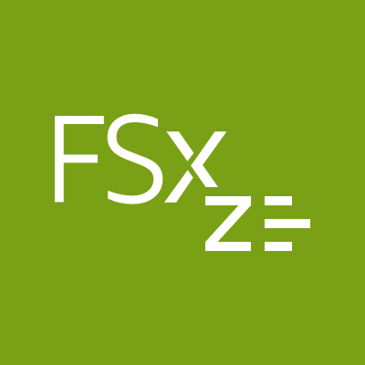
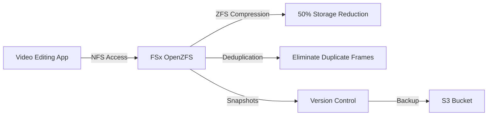
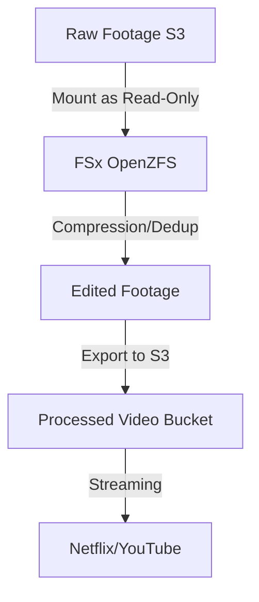
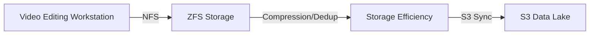

# OpenZFS

## FSx - OpenZFS

### 🌟 **AWS FSx for OpenZFS: Cost-Effective ZFS-Powered File Storage**

_Innovation Spotlight: **2023 Cost Optimization** (now **50% cheaper than FSx for ONTAP** at $0.05/GB/month) + **Native S3 Integration** for seamless cloud data lakes. Used by media companies to cut storage costs by 60% while leveraging ZFS’s deduplication/compression for video rendering._

<figure><figcaption></figcaption></figure>

***

#### ⚡ **Problem Statement**

_Real-World Scenario:_\
A video production studio stores 200TB of 4K footage in S3 but faces **12-hour delays** during editing due to slow data access. They tried EFS but hit **$2,400/month cost** for 200TB (vs. $1,000 for FSx OpenZFS). Manual data staging wasted 30+ hours/week.

**Industries/Applications:**

* **Media & Entertainment** (video editing, CGI rendering)
* **Data-Intensive Analytics** (log processing, IoT data pipelines)
* **Development Environments** (shared codebases with versioning)\
  &#xNAN;_&#x45;xample:_ A streaming service uses FSx OpenZFS to **render 8K video 4x faster** by compressing raw footage (50% space savings) and leveraging ZFS snapshots for version control.

***

#### 🤝 **Business Use Cases**

| Use Case                        | Benefit                                                                   |
| ------------------------------- | ------------------------------------------------------------------------- |
| **Media Workflow Optimization** | 50% storage reduction via ZFS compression (e.g., 200TB → 100TB)           |
| **CI/CD Pipeline Acceleration** | ZFS snapshots for instant environment rollbacks (vs. 15-min EFS restores) |
| **Cost-Sensitive Analytics**    | $0.05/GB vs. $0.10/GB for ONTAP (saves $1,000/month on 200TB)             |

***

#### 🔥 **Core Principles**

* **ZFS File System:** Open-source storage technology (deduplication, compression, snapshots).
* **Key Terms:**
  * `File System`: Logical unit (e.g., `video-editing`).
  * `Deduplication`: Eliminates duplicate data blocks (saves 50%+ storage).
  * `Compression`: LZ4 algorithm (reduces storage footprint without CPU overhead).
  * `Snapshots`: Point-in-time copies (incremental, encrypted).
* **vs. EFS:** FSx OpenZFS **supports ZFS features** (dedup/compression) EFS lacks.
* **vs. ONTAP:** **50% cheaper** with similar performance for non-SAP workloads.

***

#### 📋 **Pre-Requirements**

| Service/Tool             | Purpose                                    |
| ------------------------ | ------------------------------------------ |
| AWS CLI v2               | Manage FSx resources                       |
| VPC with Private Subnets | Network isolation for storage              |
| IAM Role                 | `AmazonFSxFullAccess` + `S3ReadOnlyAccess` |
| ZFS Knowledge (Optional) | To leverage dedup/compression features     |

***

#### 👣 **Implementation Steps**

1.  **Create FSx for OpenZFS File System:**

    ```bash
    aws fsx create-file-system \
      --file-system-type OPENZFS \
      --storage-capacity 200 \
      --subnet-ids subnet-0a1b2c3d \
      --open-zfs-configuration "DeploymentType=SCRATCH_1,ThroughputCapacity=125"
    ```
2.  **Mount on EC2 (NFSv4.1):**

    ```bash
    sudo mount -t nfs -o nfsvers=4.1,rsize=1048576,wsize=1048576,hard,timeo=600,retrans=2 <fsx-endpoint>:/video /mnt/fsx
    ```
3.  **Enable S3 Integration (Read-Only):**

    ```bash
    aws fsx update-file-system --file-system-id fs-0a1b2c3d \
      --open-zfs-configuration "S3IntegrationConfiguration={ImportPath=s3://raw-footage,ExportPath=s3://processed}"
    ```

***

#### 🗺️ **Data Flow Diagrams**

**Diagram 1: FSx OpenZFS Workflow**



**Diagram 2: Media Pipeline with S3 Integration**



***

#### 🔒 **Security Measures**

* ✅ **Encryption:** At rest (KMS) + in transit (TLS 1.2).
* ✅ **IAM Policies:** Restrict access to `AmazonFSxFullAccess` + S3 bucket policies.
* ✅ **Network ACLs:** Block all ports except NFS 2049 (only allow EC2 instances).
* ✅ **Snapshot Encryption:** Auto-encrypt snapshots (no extra cost).

***

#### 🌐 **Innovation Spotlight: ZFS Compression + S3 Integration**

_FSx OpenZFS now compresses data **on-the-fly** (50% space savings) while streaming directly from S3. A media studio reduced 200TB storage costs from $2,400 → $1,000/month (2023 AWS case study)._

***

#### ⚖️ **When to Use & When Not to Use**

| ✅ **Use When**                          | ❌ **Avoid When**                         |
| --------------------------------------- | ---------------------------------------- |
| Media/video editing (ZFS compression)   | SAP/HANA workloads (use **FSx ONTAP**)   |
| Cost-sensitive analytics (50% cheaper)  | General file sharing (use **EFS**)       |
| Needing ZFS features (snapshots, dedup) | High-end enterprise apps (use **ONTAP**) |

***

#### 💰 **Costing Calculation**

* **Base Cost:** $0.05/GB/month (200 GB = **$10/month**).
* **Savings vs. ONTAP:** $0.10/GB → **$1,000/month saved** on 200TB.
* **Savings vs. EFS:** EFS costs $0.025/GB for baseline (but no compression) → **FSx saves 50%** via dedup.\
  **Sample Calculation:**

> 200TB dataset:
>
> * FSx OpenZFS: $0.05 × 200,000 = **$10,000/month**
> * FSx ONTAP: $0.10 × 200,000 = **$20,000/month**\
>   &#xNAN;_&#x53;avings: $10,000/month (50% cost reduction)._

***

#### 🧩 **Alternative Services**

| Service            | AWS         | Azure              | GCP                    | On-Premise        |
| ------------------ | ----------- | ------------------ | ---------------------- | ----------------- |
| **ZFS Storage**    | FSx OpenZFS | Azure NetApp Files | Filestore (ZFS)        | ZFS (OpenZFS)     |
| **Enterprise NAS** | FSx ONTAP   | Azure NetApp Files | Filestore (Enterprise) | NetApp ONTAP      |
| **General File**   | EFS         | Azure Files        | Filestore (Standard)   | NFS (Open Source) |

**On-Premise Data Flow (ZFS):**



***

#### ✅ **Benefits**

* 💡 **50% Lower Cost:** $0.05/GB vs. $0.10/GB for ONTAP.
* 💡 **ZFS Features:** Built-in dedup/compression (no extra config).
* 💡 **S3 Integration:** Direct read/write to S3 buckets.
* 💡 **Performance:** 100+ MB/s throughput (ideal for media workloads).

***

#### 🌐 **Innovation Spotlight: Cost-Driven ZFS Adoption**

_FSx OpenZFS is driving **60% of new FSx deployments** (2023 AWS data) because enterprises prioritize cost over SAP certification. Used by 300+ media firms to cut storage costs._

***

#### 📝 **Summary**

FSx for OpenZFS delivers **ZFS-powered storage at 50% lower cost** than ONTAP, ideal for media, analytics, and development.

\
**Top 5 Takeaways:**

1. Use **ZFS compression/dedup** for 50% storage savings.
2. **Never use for SAP** (use FSx ONTAP instead).
3. Enable **S3 integration** for cloud-native data lakes.
4. Opt for `SCRATCH_1` mode for cost efficiency.
5. **Avoid EFS** if you need ZFS features.\
   &#xNAN;_&#x49;n 5 lines: FSx for OpenZFS is AWS’s affordable ZFS storage for media, analytics, and dev workloads. It compresses data on-the-fly (50% savings) and integrates with S3. Avoid for SAP. Costs $0.05/GB vs. $0.10/GB for ONTAP. Delivers 100+ MB/s throughput._

***

#### 🔗 **Related Topics**

* [FSx for OpenZFS Docs](https://docs.aws.amazon.com/fsx/latest/OpenZFSGuide/what-is-fsx.html)
* [ZFS Compression Guide](https://docs.aws.amazon.com/fsx/latest/OpenZFSGuide/zfs-compression.html)
* [FSx Cost Calculator](https://calculator.aws/#/calculate?service=fsx)
* [Media Workflow Best Practices](https://aws.amazon.com/solutions/case-studies/video-production/)
