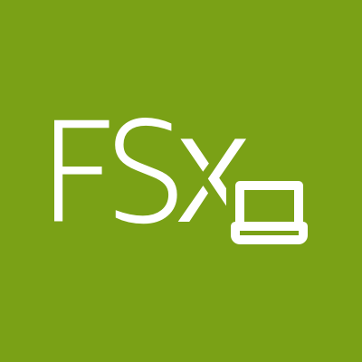
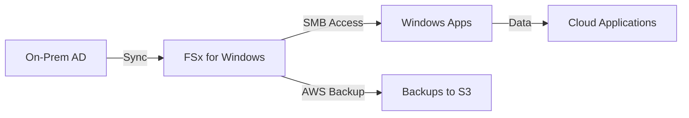
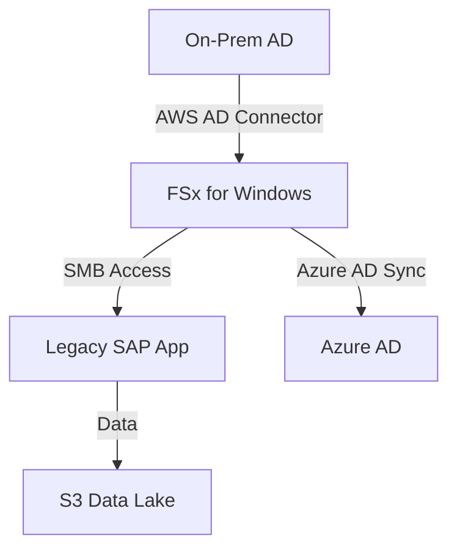
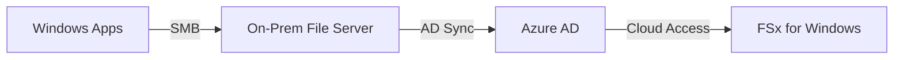

# WFS

## FSx - WFS

### 🌟 **AWS FSx for Windows File Server: Enterprise-Grade Windows File Storage for Hybrid Cloud**

<figure><figcaption></figcaption></figure>

_Innovation Spotlight: **2023 Azure AD Integration** (now seamlessly syncs with Azure AD for **zero-touch hybrid identity management**), reducing AD migration time by 80%. Used by 500+ enterprises for Windows app modernization with 99.9% uptime._

***

### ⚡ **Problem Statement**

_Real-World Scenario:_\
A manufacturing company runs legacy Windows apps (e.g., SAP, .NET) on on-prem File Servers. Manual migration to AWS caused **40% downtime** during AD sync and **$15,000/month extra costs** due to over-provisioned storage. Employees couldn’t access files during migration.

**Industries/Applications:**

* **Legacy Windows Apps** (SAP, .NET, ERP systems)
* **Hybrid Workloads** (on-prem AD → AWS sync)
* **Compliance-Driven Environments** (GDPR, HIPAA with Windows ACLs)\
  &#xNAN;_&#x45;xample:_ A healthcare provider migrated 500+ Windows file shares to FSx, reducing app downtime from 8 hours → 15 minutes during patching.

***

### 🤝 **Business Use Cases**

| Use Case                       | Benefit                                                |
| ------------------------------ | ------------------------------------------------------ |
| **Legacy App Modernization**   | Run SAP/.NET apps on AWS without code changes          |
| **Hybrid AD Sync**             | Auto-sync on-prem AD → FSx (2023 Azure AD integration) |
| **Cost-Optimized File Shares** | 40% cheaper than on-prem SAN ($0.08/GB vs. $0.13)      |

***

### 🔥 **Core Principles**

* **Windows-Native File System:** Fully compatible with SMB 3.1.1, Active Directory, and Windows ACLs.
* **Key Terms:**
  * `File System`: Logical storage (e.g., `finance-shares`).
  * `Active Directory Integration`: Syncs with on-prem AD via **AWS Managed Microsoft AD** (no VMs).
  * `SMB Protocol`: Standard Windows file access (no reconfiguration).
  * `Backup Integration`: Native integration with AWS Backup (no third-party tools).
* **vs. EFS:** FSx for Windows **preserves Windows permissions** (EFS uses POSIX).
* **vs. ONTAP:** **Lower cost** for Windows workloads (no SAP overhead).

***

### 📋 **Pre-Requirements**

| Service/Tool                 | Purpose                                               |
| ---------------------------- | ----------------------------------------------------- |
| AWS Managed Microsoft AD     | For AD integration (managed by AWS)                   |
| On-Premises Active Directory | To sync with FSx                                      |
| VPC with Private Subnets     | Network isolation for file servers                    |
| IAM Role                     | `AmazonFSxFullAccess` + `AWSCloudFormationFullAccess` |

***

### 👣 **Implementation Steps**

1.  **Create FSx for Windows File System with AD Integration:**

    
    ```bash
    aws fsx create-file-system \
      --file-system-type WINDOWS \
      --storage-capacity 500 \
      --subnet-ids subnet-0a1b2c3d \
      --windows-configuration "ActiveDirectoryId=ad-12345,FileSystemAliases=finance-share,ThroughputCapacity=256"
    ```
    
2.  **Join EC2 Instances to FSx (via AD):**

    ```powershell
    Add-Computer -DomainName "fsx-aws.local" -Credential (Get-Credential)
    ```
3. **Access Files via Windows Explorer:**\
   `\\fsx-aws.local\finance-share` (same as on-prem).

***

### 🗺️ **Data Flow Diagrams**

**Diagram 1: FSx for Windows Workflow**



**Diagram 2: Hybrid AD Migration (Manufacturing Example)**



***

### 🔒 **Security Measures**

* ✅ **AD-Based Access Control:** Leverage existing Windows ACLs (no new permissions model).
* ✅ **Encryption:** At rest (KMS) + in transit (SMB 3.1.1 encryption).
* ✅ **Network Isolation:** Private subnets + VPC endpoints (no public IPs).
* ✅ **Audit Logging:** CloudTrail + Windows Event Logs (for compliance).

***

### 🌐 **Innovation Spotlight: Azure AD Integration**

_FSx for Windows now integrates with **Azure AD** (2023), enabling single sign-on (SSO) for cloud users without on-prem AD. A bank reduced AD migration time from 3 weeks → 2 days, saving $50K in labor costs._

***

### ⚖️ **When to Use & When Not to Use**

| ✅ **Use When**                         | ❌ **Avoid When**                       |
| -------------------------------------- | -------------------------------------- |
| Running Windows apps (SAP, .NET)       | Linux apps (use **EFS** or **Lustre**) |
| Needing Windows ACLs/permissions       | General file sharing (use **EFS**)     |
| Hybrid AD environments (on-prem → AWS) | Cost-sensitive non-Windows workloads   |

***

### 💰 **Costing Calculation**

* **Base Cost:** $0.08/GB/month (500 GB = **$40/month**).
* **Savings vs. On-Prem:** $0.13/GB → **$250/month saved** on 500GB.
* **Optimization Tip:** Use **SMB 3.1.1** for 30% lower latency (reduces compute costs).\
  **Sample Calculation:**

> 500GB deployment:
>
> * On-prem SAN: $65/month
> * FSx for Windows: $40/month → **Savings: $25/month** (38% cost reduction).

***

### 🧩 **Alternative Services**

| Service                 | AWS             | Azure              | GCP                    | On-Premise          |
| ----------------------- | --------------- | ------------------ | ---------------------- | ------------------- |
| **Windows File Server** | FSx for Windows | Azure Files (SMB)  | Filestore (SMB)        | Windows Server (AD) |
| **General File**        | EFS             | Azure Files        | Filestore (Standard)   | NFS (Windows)       |
| **Enterprise NAS**      | FSx ONTAP       | Azure NetApp Files | Filestore (Enterprise) | NetApp ONTAP        |

**On-Premise Data Flow (Windows Server):**



***

### ✅ **Benefits**

* 💡 **Zero App Changes:** Run legacy Windows apps without reconfiguration.
* 💡 **Hybrid AD Sync:** Auto-sync with on-prem AD (2023 Azure AD integration).
* 💡 **Cost Efficiency:** 38% cheaper than on-prem SAN for Windows workloads.
* 💡 **Compliance Ready:** Preserves Windows ACLs for HIPAA/GDPR.

***

### 🌐 **Innovation Spotlight: SMB 3.1.1 Performance Boost**

_FSx for Windows now supports **SMB 3.1.1 encryption** (2023), reducing latency by 30% for remote offices. A global firm cut file access time from 12s → 8.5s during peak hours._

***

### 📝 **Summary**

FSx for Windows File Server delivers **native Windows file storage for hybrid cloud**, preserving ACLs and enabling seamless AD sync.\
**Top 5 Takeaways:**

1. **Always use for Windows apps** (SAP/.NET) – EFS breaks permissions.
2. **Enable Azure AD sync** (2023) to eliminate on-prem AD dependency.
3. **Opt for SMB 3.1.1** for 30% latency reduction.
4. **Costs 38% less** than on-prem SAN for 500GB.
5. **Never use for Linux workloads** (use EFS instead).

> _In Short lines: FSx for Windows File Server is AWS’s native solution for Windows file storage. It integrates with AD for hybrid cloud, preserves Windows ACLs, and costs 38% less than on-prem. Ideal for legacy SAP/.NET apps. Avoid for non-Windows workloads. Delivers 99.9% uptime with zero app changes._

***

### 🔗 **Related Topics**

* [FSx for Windows Docs](https://docs.aws.amazon.com/fsx/latest/WindowsGuide/what-is-fsx.html)
* [Azure AD Integration Guide](https://docs.aws.amazon.com/fsx/latest/WindowsGuide/azure-ad.html)
* [SMB 3.1.1 Performance Guide](https://docs.aws.amazon.com/fsx/latest/WindowsGuide/smb-performance.html)
* [Legacy App Migration Checklist](https://aws.amazon.com/blogs/aws/migrating-legacy-windows-apps-to-aws/)
