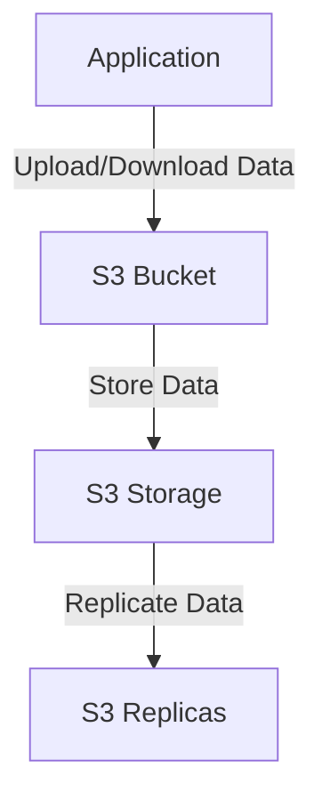
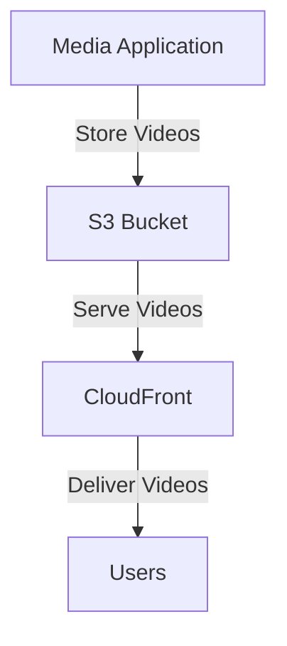

# S3 Bucket

## S3 Bucket

### 🌟 Overview

**AWS S3 (Simple Storage Service)** is a scalable object storage service offered by Amazon Web Services. It is designed to store and retrieve any amount of data from anywhere on the web. S3 is highly durable, available, and secure, making it a popular choice for a wide range of storage needs.

<figure><figcaption></figcaption></figure>

**🤖 Innovation Spotlight** As of today, AWS S3 has introduced several innovative features, including S3 Intelligent-Tiering, which automatically moves data between access tiers based on usage patterns, and S3 Batch Operations, which allows you to perform large-scale operations on objects in your S3 buckets.

### ⚡ Problem Statement

Consider a scenario where a company needs to store and manage large amounts of unstructured data, such as images, videos, and log files. They require a storage solution that is scalable, durable, and cost-effective.

For example, a media company wants to store and serve high-definition videos to users around the world. They need a storage solution that can handle large files and provide low-latency access.

### 🤝 Business Use Cases

1. **Media Storage and Delivery**: Storing and serving media files like images, videos, and music.
2. **Data Backup and Archival**: Backing up critical data and archiving old data for compliance purposes.
3. **Big Data Analytics**: Storing data for big data analytics and processing.
4. **Disaster Recovery**: Storing critical data for disaster recovery purposes.

### 🔥 Core Principles

**Foundational Concepts:**

* **Object Storage**: S3 is an object storage service, which means it stores data as objects rather than files or blocks.
* **Scalability**: S3 is designed to scale horizontally, allowing you to store and retrieve any amount of data.
* **Durability**: S3 provides high durability with multiple copies of data stored across different facilities.
* **Availability**: S3 offers high availability with multiple availability zones.

**Resource Services Terms:**

* **Bucket**: A container for objects stored in S3.
* **Object**: A file stored in an S3 bucket.
* **Key**: The unique identifier for an object within a bucket.
* **Region**: The geographical area where an S3 bucket is located.

### 📋 Pre-Requirements

1. **AWS Account**: You need an AWS account to create and manage S3 resources.
2. **AWS CLI**: The AWS Command Line Interface (CLI) is useful for managing S3 resources from the command line.
3. **AWS SDKs**: The AWS Software Development Kits (SDKs) are useful for integrating S3 with your applications.
4. **IAM Permissions**: Proper IAM permissions are required to access and manage S3 resources.

### 👣 Implementation Steps

1. **Create an S3 Bucket**:
   * Log in to the AWS Management Console.
   * Navigate to the S3 service.
   * Click on "Create Bucket" and follow the prompts to configure your bucket.
2. **Upload Objects**:
   * Use the AWS Management Console, AWS CLI, or AWS SDKs to upload objects to your S3 bucket.
3. **Configure Permissions**:
   * Set up IAM policies and bucket policies to control access to your S3 bucket and objects.
4. **Enable Versioning**:
   * Enable versioning to keep multiple versions of an object in the same bucket.
5. **Set Up Lifecycle Policies**:
   * Configure lifecycle policies to automatically transition objects to different storage classes or delete them after a specified period.

### 🗺️ Data Flow Diagram

**Diagram 1: How S3 Works**

**Diagram 2: Example Use Case**

### 🔒 Security Measures

1. **Encryption at Rest**: Enable encryption at rest to protect your data when it is stored on disk.
2. **Encryption in Transit**: Enable encryption in transit to protect your data as it travels over the network.
3. **IAM Policies**: Use IAM policies to manage access to your S3 resources.
4. **Bucket Policies**: Use bucket policies to control access to your S3 bucket and objects.
5. **Access Control Lists (ACLs)**: Use ACLs to manage access to individual objects.

### 💰 Costing Calculation

**How it is calculated?** S3 pricing is based on the amount of data stored, the number of requests made, and data transfer. You pay for the storage you use, the requests you make, and the data you transfer.

**Efficient way of handling this service:**

* Use S3 Intelligent-Tiering to automatically move data between access tiers based on usage patterns.
* Monitor your usage with Amazon CloudWatch to identify opportunities for cost savings.

**Sample Calculations:**

* **Storage Cost**: Suppose you store 1 TB of data in the S3 Standard storage class, which costs $0.023 per GB-month. The cost would be approximately $23 per month.
* **Request Cost**: Suppose you make 10,000 GET requests, which cost $0.0004 per 1,000 requests. The cost would be approximately $4 per month.

### 🧩 Alternative Services in AWS/Azure/GCP/On-Premise

| Service              | Provider   | Key Differences                                      |
| -------------------- | ---------- | ---------------------------------------------------- |
| Azure Blob Storage   | Azure      | Scalable object storage with multiple storage tiers  |
| Google Cloud Storage | GCP        | Unified object storage with multiple storage classes |
| On-Premise Storage   | On-Premise | Local storage solutions with full control over data  |

### ✅ Benefits

1. **Scalability**: S3 is designed to scale horizontally, allowing you to store and retrieve any amount of data.
2. **Durability**: S3 provides high durability with multiple copies of data stored across different facilities.
3. **Availability**: S3 offers high availability with multiple availability zones.
4. **Security**: S3 offers encryption at rest and in transit, as well as IAM policies and bucket policies for access management.
5. **Cost-Effective**: S3 is cost-effective with pay-as-you-go pricing and multiple storage classes to choose from.

### 📝 Summary

**Top 5 Points to Keep in Mind:**

1. S3 is an object storage service designed to store and retrieve any amount of data.
2. S3 is highly durable, available, and secure.
3. S3 pricing is based on the amount of data stored, the number of requests made, and data transfer.
4. S3 offers multiple storage classes to choose from, including S3 Standard, S3 Intelligent-Tiering, and S3 Glacier.
5. S3 is cost-effective with pay-as-you-go pricing and multiple storage classes to choose from.

**In Short:** AWS S3 is a scalable object storage service that is highly durable, available, and secure. It is designed to store and retrieve any amount of data from anywhere on the web.

### 🔗 Related Topics

* [AWS S3 Documentation](https://docs.aws.amazon.com/s3/index.html)
* [S3 Storage Classes](https://aws.amazon.com/s3/storage-classes/)
* [S3 Best Practices](https://docs.aws.amazon.com/AmazonS3/latest/userguide/best-practices.html)
