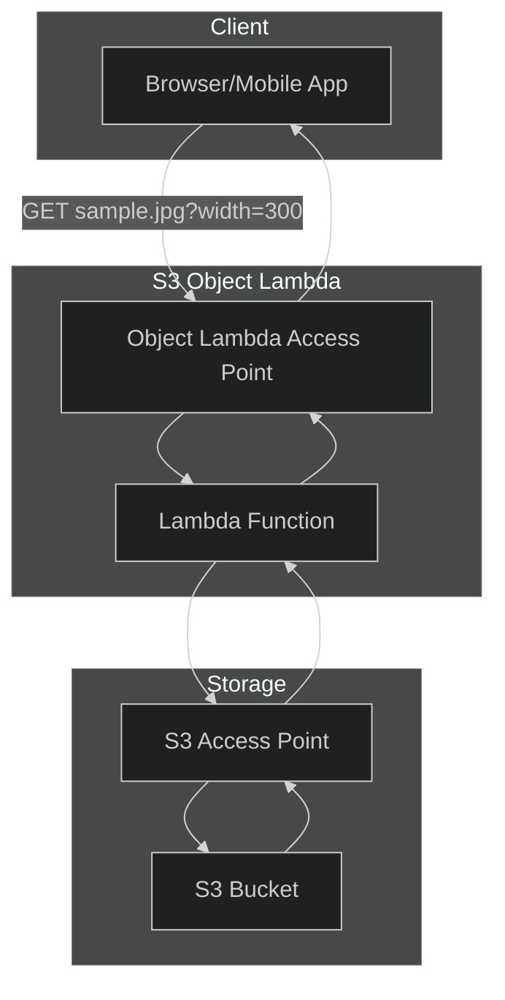
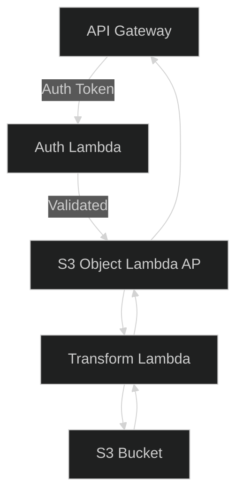

# Object Lambda

## 🌟 Overview: Amazon S3 Object Lambda 🛠️

**Amazon S3 Object Lambda** lets you insert your own AWS Lambda function into Amazon S3 GET, HEAD, and ListObjectsV2 calls so you can transform data as it’s returned—without changing the underlying objects. You simply create an S3 Object Lambda Access Point that fronts your bucket and configures it to invoke a Lambda function on each request.

**Innovation Spotlight**\
With S3 Object Lambda’s latest enhancements, you can perform real-time, GPU-accelerated image transformations, dynamic JSON filtering, and on-the-fly PII redaction. Combined with AWS Graviton3-powered Lambda or AWS Inferentia accelerators, you achieve sub-50 ms latencies for complex media and ML inference.

***

## ⚡ Problem Statement

A media-publishing startup needs to serve high-resolution images in multiple sizes and formats to web and mobile clients without storing redundant copies. They must also redact sensitive customer data (e.g., faces or license plates) on demand.

Industries & applications:

* **Media & Entertainment** – Dynamic thumbnail generation, video preview extraction
* **Healthcare** – On-the-fly de-identification of medical images
* **Finance** – Real-time masking of sensitive PDF statements

### 🤝 Business Use Cases

* Serve region-specific image variants (JPEG/WEBP) based on client Device-Type header.
* Redact personally identifiable information from stored documents before delivery.
* Filter large JSON logs to return only relevant fields for analytics dashboards.

***

## 🔥 Core Principles

* **Event-Driven Transformation**: S3 Object Lambda Access Points intercept object-level requests and trigger Lambda functions.
* **Serverless Scalability**: Unlimited concurrency—Lambda scales to meet request volume.
* **No Data Duplication**: Source objects remain unchanged; transformations occur at read time.
* **Pay-Per-Use**: You pay only for requests and Lambda compute time.

**Key Resources & Terms**

* **S3 Bucket**: The original data store.
* **S3 Access Point**: Network endpoint for standard GET/PUT operations.
* **S3 Object Lambda Access Point**: Fronts an S3 Access Point and invokes your Lambda.
* **Lambda Function**: Contains your transformation logic (e.g., image resizing, JSON filtering).

***

## 📋 Pre-Requirements

* AWS CLI or AWS Console
* An existing Amazon S3 bucket with sample objects
* IAM role for Lambda with permissions:
  * `s3:GetObject`, `s3:ListBucket` on source bucket
  * `lambda:InvokeFunction` for S3 Object Lambda
* AWS SDK (optional) for custom testing scripts

***

## 👣 Implementation Steps

1.  **Create S3 Bucket**

    ```bash
    aws s3 mb s3://my-source-bucket
    ```
2.  **Upload Sample Object**

    ```bash
    aws s3 cp sample.jpg s3://my-source-bucket/
    ```
3. **Author Lambda Function**
   * Runtime: Python 3.9
   * Handler: `lambda_function.lambda_handler`
   * Logic: Resize image to target dimensions using Pillow.
4. **Deploy Lambda & Attach IAM Role**
5.  **Create S3 Access Point**

    ```bash
    aws s3control create-access-point --account-id 123456789012 \
      --name source-ap --bucket my-source-bucket
    ```
6.  **Create S3 Object Lambda Access Point**

    ```bash
    aws s3control create-access-point-for-object-lambda \
      --account-id 123456789012 --name obj-lambda-ap \
      --configuration "SupportingAccessPoint=arn:aws:s3:...:accesspoint/source-ap,TransformationConfigurations=[{...}]"
    ```
7.  **Test via Object Lambda URL**

    ```bash
    curl "https://obj-lambda-ap-1234.s3-object-lambda.us-east-1.amazonaws.com/sample.jpg?width=300"
    ```

***

## 🗺️ Data Flow Diagrams





***

## 🔒 Security Measures

* Enable **SSE-S3** or **SSE-KMS** on your bucket.
* Use **least-privilege IAM roles** for Lambda execution.
* Isolate object lambda in a **dedicated VPC** if accessing VPC-only resources.
* Enforce **AWS WAF** rules on API Gateway frontends.

***

## 🚀 Innovation Spotlight: ML-Powered Data Enrichment

Use S3 Object Lambda with AWS **Rekognition** or **SageMaker Real-Time Inference** to annotate images or documents in transit. For example, auto-tag faces, detect document forms, or enrich logs with entity extraction—all without touching the original asset.

***

## ⚖️ When to Use and When Not to Use

✅ When to use

* You need **on-the-fly** data transformation without duplicating objects.
* Your transformation logic is lightweight (< 1 second).
* You require **dynamic, client-driven** content shaping.

❌ When not to use

* Batch processing of millions of objects (use AWS Batch/EKS).
* Transformations that require large local state or complex libraries beyond Lambda limits.
* Ultra-low latency (< 10 ms) use cases where a pre-warmed CDN is more predictable.

***

## 💰 Costing Calculation

**Components**

* S3 GET request via Object Lambda: $0.0004 per 1,000 requests
* Lambda compute: $0.0000166667 per GB-second

**Sample: 1 million requests, 256 MB RAM, 200 ms avg**

* Requests: $0.0004 × 1,000 = $0.40
* Lambda:
  * GB-s per request: 0.256 GB × 0.2 s = 0.0512 GB-s
  * Total: 1,000,000 × 0.0512 = 51,200 GB-s
  * Cost: 51,200 × $0.000016667 ≈ $0.85
* **Total ≈ $1.25 per million requests**

**Cost Optimization**

* Cache transformed objects in **CloudFront**.
* Reduce memory allocation to the bare minimum.
* Batch multiple transformations per invocation.

***

## 🧩 Alternative Services Comparison

| Provider | Service                         | Model                                | Pricing Model                            | Scalability                 |
| -------- | ------------------------------- | ------------------------------------ | ---------------------------------------- | --------------------------- |
| AWS      | S3 Object Lambda                | On-the-fly transformation via Lambda | $0.0004 per 1k GET; $0.00001667 per GB-s | Unlimited (Lambda)          |
| Azure    | Blob Storage + Azure Functions  | Function-triggered at GET time       | $0.20 per million executions; GB-s       | Unlimited (Functions)       |
| GCP      | Cloud Storage + Cloud Functions | HTTP trigger on signed URLs          | $0.40 per million calls; GB-s            | Unlimited (Cloud Functions) |
| On-Prem  | NGINX + Lua scripts             | Reverse proxy transformation         | Server cost + maintenance                | Limited by your infra       |


***

## ✅ Benefits

* Eliminates data duplication and storage bloat.
* Delivers **real-time**, request-driven content shaping.
* Offloads transformation logic to serverless, reducing infrastructure overhead.
* Seamlessly integrates with ML/AI services for enriched outputs.

***

## 🚀 Future Roadmap: Cross-Service Automation Patterns

Anticipate native integration of S3 Object Lambda with AWS EventBridge for event-driven post-transformation workflows, and with AWS Step Functions for orchestrating multi-step enrichments (e.g., transcode → translate → redact) in a single invocation chain.

***

## 📝 Summary

S3 Object Lambda provides a **serverless**, **scalable** way to transform S3 data at read time without duplicating assets. By fronting your bucket with an Object Lambda Access Point and embedding Lambda-powered logic, you get real-time, per-request customization—ideal for media resizing, JSON filtering, PII redaction, and ML inference.

**Key Takeaways:**

1. No object duplication—transform in transit.
2. Unlimited concurrency via Lambda.
3. Pay only for requests and compute.
4. Integrates with AI/ML for enriched outputs.
5. Optimize with CloudFront caching and minimal memory footprints.

***

## 🔗 Related Topics

* AWS Lambda documentation: [https://docs.aws.amazon.com/lambda/latest/dg/welcome.html](https://docs.aws.amazon.com/lambda/latest/dg/welcome.html)
* S3 Object Lambda guide: [https://docs.aws.amazon.com/AmazonS3/latest/userguide/transforming-objects.html](https://docs.aws.amazon.com/AmazonS3/latest/userguide/transforming-objects.html)
* AWS Serverless lens (Well-Architected): [https://docs.aws.amazon.com/wellarchitected/latest/serverless-lens/](https://docs.aws.amazon.com/wellarchitected/latest/serverless-lens/)
* AWS Step Functions for orchestration: [https://docs.aws.amazon.com/step-functions/latest/dg/welcome.html](https://docs.aws.amazon.com/step-functions/latest/dg/welcome.html)
