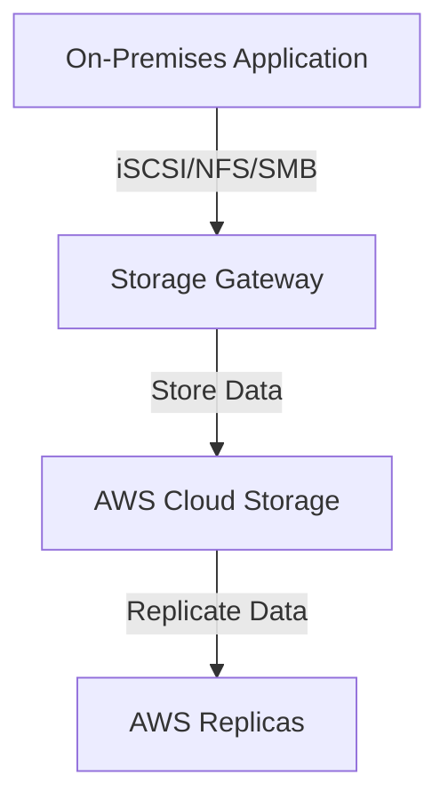
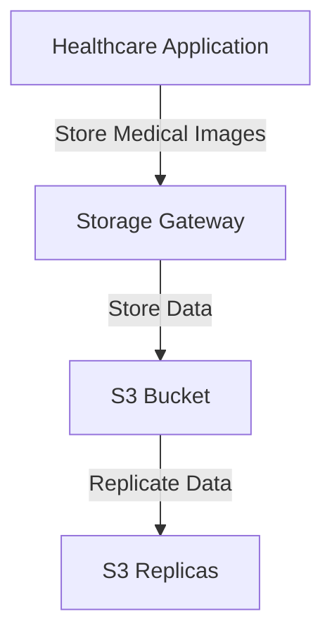

# Storage Gateway

## Storage Gateway

### 🌟 Overview

**AWS Storage Gateway** is a hybrid cloud storage service that enables your on-premises applications to seamlessly use AWS cloud storage. It provides a standard set of storage protocols such as iSCSI, NFS, and SMB, allowing you to integrate on-premises IT environments with the scalability and cost-effectiveness of AWS cloud storage.

**🤖 Innovation Spotlight** As of today, AWS Storage Gateway has introduced several innovative features, including support for Amazon S3 Intelligent-Tiering, which automatically moves data between access tiers based on usage patterns, and enhanced security with encryption at rest and in transit.

### ⚡ Problem Statement

Consider a scenario where a company needs to integrate its on-premises storage infrastructure with the cloud to leverage the scalability and cost-effectiveness of AWS. They require a solution that allows them to seamlessly extend their storage infrastructure to the cloud without disrupting their existing applications.

For example, a healthcare organization wants to store and manage large amounts of medical imaging data. They need a storage solution that can handle large files and provide low-latency access while ensuring data durability and security.

### 🤝 Business Use Cases

1. **Disaster Recovery**: Using AWS Storage Gateway for disaster recovery by backing up on-premises data to the cloud.
2. **Data Archival**: Archiving old data to the cloud to free up on-premises storage space.
3. **Hybrid Cloud Storage**: Extending on-premises storage infrastructure to the cloud for scalability and cost-effectiveness.
4. **Data Backup**: Backing up critical data to the cloud for added durability and security.

### 🔥 Core Principles

**Foundational Concepts:**

* **Hybrid Cloud Storage**: Storage Gateway allows you to integrate on-premises storage with cloud storage.
* **Protocol Support**: Storage Gateway supports standard storage protocols such as iSCSI, NFS, and SMB.
* **Data Synchronization**: Storage Gateway synchronizes data between on-premises storage and cloud storage.
* **Data Durability**: Storage Gateway ensures data durability by storing multiple copies of data in the cloud.

**Resource Services Terms:**

* **Gateway**: A virtual machine or physical appliance that connects your on-premises storage to AWS cloud storage.
* **Volume**: A block storage device that is presented to your on-premises applications.
* **Snapshot**: A point-in-time copy of a volume that is stored in the cloud.
* **Tape Gateway**: A virtual tape library that allows you to back up data to the cloud using tape-based backup software.

### 📋 Pre-Requirements

1. **AWS Account**: You need an AWS account to create and manage Storage Gateway resources.
2. **On-Premises Infrastructure**: You need on-premises infrastructure to deploy the Storage Gateway.
3. **Network Connectivity**: You need network connectivity between your on-premises infrastructure and AWS.
4. **IAM Permissions**: Proper IAM permissions are required to access and manage Storage Gateway resources.

### 👣 Implementation Steps

1. **Deploy a Storage Gateway**:
   * Log in to the AWS Management Console.
   * Navigate to the Storage Gateway service.
   * Click on "Create Gateway" and follow the prompts to configure your gateway.
2. **Configure Storage**:
   * Configure the storage for your gateway, including the type of storage (e.g., file, volume, tape) and the amount of storage.
3. **Connect to On-Premises Applications**:
   * Use standard storage protocols (e.g., iSCSI, NFS, SMB) to connect your on-premises applications to the Storage Gateway.
4. **Set Up Data Synchronization**:
   * Configure data synchronization between your on-premises storage and cloud storage.
5. **Monitor and Manage**:
   * Use the AWS Management Console to monitor and manage your Storage Gateway resources.

### 🗺️ Data Flow Diagram

**Diagram 1: How Storage Gateway Works**

**Diagram 2: Example Use Case**

### 🔒 Security Measures

1. **Encryption at Rest**: Enable encryption at rest to protect your data when it is stored on disk.
2. **Encryption in Transit**: Enable encryption in transit to protect your data as it travels over the network.
3. **IAM Policies**: Use IAM policies to manage access to your Storage Gateway resources.
4. **Network Security**: Use network security groups and firewalls to control access to your Storage Gateway.
5. **Regular Backups**: Set up regular backups to ensure you can recover your data in case of a failure.

### 💰 Costing Calculation

**How it is calculated?** Storage Gateway pricing is based on the amount of data stored, the number of requests made, and data transfer. You pay for the storage you use, the requests you make, and the data you transfer.

**Efficient way of handling this service:**

* Use S3 Intelligent-Tiering to automatically move data between access tiers based on usage patterns.
* Monitor your usage with Amazon CloudWatch to identify opportunities for cost savings.

**Sample Calculations:**

* **Storage Cost**: Suppose you store 1 TB of data in the S3 Standard storage class, which costs $0.023 per GB-month. The cost would be approximately $23 per month.
* **Request Cost**: Suppose you make 10,000 GET requests, which cost $0.0004 per 1,000 requests. The cost would be approximately $4 per month.

### 🧩 Alternative Services in AWS/Azure/GCP/On-Premise

| Service                      | Provider   | Key Differences                                                                             |
| ---------------------------- | ---------- | ------------------------------------------------------------------------------------------- |
| Azure File Sync              | Azure      | Hybrid file storage solution that syncs on-premises file servers with Azure Files           |
| Google Cloud Storage Gateway | GCP        | Hybrid cloud storage solution that integrates on-premises storage with Google Cloud Storage |
| On-Premise Storage           | On-Premise | Local storage solutions with full control over data                                         |

### ✅ Benefits

1. **Hybrid Cloud Storage**: Storage Gateway allows you to integrate on-premises storage with cloud storage.
2. **Protocol Support**: Storage Gateway supports standard storage protocols such as iSCSI, NFS, and SMB.
3. **Data Synchronization**: Storage Gateway synchronizes data between on-premises storage and cloud storage.
4. **Data Durability**: Storage Gateway ensures data durability by storing multiple copies of data in the cloud.
5. **Cost-Effective**: Storage Gateway is cost-effective with pay-as-you-go pricing and multiple storage classes to choose from.

### 📝 Summary

**Top 5 Points to Keep in Mind:**

1. Storage Gateway is a hybrid cloud storage service that enables your on-premises applications to seamlessly use AWS cloud storage.
2. Storage Gateway supports standard storage protocols such as iSCSI, NFS, and SMB.
3. Storage Gateway pricing is based on the amount of data stored, the number of requests made, and data transfer.
4. Storage Gateway ensures data durability by storing multiple copies of data in the cloud.
5. Storage Gateway is cost-effective with pay-as-you-go pricing and multiple storage classes to choose from.

> **In Short:** AWS Storage Gateway is a hybrid cloud storage service that allows you to integrate on-premises storage with the scalability and cost-effectiveness of AWS cloud storage.

### 🔗 Related Topics

* [AWS Storage Gateway Documentation](https://docs.aws.amazon.com/storagegateway/latest/userguide/what-is-storage-gateway.html)
* [Storage Gateway Best Practices](https://docs.aws.amazon.com/storagegateway/latest/userguide/best-practices.html)
* [Storage Gateway Pricing](https://aws.amazon.com/storagegateway/pricing/)
