# Indexes in MongoDB

## Mastering Indexes in MongoDB: A Comprehensive Guide

### Introduction

In the world of NoSQL databases, MongoDB stands out for its flexibility and scalability, handling vast amounts of unstructured data efficiently. As of September 2025, with MongoDB 8.1 as the latest release, indexes remain a cornerstone for optimizing query performance. Indexes allow MongoDB to quickly locate data without scanning every document in a collection, much like an index in a book helps you find specific topics faster. This article dives deep into MongoDB indexes, covering their fundamentals, types, creation, management, and best practices. We’ll use real-world examples, code snippets, and Mermaid diagrams to illustrate key concepts, making it easy for developers and database administrators to grasp and apply them.

Whether you’re building a high-traffic e-commerce app or analyzing geospatial data, understanding indexes can dramatically improve your application’s speed and efficiency. Let’s explore how they work in MongoDB 8.x.

### What Are Indexes in MongoDB?

Indexes in MongoDB are special data structures that store a subset of a collection’s data in an ordered, easy-to-traverse format. By default, MongoDB uses B-tree structures for most indexes, which support efficient equality matches, range queries, and sorting. Without an index, MongoDB performs a full collection scan—examining every document—which becomes inefficient as data grows.

### Key Benefits:

* Faster read operations.
* Support for sorted results without additional processing.
* Enforcement of uniqueness constraints.

However, indexes come with trade-offs: they consume storage and can slow down write operations (inserts, updates, deletes) since the index must be updated alongside the data.

#### Example: Basic Query Without and With Index

Consider a collection users with millions of documents. A query like `db.users.find({ age: 30 })` without an index scans everything. With an index on age, MongoDB jumps directly to matching entries.

```javascript
// Without index: Full scan
db.users.find({ age: 30 });

// With index: Efficient lookup
db.users.createIndex({ age: 1 }); // 1 for ascending order
db.users.find({ age: 30 });
```

#### Diagram: B-Tree Structure of an Index

Here’s a simplified Mermaid diagram showing a B-tree index on a numeric field like age.

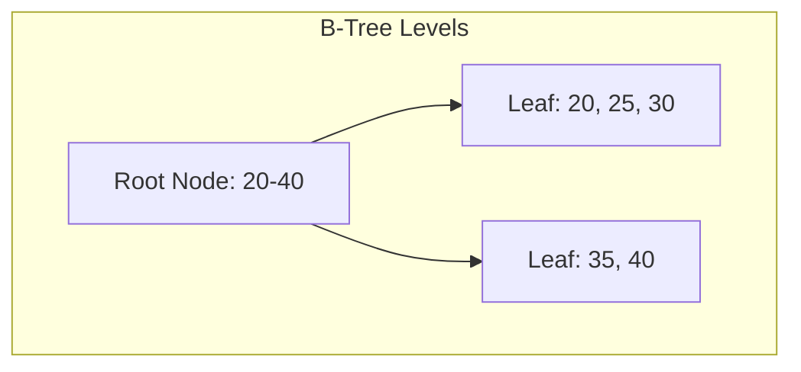

This diagram represents a balanced tree where nodes split to maintain order, enabling logarithmic-time searches.

#### Types of Indexes in MongoDB

MongoDB supports various index types to handle different data and query patterns. We’ll cover the main ones, each with an explanation, example, and a Mermaid diagram.

#### Single Field Index

A single field index is the simplest type, created on one field to speed up queries and sorts on that field. It works on scalar values, embedded fields, or arrays (as multikey, covered later).

**Explanation with Example:**

For an e-commerce collection products, index the price field to quickly find items in a price range. `db.products.createIndex({ price: 1 }); db.products.find({ price: { $gt: 50, $lt: 100 } }).sort({ price: 1 });`

**Diagram: Single Field Index Structure**

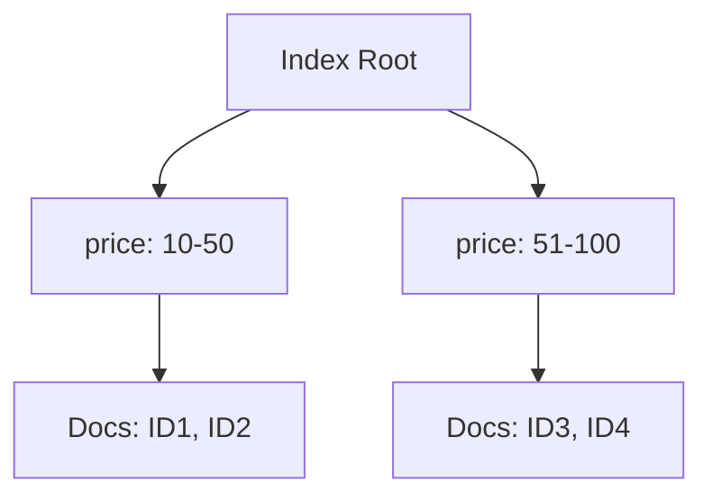

***

#### Compound Index

Compound indexes combine multiple fields into one index, supporting queries on prefix fields (the order matters). Ideal for multi-criteria searches.

**Explanation with Example:**

In a orders collection, index `customerId` and `orderDate` for customer-specific date-range queries.


```javascript
db.orders.createIndex({ customerId: 1, orderDate: -1 }); // -1 for descending
db.orders.find({ customerId: "cust123", orderDate: { $gte: new Date("2025-01-01") } });
```


**Diagram: Compound Index Structure**

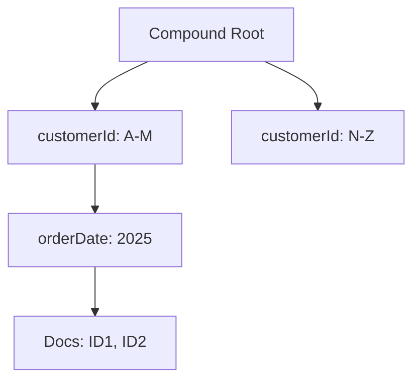

***

#### Multikey Index

Multikey indexes handle arrays by creating an index entry for each array element. Useful for querying array fields.

**Explanation with Example:**

For a movies collection with genres array, index to find movies by genre.

```javascript
db.movies.createIndex({ genres: 1 });
db.movies.find({ genres: "Action" });
```

**Diagram: Multikey Index Entries**

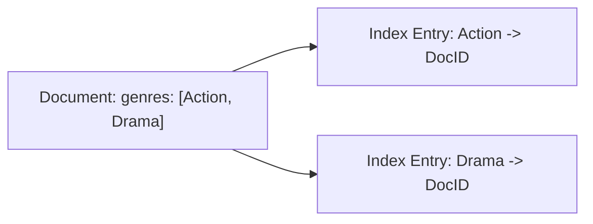

***

#### Text Index

Text indexes support full-text search on string content, using stemming and stop words for efficient searching.

**Explanation with Example:**

Index blog posts for searching titles and content.

```javascript
db.posts.createIndex({ title: "text", content: "text" });
db.posts.find({ $text: { $search: "MongoDB indexes" } });
```

**Diagram: Text Index Process**

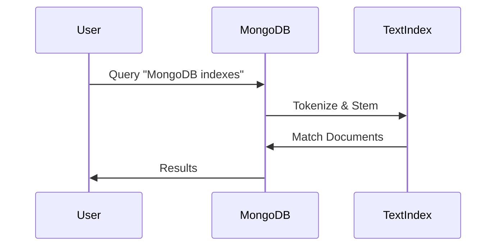

***

#### Geospatial Index

Geospatial indexes (2dsphere, 2d) enable queries on location data, like finding points near a coordinate.

**Explanation with Example:**

For stores, find nearby locations.


```javascript
db.stores.createIndex({ location: "2dsphere" });
db.stores.find({ location: { $near: { $geometry: { type: "Point", coordinates: [ -73.9, 40.7 ] } } } });
```


**Diagram: Geospatial Query**

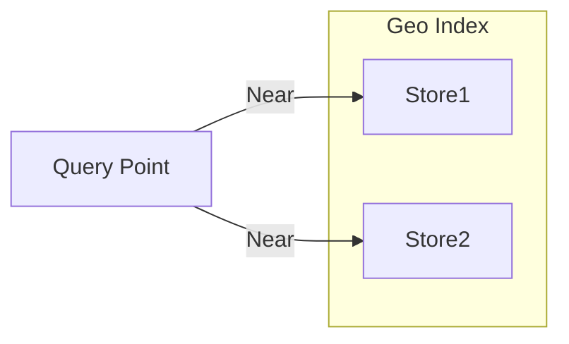

***

#### Hashed Index

Hashed indexes store hash values of fields, useful for sharding or equality matches (not ranges).

**Explanation with Example:**

Hash user IDs for even distribution.

```javascript
db.users.createIndex({ userId: "hashed" });
db.users.find({ userId: "abc123" });
```

**Diagram: Hashed Index Mapping**

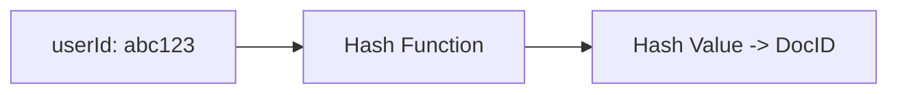

***

#### Unique Index

Unique indexes enforce no duplicates on the indexed field(s).

**Explanation with Example:**

Ensure unique emails.

```javascript
db.users.createIndex({ email: 1 }, { unique: true });
```

**Diagram: Unique Constraint Check**

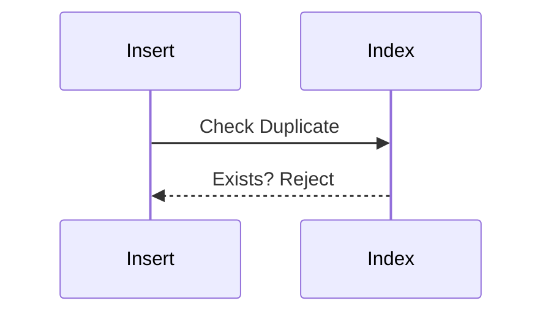

***

#### Sparse Index

Sparse indexes skip documents without the indexed field, saving space.

#### Explanation with Example:

Index optional phone field.

```javascript
db.contacts.createIndex({ phone: 1 }, { sparse: true });
```

#### Diagram: Sparse vs. Dense

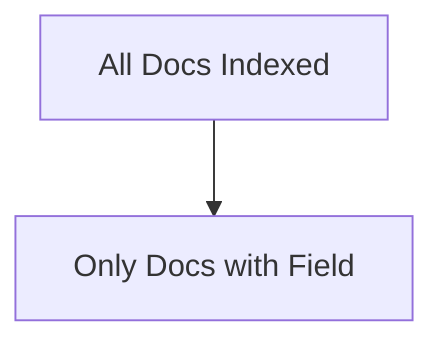

***

#### Partial Index

Partial indexes index only documents matching a filter, for targeted optimization.

**Explanation with Example:**

Index active users only.


```javascript
db.users.createIndex({ status: 1 }, { partialFilterExpression: { status: "active" } });
```


**Diagram: Partial Filter**

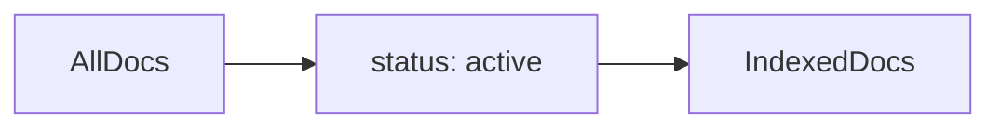

***

#### TTL Index

Time-to-Live (TTL) indexes automatically expire documents after a set time, based on a date field.

**Explanation with Example:**

Expire sessions after 1 hour.

```javascript
db.sessions.createIndex({ createdAt: 1 }, { expireAfterSeconds: 3600 });
```

**Diagram: TTL Expiration**

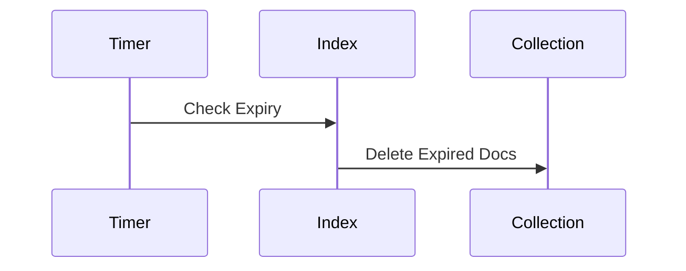

***

#### Wildcard Index

Wildcard indexes apply to all fields or a subset, useful for dynamic schemas (introduced in MongoDB 4.2, still relevant in 8.1).

**Explanation with Example:**

Index all user attributes.

```javascript
db.users.createIndex({ "userAttributes.$**": 1 });
```

**Diagram: Wildcard Coverage**

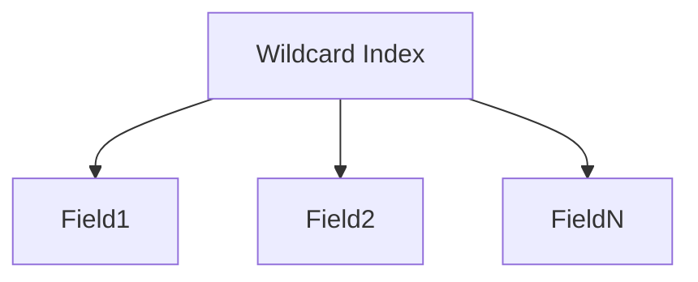

***

### Creating and Managing Indexes

To create indexes, use `db.collection.createIndex(keys, options)`. Options include unique, sparse, background (deprecated in newer versions; builds now yield automatically).

**Example: Compound with Options**


```javascript
db.inventory.createIndex({ item: 1, stock: 1 }, { unique: true, name: "item_stock_idx" });
```


Manage with `db.collection.getIndexes()` to list, `db.collection.dropIndex(name)` to remove.

In `MongoDB 8.1`, index builds on populated collections use an optimized process with commit quorums for replica sets, limiting memory to 200MB by default.

**Performance Considerations**: Build during low-traffic periods; monitor with `db.currentOp()`.

### Best Practices for Indexes

1. Index frequently queried fields, but avoid over-indexing to prevent write slowdowns.
2. Use compound indexes for common multi-field queries; order fields by equality, sort, range.
3. Leverage the ESR rule (Equality, Sort, Range) for compound index order.
4. Monitor with MongoDB Atlas Performance Advisor for recommendations.
5. Test with `explain()` to verify index usage.
6. Limit indexes per collection (default 64); drop unused ones.
7. For large datasets, consider sharded clusters with hashed indexes for even distribution.

### Conclusion

Indexes are essential for harnessing MongoDB’s full potential, transforming slow scans into lightning-fast queries. From single field to advanced types like geospatial and TTL, each serves specific needs in modern applications. As of MongoDB 8.1 in 2025, features like improved build processes enhance reliability. Remember to balance read optimization with write performance, and always test in your environment. By applying these concepts, you’ll build scalable, efficient databases. For more, check the official MongoDB docs.
