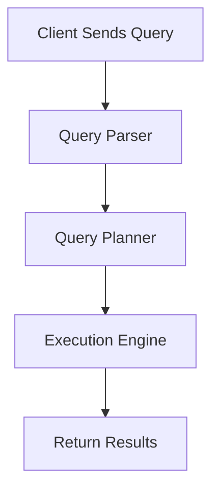
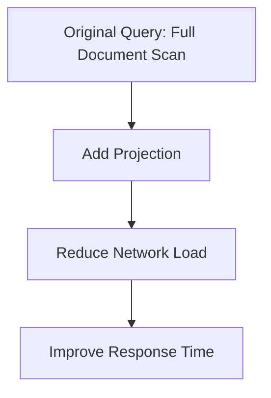
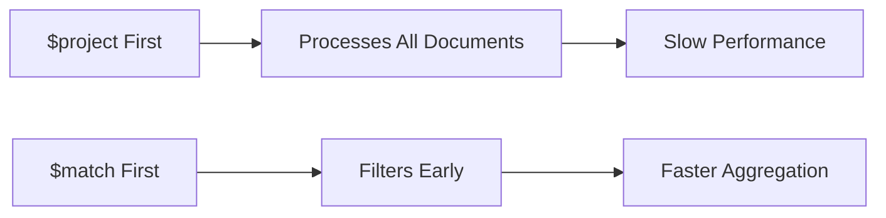
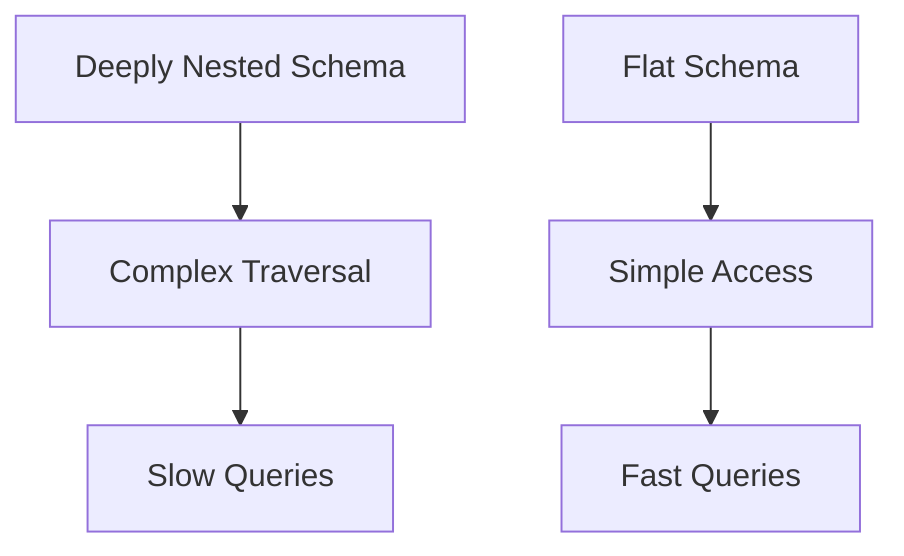
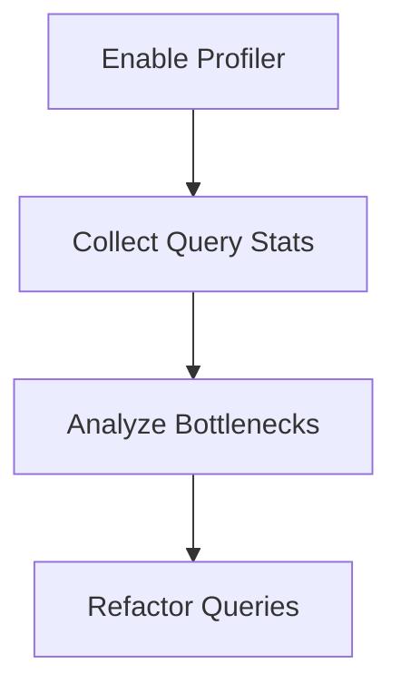

# Query Tune beyond Index

## 🚀 Query Tuning Beyond Index in MongoDB

MongoDB is renowned for its flexible schema and powerful indexing capabilities. But once indexes are in place, many developers assume query performance is “optimized.” In reality, **indexing is just the beginning**. This blog explores advanced query tuning techniques that go beyond indexes—covering query structure, execution plans, aggregation tuning, schema design, and profiling tools.

***

### 📚 Table of Contents

1. Introduction to Query Tuning
2. Understanding the Query Execution Lifecycle
3. Query Structure Optimization
4. Aggregation Pipeline Tuning
5. Schema Design for Performance
6. Query Profiling and Monitoring
7. Real-World Examples with Mermaid Diagrams
8. Summary and Best Practices

***

### 🔍 1. Introduction to Query Tuning

Query tuning in MongoDB is the art of making queries faster, more efficient, and less resource-intensive. While indexes are essential, they’re not a silver bullet. Queries can still be slow due to poor structure, inefficient aggregation, or suboptimal schema design.

***

### ⚙️ 2. Understanding the Query Execution Lifecycle

Before tuning, it’s crucial to understand how MongoDB processes a query:



* **Query Parser**: Interprets the query.
* **Query Planner**: Chooses the best plan (index scan, collection scan, etc.).
* **Execution Engine**: Executes the plan.
* **Return Results**: Sends data back to the client.

Use `.explain("executionStats")` to inspect this lifecycle.

***

### 🧠 3. Query Structure Optimization

Even with indexes, poorly written queries can degrade performance.

#### ✅ Use Projections

Return only necessary fields:

```js
db.users.find({ age: { $gt: 30 } }, { name: 1, email: 1 })
```

#### ❌ Avoid `$where`

```js
// Slow and unsafe
db.users.find({ $where: "this.age > 30" })
```

#### ✅ Use `$or` Instead of `$in` for Large Arrays

```js
db.users.find({ $or: [{ age: 25 }, { age: 30 }] })
```

#### 🔍 Example: Query Optimization



***

### 🧪 4. Aggregation Pipeline Tuning

Aggregation is powerful but can be a performance bottleneck.

#### ✅ Use `$match` Early

Place `$match` as close to the beginning as possible to reduce data volume.

```js
db.orders.aggregate([
  { $match: { status: "delivered" } },
  { $group: { _id: "$customerId", total: { $sum: "$amount" } } }
])
```

#### ✅ Avoid `$project` Before `$match`



#### ✅ Use `$facet` for Parallel Pipelines

```js
db.orders.aggregate([
  {
    $facet: {
      "byStatus": [{ $group: { _id: "$status", count: { $sum: 1 } } }],
      "byRegion": [{ $group: { _id: "$region", total: { $sum: "$amount" } } }]
    }
  }
])
```

***

### 🏗️ 5. Schema Design for Performance

MongoDB’s flexible schema is a double-edged sword. Design impacts query speed.

#### ✅ Denormalization

Embed related data to avoid joins:

```js
// Instead of referencing
{
  _id: 1,
  customerId: 123
}

// Embed customer
{
  _id: 1,
  customer: {
    id: 123,
    name: "Alice"
  }
}
```

#### ✅ Use Arrays Wisely

Avoid large arrays that require `$unwind`.

#### ✅ Avoid Deep Nesting

Flatten documents where possible to reduce traversal time.



***

### 📈 6. Query Profiling and Monitoring

MongoDB offers tools to identify slow queries:

#### 🔍 `explain()` Method

```js
db.users.find({ age: { $gt: 30 } }).explain("executionStats")
```

Shows:

* Index usage
* Documents scanned
* Execution time

#### 📊 Database Profiler

Enable with:

```js
db.setProfilingLevel(2)
```

Stores query stats in `system.profile`.

#### 🧠 Atlas Query Profiler

Visualizes slow queries and performance outliers.



***

### 🧪 7. Real-World Examples

#### Example 1: Slow Aggregation

**Problem**: Aggregation pipeline with `$project` before `$match`.

**Fix**: Reorder stages.

```js
db.sales.aggregate([
  { $match: { region: "South" } },
  { $project: { item: 1, amount: 1 } }
])
```

#### Example 2: Inefficient Query Structure

**Problem**: Using `$where`.

**Fix**: Replace with standard operators.

```js
db.users.find({ age: { $gt: 30 } })
```

#### Example 3: Schema Refactor

**Before**:

```js
{
  _id: 1,
  customerId: 123,
  items: [{ productId: 456, qty: 2 }]
}
```

**After** (denormalized):

```js
{
  _id: 1,
  customer: { id: 123, name: "Alice" },
  items: [{ product: { id: 456, name: "Widget" }, qty: 2 }]
}
```

***

### 🧾 8. Summary and Best Practices

MongoDB query tuning goes far beyond indexing. Here’s a recap:

* ✅ Use projections to reduce payload
* ✅ Structure queries to minimize document scans
* ✅ Optimize aggregation pipelines with early `$match`
* ✅ Design schemas for read efficiency
* ✅ Use profiling tools to monitor and refine queries

By combining these techniques, you’ll unlock the full performance potential of MongoDB—ensuring your applications scale smoothly and respond swiftly.

***

