```mermaid
flowchart TD
    A[Query Request] --> B{Index Available?}
    B -->|Yes| C[Index Scan]
    B -->|No| D[Collection Scan - SLOW!]
    
    C --> E{Compound Index?}
    E -->|Yes| F[Check Field Order]
    E -->|No| G[Single Field Index]
    
    F --> H{Correct ESR Order?}
    H -->|Yes| I[Efficient Query ✅]
    H -->|No| J[Partial Index Usage ⚠️]
    
    G --> K[Check Selectivity]
    K --> L[Execute Query]
    
    D --> M[Very Slow Execution ❌]
    
    style I stroke:#31C950
    style J stroke:#FF692A
    style M stroke:#EC253F
```

# Schema Design

## 🏗️ Building Scalable Document Structures

### 📚 Introduction

MongoDB's flexible document-oriented architecture offers developers unprecedented freedom in data modeling. Unlike traditional relational databases with rigid table structures, MongoDB allows you to store complex, nested data in JSON-like documents. However, this flexibility comes with responsibility – proper schema design is crucial for application performance, scalability, and maintainability.

In this comprehensive guide, we'll explore MongoDB schema design patterns, best practices, and real-world examples that will help you build robust and efficient database structures.

### 🎯 Understanding MongoDB's Document Model

#### What Makes MongoDB Different? 📊

MongoDB stores data in BSON (Binary JSON) documents within collections. Each document can have a different structure, but following consistent patterns is essential for maintainable applications.

```javascript
// Example MongoDB Document
{
  "_id": ObjectId("64a1b2c3d4e5f6789abcdef0"),
  "name": "John Doe",
  "email": "john@example.com",
  "profile": {
    "age": 28,
    "skills": ["JavaScript", "Python", "MongoDB"]
  },
  "createdAt": ISODate("2024-01-15T10:30:00Z")
}
```

### 🔄 Schema Design Patterns

#### 1. Embedding vs. Referencing 🔗

The fundamental decision in MongoDB schema design is whether to embed related data or reference it.

**Embedding Pattern**

```javascript
// E-commerce Order with Embedded Items
{
  "_id": ObjectId("..."),
  "orderNumber": "ORD-2024-001",
  "customerId": ObjectId("..."),
  "orderDate": ISODate("2024-01-15T10:30:00Z"),
  "items": [
    {
      "productId": ObjectId("..."),
      "name": "Laptop",
      "price": 999.99,
      "quantity": 1
    },
    {
      "productId": ObjectId("..."),
      "name": "Mouse",
      "price": 29.99,
      "quantity": 2
    }
  ],
  "totalAmount": 1059.97,
  "status": "shipped"
}
```


**Referencing Pattern**

```javascript
// User Document
{
  "_id": ObjectId("64a1b2c3d4e5f6789abcdef0"),
  "username": "john_doe",
  "email": "john@example.com",
  "profile": ObjectId("64a1b2c3d4e5f6789abcdef1") // Reference to profile
}

// Separate Profile Document
{
  "_id": ObjectId("64a1b2c3d4e5f6789abcdef1"),
  "userId": ObjectId("64a1b2c3d4e5f6789abcdef0"),
  "bio": "Software Developer",
  "skills": ["JavaScript", "Python", "MongoDB"],
  "projects": [/* large array of projects */]
}
```


#### 2. One-to-One Relationships 👤

**When to Embed**: When data is frequently accessed together and the subdocument is not too large.

```javascript
// User with embedded profile (recommended for most cases)
{
  "_id": ObjectId("..."),
  "username": "jane_smith",
  "email": "jane@example.com",
  "profile": {
    "firstName": "Jane",
    "lastName": "Smith",
    "dateOfBirth": ISODate("1995-06-15"),
    "address": {
      "street": "123 Main St",
      "city": "New York",
      "zipCode": "10001"
    }
  },
  "preferences": {
    "theme": "dark",
    "notifications": true,
    "language": "en"
  }
}
```

#### 3. One-to-Many Relationships 📝

**Embedding (for small arrays)**

```javascript
// Blog post with embedded comments
{
  "_id": ObjectId("..."),
  "title": "MongoDB Schema Design Best Practices",
  "content": "In this post, we'll explore...",
  "author": "John Doe",
  "publishDate": ISODate("2024-01-15"),
  "comments": [
    {
      "author": "Alice",
      "text": "Great article!",
      "timestamp": ISODate("2024-01-16")
    },
    {
      "author": "Bob",
      "text": "Very informative.",
      "timestamp": ISODate("2024-01-17")
    }
  ],
  "tags": ["mongodb", "database", "nosql"]
}
```

**Referencing (for large or unbounded arrays)**

```javascript
// Author document
{
  "_id": ObjectId("author_id"),
  "name": "John Doe",
  "bio": "Tech blogger and developer"
}

// Book documents (separate collection)
{
  "_id": ObjectId("book_id_1"),
  "title": "MongoDB Mastery",
  "authorId": ObjectId("author_id"), // Reference to author
  "publishYear": 2024
}
```


### ⚡ Performance Considerations

#### Indexing Strategies 📈

Proper indexing is crucial for MongoDB performance:

```javascript
// Create compound index for common queries
db.orders.createIndex({ 
  "customerId": 1, 
  "orderDate": -1 
});

// Text index for search functionality
db.products.createIndex({ 
  "name": "text", 
  "description": "text" 
});

// Partial index for specific conditions
db.users.createIndex(
  { "email": 1 },
  { "partialFilterExpression": { "isActive": true } }
);
```

#### Document Size Limits 📏

MongoDB has a 16MB document size limit. Design patterns to handle large documents:

```javascript
// GridFS for large files
{
  "_id": ObjectId("..."),
  "filename": "large_video.mp4",
  "uploadDate": ISODate("2024-01-15"),
  "length": 52428800, // 50MB
  "chunkSize": 261120,
  "metadata": {
    "contentType": "video/mp4",
    "userId": ObjectId("...")
  }
}
```

### 🏛️ Schema Evolution and Versioning

#### Handling Schema Changes 🔄

```javascript
// Version-aware documents
{
  "_id": ObjectId("..."),
  "schemaVersion": 2,
  "name": "John Doe",
  "email": "john@example.com",
  // New field added in version 2
  "phoneNumber": "+1234567890",
  "profile": {
    "age": 28,
    "skills": ["JavaScript", "Python"]
  }
}

// Migration function example
function migrateUserDocuments() {
  db.users.find({ schemaVersion: { $exists: false } }).forEach(
    function(doc) {
      doc.schemaVersion = 1;
      // Add default values for new fields
      if (!doc.phoneNumber) {
        doc.phoneNumber = null;
      }
      db.users.save(doc);
    }
  );
}
```


### 🎯 Best Practices and Anti-Patterns

#### ✅ Best Practices

1. **Design for Your Queries**: Structure data based on how you'll access it
2. **Avoid Deep Nesting**: Keep document structure shallow (2-3 levels max)
3. **Use Appropriate Data Types**: Leverage MongoDB's rich data types
4. **Plan for Growth**: Consider future scalability requirements

#### ❌ Common Anti-Patterns

1. **Unnecessary Normalization**: Don't over-normalize like relational databases
2. **Massive Arrays**: Avoid unbounded array growth
3. **Keyword as Keys**: Don't use dynamic field names excessively

The most important Anti-Pattern is described below,

```javascript
// ❌ Anti-pattern: Massive embedded array
{
  "userId": ObjectId("..."),
  "posts": [
    // Thousands of posts embedded - BAD!
  ]
}

// ✅ Better approach: Reference pattern
{
  "userId": ObjectId("..."),
  "totalPosts": 1547,
  "recentPosts": [ // Only recent posts embedded
    {
      "title": "Latest Post",
      "date": ISODate("2024-01-15")
    }
  ]
}
```


### :deciduous\_tree: Developer Training Guide  on  :anger: Anti-Patterns Vs Best Practices

1. [Data Modeling Anti-Patterns](schema-design.md#data-modeling-anti-patterns)
2. [Best Practices with Examples](schema-design.md#best-practices-with-examples)
3. [Performance Anti-Patterns](schema-design.md#performance-anti-patterns)
4. [Query Optimization Practices](schema-design.md#query-optimization-practices)
5. [Schema Evolution Patterns](schema-design.md#schema-evolution-patterns)
6. [Real-World Case Studies](schema-design.md#real-world-case-studies)

### 🚨 Data Modeling Anti-Patterns

#### 1. ❌ Massive Document Arrays (Unbounded Growth)

**Problem**: Embedding large arrays that grow indefinitely

```javascript
// ❌ ANTI-PATTERN: Unbounded array growth
{
  "_id": ObjectId("user123"),
  "username": "john_doe",
  "posts": [
    // Imagine 10,000+ posts embedded here
    { "title": "Post 1", "content": "...", "date": "2020-01-01" },
    { "title": "Post 2", "content": "...", "date": "2020-01-02" },
    // ... thousands more
  ],
  "comments": [
    // Another 50,000+ comments
    { "postId": "post1", "text": "Great!", "date": "2020-01-01" },
    // ... thousands more
  ]
}
```

**Why it's bad:**

* Document size approaches 16MB limit
* Slow queries (entire document loaded)
* Memory inefficient
* Index performance degrades

#### 2. ❌ Excessive Normalization (Relational Thinking)

```javascript
// ❌ ANTI-PATTERN: Over-normalization
// User Collection
{ "_id": ObjectId("user1"), "username": "john" }

// UserProfile Collection
{ "_id": ObjectId("prof1"), "userId": ObjectId("user1"), "firstName": "John" }

// UserPreferences Collection  
{ "_id": ObjectId("pref1"), "userId": ObjectId("user1"), "theme": "dark" }

// UserAddress Collection
{ "_id": ObjectId("addr1"), "userId": ObjectId("user1"), "street": "123 Main" }
```

**Why it's bad:**

* Multiple queries for simple data retrieval
* JOIN-like operations in application code
* Increased complexity
* Network round trips

#### 3. ❌ Dynamic Schema with Unpredictable Fields

```javascript
// ❌ ANTI-PATTERN: Dynamic field names as data
{
  "_id": ObjectId("product1"),
  "name": "T-Shirt",
  "2024-01-15": 100,  // Stock for specific date
  "2024-01-16": 95,   // Stock for specific date
  "2024-01-17": 87,   // Stock for specific date
  // Hundreds of date fields...
}
```

**Why it's bad:**

* Impossible to create meaningful indexes
* Complex queries
* Schema unpredictability
* Maintenance nightmare

#### 4. ❌ Keyword/Reserved Word Field Names

```javascript
// ❌ ANTI-PATTERN: Using reserved words
{
  "_id": ObjectId("doc1"),
  "class": "premium",      // 'class' is reserved in many languages
  "function": "admin",     // 'function' is reserved
  "return": "success",     // 'return' is reserved
  "new": true             // 'new' is reserved
}
```

#### 5. ❌ Storing Large Binary Data in Documents

```javascript
// ❌ ANTI-PATTERN: Binary data in documents
{
  "_id": ObjectId("doc1"),
  "title": "My Video",
  "videoData": BinData(0, "base64encodedvideodatathatisverylarge..."), // 10MB+
  "description": "A sample video"
}
```

***

### ✅ Best Practices with Examples

#### 1. ✅ Proper Embedding Strategy

**Rule**: Embed when data is accessed together and has limited growth

```javascript
// ✅ GOOD PRACTICE: Controlled embedding
{
  "_id": ObjectId("user123"),
  "username": "john_doe",
  "email": "john@example.com",
  "profile": {
    "firstName": "John",
    "lastName": "Doe",
    "avatar": "https://example.com/avatar.jpg",
    "bio": "Software Developer",
    "social": {
      "twitter": "@johndoe",
      "linkedin": "john-doe"
    }
  },
  "preferences": {
    "theme": "dark",
    "language": "en",
    "notifications": {
      "email": true,
      "push": false,
      "sms": true
    }
  },
  "recentActivity": [
    // Only last 10 activities
    {
      "action": "login",
      "timestamp": ISODate("2024-01-15T10:30:00Z"),
      "ip": "192.168.1.1"
    }
  ]
}
```


#### 2. ✅ Reference Pattern for Large Collections

```javascript
// ✅ GOOD PRACTICE: User document with references
{
  "_id": ObjectId("user123"),
  "username": "john_doe",
  "email": "john@example.com",
  "stats": {
    "totalPosts": 1247,
    "totalComments": 3891,
    "joinDate": ISODate("2020-01-01"),
    "lastActive": ISODate("2024-01-15")
  }
}

// Separate Posts Collection
{
  "_id": ObjectId("post456"),
  "authorId": ObjectId("user123"),  // Reference to user
  "title": "MongoDB Best Practices",
  "content": "In this post...",
  "publishDate": ISODate("2024-01-15"),
  "tags": ["mongodb", "database", "nosql"],
  "metrics": {
    "views": 1250,
    "likes": 89,
    "shares": 23
  }
}

// Comments Collection
{
  "_id": ObjectId("comment789"),
  "postId": ObjectId("post456"),    // Reference to post
  "authorId": ObjectId("user123"),  // Reference to user
  "text": "Great article!",
  "timestamp": ISODate("2024-01-15T11:30:00Z"),
  "replies": [
    // Only direct replies, not nested deeply
    {
      "authorId": ObjectId("user456"),
      "text": "I agree!",
      "timestamp": ISODate("2024-01-15T12:00:00Z")
    }
  ]
}
```

#### 3. ✅ Proper Array Design with Bucketing

```javascript
// ✅ GOOD PRACTICE: Time-series data with bucketing
{
  "_id": ObjectId("bucket1"),
  "sensorId": "temp_sensor_01",
  "timestamp": ISODate("2024-01-15T00:00:00Z"), // Hour bucket
  "measurements": [
    {
      "time": ISODate("2024-01-15T00:01:00Z"),
      "temperature": 23.5,
      "humidity": 45.2
    },
    {
      "time": ISODate("2024-01-15T00:02:00Z"),
      "temperature": 23.7,
      "humidity": 45.0
    }
    // Max ~60 measurements per hour bucket
  ],
  "summary": {
    "count": 60,
    "avgTemp": 23.6,
    "minTemp": 22.1,
    "maxTemp": 24.8
  }
}
```

#### 4. ✅ Polymorphic Schema Design

```javascript
// ✅ GOOD PRACTICE: Handling different document types
{
  "_id": ObjectId("content1"),
  "type": "article",
  "title": "MongoDB Schema Design",
  "author": "John Doe",
  "publishDate": ISODate("2024-01-15"),
  // Article-specific fields
  "content": "Full article content...",
  "wordCount": 2500,
  "readTime": 10
}

{
  "_id": ObjectId("content2"),
  "type": "video",
  "title": "MongoDB Tutorial",
  "author": "Jane Smith",
  "publishDate": ISODate("2024-01-14"),
  // Video-specific fields
  "duration": 1800, // seconds
  "resolution": "1080p",
  "fileSize": 245760000, // bytes
  "thumbnailUrl": "https://example.com/thumb.jpg"
}

// Query both types easily
db.content.find({ "author": "John Doe" })
```

#### 5. ✅ Computed Fields and Materialized Views

```javascript
// ✅ GOOD PRACTICE: Store computed values
{
  "_id": ObjectId("order123"),
  "orderNumber": "ORD-2024-001",
  "customerId": ObjectId("customer456"),
  "items": [
    {
      "productId": ObjectId("prod789"),
      "name": "Laptop",
      "price": 999.99,
      "quantity": 1,
      "subtotal": 999.99  // Pre-computed
    },
    {
      "productId": ObjectId("prod012"),
      "name": "Mouse",
      "price": 29.99,
      "quantity": 2,
      "subtotal": 59.98   // Pre-computed
    }
  ],
  "totals": {
    "subtotal": 1059.97,      // Pre-computed
    "tax": 106.00,            // Pre-computed
    "shipping": 15.00,        // Pre-computed
    "total": 1180.97          // Pre-computed
  },
  "status": "confirmed",
  "dates": {
    "created": ISODate("2024-01-15T10:00:00Z"),
    "confirmed": ISODate("2024-01-15T10:05:00Z"),
    "estimated_delivery": ISODate("2024-01-18T18:00:00Z")
  }
}
```

***

### ⚡ Performance Anti-Patterns

#### 1. ❌ Missing Indexes on Query Fields

```javascript
// ❌ ANTI-PATTERN: No indexes
// Collection with millions of documents
// Frequent query without index
db.users.find({ "email": "john@example.com" })  // Full collection scan!

// ❌ Wrong index order for compound queries
db.orders.createIndex({ "status": 1, "customerId": 1 })
// But you frequently query: { "customerId": 123, "status": "active" }
```

#### 2. ❌ Using $regex Without Proper Indexing

```javascript
// ❌ ANTI-PATTERN: Inefficient regex queries
db.products.find({ 
  "name": { $regex: ".*laptop.*", $options: "i" } 
})  // Cannot use index efficiently

// ❌ Leading wildcard regex
db.products.find({ 
  "name": { $regex: ".*MacBook", $options: "i" } 
})  // Even worse - cannot use index at all
```

#### 3. ❌ Retrieving Unnecessary Fields

```javascript
// ❌ ANTI-PATTERN: Fetching entire documents
db.users.find({})  // Returns everything including large embedded documents

// ❌ Not using projection
db.posts.find({ "status": "published" })  // Returns full content
```

***

### 🎯 Query Optimization Practices

#### 1. ✅ Proper Indexing Strategy

```javascript
// ✅ GOOD PRACTICE: Strategic indexing
// Compound index for common queries
db.users.createIndex({ 
  "status": 1,           // Equality first
  "lastLoginDate": -1,   // Range/sort second
  "email": 1             // Additional equality
})

// Text index for search
db.products.createIndex({ 
  "name": "text", 
  "description": "text",
  "tags": "text"
}, {
  "weights": {
    "name": 10,
    "tags": 5,
    "description": 1
  }
})

// Partial index for specific conditions
db.users.createIndex(
  { "email": 1 }, 
  { 
    "partialFilterExpression": { 
      "isActive": true,
      "email": { $exists: true }
    }
  }
)

// TTL index for expiring data
db.sessions.createIndex(
  { "lastAccessTime": 1 }, 
  { "expireAfterSeconds": 3600 } // 1 hour
)
```

#### 2. ✅ Efficient Queries with Projection

```javascript
// ✅ GOOD PRACTICE: Use projection to limit data transfer
// Only get needed fields
db.users.find(
  { "status": "active" },
  { 
    "name": 1, 
    "email": 1, 
    "lastLogin": 1,
    "_id": 0  // Exclude _id if not needed
  }
)

// Exclude large fields
db.posts.find(
  { "status": "published" },
  { 
    "content": 0,  // Exclude large content field
    "comments": 0  // Exclude embedded comments
  }
)
```

#### 3. ✅ Optimized Text Search

```javascript
// ✅ GOOD PRACTICE: Efficient text search
// Use text index instead of regex
db.products.find({ 
  $text: { 
    $search: "laptop gaming",
    $caseSensitive: false
  }
}).sort({ score: { $meta: "textScore" } })

// Prefix matching with regular index
db.products.find({ 
  "name": { $regex: "^MacBook", $options: "i" } 
})  // Can use index effectively
```



***

### 🔄 Schema Evolution Patterns

#### 1. ❌ Breaking Schema Changes

```javascript
// ❌ ANTI-PATTERN: Sudden schema changes without migration
// Old documents
{
  "_id": ObjectId("user1"),
  "name": "John Doe",
  "email": "john@example.com"
}

// New application expects this structure (breaking change!)
{
  "_id": ObjectId("user1"),
  "firstName": "John",  // Changed from 'name'
  "lastName": "Doe",
  "email": "john@example.com",
  "profile": {          // New required field
    "age": 30
  }
}
```

#### 2. ✅ Versioned Schema Evolution

```javascript
// ✅ GOOD PRACTICE: Gradual schema evolution with versioning
// Version 1 documents
{
  "_id": ObjectId("user1"),
  "schemaVersion": 1,
  "name": "John Doe",
  "email": "john@example.com"
}

// Version 2 documents (backward compatible)
{
  "_id": ObjectId("user2"),
  "schemaVersion": 2,
  "name": "Jane Smith",      // Keep old field for compatibility
  "firstName": "Jane",       // Add new fields
  "lastName": "Smith",
  "email": "jane@example.com",
  "profile": {
    "age": 28,
    "bio": "Software Engineer"
  }
}

// Application handles both versions
function getUserName(user) {
  if (user.schemaVersion === 1) {
    return user.name;
  } else {
    return `${user.firstName} ${user.lastName}`;
  }
}

// Migration script
function migrateToV2() {
  db.users.find({ schemaVersion: 1 }).forEach(function(doc) {
    const nameParts = doc.name.split(' ');
    db.users.updateOne(
      { "_id": doc._id },
      { 
        $set: {
          "schemaVersion": 2,
          "firstName": nameParts[0],
          "lastName": nameParts.slice(1).join(' '),
          "profile": {
            "age": null,
            "bio": ""
          }
        }
      }
    );
  });
}
```

#### 3. ✅ Feature Flags for Schema Changes

```javascript
// ✅ GOOD PRACTICE: Using feature flags
{
  "_id": ObjectId("user1"),
  "schemaVersion": 2,
  "firstName": "John",
  "lastName": "Doe",
  "email": "john@example.com",
  "features": {
    "newProfileSystem": true,    // Feature flag
    "advancedSearch": false,     // Feature flag
    "betaFeatures": true         // Feature flag
  },
  "profile": {
    // Only present if newProfileSystem is true
    "age": 30,
    "bio": "Developer"
  }
}
```

***

### 📚 Real-World Case Studies

#### Case Study 1: E-commerce Platform 🛒

**❌ Initial Poor Design:**

```javascript
// Everything in one document - BAD!
{
  "_id": ObjectId("customer1"),
  "name": "John Doe",
  "email": "john@example.com",
  "orders": [
    // 500+ orders embedded
    {
      "orderDate": ISODate("2023-01-01"),
      "items": [/* hundreds of items */],
      "total": 299.99
    }
    // ... more orders
  ],
  "reviews": [
    // 1000+ reviews embedded
  ],
  "wishlist": [
    // 200+ wishlist items
  ]
}
```

**✅ Improved Design:**

```javascript
// Customer document - lean and focused
{
  "_id": ObjectId("customer1"),
  "name": "John Doe",
  "email": "john@example.com",
  "status": "premium",
  "stats": {
    "totalOrders": 523,
    "totalSpent": 45670.85,
    "memberSince": ISODate("2020-01-01"),
    "lastOrderDate": ISODate("2024-01-15")
  },
  "preferences": {
    "currency": "USD",
    "language": "en",
    "newsletter": true
  }
}

// Orders collection
{
  "_id": ObjectId("order123"),
  "customerId": ObjectId("customer1"),
  "orderNumber": "ORD-2024-001",
  "status": "shipped",
  "orderDate": ISODate("2024-01-15"),
  "items": [
    {
      "productId": ObjectId("prod456"),
      "sku": "LAPTOP-001",
      "name": "Gaming Laptop",
      "price": 1299.99,
      "quantity": 1
    }
  ],
  "totals": {
    "subtotal": 1299.99,
    "tax": 130.00,
    "shipping": 0.00,
    "total": 1429.99
  },
  "shipping": {
    "address": "123 Main St, City, State 12345",
    "method": "express",
    "trackingNumber": "TRK123456789"
  }
}
```

#### Case Study 2: Social Media Platform 📱

**❌ Poor Design:**

```javascript
// User with all data embedded
{
  "_id": ObjectId("user1"),
  "username": "johndoe",
  "posts": [/* 5000+ posts */],
  "followers": [/* 10000+ follower IDs */],
  "following": [/* 2000+ following IDs */],
  "messages": [/* 50000+ messages */]
}
```

**✅ Better Design:**

```javascript
// User profile
{
  "_id": ObjectId("user1"),
  "username": "johndoe",
  "email": "john@example.com",
  "profile": {
    "displayName": "John Doe",
    "bio": "Software Developer | Coffee Lover",
    "avatar": "https://cdn.example.com/avatars/user1.jpg",
    "location": "San Francisco, CA",
    "website": "https://johndoe.dev"
  },
  "stats": {
    "posts": 1247,
    "followers": 10567,
    "following": 892,
    "joinDate": ISODate("2020-01-01")
  },
  "settings": {
    "privacy": "public",
    "notifications": {
      "email": true,
      "push": true,
      "sms": false
    }
  }
}

// Follow relationships (separate collection)
{
  "_id": ObjectId("follow1"),
  "followerId": ObjectId("user1"),
  "followingId": ObjectId("user2"),
  "followDate": ISODate("2024-01-15"),
  "status": "active"
}

// Posts collection with computed engagement
{
  "_id": ObjectId("post1"),
  "authorId": ObjectId("user1"),
  "content": "Just shipped a new feature!",
  "mediaUrls": ["https://cdn.example.com/images/post1.jpg"],
  "hashtags": ["coding", "javascript", "mongodb"],
  "mentions": [ObjectId("user2"), ObjectId("user3")],
  "timestamp": ISODate("2024-01-15T10:30:00Z"),
  "engagement": {
    "likes": 45,
    "comments": 12,
    "shares": 8,
    "views": 1250
  },
  "status": "published"
}
```


***

### 🎯 Key Takeaways for Developers

#### ✅ DO's:

1. **Design for your queries** - Structure data based on access patterns
2. **Embed small, bounded arrays** (< 100 items typically)
3. **Use references for large or growing collections**
4. **Create appropriate indexes** before going to production
5. **Use projection** to limit data transfer
6. **Version your schemas** for safe evolution
7. **Pre-compute values** when possible
8. **Use atomic operations** for data consistency

#### ❌ DON'Ts:

1. **Don't embed unbounded arrays**
2. **Don't over-normalize** like relational databases
3. **Don't use dynamic field names** as data
4. **Don't forget to index** frequently queried fields
5. **Don't retrieve unused data** - always use projection
6. **Don't make breaking schema changes** without migration
7. **Don't store large binaries** in documents
8. **Don't ignore the 16MB document limit**

***

### 🚀 Action Items&#x20;

#### Before Starting Development:

1. **Analyze query patterns** - What data is accessed together?
2. **Estimate data growth** - How much data will you have in 6 months/2 years?
3. **Define schema versioning strategy**
4. **Plan indexing strategy**
5. **Set up monitoring** for query performance

#### During Development:

1. **Use MongoDB Compass** to analyze query performance
2. **Enable profiler** to identify slow operations
3. **Test with realistic data volumes**
4. **Review schema designs** in code reviews
5. **Document schema decisions** and rationale

#### Performance Monitoring:

```javascript
// Enable profiler for slow operations
db.setProfilingLevel(1, { slowms: 100 })

// Analyze query patterns
db.system.profile.find().limit(5).sort({ ts: -1 }).pretty()

// Check index usage
db.collection.find({ query }).explain("executionStats")
```

### 🏁 Summary and Conclusion

`MongoDB schema design` requires careful consideration of data access patterns, relationships, and performance requirements. Key takeaways:

* **Choose embedding for frequently accessed related data and small arrays**
* **Use referencing for large datasets and many-to-many relationships**
* **Design indexes based on query patterns**
* **Plan for schema evolution with versioning strategies**
* **Monitor document sizes and avoid anti-patterns**

The flexibility of MongoDB's document model is both its greatest strength and potential challenge. By following these patterns and best practices, you can build scalable, maintainable applications that leverage MongoDB's full potential.

> `Remember:` there's no one-size-fits-all solution. Always analyze your specific use case, data access patterns, and performance requirements when designing your MongoDB schema. Start simple, measure performance, and iterate as your application grows.
