# Index in PostgreSQL

***

### 🏁 Introduction: The Power of Indexes in PostgreSQL

Efficient data retrieval lies at the heart of database-powered web applications, analytics platforms, and data-driven businesses. As your data grows, queries can slow down—unless PostgreSQL can find what it needs quickly. Indexes are the “shortcut” that transforms sluggish table scans into lightning-fast lookups, much like the index at the back of a book lets you jump straight to relevant pages.

<figure><figcaption></figcaption></figure>

> In PostgreSQL, mastering index types, their practical applications, and their management is essential for database performance and scalability. This blog (2025 edition) demystifies PostgreSQL indexing, explains each index type with real-world examples, and uses Mermaid diagrams for easy visualization. Each key concept is paired with practical SQL, use cases, and up-to-date insights.


***

### 🧭 What is an Index in PostgreSQL?

An **index** in PostgreSQL is a specialized data structure that makes searching, filtering, and sorting operations on tables much faster. Without indexes, queries often scan every row (“sequential scan”), which can be painfully slow for large tables.

Indexes map the values in indexed columns to their locations in the underlying table—much like a phone book alphabetically maps names to phone numbers.

#### Example: Creating and Using a Simple Index

```sql
CREATE TABLE books (
  id SERIAL PRIMARY KEY,
  title VARCHAR(100) NOT NULL,
  author VARCHAR(100) NOT NULL,
  publication_year INT
);

-- Insert some sample data
INSERT INTO books (title, author, publication_year) VALUES
('To Kill a Mockingbird', 'Harper Lee', 1960),
('1984', 'George Orwell', 1949),
('Pride and Prejudice', 'Jane Austen', 1813);

-- Add an index on the author column
CREATE INDEX idx_author ON books (author);

-- Query leveraging the index
SELECT * FROM books WHERE author = 'Harper Lee';
```

**Result:** The query uses the `idx_author` index and avoids scanning all rows.

***

### 🌲 B-Tree Indexes in PostgreSQL

#### 🔎 What Are B-Tree Indexes?

B-tree (balanced tree) indexes are **the default and most widely used index type** in PostgreSQL. B-trees efficiently handle **equality** and **range** queries (`=`, `<`, `>`, `BETWEEN`, etc.) and maintain data in sorted order for rapid access.

They are ideal for:

* Primary keys and unique constraints
* Queries filtering or ordering by numeric, date, text, or categorical columns

#### 🏗️ How B-Tree Works (Mermaid Diagram)

```mermaid
graph TD
  Root("Root Page")
  A("Internal Page 1")
  B("Internal Page 2")
  L1("Leaf Page [1–50]")
  L2("Leaf Page [51–100]")
  L3("Leaf Page [101–150]")
  L4("Leaf Page [151–200]")

  Root -->|1-100| A
  Root -->|101-200| B
  A -->|1-50| L1
  A -->|51-100| L2
  B -->|101-150| L3
  B -->|151-200| L4
```



**Explanation:** Searches begin at the root, descend through the internal nodes, and quickly land on a leaf page containing the indexed value.

#### 📋 Example Usage

```sql
-- Create a B-tree index on the author
CREATE INDEX idx_btree_author ON books (author);
```

This index is automatically used for:

* `WHERE author = 'J.K. Rowling'`
* `WHERE author >= 'A' AND author <= 'M'`
* `ORDER BY author ASC`

B-tree can be customized for **ASC** or **DESC** order, and supports the `INCLUDE` clause for covering indexes.

***

### #️⃣ Hash Indexes in PostgreSQL

#### ⚡ What Are Hash Indexes?

**Hash indexes** optimize equality searches (`=`) using a hash function. They are slightly faster for exact-match queries than B-trees but **do not support range or sorting operations**.

Hash indexes are useful for:

* Quickly retrieving a row by a unique key (non-primary)
* Large text or UUID columns only used for equality checks

#### 🧩 Hash Index Mermaid Diagram


**Explanation:** Each value is hashed to a bucket, which directly maps to its record(s).

#### 🚦 Example Usage

```sql
CREATE INDEX idx_hash_email ON users USING hash(email);

SELECT * FROM users WHERE email = 'user@example.com'; -- Fast!
```

**Limitations:** No support for range queries, and (in older versions) less WAL support, though as of PostgreSQL 10+, hash indexes are crash-safe and replicated.

***

### 🌳 GiST Indexes (Generalized Search Tree)

#### 🌐 What Is a GiST Index?

A **GiST index** is an extensible, flexible index type for **complex data types**. It’s particularly powerful for:

* Geometric/spatial data (points, polygons, PostGIS)
* Full-text search (tsvector columns)
* Range types and custom user-defined types

It supports a wide variety of query operators, configurable via operator classes.

#### 🗺️ GiST Mermaid Diagram


**Explanation:** Nodes contain bounding boxes for fast spatial exclusion.

#### 🛠️ Example: Geospatial Index

```sql
CREATE TABLE places (
  id SERIAL PRIMARY KEY,
  name TEXT,
  location GEOMETRY
);
CREATE INDEX idx_places_location ON places USING gist(location);

-- Query: Find places within 1000 meters
SELECT name
FROM places
WHERE ST_DWithin(location, ST_MakePoint(-122.4167, 37.7833)::geometry, 1000);
```

**Takeaway:** GiST indexes are the backbone of spatial, range, and similarity-based queries.

***

### 🗃️ SP-GiST Indexes (Space-Partitioned Generalized Search Tree)

#### 🧭 What Is an SP-GiST Index?

**SP-GiST** indexes implement space-partitioned trees for data that can be naturally split into non-overlapping regions—perfect for:

* Hierarchical or sparse data
* Geospatial/quadtree data
* IP/network prefix matching
* Prefix text searches

#### 🗺️ SP-GiST Partitioning (Mermaid Diagram)


**Explanation:** Data is partitioned recursively for quick, efficient search inside specific regions or prefixes.

#### 🌟 Example: QuadTree for Geospatial Data

```sql
CREATE INDEX idx_geo_points ON geo_points USING spgist(point);
```

For `point` columns, SP-GiST divides the space using quadtrees, yielding fast searches for geometric proximity or region-based queries.

***

### 📝 GIN Indexes (Generalized Inverted Index)

#### ⚙️ What Is a GIN Index?

**GIN indexes** are designed to efficiently handle columns containing **multiple discrete values** (arrays, JSONB, full-text search). For each value or element, the index records all rows it appears in—similar to an inverted index in search engines.

Best used for:

* Array, JSONB and hstore columns
* Full-text search (tsvector)
* Multi-valued or tagging systems

#### 🔄 GIN Inverted Index (Mermaid Diagram)


**Explanation:** Each distinct value in the column knows all rows that contain it, making containment queries (`@>`, `<@`, `?`) very efficient.

#### 📚 Example: Indexing a JSONB Column

```sql
CREATE TABLE docs (
  id SERIAL PRIMARY KEY,
  doc JSONB
);

-- Add a GIN index
CREATE INDEX idx_docs_doc_gin ON docs USING gin(doc);

-- Query: Find all docs where JSON contains a specific key/value
SELECT * FROM docs WHERE doc @> '{"user":"alice"}';
```

**Note:** GIN is **critical** for efficient array and document store querying.

***

### 📊 BRIN Indexes (Block Range Index)

#### ♻️ What Is a BRIN Index?

**BRIN** (Block Range INdex) indexes store summaries (min/max) of values for each block of rows rather than indexing each row individually. BRIN indexes are **small, fast to create, and ideal for massive tables where data has a natural ordering** (e.g., time-series or log data).

#### 🧱 BRIN Block Structure (Mermaid Diagram)


**Explanation:** Queries matching a specific range quickly pinpoint relevant blocks and skip unrelated ones.

#### ▶️ BRIN Example: Time-Series Logs

```sql
CREATE TABLE logs (
  id SERIAL PRIMARY KEY,
  log TEXT,
  logged_at TIMESTAMPTZ NOT NULL
);

CREATE INDEX logs_logged_at_brin ON logs USING brin(logged_at);

-- Efficient for:
SELECT * FROM logs WHERE logged_at >= '2025-09-01' AND logged_at < '2025-10-01';
```

**BRIN is not suited for random lookups, but shines with huge, append-only datasets.**

***

### 🏗️ Composite and Expression Indexes

#### 🔗 Composite (Multi-Column) Indexes

Composite indexes speed up queries that filter using multiple columns. The **order of columns** is crucial: the index is most efficient when the query applies conditions to the leading column(s).

**Composite Index Mermaid Example**


```sql
CREATE INDEX idx_orders_customer_date ON orders (customer_id, order_date);
-- Best for
-- WHERE customer_id = 123 AND order_date >= '2025-01-01'
```

#### 💡 Expression Indexes

These indexes store results of expressions/functions (e.g., `LOWER(email)`, elements from JSONB).

Helpful for:

* Case-insensitive search (`LOWER(email)`)
* Indexing computed or extracted values

```sql
-- Index for case-insensitive search
CREATE INDEX idx_users_lower_email ON users (LOWER(email));

-- Index a JSONB field
CREATE INDEX idx_jsonb_type_code ON docs (((doc->>'type_code')));
```

**Tip:** Use an expression index when your WHERE clause matches the indexed expression.

***

### 🪟 Partial Indexes in PostgreSQL

A **partial index** indexes only rows meeting a specified condition—making it smaller, faster to update, and highly targeted for particular queries or workloads.

#### Partial Index Mermaid Diagram


```sql
-- Index only active users
CREATE INDEX idx_active_users ON users (id, name) WHERE status = 'active';

-- Optimizes
SELECT * FROM users WHERE status = 'active' AND name LIKE 'A%';
```

***

### 🛠️ Index Maintenance, Monitoring, and REINDEX

Effective index management in PostgreSQL involves regular monitoring, occasional rebuilding, and avoiding over-indexing.

#### 🧩 Index Bloat, REINDEX, and Autovacuum

* **VACUUM & Autovacuum** clean dead tuples and reduce index bloat.
* **REINDEX** rebuilds an index, reclaiming space and restoring speed, especially after heavy updates/deletes or when index bloat is significant:

```sql
REINDEX INDEX idx_btree_author;
REINDEX TABLE books;
```

#### 🕵️ Monitoring Index Usage

* Use `pg_stat_user_indexes` and `pg_stat_user_tables` to review scan counts and identify unused indexes.
* Use the `EXPLAIN` and `EXPLAIN ANALYZE` commands before/after index creation to see if/how indexes are used.
* Monitor index bloat and performance with tools/extensions like `pgstattuple` or `pg_repack`.

***

### 🏎️ Index Performance Analysis: EXPLAIN ANALYZE

**EXPLAIN ANALYZE** shows how queries are executed, revealing if an index is used, whether a scan is sequential, an index scan, or a bitmap scan.

```sql
EXPLAIN ANALYZE SELECT * FROM books WHERE author = 'Harper Lee';
```

**Look for:** `Index Scan using idx_author`, `Bitmap Heap Scan`, or `Seq Scan`.

If `Seq Scan` appears when you expect an index, investigate statistics (`ANALYZE`), data distribution, or index definition.

***

### ⏳ Concurrency and Online Index Creation

In production, blocking writes for index creation is undesirable. Use **CONCURRENTLY** for minimal disruption:

```sql
CREATE INDEX CONCURRENTLY idx_books_author ON books (author);
```

* Allows ongoing `INSERT`, `UPDATE`, `DELETE` during index build.
* Takes longer and uses more I/O/CPU.
* Cannot be run inside a transaction block.

***

### 📗 Mermaid ER and Index Visualization

Use Mermaid’s ER syntax to document table/index relationships, illustrate foreign keys, and clarify application logic.

```mermaid fullWidth="false"
---
%%| label: fig-my-diagram
%%| fig-cap: A centered Mermaid diagram
%%| fig-align: center
---
erDiagram
  BOOKS {
    int id PK
    string title
    string author
    int publication_year
  }
  IDX_AUTHOR {
    string author
  }
  BOOKS ||--o| IDX_AUTHOR : "author index"

```

***

### ⚠️ Index Best Practices and Pitfalls

**Do:**

* Create indexes on columns frequently used in filtering (`WHERE`), joining (`JOIN`), or sorting (`ORDER BY`, `GROUP BY`).
* Use proper index types for the column (e.g., GIN for JSONB, GiST for geometric data).
* Use partial and expression indexes for targeted query speeds.
* Rebuild (`REINDEX`) bloated or unused indexes.
* Regularly monitor and remove unused indexes.

**Don’t:**

* Over-index small tables; sequential scan may be faster.
* Index very low cardinality (few unique values) columns unless necessary.
* Create multiple overlapping indexes (wastes space and slows writes).

***

### 🏆 Summary & Takeaways

PostgreSQL indexing remains an evolving, nuanced field. To make the most of your database in 2025:

* Use **B-tree** for most lookups and ranges, **Hash** for fast equality, **GiST/SP-GiST** for spatial/unusual data, **GIN** for multi-valued/JSONB/text, and **BRIN** for very large, naturally ordered tables.
* Harness **composite and expression indexes** for complex queries, and **partial indexes** for targeted optimization.
* Maintain and monitor indexes—beware bloat, unused indexes, and periodic need for REINDEX.
* Use **CONCURRENTLY** for online index creation without write downtime.
* Always **test and validate** with `EXPLAIN ANALYZE` and database statistics.

> With these strategies and visualizations, you’ll maximize PostgreSQL’s index performance, scalability, and clarity. 😊 Happy indexing!

***
