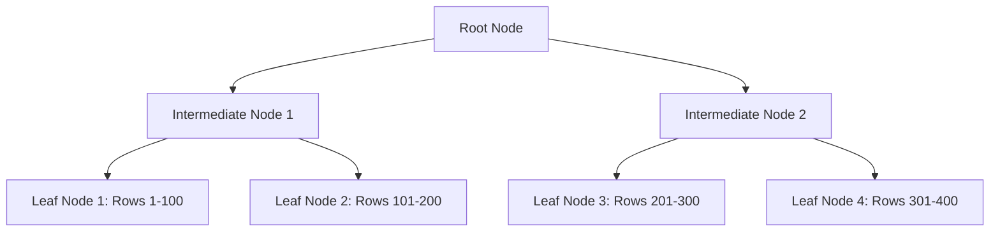
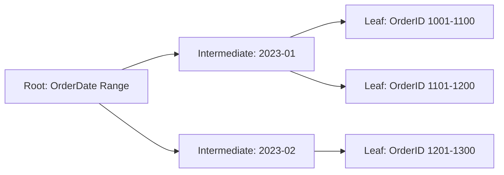
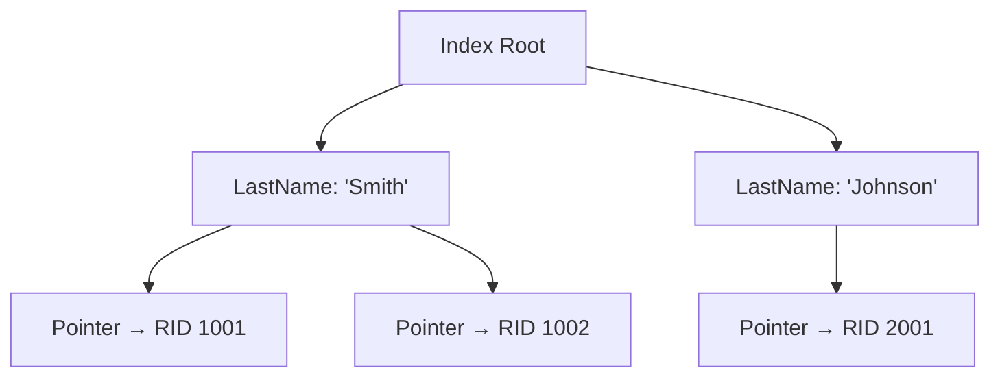
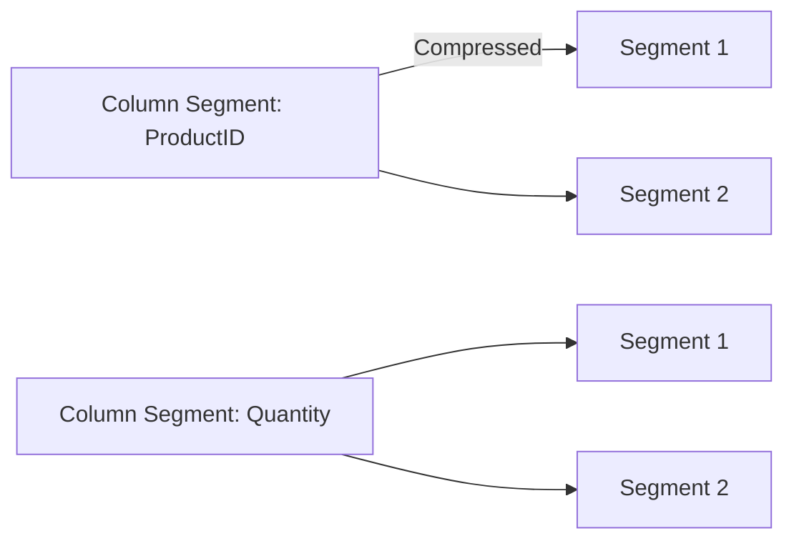

# Indexing in SQL Server

***

## 🚀 Index in SQL Server

### 🔍 Understanding the Backbone of Database Optimization

Imagine searching for a specific recipe in a 500-page cookbook _without an index_. You’d flip through every page until you found it – painfully slow! This is exactly what happens when your SQL Server queries lack proper indexing. In this deep dive, we’ll explore how **SQL Server indexing** transforms sluggish queries into lightning-fast operations, complete with real-world examples and visual Mermaid diagrams.

### 📚 What Exactly is a Database Index?

An index in SQL Server is a **performance-tuning structure** that acts like a roadmap for your data. Just as a book index directs you to page numbers for specific topics, a database index helps SQL Server quickly locate data without scanning every row in a table.

#### **Key Characteristics**:

* Created on one or more columns (key columns)
* Stored in B-tree (balanced tree) structure
* Consumes additional storage space
* Automatically updated when data changes



_Visualizing the B-tree structure where leaf nodes contain actual data (clustered) or pointers (non-clustered)_

### ⚡ Types of SQL Server Indexes (With Practical Examples)

#### 1. Clustered Index: The Data Organizer 🏗️

This index **physically reorders** table data based on key columns. Every table should have exactly one clustered index (the default for primary keys).

**Example**: E-commerce orders table

```sql
CREATE CLUSTERED INDEX IX_Orders_OrderDate 
ON Orders (OrderDate DESC);
```

**How it works**:

* Leaf nodes contain actual data pages
* Ideal for range queries (`BETWEEN`, `>`, `<`)
* Automatically created when defining PRIMARY KEY



#### 2. Non-Clustered Index: The Reference Guide 📖

Creates a **separate structure** with key values and pointers to actual data. A table can have up to 999 non-clustered indexes.

**Example**: Customer search by last name

```sql
CREATE NONCLUSTERED INDEX IX_Customers_LastName 
ON Customers (LastName) 
INCLUDE (FirstName, Email);
```

**Critical Insight**: The `INCLUDE` clause creates a **covering index** – all requested columns exist in the index, avoiding costly key lookups.



#### 3. Filtered Index: The Precision Tool 🔍

A optimized non-clustered index for **subset of data** using WHERE clause.

**Real-World Use Case**: Only 5% of orders are "Processing" status

```sql
CREATE NONCLUSTERED INDEX IX_Orders_Processing
ON Orders (OrderDate)
WHERE Status = 'Processing';
```

**Benefits**:

* 70% smaller than full index
* Faster maintenance
* Optimized for common filtered queries

#### 4. Columnstore Index: The Analytics Powerhouse 📊

Designed for **data warehousing** with column-based storage (vs row-based).

```sql
CREATE COLUMNSTORE INDEX IX_FactSales 
ON Sales (ProductID, Quantity, Amount);
```

**Performance Impact**:

* 10x faster analytics queries
* 5-10x data compression
* Uses batch mode processing



###

### ⚙️ How Indexes Actually Work: The B-Tree Mechanics

SQL Server uses **3-level B-trees** for most indexes:

1. **Root Node**: Single page containing entry points
2. **Intermediate Nodes**: Navigation layers
3. **Leaf Nodes**: Actual data (clustered) or pointers (non-clustered)

**Query Execution Flow**:

1. Start at root node
2. Traverse intermediate nodes using binary search
3. Reach leaf node with target data

**Critical Optimization Tip**: Keep index keys narrow! A 4-byte INT key allows more entries per page than a 50-byte VARCHAR, reducing I/O operations.

####

### 🚨 Common Indexing Mistakes (And How to Fix Them)

#### 1. The "Index Everything" Anti-Pattern


Problem : 20+ indexes on a transaction table&#x20;



Solution: Use Query Store to identify missing indexes:&#x20;

&#x20;`sql SELECT * FROM sys.dm_db_missing_index_details;`&#x20;


#### 2. Ignoring Index Fragmentation


**Thresholds**:&#x20;

1. &#x20;5-30% fragmentation → \`ALTER INDEX ... REORGANIZE\`&#x20;
2. &#x20;\>30% fragmentation → \`ALTER INDEX ... REBUILD\`


**Automation Script**:

```sql
-- Rebuild fragmented indexes >30%
DECLARE @sql NVARCHAR(MAX) = N'';
SELECT @sql += N'ALTER INDEX ' + i.name + ' ON ' + 
    s.name + '.' + t.name + ' REBUILD;'
FROM sys.dm_db_index_physical_stats(DB_ID(), NULL, NULL, NULL, 'LIMITED') AS ps
JOIN sys.indexes AS i ON ps.object_id = i.object_id AND ps.index_id = i.index_id
JOIN sys.tables AS t ON ps.object_id = t.object_id
JOIN sys.schemas AS s ON t.schema_id = s.schema_id
WHERE ps.avg_fragmentation_in_percent > 30;
EXEC sp_executesql @sql;
```

#### 3. Missing Covering Indexes

**Before**:&#x20;


**Before Missing the Covering Index**

`sql SELECT CustomerID, Name, Email FROM Customers WHERE City = 'New York';`

**Execution Plan Shows:**&#x20;

Key Lookup (45% of query cost)


**Fix**:

```sql
CREATE INDEX IX_Customers_City_Covering 
ON Customers (City) 
INCLUDE (CustomerID, Name, Email);
```

####

### 📈 Performance Benchmark: With vs Without Indexes

**Test Environment**:

* SQL Server 2022 on Azure VM (8 vCPU, 32GB RAM)
* 10M row `Transactions` table
* Query: `SELECT * FROM Transactions WHERE Amount > 1000`

| Scenario            | Execution Time | Logical Reads | CPU Time |
| ------------------- | -------------- | ------------- | -------- |
| No Index            | 12,450 ms      | 98,542        | 8,760 ms |
| Non-Clustered Index | 85 ms          | 127           | 45 ms    |
| Covering Index      | 28 ms          | 83            | 12 ms    |

**Key Takeaway**: Proper indexing reduced execution time by **99.77%**!

####

### 🛠️ Modern Indexing Strategies

#### 1. Adaptive Indexing with Azure SQL

Azure SQL's **Automatic Tuning**: - Creates missing indexes automatically - Drops unused indexes - Continuously monitors performance

#### 2. Hypothetical Index Analysis

Test index impact without physical creation:&#x20;

```sql
-- Create hypothetical index 
EXEC sp_tableoption 'HypotheticalIndex', 'hypothetical', 'on';
```

Test query performance&#x20;

```sql
SELECT * FROM Orders WHERE Status = 'Shipped';
```



```sql
-- JSON Indexing for Semi-Structured Data
-- Create index on JSON property

CREATE INDEX IX_Users_Preferences 
ON Users (CAST(Preferences AS NVARCHAR(100)))
WHERE ISJSON(Preferences) > 0;

```


***

### 🎯 Pro Tips for Index Maintenance

1.  **Fill Factor Strategy**:

    ```sql
    -- For volatile tables (high INSERT/UPDATE)
    CREATE INDEX IX_Orders_Modified 
    ON Orders (ModifiedDate) 
    WITH (FILLFACTOR = 80);
    ```
2.  **Index Compression**:

    ```sql
    ALTER INDEX IX_Transactions 
    ON Finance.Transactions 
    REBUILD WITH (DATA_COMPRESSION = PAGE);
    ```
3.  **Monitor Index Usage**:

    ```sql
    SELECT 
        OBJECT_NAME(i.object_id) AS TableName,
        i.name AS IndexName,
        user_seeks, 
        user_scans,
        last_user_seek
    FROM sys.dm_db_index_usage_stats ius
    JOIN sys.indexes i ON ius.index_id = i.index_id
    WHERE database_id = DB_ID();
    ```

####

### 💡 When NOT to Use Indexes

Indexes aren't always the answer! Avoid them when:

* Tables have < 500 rows
* Columns contain mostly duplicate values (low selectivity)
* Tables are write-heavy with infrequent reads
* Queries use functions on indexed columns (`WHERE UPPER(name) = 'JOHN'`)

***

### 🏁 Conclusion: Indexing as a Continuous Process

Mastering SQL Server indexing isn't about creating the "perfect" indexes once – it's an **ongoing optimization journey**. As your data grows and query patterns evolve, your indexing strategy must adapt. Remember these key principles:

✅ **Right-Size Your Indexes**: Balance read performance with write overhead\
✅ **Monitor Relentlessly**: Use Query Store and DMVs for data-driven decisions\
✅ **Think Like the Optimizer**: Understand how SQL Server uses indexes internally\
✅ **Test Rigorously**: Always validate with realistic workloads

The most successful database professionals treat indexing as a **continuous improvement process**, not a one-time setup. Start with clustered indexes on primary keys, add targeted non-clustered indexes for critical queries, and leverage modern features like columnstore for analytics workloads. Your users will thank you when reports that once took minutes now return in seconds! 💪

> _Pro Tip: Bookmark Microsoft's_ [_Indexing Best Practices Guide_](https://learn.microsoft.com/en-us/sql/relational-databases/sql-server-index-design-guide?view=sql-server-ver16) _for the latest recommendations – it's updated quarterly with real-world case studies._
