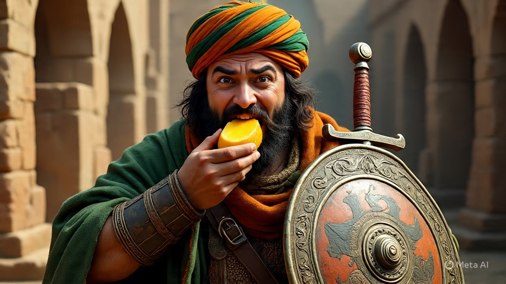
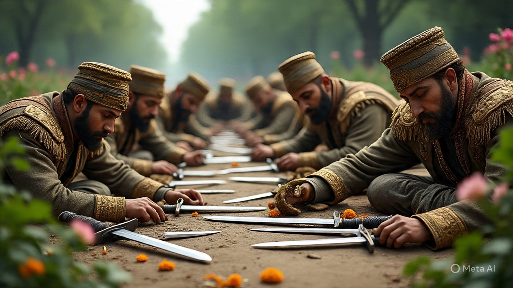
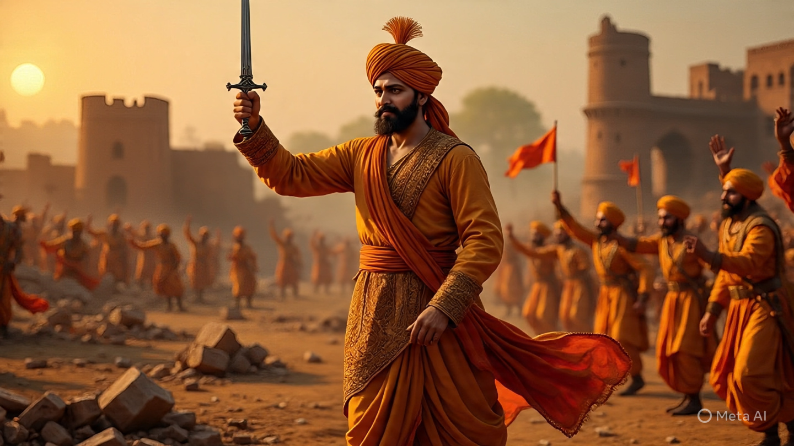

# Lion of the Sahyadris

## **Title:** The Lion of the Sahyadris and the Golden Mangoes

### Chhatrapati Shivaji Maharaj

Let's travel back in time to the 17th century and discover a story about a very special king who was not just a warrior, but also a clever leader. Here is a story about the great Maratha warrior, Chhatrapati Shivaji Maharaj. **Category:** Indian History (17th Century)

**Colors:** 🧡💚🤍 (Saffron, Green, and White, like the Maratha flag!)

In the grand, rugged hills of the Sahyadri mountains, where ancient forts stood like sleeping giants, lived a king unlike any other. His name was Shivaji, and he was the founder of the Maratha Empire. Born in the year 1630, a time when powerful Mughal emperors ruled vast lands, Shivaji grew up with a heart full of courage and a dream of freedom for his people, the Marathas. 🏞️👑

Shivaji Maharaj was not a king who lived in a luxurious palace. Instead, he preferred to live simply, always close to his people and his land. He knew every twist and turn of the Sahyadri mountains and used this knowledge to become a master of a special kind of warfare called "guerrilla warfare." This meant that his army, though smaller than the mighty Mughals, would fight from hidden places, using the dense forests and steep mountains to their advantage. They would strike quickly and then disappear like ghosts, leaving the enemy confused and defeated.

One sunny afternoon, a traveler arrived at Shivaji’s court, looking very tired and worried. The man was a farmer from a distant village and he brought a sad story. "Maharaj," he said, bowing low, "the Mughal soldiers have come to our village. They are taking everything—our crops, our cattle, and even our food. We have nothing left to eat, and our children are hungry. Please, help us!"

Shivaji listened with a heavy heart. He looked at the worried faces of his people. He knew that if he sent his army to fight the Mughals directly, it would be a long and difficult battle, and more innocent people might get hurt. He needed a plan that was as clever as it was brave. 🧠💡

He thought for a moment and then his eyes sparkled with an idea. "Fear not, my friend," Shivaji said to the farmer. "I will help you. But first, tell me, what do the Mughal soldiers love most?"

The farmer thought for a moment. "They love gold and jewels, Maharaj. But they also love the delicious, juicy mangoes that grow in our orchards."

Shivaji smiled. "Excellent! We will give them what they love," he said, much to the surprise of everyone present. He then called his most trusted general, Netaji Palkar, and whispered a secret plan.

That night, under the cover of darkness, Netaji Palkar and a small group of brave Maratha soldiers crept silently towards the Mughal camp. But they did not carry swords or shields. Instead, they carried huge baskets filled with the most beautiful, ripe mangoes from the village orchards. The mangoes were so yellow and golden that they looked like little suns. 🥭✨

The Maratha soldiers carefully placed the baskets just outside the Mughal camp's boundary, where the sentries would surely find them in the morning. They then hid and waited.

When the sun rose, the Mughal soldiers were astonished to find baskets overflowing with fresh, sweet-smelling mangoes! Their commander, who was very greedy, ordered his men to take the mangoes and eat them all. The soldiers, who had been eating boring army food for weeks, were overjoyed. They ate and ate, forgetting all about their duties and their mission.

<figure><figcaption></figcaption></figure>

As they feasted on the mangoes, the Mughal commander began to feel a strange, burning sensation in his stomach. Soon, all the soldiers felt the same. Their stomachs started to hurt, and they became so sick that they couldn't even stand up.

"What is happening?" cried the commander, clutching his stomach. "These mangoes... they must be cursed!"

<figure><figcaption></figcaption></figure>

Just then, Shivaji and his army, who were watching from a distance, came out of their hiding places. They saw the Mughal soldiers lying on the ground, groaning in pain. They had used their knowledge of nature to their advantage! The Marathas had mixed the mangoes with a special, harmless herb that caused temporary sickness and stomach aches.

Without a single sword drawn or a life lost, Shivaji Maharaj and his army easily captured the entire Mughal camp. They took back all the food and cattle that had been stolen from the villagers and even more. The greedy Mughal commander was so embarrassed and defeated that he and his soldiers fled the region, promising never to return. 🏃‍♂️💨

The villagers were so happy and grateful! They celebrated with joy, cheering for their clever and courageous king. Shivaji taught them that strength is not just about a powerful army, but about using your mind and your surroundings to win.

<figure><figcaption></figcaption></figure>

***

#### **Factual Element:**

Chhatrapati Shivaji Maharaj was a true historical figure. He was indeed the founder of the Maratha Empire and is celebrated for his brilliant use of guerrilla warfare tactics to fight against larger armies. He was known for his love of his people and his strategic genius. His victories were often due to his clever mind, not just brute force. He established a well-organized and disciplined army and a powerful navy. He was a visionary leader who created a strong and independent kingdom. His life is a testament to the fact that with courage, a smart plan, and a big heart, even the smallest of people can defeat the biggest of challenges.

***

#### **Moral of the Story:**

This story teaches us that true power comes not from being the strongest or the biggest, but from being the cleverest and most resourceful. It also shows us the importance of a leader who truly cares for their people. With intelligence, a little creativity, and a peaceful approach, you can overcome any obstacle, no matter how big it seems. 🧠💪❤️

***
