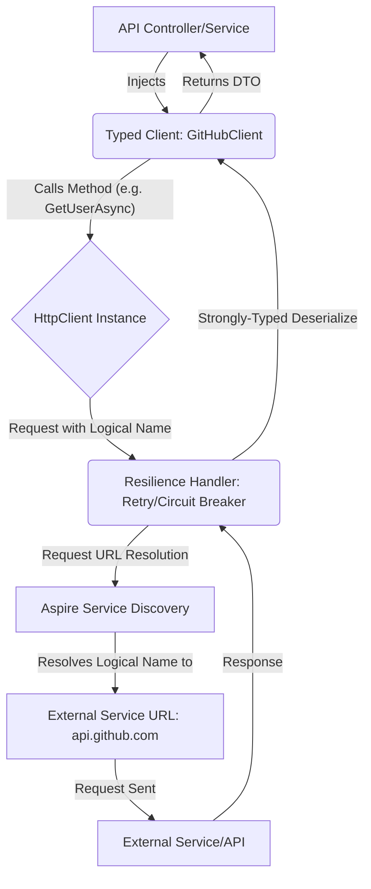

# 5 Http Client Best Practices

The HttpClient is the backbone of microservices and any modern .NET application talking to the outside world. But using it incorrectly can lead to headaches like socket exhaustion, hard-to-read code, and brittle services.

To help you build cleaner, more resilient, and more maintainable applications, here are five essential best practices for using HttpClient in .NET.

### 1. Ensure Proper Disposal of `HttpClient`

Ensure Proper Disposal of `HttpClient` Instances While the `IHttpClientFactory` is crucial for managing the underlying `HttpMessageHandler` (preventing socket exhaustion), the `HttpClient` instance itself should still be disposed of quickly when you’re done with it.

This ensures proper resource cleanup while still benefiting from the factory's handler reuse.

The Example Always wrap your usage in a using statement (or an inline using declaration in modern `C#`):

```csharp
public async Task<string> GetDataAsync(IHttpClientFactory clientFactory)
{
    // Use 'using' to ensure the HttpClient instance is disposed of
    using var client = clientFactory.CreateClient("ExternalApi");
    
    // The underlying handler is pooled and reused by the factory.
    var response = await client.GetAsync("data");
    
    response.EnsureSuccessStatusCode();
    return await response.Content.ReadAsStringAsync();
}
```

### 2. Named Clients for Centralized Configuration

Introduce Named Clients for Centralized Configuration. Stop hard-coding base URLs and repetitive headers (like User-Agent or authentication schemes) in your services. Named Clients let you centralize this setup during application startup. The Example Register your client in `Program.cs` and apply defaults:

```csharp
// Program.cs
builder.Services.AddHttpClient("GitHubClient", client =>
{
    // Centralize the Base Address
    client.BaseAddress = new Uri("https://api.github.com/"); 
    
    // Centralize default headers 
    client.DefaultRequestHeaders.Add("User-Agent", "dotnet-app");
});
```

Then, you can resolve it using the `IHttpClientFactory` and enjoy cleaner request paths:

```csharp
// MyService.cs
using var client = _clientFactory.CreateClient("GitHubClient");

// BaseAddress is already set, so you only specify the endpoint URI:
var response = await client.GetAsync("users/srg"); 
```

### 3. Prioritize Strongly Typed Clients

Prioritize Strongly Typed Clients. Named clients are good, but Typed Clients are even better. They create a dedicated class (your "client") that encapsulates all the API interaction logic, providing a clean, strongly-typed interface to your business logic.

The Example First, define your client class, injecting the pre-configured HttpClient:

```csharp
// GitHubClient.cs - The Typed Client
public class GitHubClient
{
    private readonly HttpClient _client;

    // HttpClient is injected and already configured via the factory
    public GitHubClient(HttpClient client) => _client = client;

    // Strongly-typed method that hides HTTP details
    public async Task<GitHubUser?> GetUserAsync(string username)
    {
        var response = await _client.GetAsync($"users/{username}");
        
        response.EnsureSuccessStatusCode();
        // Assuming GetFromJsonAsync handles the deserialization
        return await response.Content.ReadFromJsonAsync<GitHubUser>();
    }
}
```

Next, register it in Program.cs. Note that the factory handles the configuration and registration automatically:

```csharp
// Program.cs
// This automatically registers GitHubClient and injects a named/configured HttpClient
builder.Services.AddHttpClient<GitHubClient>(client =>
{
    client.BaseAddress = new Uri("https://api.github.com/");
    client.DefaultRequestHeaders.Add("User-Agent", "dotnet-app");
});
```

Now, your application services only need to inject GitHubClient, not the factory:

```csharp
// ApiController.cs
public class UsersController : ControllerBase
{
    private readonly GitHubClient _gitHubClient;

    public UsersController(GitHubClient gitHubClient) => _gitHubClient = gitHubClient;

    public async Task<IActionResult> GetUser(string name)
    {
        // Clean, simple call to a business method
        var user = await _gitHubClient.GetUserAsync(name); 
        return user is not null ? Ok(user) : NotFound();
    }
}
```

### 4.Make Your Responses Strongly Typed

Make Your Responses Strongly Typed. When you use a typed client, don't waste that type safety by deserializing to a generic object or JObject. Create explicit C# model classes (DTOs) for your API responses. The Example Using a simple GitHubUser record (DTO):

```csharp
// DTOs for type safety
public record GitHubUser(
    [property: JsonPropertyName("id")] int Id,
    [property: JsonPropertyName("login")] string Login,
    [property: JsonPropertyName("name")] string? Name
);

// Update your client method to use the specific type:
public async Task<GitHubUser?> GetUserAsync(string username)
{
    // ... client setup ...
    
    // Deserialize directly to the strongly-typed DTO
    return await response.Content.ReadFromJsonAsync<GitHubUser>();
}
```

This improves compile-time checking, enhances IntelliSense, and makes your code far easier to debug and refactor.

### 5. Leverage .NET Aspire for Service Discovery and Resilience

Leverage .NET Aspire for Service Discovery and Resilience. For distributed applications, .NET Aspire offers powerful features that address two massive concerns with external calls: reliability and addressing.&#x20;

1. Automatic Resilience The `AddServiceDefaults()` call (included with Aspire projects) automatically configures a standard resilience handler for every `HttpClient` request. This means policies like retries for transient errors are applied automatically, making your services instantly more robust.&#x20;
2. Service Discovery Aspire lets you assign a logical name (e.g., `githubapi`) to external services instead of their physical URLs.&#x20;

The Example:

* Configure in Aspire: In your Aspire host project, you define an external service:

```csharp
// AppHost.cs
var githubApi = builder.AddExternalHttp("GitHubAPI")
                       .WithUri("https://api.github.com/");

// Reference this logical service name in your API project
builder.AddProject<Projects.MyAPI>("myapi")
       .WithReference(githubApi);

```

* Use the Logical Name in Program.cs:

```csharp
// Program.cs
// The BaseAddress is now the logical name, not the URL!
builder.Services.AddHttpClient<GitHubClient>(client =>
{
    client.BaseAddress = new Uri("http://GitHubAPI");
    // ... other configurations
});
```

Aspire's service discovery mechanism automatically translates the logical name (GitHubAPI) into the correct physical URL (https://api.github.com/) at runtime. This prevents environment-specific addressing errors and keeps your code deployment-agnostic.

### Complete Request Flow Diagram

This diagram shows how a request moves from your application through the best practices (Typed Client, Resilience, and Discovery) to the final external service.



***

