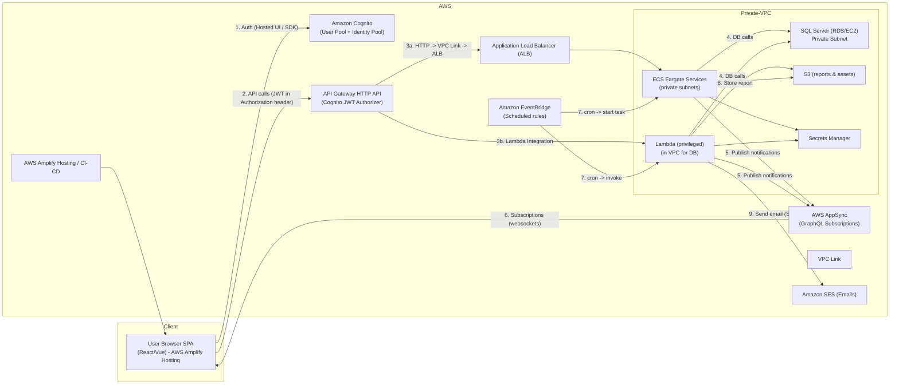
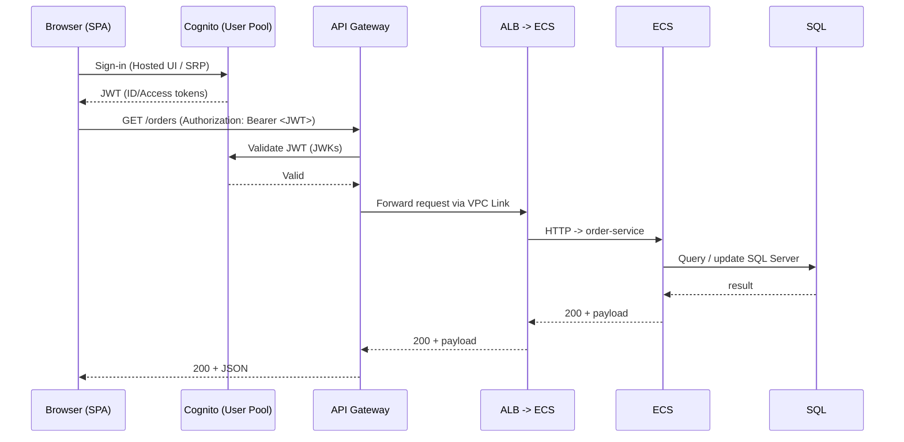
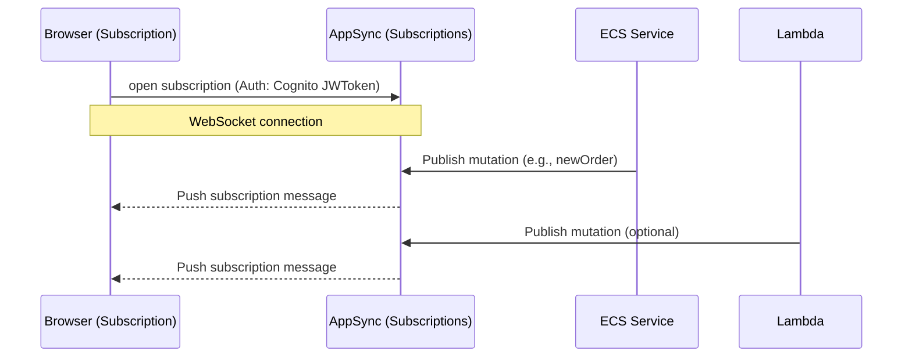
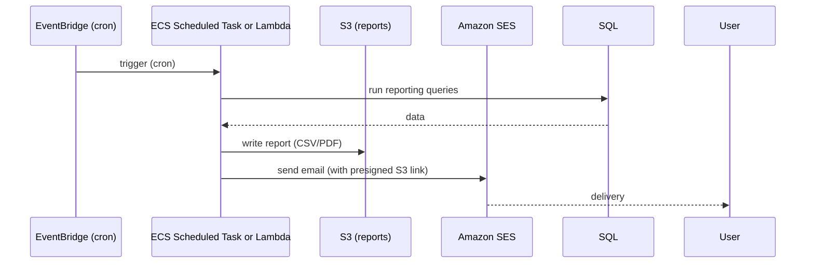

# Amplify Hosted with Security

## Building a secure, realtime SPA on AWS Amplify (React/Vue) — architecture + how-to

_Host a single-page app (React / Vue) on AWS Amplify, secure it with Cognito, call ECS & Lambda APIs via API Gateway using Cognito JWTs, deliver realtime notifications, access SQL Server in a private subnet, and run scheduled batch reporting with email delivery._

***

### Amplify Hosting

We will host the SPA with **AWS Amplify Hosting** (CDN + CI/CD), secure users with **Amazon Cognito (User Pools + Identity Pools)**, expose backend APIs via **Amazon API Gateway** (HTTP APIs with Cognito JWT authorizer), run container APIs in **ECS Fargate** behind an **ALB** (private subnets), run serverless APIs in **Lambda** (attached to same VPC when needing DB access), deliver realtime notifications with **AWS AppSync (GraphQL subscriptions)** or **API Gateway WebSockets** (recommended: **AppSync** for built-in Cognito integration and subscription model), access **SQL Server** (RDS/EC2 in private subnet) from ECS/Lambda through the VPC, and run scheduled reports with **EventBridge → Fargate task or Lambda → S3 → SES**.

Below is a technical design, security notes, and Mermaid diagrams (architecture + interaction flows) you can paste into docs or blog post.

***

### 1 — Architecture overview (high level)

Mermaid flowchart representing the whole system:



***

### 2 — Component responsibilities & rationale

**AWS Amplify Hosting**

* Host SPA with CI/CD (connect to Git repo). Amplify provides hosting backed by CloudFront for global distribution, and easy integration of environment variables (API endpoints, Cognito pool IDs).

**Amazon Cognito**

* Use **User Pool** (authentication + hosted UI or SDK) and **Identity Pool** (for temporary AWS credentials if SPA needs to call AWS services directly, e.g., AppSync with IAM).
* Cognito issues **JWTs** (ID / Access tokens) used by API Gateway authorizers.
* Use groups/roles to implement role-based access (admins vs normal users).

**API Gateway (HTTP API preferred)**

* Configure a **JWT authorizer using Cognito** — API Gateway validates the JWT and extracts claims for authorization.
* For ECS APIs behind a private ALB, use **API Gateway VPC Link** to forward requests to the internal ALB.
* For Lambda-based APIs, use direct Lambda integration (for private DB access attach Lambda to the VPC).

**ECS Fargate Services**

* Host containerized REST APIs that may require VPC access to SQL Server. Keep containers in private subnets; front them with ALB (internal).
* Use **Secrets Manager** for DB credentials and rotate regularly.
* Use **IAM Task Roles** for any AWS API access.

**Lambda**

* Use Lambda for lightweight APIs, or as workers. Configure Lambda functions that need DB access to run in the same VPC/private subnet, with proper subnet selection and ENI limits considered.

**SQL Server (private)**

* Host in RDS SQL Server or EC2 in private subnets. Only reachable from ECS/Lambda via security group rules.
* Use **Secrets Manager** to store DB username/password. Do not embed credentials in code.

**Realtime notifications — AWS AppSync (recommended)**

* AppSync supports GraphQL subscriptions (via WebSocket) and integrates with Cognito for authorization. Backend (ECS/Lambda) can trigger mutations to AppSync (or use a resolver pipeline) to send messages to subscribed clients.
* Alternative: API Gateway WebSocket APIs — more low-level and you'd need a connection management (e.g., store connection IDs), so AppSync usually simplifies dev for SPA.

**Scheduled Batch / Reporting**

* Use **Amazon EventBridge** scheduled rules to trigger:
  * A **Lambda** that generates a small report, or
  * Start an **ECS Fargate Scheduled Task** for heavy processing.
* Write reports to S3 and send notification/email via **Amazon SES** with a presigned S3 link (or attach PDF).

**Security & Observability**

* Use WAF on the CloudFront/ALB if needed.
* Enable **CloudWatch** logs/metrics for API Gateway, Lambda, ECS.
* Use **X-Ray** for tracing across API Gateway → ECS/Lambda → DB.
* Use strict security groups and NACLs; only allow ports necessary (e.g., SQL Server port 1433 only from ECS/Lambda SG).

***

### 3 — Key flows (Mermaid sequence diagrams)

**3.1 — Authentication + API call (sequence)**



**3.2 — Realtime notification (publish -> subscription)**



**3.3 — Scheduled batch → report → email**



***

### 4 — Implementation notes / snippets (practical)

#### Amplify (Hosting + Auth) quick steps

* Create Amplify app in console; connect to GitHub and configure build settings.
* Set `REACT_APP_API_URL`, `VUE_APP_API_URL`, `COGNITO_USER_POOL_ID`, `COGNITO_APP_CLIENT_ID` in Amplify environment variables or use `amplify configure` in code.
* Use **aws-amplify** SDK to integrate auth quickly:

```js
// sample react init
import { Amplify } from 'aws-amplify';
import awsExports from './aws-exports'; // generated by amplify or manual
Amplify.configure(awsExports);
```

#### Calling APIs with JWT (React example)

* After user signs in, Amplify/Cognito returns tokens. Use access token in Authorization header:

```js
import { Auth } from 'aws-amplify';

async function getOrders() {
  const session = await Auth.currentSession();
  const accessToken = session.getAccessToken().getJwtToken();
  const resp = await fetch(process.env.REACT_APP_API_URL + '/orders', {
    headers: { Authorization: `Bearer ${accessToken}` }
  });
  return resp.json();
}
```

#### API Gateway config

* Create HTTP API.
* Under **Authorization**, add **JWT authorizer** pointing to Cognito User Pool.
* For ECS integration:
  * Create **VPC Link** referencing the VPC subnets and NLB/ALB.
  * Configure a route + integration that forwards to internal ALB (private).
* For Lambda integration, add route and Lambda integration.

#### AppSync (subscriptions)

* Create AppSync GraphQL API and choose **Cognito User Pool** as the auth provider.
* Define schema with subscriptions:

```graphql
type Order {
  id: ID!
  status: String!
  amount: Float
}

type Mutation {
  publishOrder(order: Order!): Order
}

type Subscription {
  onOrderPublished: Order
    @aws_subscribe(mutations: ["publishOrder"])
}

type Query { getOrders: [Order] }
```

* Backend (ECS/Lambda) calls AppSync via a mutation (using an SDK) when it needs to notify clients.

#### DB Credentials & Secrets

* Store DB credentials in **AWS Secrets Manager**. In ECS Task Definition/Lambda env, reference secrets or fetch them at runtime using the AWS SDK and IAM role (least privilege).

#### Scheduled jobs

* Use EventBridge rule (cron) that either:
  * Targets a Lambda function (simple small reports), or
  * Targets an ECS Fargate task via EventBridge target (for heavy compute). Provide an IAM role to start tasks.
* Save report to S3 and generate pre-signed URL (S3 SDK) to embed in email.

#### Email (SES)

* Use **SES** (verify domain or email addresses in sandbox) and send raw or template emails. For attachments, store in S3 and send link.

***

### 5 — Security & operational best practices (short)

* Use HTTPS everywhere (Amplify + API Gateway default).
* Do not expose SQL Server to the internet — only allow SG from ECS/Lambda SGs.
* Use IAM Task Roles for ECS and execution role for Lambda; grant least privilege.
* Use Cognito groups + JWT permission claims for backend-level RBAC.
* Rotate secrets with Secrets Manager; avoid hardcoding credentials.
* Rate limit & enable WAF on the API endpoints.
* Enable CloudWatch Logs, X-Ray tracing across services; configure alerts.
* Monitor Lambda ENI limits and cold-start implications if VPC-bound.

***

### 6 — Trade-offs & alternatives

* **Realtime**: AppSync is easier for subscriptions and integrates with Cognito; API Gateway WebSockets is lower-level (may be cheaper at very high scale) but requires managing connection state.
* **DB Access**: For heavy DB pooling use **RDS Proxy** (for supported engines) to reduce connection churn when many Lambdas connect. SQL Server support for RDS Proxy is limited—if using SQL Server, put a connection pooling layer in ECS or use a middle-tier microservice.
* **Authentication**: If you need social logins or SAML, use Cognito federation or external IdP.

***

### 7 — Example IAM/principal configuration snippets (conceptual)

**API Gateway JWT authorizer (concept)**

* Use HTTP API JWT authorizer:
  * Issuer: `https://cognito-idp.{region}.amazonaws.com/{userPoolId}`
  * Audience: `app client id` or use token's `aud`

**ECS Task Role (minimal)**

* Permissions to read Secrets Manager secret and write to CloudWatch, S3:

```json
{
  "Version": "2012-10-17",
  "Statement":[
    {
      "Effect":"Allow",
      "Action":[
        "secretsmanager:GetSecretValue"
      ],
      "Resource":["arn:aws:secretsmanager:region:acct-id:secret:mydbsecret-*"]
    },
    {
      "Effect":"Allow",
      "Action":["s3:PutObject","s3:GetObject"],
      "Resource":["arn:aws:s3:::my-reports-bucket/*"]
    }
  ]
}
```

***

### 8 — Developer checklist / steps to deliver

1. Create Amplify app & push SPA (CI/CD).
2. Create Cognito User Pool + App client; decide on hosted UI or custom UI with Amplify Auth.
3. Create AppSync GraphQL API (Cognito auth) and define schema for subscriptions.
4. Build ECS Fargate services (Dockerize APIs), ALB (internal), VPC with private subnets for ECS & SQL.
5. Create SQL Server (RDS or EC2) in private subnets; configure SGs.
6. Create API Gateway HTTP API with JWT authorizer + VPC Link to ALB; add Lambda integrations.
7. Setup EventBridge rules for scheduled tasks → Lambda or ECS; connect to SES for email.
8. Configure Secrets Manager for DB creds; attach IAM roles.
9. Add CloudWatch dashboards, X-Ray, and alerts.
10. Pen test for auth flows and validate token enforcement at API Gateway.

***

### 9 — Closing / Next steps

This design balances developer velocity (Amplify + Cognito + AppSync) and production-grade security (API Gateway JWT validation, VPC isolation, Secrets Manager). If you want, I can:

* Produce a ready-to-deploy CloudFormation / CDK skeleton (Amplify config, Cognito, API Gateway, AppSync, ECS Task + ALB, RDS skeleton, EventBridge rule, SES permissions).
* Provide sample React code to wire Cognito + AppSync subscriptions and API calls.
* Provide Terraform/CDK for VPC, ECS, and RDS with proper security groups.

