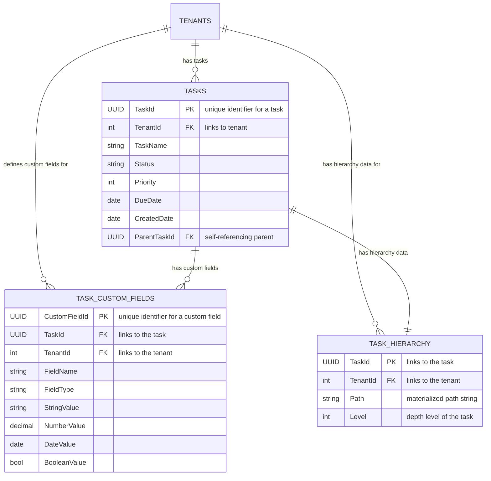

# SQL

## SQL SERVER

Switching from a NoSQL approach to a relational database like SQL Server for this kind of multi-tenant, multi-level hierarchical data requires a different schema design to maintain performance. The key is to handle the flexible custom fields and the deep hierarchy efficiently.

Here is a proposed schema design for SQL Server.

### The Core Schema Design

The solution will use a few tables to handle the different aspects of the data: the fixed task fields, the flexible custom fields, and the hierarchical relationships.

* **`Tenants` Table:** A standard table to manage tenants. This is for multi-tenancy.
* **`Tasks` Table:** This is the main table for the fixed fields of each task.
* **`Task_CustomFields` Table:** This table stores the custom fields for each task. Since SQL is strongly typed, each custom field will be stored as a key-value pair, with a column for the value of each data type.
* **`Task_Hierarchy` Table:** This table is used to model the parent-child relationships, but with an important addition: a **Materialized Path**.

***

### Schema Structure with DDL

Here is a detailed look at the table structures using SQL Server's DDL (Data Definition Language).

**`Tenants` Table** This table is for tenant management.

```sql
CREATE TABLE Tenants (
    TenantId INT PRIMARY KEY IDENTITY(1,1),
    TenantName NVARCHAR(255) NOT NULL,
    -- Other tenant-specific fields
);
```

**`Tasks` Table** This table stores the fixed task fields and is the central point for the data. The `ParentId` column is a self-referencing foreign key, which models the immediate parent-child relationship.

```sql
CREATE TABLE Tasks (
    TaskId UNIQUEIDENTIFIER PRIMARY KEY DEFAULT NEWID(),
    TenantId INT NOT NULL,
    TaskName NVARCHAR(500) NOT NULL,
    Status NVARCHAR(50) NOT NULL,
    Priority INT NOT NULL,
    DueDate DATETIME,
    CreatedDate DATETIME NOT NULL,
    ParentTaskId UNIQUEIDENTIFIER, -- Self-referencing FK to Tasks.TaskId
    FOREIGN KEY (ParentTaskId) REFERENCES Tasks(TaskId),
    FOREIGN KEY (TenantId) REFERENCES Tenants(TenantId)
);
```

**`Task_Hierarchy` Table (Materialized Path)** This is the most crucial part for handling the deep hierarchy. Instead of recursive lookups, we store the full path from the root. This makes querying for subtrees extremely fast.

```sql
CREATE TABLE Task_Hierarchy (
    TaskId UNIQUEIDENTIFIER PRIMARY KEY,
    TenantId INT NOT NULL,
    Path VARCHAR(MAX) NOT NULL, -- e.g., '/Task-A/Task-B/Task-C/'
    Level INT NOT NULL, -- 0 for root, 1 for child, etc.
    FOREIGN KEY (TaskId) REFERENCES Tasks(TaskId),
    FOREIGN KEY (TenantId) REFERENCES Tenants(TenantId)
);
```

**`Task_CustomFields` Table** This table handles the dynamic nature of custom fields. The `Value` is split across different columns to accommodate various data types. This is a common pattern in relational databases for this problem.

```sql
CREATE TABLE Task_CustomFields (
    CustomFieldId UNIQUEIDENTIFIER PRIMARY KEY DEFAULT NEWID(),
    TaskId UNIQUEIDENTIFIER NOT NULL,
    TenantId INT NOT NULL,
    FieldName NVARCHAR(255) NOT NULL,
    FieldType NVARCHAR(50) NOT NULL, -- e.g., 'string', 'number', 'date', 'boolean'
    StringValue NVARCHAR(MAX),
    NumberValue DECIMAL(18, 2),
    DateValue DATETIME,
    BooleanValue BIT,
    FOREIGN KEY (TaskId) REFERENCES Tasks(TaskId),
    FOREIGN KEY (TenantId) REFERENCES Tenants(TenantId)
);
```

***

### Key Concepts and How They Address the Problem

* **Multi-Tenancy**: The `TenantId` column is present in every data table (`Tasks`, `Task_Hierarchy`, `Task_CustomFields`). This is the foundation for a multi-tenant application and is included in all indexes to ensure data isolation.
* **Deep Hierarchy**: The **Materialized Path** approach in the `Task_Hierarchy` table solves the problem of deep nesting up to 50 levels. Instead of performing a recursive Common Table Expression (CTE) query, you can find all descendants of a task with a simple `LIKE` query on the `Path` column, which is highly performant with the right index.
* **Flexible Custom Fields**: The `Task_CustomFields` table allows tenants to define their own fields without altering the core schema. Storing the values in different columns based on data type (`StringValue`, `NumberValue`, etc.) is a necessary trade-off in a strongly-typed system to maintain data integrity and enable searching and sorting.
* **Efficient Searching and Sorting**:
  * **Fixed Fields**: Searching on fixed fields like `Status` or `Priority` is straightforward. You'll need to create standard indexes on these columns.
  * **Custom Fields**: For searching and sorting on custom fields, you can create indexes on the value columns in the `Task_CustomFields` table, combined with the `TenantId`. For example: `CREATE INDEX IX_CustomField_Number ON Task_CustomFields (TenantId, FieldName, NumberValue)`.
  * **Complex Reads/Hierarchical Queries**: The `Task_Hierarchy` table makes complex reads (like "get all tasks under a specific project") simple and fast using `WHERE Path LIKE '...'`.
* **Performance Optimization**:
  * **Proper Indexing**: This is the most critical factor. Create **compound indexes** that start with `TenantId` on all tables to optimize queries and ensure data security.
  * **Denormalization**: For frequently accessed data, you might consider denormalizing the `Path` and `Level` directly into the `Tasks` table to reduce joins for simple queries. However, this increases complexity for updates and should be carefully considered. The separate `Task_Hierarchy` table is generally a cleaner and more scalable approach.
  * **Data Partitioning**: For a 10 million record table, consider partitioning the `Tasks` table by `TenantId`. This can significantly improve performance for very large tenants by keeping their data in a dedicated partition.

***

### Example Queries

**A. Find All Descendants of a Specific Task**

```sql
DECLARE @path VARCHAR(MAX);
-- First, get the path of the parent task
SELECT @path = Path FROM Task_Hierarchy WHERE TaskId = 'parent_task_id';

-- Then, find all descendants using the materialized path
SELECT T.*
FROM Tasks T
INNER JOIN Task_Hierarchy H ON T.TaskId = H.TaskId
WHERE H.Path LIKE @path + '%' AND H.TaskId <> 'parent_task_id';
```

**B. Search for Tasks with a Custom Field and Sort**

```sql
SELECT T.*, CF.NumberValue AS EstimatedHours
FROM Tasks T
INNER JOIN Task_CustomFields CF ON T.TaskId = CF.TaskId
WHERE T.TenantId = 'your_tenant_id'
  AND CF.FieldName = 'estimatedHours'
  AND CF.NumberValue >= 20
ORDER BY T.Priority DESC, CF.NumberValue ASC;
```

### ER Diagram for easy understanding




***

### Indexing Activities with Syntax

Here is the SQL syntax for creating the necessary indexes to optimize the schema's performance.

#### **On the `Tasks` Table**

```sql
-- Compound index on TenantId and TaskId for efficient lookups
CREATE UNIQUE INDEX IX_Tasks_TenantId_TaskId ON Tasks (TenantId, TaskId);

-- Index for the ParentTaskId to optimize parent-child queries
CREATE INDEX IX_Tasks_ParentTaskId ON Tasks (TenantId, ParentTaskId);

-- Indexes for fixed fields commonly used in searches or sorts
CREATE INDEX IX_Tasks_Status ON Tasks (TenantId, Status);
CREATE INDEX IX_Tasks_Priority ON Tasks (TenantId, Priority);
CREATE INDEX IX_Tasks_DueDate ON Tasks (TenantId, DueDate);
```

### **On the `Task_Hierarchy` Table**

```sql
-- The most critical index for hierarchy queries
CREATE INDEX IX_Hierarchy_Path ON Task_Hierarchy (TenantId, Path);

-- Index for level-specific queries
CREATE INDEX IX_Hierarchy_Level ON Task_Hierarchy (TenantId, Level);
```

### **On the `Task_CustomFields` Table**

```sql
-- Compound index for linking tasks to their custom fields
CREATE INDEX IX_CustomFields_TaskId ON Task_CustomFields (TenantId, TaskId);

-- Example indexes for searchable/sortable custom fields.
-- These should be created dynamically based on the tenant's schema configuration.

-- Index for string-based custom fields (e.g., 'department' or 'assignee')
CREATE INDEX IX_CustomFields_StringValue ON Task_CustomFields (TenantId, FieldName, StringValue);

-- Index for number-based custom fields (e.g., 'estimatedHours')
CREATE INDEX IX_CustomFields_NumberValue ON Task_CustomFields (TenantId, FieldName, NumberValue);

-- Index for date-based custom fields
CREATE INDEX IX_CustomFields_DateValue ON Task_CustomFields (TenantId, FieldName, DateValue);
```

### <i class="fa-chart-bullet">:chart-bullet:</i>

### Top 5 Performance Tips

1. **Use a Materialized Path for Hierarchy**: The `TASK_HIERARCHY` table with the `Path` column is critical. This approach avoids slow, recursive CTE queries or complex joins to find all descendants of a node. A simple `LIKE` query on an indexed `Path` column is extremely fast.
2. **Use Compound Indexes**: The `TenantId` should be the **first column in every index** on `TASKS`, `TASK_CUSTOM_FIELDS`, and `TASK_HIERARCHY`. This is the single most important rule for multi-tenant applications as it ensures that all queries are automatically partitioned by tenant, leading to massive performance gains and preventing data from one tenant from being scanned for another.
3. **Use Partitioning**: With up to 10 million records, consider **partitioning the `Tasks` table by `TenantId`**. This physical separation of data allows SQL Server to quickly access a specific tenant's data while ignoring all others, which is much more efficient than using a single massive table.
4. **Careful with Custom Field Indexing**: The `TASK_CUSTOM_FIELDS` table is very flexible but can be slow to query. Create **specific indexes on the value columns** (`StringValue`, `NumberValue`, etc.) for the custom fields that are most frequently used for searching and sorting. For example, if a tenant often searches by "Estimated Hours" (`NumberValue`), create an index on `(TenantId, FieldName, NumberValue)`.
5. **Use Proper Data Types**: Use the correct data types for each field to minimize storage space and improve query efficiency. For example, use `DATETIME` for dates, `INT` or `DECIMAL` for numbers, and `BIT` for booleans. This is especially important in the `TASK_CUSTOM_FIELDS` table where values are stored in different columns.

***
