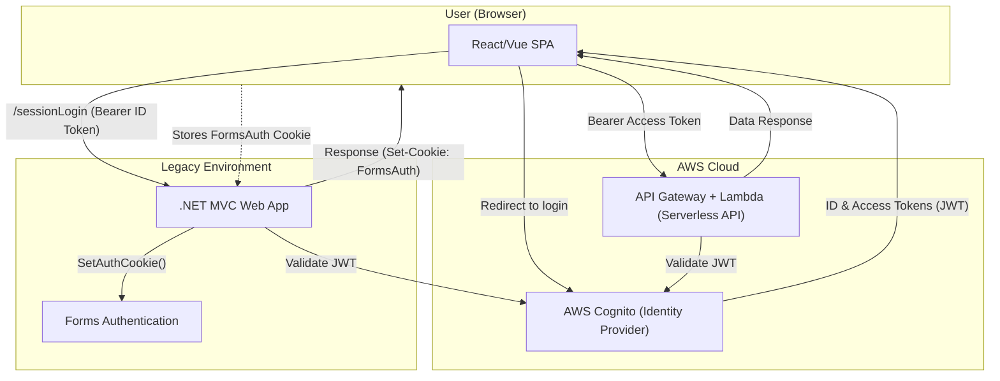
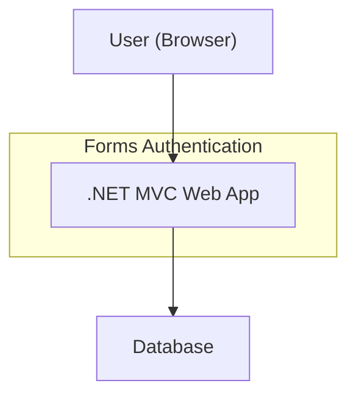
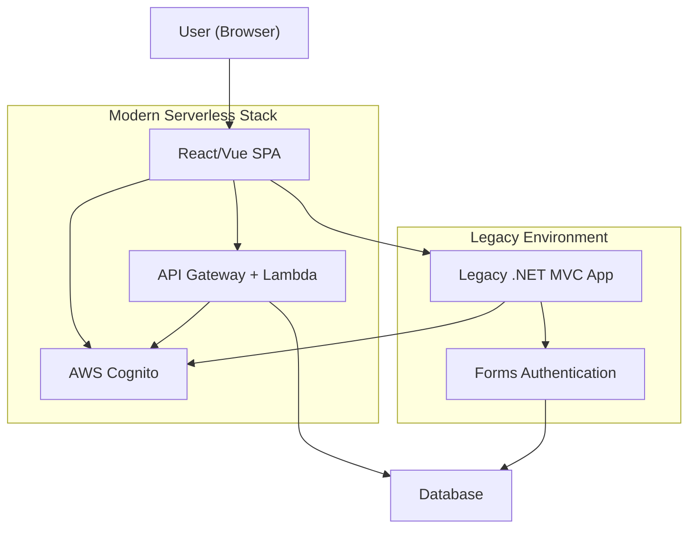
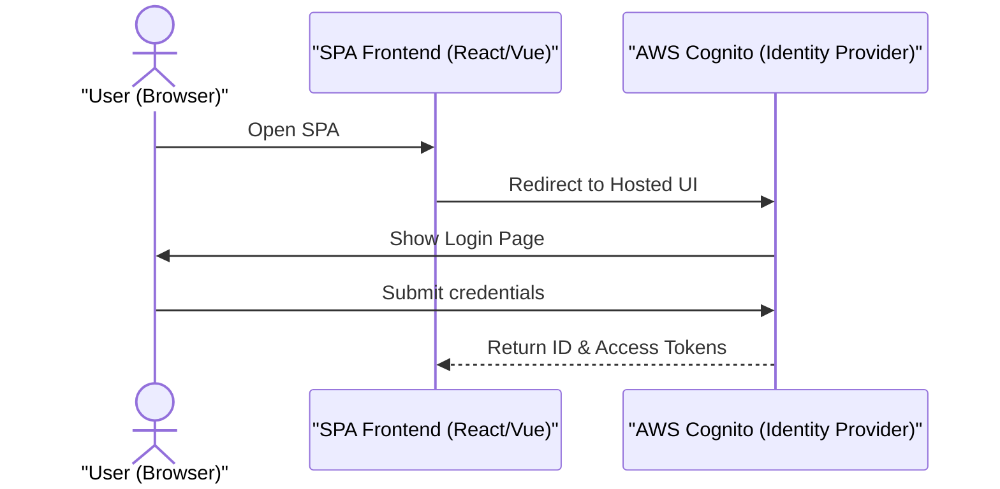
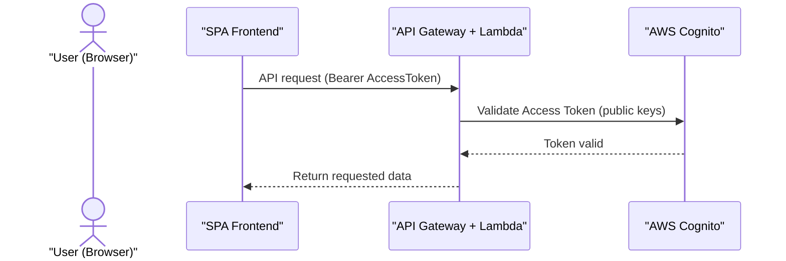
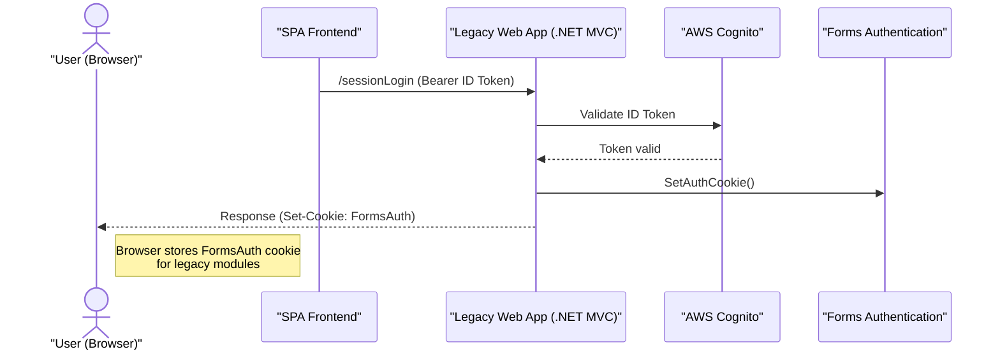
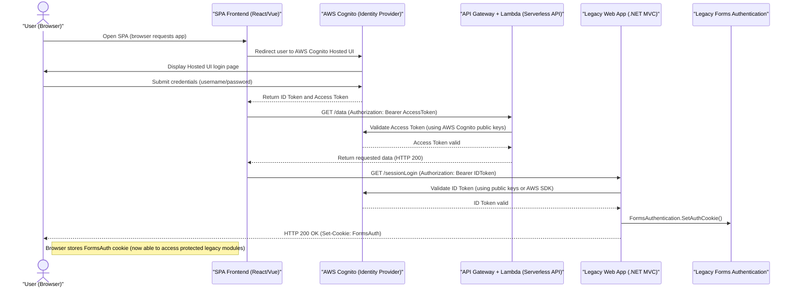

# Serverless with Legacy Integration

## 📝 Migration to Serverless with Legacy Integration

### 🧩 Context

For the given context,

* The existing application is a **.NET MVC legacy app** using **Forms Authentication (cookie-based session)**.
* The target architecture is **serverless**, with:
  * **React/Vue SPA frontend**
  * **AWS Cognito** for identity and authentication
  * **API Gateway + Lambda backend**
  * **Database remains unchanged**
* The challenge is to ensure **Single Sign-On (SSO)** between the new SPA (token-based) and the legacy app (session-based), running on different subdomains.

***

### ⚠️ Problem Statement

Users should **log in once via Cognito** and seamlessly access:

* **New APIs** (validated via JWT tokens)
* **Legacy modules** (validated via Forms Authentication cookies).

> Without a bridging solution, users would need to log in twice, which is not acceptable. Lets see how we will a **hybrid authentication bridge** that exchanges **Cognito tokens for Forms Authentication cookies** in the legacy app.


This solution we focus using AWS Cognito, but this suits to any Authentication Providers it can be Azure B2C, B2B etc.


***

### 🏗️ Architecture Flow

1. **User Login (SPA + Cognito)**
   * The SPA redirects the user to **Cognito Hosted UI**.
   * User authenticates.
   * Cognito returns **ID token + Access token (JWTs)** to SPA.
2. **Modern API Access**
   * SPA includes **Access token** in requests to **API Gateway + Lambda**.
   * Lambda validates the token against Cognito’s public keys.
   * Data is returned if token is valid.
3.  **Legacy Session Bridging**

    * SPA calls **`/sessionLogin`** endpoint on the legacy MVC app with the **ID token**. <mark style="color:$info;">In general, it should perform a "POST" Call.</mark>
    * Legacy app validates the JWT with AWS Cognito.
    * If valid, it issues a **FormsAuth cookie** (`.ASPXAUTH`) via `FormsAuthentication.SetAuthCookie()`.
    * Browser stores cookie (with `Secure`, `HttpOnly`, and `domain=.example.com`).
    * Legacy modules now accept user as authenticated.


Similar to SessionLogin, When sign-out happens, similar to login the session clearance should happens via secure POST.


***

### 🛠️ Implementation Stratergy

* **Cognito Integration**
  * Use AWS SDK or JWT library in .NET to validate Cognito tokens.
  * Maintain token expiry rules consistent with Cognito.
* **Forms Authentication Cookie**
  * Configure `<forms domain=".example.com">` so cookie is shared across subdomains.
  * Synchronize `<machineKey>` across legacy app instances for cookie validation.
* **CORS & Cookies**
  * Legacy app must allow CORS with credentials (`Access-Control-Allow-Credentials: true`).
  * SPA must send requests with `withCredentials: true`.
* **Security Practices**
  * Force **HTTPS everywhere**.
  * Mark cookies as `Secure` and `HttpOnly`.
  * Implement CSRF protection for legacy endpoints.
  * Log token exchange attempts for auditing.

***

### 🔐 Securely bridging the new SPA and legacy .NET session

* The legacy .NET MVC app uses Forms Authentication, where a login creates a forms-auth ticket stored in a cookie. This ticket (often in a cookie like `.ASPXAUTH`) is sent on each request so ASP.NET can identify the user.
* In a multi-subdomain setup, you can set `<forms domain=".example.com">` so the cookie is sent to all subdomains.
* All apps sharing that cookie must also share the same encryption key (the same `<machineKey>`) so each can decrypt the cookie.
* However, modern `SPA/AWS` setups use token-based auth (OAuth/OIDC) instead of server sessions, and ASP.NET Core (or AWS serverless) uses different data-protection for cookies. In fact, ASP.NET Core’s cookie encryption is incompatible with legacy WebForms, so you cannot simply share the old FormsAuth cookie with a new app.
* The recommended approach is to use a central identity provider (IdP) instead. In this model, your users sign in once (e.g. at Cognito), and each app (SPA or legacy) independently trusts that login. As one SO answer explains, “each site authorizes independently with the provider, but the same user account can be used. The actual login happens at the identity provider, then each site … is given the identity from the identity provider and can then set their own cookies”.
* In short, rely on an IdP (AWS Cognito) for SSO rather than trying to share forms cookies directly.

### 📊 Data Flow Diagram for the above approach

### :heavy\_equals\_sign: Workflow Before and After



Legacy Workflow




New Workflow




### 🔑 Use AWS Cognito for centralized authentication

Set up an Amazon Cognito User Pool as your central auth service. Cognito provides user management and issues OAuth tokens (JWTs) after sign-in. When the user logs in via your SPA (for example using Cognito’s Hosted UI or AWS Amplify), Cognito will return an ID token and access token (and optionally a refresh token) for that user.

These JWTs encode the user’s identity and can be sent with API calls to your new backend. Because these tokens are issued by Cognito, both your new services and your legacy app can trust them (Cognito is the common identity provider).

For example: after a successful Cognito login, the SPA receives a JWT. It then calls a special “session login” endpoint on the legacy app, passing that token. The legacy app validates the Cognito token (using AWS’s .NET SDK or by fetching Cognito’s public keys) and, if valid, calls `FormsAuthentication.SetAuthCookie(username, …)` to create a legacy session. This sets the ASP.NET auth cookie in the browser. Now the user has a normal legacy session just as if they had logged in there, but it was triggered by the SPA using the Cognito identity.

Alternatively, you could retrofit the legacy site to act as an OIDC client of Cognito (using OWIN middleware or a third-party `SAML/OIDC plugin`), but an explicit token-exchange endpoint is often simpler if the legacy code cannot be fully reworked.

### 🍪 Subdomains, cookies and CORS

Host the SPA and legacy under the same base domain so cookies can be shared. For example, serve the SPA at spa.example.com and the legacy app at app.example.com. In your legacy Web.config, set `<forms domain=".example.com">` (note the leading dot) so the authentication cookie is valid on all subdomains. . Ensure the legacy site’s machineKey and decryption settings are the same wherever the app runs, so it can decrypt the cookie. . Mark the cookie Secure and HttpOnly to keep it safe. Because the SPA’s JavaScript will call the legacy domain, this is a cross-origin request (different subdomain). You must enable CORS with credentials. On the legacy side set `Access-Control-Allow-Credentials: true` and set `Access-Control-Allow-Origin` to the exact SPA origin (no wildcard).

In the SPA’s fetch/axios call, use withCredentials: true (or `fetch` with `credentials: 'include'`). This lets the browser include and accept the legacy auth cookie. Notably, a request from one subdomain to another of the same parent domain is “same-site” from the browser’s perspective, so you do not need `SameSite=None` on the cookie.

### 🔓 Stage 1: Login Flow (SPA ↔ Cognito)

### 📡 Stage 2: API Flow (SPA ↔ API Gateway/Lambda)

### 🌉 Stage 3: Legacy Session Bridging (SPA ↔ Legacy Web App)

### 📋 Sequence Diagram - Complete Overview

***

### 📋 Summary of steps

* Configure AWS Cognito: Create a User Pool and App Client.
* Implement SPA login: Have the React/Vue front end use Cognito’s OAuth flow (e.g. via AWS Amplify or a direct OIDC flow) so the user logs in and receives `JWT tokens`.
* Protect new APIs: Your serverless `API Gateway/Lambda` backend should validate the `Cognito JWT` on each request (using a Cognito authorizer or manually).
* Bridge to legacy: After login, have the SPA call a legacy-app endpoint (e.g. `/sessionLogin`) including the Cognito ID/access token. In that endpoint, verify the token’s signature with Cognito’s public keys, then call `FormsAuthentication.SetAuthCookie(userName)` to issue the legacy cookie for that user.
* Set cookie domain: In the legacy Web.config `<forms>` element, set `domain=".example.com"` so the cookie is sent to all subdomains. Ensure `<machineKey>` is synchronized so the cookie can be decrypted on any server.
* Configure CORS: On the legacy app enable CORS with credentials (allow the SPA’s origin and Access-Control-Allow-Credentials: true) and have the SPA send requests with credentials. This ensures the auth cookie can be set and sent by the browser stackoverflow.com
* Use secure practices: Always use HTTPS and mark cookies `Secure`. Store tokens/cookies in HttpOnly storage or memory only, per AWS best practices. As AWS notes, “secure all tokens in transit and storage” because they may contain PII.

By using AWS Cognito as a common IdP and having the `SPA` exchange its `JWT` for a legacy session cookie, you achieve single sign-on. The user signs in once with Cognito, the SPA gets a token, and then both the new serverless APIs and the legacy session-based modules recognize the user’s identity. This approach fully decouples the old `Forms Authentication` session from the new front end while securely passing the user’s state between them.

***

### 📌 Key Points to Remember

* ✅ Users log in **once** via `Cognito → access` both new APIs and legacy modules.
* ✅ Migration can proceed incrementally: new features go `serverless`, old modules continue to function.
* ⚠️ Additional complexity in `maintaining`/`sessionLogin` bridging endpoint.
* ⚠️ Long-term strategy should be to **fully migrate legacy modules** to `Cognito`/`OIDC`.

***
